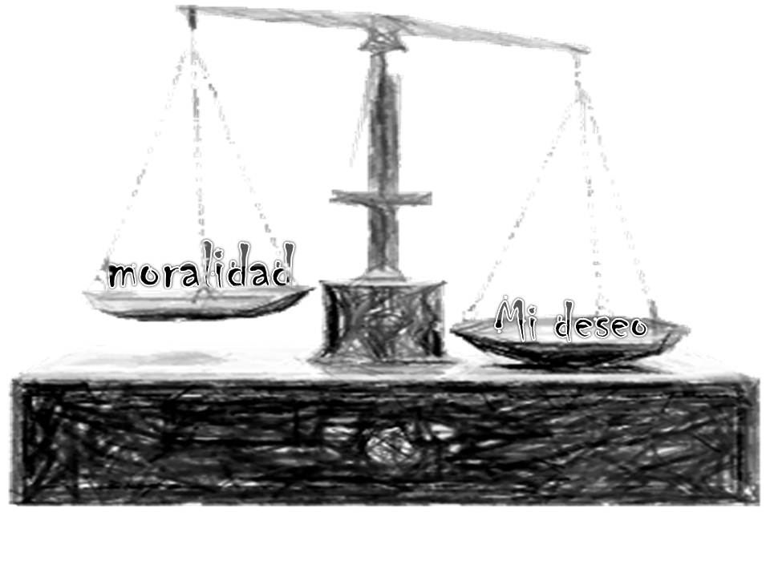

{width="8.515277777777778in" height="11.093333333333334in"}

{width="2.225in" height="0.8131944444444444in"}

La primera carta a los Corintios es un excelente estudio porque nos habla de las situaciones por las cuales pasan las iglesias locales promedio de hoy. El libro abarca situaciones frecuentes que suceden en todas las iglesias y nos proporciona respuestas confiables en cómo resolverlas (1 Corintios 7:40b). Estas respuestas no son, ni remotamente comparables a las filosofías huecas de este mundo, aunque sean presentadas como la última y mejor idea (1 Corintios 1:19-20).

A veces hay que ver como algo no debe ser, antes de poder visualizar como algo debe de ser (1 Corintios 11:19). Esto lo observamos claramente en nuestro estudio de la primera carta a los Corintios (1 Corintios 1:10-11). Aunque Pablo aplaudió a los creyentes en el primer capítulo (1 Corintios 1:1-9), parece que los loores terminaron allí. Obviamente estuvo desilusionado por su conducta. Nosotros debemos recordar que no podemos amar al mundo y ser amigos de Dios, al mismo tiempo (1 Corintios 3:18-21). Tampoco es posible caminar según la naturaleza carnal y el Espíritu Santo al mismo tiempo (1 Corintios 3:1-4). Para nosotros es necesario recordar siempre que si desagradamos al Señor Jesucristo no debemos esperar ser recompensados en el Tribunal BEMA de Jesucristo (1 Corintios 3:11-15).

Remarcablemente, a pesar de todos sus errores, el apóstol Pablo los llamó "*la iglesia de Dios*" (1 Corintios 1:2). Sin lugar a dudas, Cristo ama a su iglesia a pesar de su mala conducta (1 Corintios 1:8-9). De la misma forma, nosotros debemos ser pro-eclesiales en nuestra forma de pensar y acciones, aun cuando nuestra iglesia local sea imperfecta. Ya es hora de madurar y formar parte de la solución y no ser más contribuyentes de la fragmentación (1 Corintios 3:16-17) por que; \...*sólo hay un Dios, el Padre, del cual proceden todas las cosas, y nosotros somos para él; y un Señor, Jesucristo, por medio del cual son todas las cosas, y nosotros por medio de él*\... 1 Corintios 8:6.

Bret Nazworth

Junio, 2013 (2a Edición)

Derechos de Autor © **2013** **DM2** **International** **Inc.** Todos los derechos reservados

**Póliza** **de** **los** **Derechos** **de** **Autor.** Traducción no autorizada, re-publicación, duplicación del documento, página de la internet o distribución del correo electrónico de cualquier porción de este material de derechos de autor de cualquier forma, sin el expreso consentimiento escrito de DM2™ es estrictamente prohibido. Puedes usar los materiales de DM2 para tu propio estudio personal o para volverlos a enseñar en una clase, siempre y cuando, el logo de DM2 y esta póliza de los derechos de autor estén incluidos siempre en el material al ser enseñados. Puedes bajar una copia a tú PC, imprimirla o hacer copias para la clase o estudio de grupo Bíblico; sin embargo, no puedes cobrar por este material o por conducir una clase usando el mismo, excepto por el costo actual del copiado. NO puedes hacer cambios a este material, tiene derechos de autor. Para una más amplia exposición de la póliza del DM2 con respecto a los usos de sus materiales, por favor referirse a la página de la internet DM2-USA al <http://www.dm2usa.org>.

\[DM2™\]

**Impreso** **y** **Propiedad** **de:**

**DM2**

**Disciple** **Makers** **Multiplied**

**PO** **Box** **3570**

**Harlingen,** **TX** **78551**

**Para** **más** **información:**

**Escríbenos** **a:** **bret.nazworth\@gmail.com**

**www.DM2USA.org**

**1 CORINTIOS 1-8**

> **1** **Corintios** **1:1-10** **--** **Historia de Corinto 7**
>
> **1** **Corintios** **1:1-10** **--** **Recomendando** **a** **los** **Cristianos** **de** **Corinto 11**
>
> **1 Corintios 1:11-17 -- Confrontando el Conflicto Corinto 15**
>
> **1** **Corintios** **1:18-31** **--** **¡No** **Alterar** **el** **Mensaje**! **15**
>
> **1** **Corintios** **2:1-16** **--** **¡No** **Juguetear** **con** **el** **Método! 20**
>
> **1** **Corintios** **3:1** **-** **4:13** **--** **¡No** **te** **dejes** **seducir** **por** **un** **hombre! 27**
>
> **1** **Corintios** **5:1-6:20** **--** **Confrontando** **Tres** **Serios** **Problemas 42**
>
> **1 Corintios 5:1-13 -- Una situación social escandalosa "el incesto" 42**
>
> **1 Corintios 6:1-8 -- Una libertad legal lamentable \"la justicia social\" 48**
>
> **1 Corintios 6:9-20 -- Una inclinación hacia la indulgencia inmoral 50**
>
> **1 Corintios 7:1-40 -- Preguntas Relacionadas con el Matrimonio 55**
>
> **1 Corintios 7:1b-9 -- ¿Es legítimo... nunca tocar... mujer? 55**
>
> **1 Corintios 7:10-16 -- ¿Qué instrucción tenía para el matrimonio? 58**
>
> **1 Corintios 7:17-24 -- No trates de cambiar tu estado matrimonial 61**
>
> **1 Corintios 7:25-38 -- ¿Qué instrucción hay para hijas vírgenes? 63**
>
> **1 Corintios 7:39-40 -- ¿Qué instrucciones tenía para las viudas? 66**
>
> **1** **Corintios** **8:1-11:1** **--Preguntas** **sobre** **Libertades** **Cristianas. 69**
>
> **1 Corintios 8:1-6 -- ¿Qué de lo sacrificado a los ídolos? 69**

**\
**

{width="6.326965223097113in" height="6.975885826771654in"}**\
**

**UNA IGLESIA EN CONFLICTO**

I.  **Historia** **de** **Corinto**

    A.  **La** **Iglesia**

        1.  1 Corintios 1:2 -- *A la iglesia de **[Dios]{.ul}** que está en Corinto*

        2.  La iglesia de Corinto se formó dentro de una sociedad que seguía de cerca los pasos de Sodoma y Gomorra en su decadencia **[moral]{.ul}**.

        3.  Parecía poco probable que una iglesia **[naciera]{.ul}** en una comunidad tan pecaminosa. Marcos 10:27

    B.  **La** **Ciudad**

        1.  Hace dos mil años, Corinto era la **[capital]{.ul}** de la provincia del sur de Grecia llamada Acaya.

            a.  En el siglo VIII a. C. Corinto comenzó a desarrollarse como un **[centro]{.ul}** comercial.

            b.  Pero en el año 146 a. C., fue destruida totalmente por un general romano llamado **[Lucio]{.ul}** Mumio.

            c.  En el 46 a. C., Corinto fue reedificada por Julio César como **[colonia]{.ul}** romana.

                1.  Esta fue probablemente una de las mejores decisiones que **[Roma]{.ul}** hiciera jamás.

                2.  Una vez un poeta apodó a Corinto "la **[Rica]{.ul}**" por su inmensa riqueza.

        2.  Corinto estaba ubicada a 50 millas al este de Atenas, Grecia. Situada en una estratégica franja de **[tierra]{.ul}** entre el Mar Egeo al este y el Mar Jónico al oeste.

            a.  La vía fluvial alrededor del extremo sur de Grecia era (y sigue siendo) tan traicionera, que muchos capitanes de barco preferían **[atracar]{.ul}** en la orilla oriental de Corinto, y tener su mercadería llevada través del istmo, antes que realizar un viaje peligroso por mar.

            b.  Muchas veces los barcos enteros eran transportados por tierra desde el Mar Egeo al Mar Jónico (o vice versa). Estos barcos y la mercadería pasaban por Corinto.

            c.  Este puente de tierra proveía un excelente lugar para que los césares cobraran **[impuestos]{.ul}** por la mercadería; año tras año Corinto llenaba los cofres de Roma con grandes cantidades de tributos.

            d.  Y, por supuesto, Corinto llegó a ser el **[lugar]{.ul}** perfecto para que la tripulación tuviera unos días de descanso y relajación mientras esperaban reanudar su viaje.

        3.  Corinto albergaba el **[templo]{.ul}** de Afrodita, la diosa del amor carnal o de la pasión carnal.

            a.  Este templo empleaba 1,000 jóvenes **[esclavas]{.ul}**, que estaban dedicadas a la prostitución en el templo y eran pagadas con fondos públicos.

            b.  Esta ciudad, era tan famosa por su perversa inmoralidad, que en el mundo **[romano]{.ul}** una persona indecente era catalogada como un corintio.

        4.  El Apóstol Pablo estableció una iglesia en la ciudad de Corinto.

            a.  Cuando **[Pablo]{.ul}** estableció la iglesia en Corinto, se estima que esa ciudad tenía entre 400.000 y 700.000 habitantes.

            b.  Pablo estableció la iglesia en Corinto durante su **[segundo]{.ul}** viaje misionero, entre los años 49-51 d. C. (Hechos 18:1-18) Durante esos días trabajó haciendo tiendas con Aquila y Priscila.

        5.  Esta primera carta a los Corintios fue escrita en Éfeso aproximadamente en al año 55 d. C.

            a.  Esto fue tan solo como **[cinco]{.ul}** años después de que la iglesia fuese fundada.

            b.  El enfoque de la carta se centraba en el hecho de que, como congregación, ellos eran **[soberbios]{.ul}** y estaban divididos.

            c.  Al leer 1 Corintios 6:9-11 vemos que muchos creyentes corintios aun luchaban con las tendencias **[pecaminosas]{.ul}** de su vida anterior.

        6.  Importantes metáforas usadas en los escritos de Pablo a los corintios.

            a.  El **[espejo]{.ul}**: Corinto era una ciudad conocida por hacer espejos de bronce pulidos. 1 Corintios 13:12, 2 Corintios 3:18

            b.  El **[BEMA]{.ul}**: Esta era una plataforma elevada donde el magistrado romano oía y juzgaba asuntos legales. Hechos 18:12-16

                1.  Pablo compareció ante el **[tribunal]{.ul}** de Corinto donde fue acusado por los líderes judíos de persuadir a la gente de rendir culto a Dios de manera contraria a sus leyes.

                2.  Galión, el procónsul romano en Acaya, los echó y no quiso **[oír]{.ul}** el caso.

                3.  Arqueólogos han descubierto el lugar **[preciso]{.ul}** de este tribunal BEMA en Corinto.

                4.  Es interesante que en diversos lugares Pablo usa el concepto de ser **[juzgado]{.ul}** ante el tribunal BEMA. 1 Corintios 3:8-15, 4:3-5;\
                    2 Corintios 4:2, 5:10-11, 10:18

            c.  El **[templo]{.ul}**: La ciudad albergaba el gran complejo del templo de Afrodita, la diosa del amor carnal.

                1.  Pablo usa la palabra templo en forma figurativa en este libro. El usó **dos** términos griegos para templo.

                    a.  Un **santuario** o **[lugar]{.ul}** sagrado (Griego: NAOS) se usa en\
                        1 Corintios 3:16--17, 6:19; 2 Corintios 6:16.

                    b.  Un complejo entero del **[templo]{.ul}** (Griego: HIERON) se usa en\
                        1 Corintios 9:13.

                2.  La mayoría de los corintios nunca habrían visto el Templo en Jerusalén. De modo que debe darse una cuidadosa atención al contexto en el cual se usa el concepto de templo para **[saber]{.ul}** si Pablo está hablando metafóricamente de templos en general, o del templo judío. Comparar con Romanos 2:22.

            d.  **[Deportes]{.ul}**: Los juegos atléticos eran importantes en Corinto.

                1.  Los **[juegos]{.ul}** bienales del istmo se realizaban en Corinto y eran segundos en importancia después de los Juegos Olímpicos.

                2.  Pablo habla enérgica y desafiantemente **[usando]{.ul}** la metáfora de atletas en\
                    1 Corintios 9:24-27.

**\
**

{width="6.75in" height="5.0625in"}**\
**

II. **1** **Corintios** **1:1-10** **--** **Recomendando** **a** **los** **Cristianos** **de** **Corinto\
    **

    A.  **1** **Corintios** **1:1-9** **--** **Saludos** **e** **introducción** **a** **la** **carta**

        1.  1 Corintios 1:1 -- El **Autor**

            a.  1 Corintios 1:1a -- El escritor se identifica a los creyentes con su nombre: **[Pablo]{.ul}**.

                1.  Saulo (SAUL en griego) significa el "**[deseado]{.ul}**" y era el verdadero nombre de Pablo.

                2.  Pablo (PAUL en griego) significa "**[pequeño]{.ul}**" y es así como Pablo es más conocido después de su salvación.

                3.  Las Escrituras no explican cómo o por qué su nombre fue cambiado, pero la diferencia de significado nos puede dar la mejor **[pista]{.ul}**.

            b.  Es interesante notar cómo la actitud humilde de Pablo **[aumentaba]{.ul}** a medida que iba madurando. Romanos 12:3

                1.  1 Corintios 15:9 -- (Alrededor 55 d. C.) Pablo se llama a sí mismo *el más **[pequeño]{.ul}** de los apóstoles*.

                2.  Efesios 3:8 -- (Alrededor 60 d. C.) Paul se llama a sí mismo ***[menos]{.ul}** que el más pequeño de los apóstoles*.

                3.  1 Timoteo 1:15 -- (Alrededor 65 d. C.) Hacia el final de su vida y ministerio, él se refiere a sí mismo como *el **[primero]{.ul}** de los pecadores*.

            c.  1 Corintios 1:1b -- La autoridad de Pablo procedía del Dios **[trino]{.ul}**.

                1.  La declaración *apóstol de Jesucristo* significa que **Dios** **el** **Hijo** comisionó a Pablo y lo **[envió]{.ul}**.

                2.  Pablo fue escogido porque **Dios** **el** **Padre** lo **[quiso]{.ul}** así -- *por la voluntad de Dios*.

                3.  También sabemos que Pablo fue **[apartado]{.ul}** por Dios el Espíritu Santo cuando fue enviado como misionero por los líderes de la iglesia de Antioquía.\
                    Hechos 13:2-4.

            d.  1 Corintios 1:1c -- No se **[sabe]{.ul}** mucho del hombre Sóstenes que envía los saludos.

                1.  El nombre Sóstenes significa "**[seguro]{.ul}** en poder."

                2.  Parece que era el **[líder]{.ul}** de la sinagoga de Corinto que se convirtió al cristianismo y fue golpeado por los judíos incrédulos. Hechos 18:8, 17;\
                    1 Corintios 1:14

        2.  1 Corintios 1:2 -- La **Audiencia**

            a.  1 Corintios 1:2a -- Pablo escribe *a la iglesia* (los llamados **[afuera]{.ul}**) *de Dios*.

                1.  Pablo se estaba dirigiendo específicamente a la iglesia (Griego: EKKLESIA, EK **[afuera]{.ul}** y KLESIS llamado) de Dios en Corinto.

                2.  Esta **[iglesia]{.ul}** no pertenecía a Pablo, Pedro o Apolos. Pertenecía a Dios.

            b.  1 Corintios 1:2b -- Pablo **[escribía]{.ul}** a *quienes habían sido santificados en Cristo Jesús*.

                1.  Ser santificado HAGIAZO significa separar o **[apartar]{.ul}** algo como propio.

                2.  El verbo indica que los corintios habían sido apartados para los exclusivos propósitos de **[Dios]{.ul}**.

                3.  Este término se refiere a la posición en Cristo de los corintios por la obra del Espíritu Santo en el **[momento]{.ul}** de la salvación. 1 Pedro 1:2, 1 Corintios 12:13

            c.  1 Corintios 1:2c -- Pablo les recuerda que ellos, como todos los demás creyentes, eran ***[santos]{.ul}*** *por llamamiento*.

                1.  La idea es que, puesto que ahora eran llamados "santos," ellos debían vivir una vida **[digna]{.ul}** de tan noble llamado. Debían vivir de acuerdo con la honorable posición que tenían.

                2.  Mientras que la frase "*los santificados*" se refiere específicamente a su ***posición*** en Cristo, las palabras "*llamados a ser santos"* se refiere más bien a su **[manera]{.ul}** de vivir o a su ***práctica*** como creyentes.

        3.  1 Corintios 1:3 -- Dos **Afirmaciones**

            a.  Gracia -- Que abunde hacia ustedes el inmerecido **[favor]{.ul}** de Dios. 1 Corintios 16:23

            b.  Paz -- Que Dios les **[libre]{.ul}** de sus preocupaciones y les conceda armonía.

                1.  Esto era muy necesario para la iglesia en Corinto porque ellos **[no]{.ul}** estaban en paz los unos con los otros. 1 Corintios 1:10-12, 3:1-4

                2.  Parece ser que Pablo también divisaba en el horizonte un **[futuro]{.ul}** sufrimiento para los corintios. 1 Corintios 7:29-31

            c.  1 Corintios 1:4-9 -- Verdadero **Aprecio**

            d.  1 Corintios 1:4a -- ...*Gracias doy a mi Dios siempre*... En estos versículos Pablo da gracias a Dios por los corintios.

            e.  1 Corintios 1:4b -- Pablo da gracias a Dios por sus **[personas]{.ul}**: ...*por vosotros*...

            f.  1 Corintios 1:4c -- Pablo da gracias a Dios por la **[gracia]{.ul}** de Dios que les fue concedida por su posición en Cristo. ...*por la gracia de Dios que os fue dada en Cristo Jesús*...

            g.  1 Corintios 1:5 -- Pablo da gracias a Dios porque los corintios se habían beneficiado recibiendo toda **[riqueza]{.ul}** espiritual. Efesios 1:3

                1.  Habían sido enriquecidos en toda **[palabra]{.ul}**, es decir, tenían el denuedo para compartir resueltamente la fe.

                2.  Habían sido enriquecidos en toda ciencia, es decir, habían recibido el **[verdadero]{.ul}** conocimiento y habían sido iluminados para entender la verdad.

            h.  1 Corintios 1:6-7 -- Pablo estaba agradecido de que su testimonio a través de a una vida transformada por la obra de Cristo, se había confirmado en sus **[vidas]{.ul}** después de la salvación. 2 Tesalonicenses 1:10

                1.  1 Corintios 1:7a -- El testimonio de Pablo fue confirmado por el hecho de que la iglesia de Corinto no tenía **[falta]{.ul}** de ningún don espiritual. Este era un motivo válido para la gratitud de Pablo.

                2.  1 Corintios 1:7b -- El testimonio de Pablo también fue confirmado por el anhelado **[retorno]{.ul}** del Señor Jesucristo. Pablo se regocijaba dando gracias por ellos.

            i.  1 Corintios 1:8 -- Pablo estaba agradecido por la seguridad **[eterna]{.ul}** de la salvación de ellos. ***El*** ***cual*** ***también*** ***os*** ***confirmará*** ***hasta*** ***el*** ***fin,*** ***para*** ***que*** ***seáis*** ***irreprensibles*** (libres de toda acusación) *en el día de nuestro Señor Jesucristo*.

            j.  1 Corintios 1:9 -- Pablo estaba agradecido de que Dios hubiera **[llamado]{.ul}** a los corintios para tener comunión con Su Hijo. 2 Tesalonicenses 2:14

        4.  1 Corintios 1:1-9 -- Observación importante

            a.  ¿Cuál es el común denominador que aparece en cada versículo de 1 Corintios 1:1-9?

            b.  El común denominador, es que hay por lo menos, una mención de Jesucristo en cada **[versículo]{.ul}**.

            c.  Antes de que Pablo comience a corregir las divisiones de esta errante congregación, él les recuerda de su Salvador **[diez]{.ul}** veces en nueve versículos.

            d.  **[Unidad]{.ul}** basada en cualquier otra cosa que no sea Jesucristo, no es verdadera unidad, sino solo una débil tolerancia mundana.

    B.  **1** **Corintios** **1:10** **--** **Algunos** **Principios** **Básicos** **para** **la** **Unidad**

        1.  1 Corintios 1:10a -- Recordar que todos somos hermanos y hermanas en la misma **[familia]{.ul}**: *Os ruego, pues, **hermanos**...que todos habléis una misma cosa.*

        2.  1 Corintios 1:10b -- Recordar que todos estamos bajo el mismo **[Señor]{.ul}**: *...por el nombre de nuestro Señor Jesucristo...que todos habléis una misma cosa.*

        3.  1 Corintios 1:10c -- Debemos **[hablar]{.ul}** abiertamente. Debemos tener un diálogo sincero. ...*que todos estemos de acuerdo...*

            a.  La frase *todos de acuerdo* (Griego: TO AUTO LEGETE PANTES) traducido literalmente significa "**[hablar]{.ul}** la misma cosa."

            b.  Un paso necesario para arreglar relaciones **[rotas]{.ul}** es dejar de ser desagradables o antipáticos.

            c.  Pablo diría, "¡**[Empiecen]{.ul}** por tener un diálogo mutuo!"

        4.  1 Corintios 1:10d -- ¡Dejen de **[desunirse]{.ul}**! *...que no haya entre vosotros divisiones...*

            a.  *División* SCHISMA significa **[romper]{.ul}** o rasgar.

            b.  Obviamente, nuestra palabra en Español **[cisma]{.ul}** (división) viene de esta palabra griega.

            c.  Tenemos que entender que la *desunión y el **[rompimiento]{.ul}*** se relacionan.

            d.  Cuando **[permitimos]{.ul}** o incitamos la desunión, estamos en realidad rompiendo el cuerpo de Cristo.

        5.  1 Corintios 1:10e -- **[¡Arreglen]{.ul}** la desavenencia! *...que estéis perfectamente unidos en una misma mente y en un mismo parecer.*

            a.  El concepto *estéis perfectamente unidos* (Griego: KATARTIZO) significa reparar o **[arreglar]{.ul}**.

            b.  Esta declaración está en voz pasiva, lo que significa que ellos debían **[permitirse]{.ul}** ser reconciliados. Efesios 4:3, Romanos 15:5-6

            c.  Debían permitir, con humildad, que la ***[misma]{.ul}** mente* los saturara; debían estar unidos en su manera de entender y pensar.

            d.  Con humildad, debían **[admitir]{.ul}** una misma *opinión y criterio*; debían procurar tener los mismos objetivos y propósitos.

        6.  En resumen: Para tener **[unidad]{.ul}** debemos tener presente que tenemos un Maestro en común y que todos pertenecemos a la misma familia. Esto debería motivarnos a dejar de a un lado las discusiones, para buscar el mutuo entendimiento y las metas en común.

**\
**

III. **1** **Corintios** **1:11-17** **--** **Confrontando** **el** **Conflicto** **Corinto**

     A.  **1** **Corintios** **1:11-12** **--** **El** **conflicto** **en** **Corinto.**

         1.  1 Corintios 1:11 -- Pablo había recibido noticia de que había **[disputas]{.ul}** entre los corintios.

             a.  La palabra contienda (griego: ERIS, altercado, disputa, riña) implica un **[celo]{.ul}** por las controversias y disfrute con los desacuerdos. Tito 3:9

             b.  Esto era un problema serio, e incluso un **[año]{.ul}** o más después, vemos que Pablo temía encontrarlos aún envueltos en discordias. 2 Corintios 12:20

         2.  1 Corintios 1:12 -- Bandos orgullosos eran el **[centro]{.ul}** de sus controversias.\
             Proverbios 13:10

             a.  Algunos corintios afirmaban ser seguidores de **[Pablo]{.ul}**, el fundador de la iglesia.

             b.  Otros afirmaban ser seguidores de **[Apolo]{.ul}** que era un orador elocuente, versado en las Escrituras Hebreas, y un apologista que había pasado tiempo con ellos. Hechos 18:24

             c.  Otros afirmaban seguir a Cefas (**[Pedro]{.ul}**).

                 1.  Cefas (roca o piedra) era el apodo que **[Cristo]{.ul}** dio a Pedro (piedra). Juan 1:42

                 2.  Cefas era la transliteración griega de la palabra aramea KEPH (roca) que, según el contexto de Juan 1:41-42, era un nombre de **[honor]{.ul}** para Pedro.

                 3.  Pablo fue el único ***escritor*** del Nuevo Testamento que honró a Pedro con este nombre, el que empleó **[siete]{.ul}** veces en sus escritos. 1 Corintios 1:12, 3:22, 9:5, 15:5; Gálatas 1:18, 2:9, 2:11

                 4.  Al mismo tiempo, Saulo se refería a sí mismo con su sobrenombre después de salvo, Pablo, que significa *el **[pequeño]{.ul}***.

                 5.  ¿Cuál película de Hollywood preferirías ver, "**[Rocky]{.ul}**" (Cefas) o "Pequeño" (Pablo)?

             d.  Algunos eran muy piadosos y alardeaban diciendo, "Nosotros seguimos a Cristo." Puesto que Pablo añadió a este grupo de esta manera, parece ser una referencia a los hipócritas **[súper]{.ul}** espirituales que eran parte de los desacuerdos.

     B.  **1** **Corintios** **1:13** **--** **Se** **hacen** **tres** **preguntas** **para** **hacer** **reflexionar** **a** **los** **corintios.**

         1.  Una pregunta en cuanto al ***Salvador***: ¿Está Cristo dividido en bandos? No, ¡**[jamás]{.ul}**!

         2.  Una pregunta en cuanto a la ***salvación***: ¿Fue Pablo crucificado por ti? ¡**[Absurdo]{.ul}**!

         3.  Una pregunta en cuanto a su identidad ***espiritual***: ¿Fue alguno de ustedes bautizado por la autoridad de Pablo? ¡Por cierto que **[no]{.ul}**!

     C.  **1** **Corintios** **1:14-17** **--** **Pablo** **señala** **el** **motivo** **presentado** **en** **sus** **tres** **preguntas.**

         1.  1 Corintios 1:14-16 -- Pablo nunca trató de establecer un **[culto]{.ul}** a la ***personalidad***: *Doy gracias a* *Dios de que a ninguno de vosotros he bautizado*, *sino...para que ninguno diga que fuisteis bautizados en mi nombre.*

         2.  1 Corintios 1:17a -- Pablo se centraba sólo en la ***predicación*** del **[Evangelio]{.ul}**: *Pues no me envió Cristo a bautizar, sino a predicar el Evangelio.*

         3.  1 Corintios 1:17b -- Pablo no trató de ser un predicador ***popular***: *no con sabiduría de **[palabras]{.ul}***.

         4.  1 Corintios 1:17c -- Pablo no trató de tener un mensaje ***prestigioso***; él no quería invalidar el poder de la cruz de Cristo: *...para que no se haga **[vana]{.ul}** la cruz de Cristo.\
             *

     D.  **Sumario--** **Siguiendo** **el** **motivo** **de** **Pablo** **hacia** **la** **unidad.**

         1.  1 Corintios 1:10 -- Todos formamos parte de la **[misma]{.ul}** familia: *hermanos.*

         2.  1 Corintios 1:10 -- Tenemos el mismo **[maestro]{.ul}**: *Jesucristo*.

         3.  1 Corintios 1:11-12 -- Los cristianos que siguen a los hombres **[crean]{.ul}** divisiones.

         4.  1 Corintios 1:13 -- **[Cristo]{.ul}** no está dividido.

         5.  1 Corintios 1:14-16 -- Pablo nunca buscó **[llamar]{.ul}** la atención sobre sí mismo.

         6.  1 Corintios 1:17a -- Pablo no confiaba en su **[habilidad]{.ul}** para predicar, ni en su metodología.

         7.  1 Corintios 1:17b -- Pablo se centraba en el **[mensaje]{.ul}** del Evangelio e indica que el Evangelio que predicaba era acerca del *Cristo crucificado*.

**\
**

IV. **1** **Corintios** **1:18-4:21** **--** **Acerca** **de** **la** **Tentación** **de** **Comprometerse**

    A.  **Introducción** **a** **la** **Sección:** **Pablo** **señala** **[tres]{.ul}** **áreas** **en** **las** **cuales** **comúnmente** **muchas** **iglesias** **son** **tentadas** **al** **compromiso.**

        1.  ***Alterar*** ***el*** ***Mensaje***: Los Corintios estaban tentados a comprometerse, alterando el mensaje del **[Evangelio]{.ul}**. 1 Corintios 1:18-31

        2.  ***Juguetear*** ***con*** ***el*** ***Método***: Los Corintios estaban tentados a comprometerse, adoptando métodos **[mundanos]{.ul}**. 1 Corintios 2:1-16

        3.  ***Seducir*** ***con*** ***el*** ***Hombre***: Los Corintios estaban tentados a comprometerse, siguiendo a los **[hombres]{.ul}**. 1 Corintios 3:1-4:21

        4.  Estos tres **[errores]{.ul}** serán indicados y corregidos en los capítulos 1-4.

    B.  **1** **Corintios** **1:18-31** **--** **¡No** **Alterar** **el** **Mensaje**!

        1.  1 Corintios 1:18 -- La ***palabra*** ***de*** ***la*** ***cruz*** (el mensaje del Evangelio) no es un mensaje agradable o popular para el **[mundo.]{.ul}**

            a.  La cruz no es un mensaje atractivo para la humanidad **[perdida]{.ul}**; por el contrario, el *Evangelio es **locura** a los que* ***se*** ***pierden***.

            b.  Por otra parte, la cruz es un mensaje sensato para el creyente que **[crece]{.ul}**, por cuanto *es* *el poder de Dios a los que* ***se*** ***salvan.*** (**Salvación** **Fase** **Dos**, *los que se salvan...* 2 Corintios 2:15)

        2.  1 Corintios 1:19-20 -- La ***palabra*** ***de*** ***la*** ***cruz*** **[no]{.ul}** está diseñada según el razonamiento humano.

            a.  1 Corintios 1:19 -- El Evangelio es un mensaje no convencional por **[diseño]{.ul}**.

                1.  Hace mucho tiempo, Dios prometió destruir la sabiduría de los sabios (Isaías 29:14). Dios hizo esto salvando a la gente mediante la predicación de la **[cruz]{.ul}**.

                2.  ¿Puedes acaso, ser **[salvo]{.ul}** por medio de un mensaje que gira en torno a la pena capital? Sí, ¡si puedes!

            b.  1 Corintios 1:20 -- Cuatro preguntas retóricas que exponen la **[locura]{.ul}** de la sabiduría humana y que muestran, por qué Dios la destruye y por qué nosotros deberíamos rechazarla.

                1.  *¿Dónde está el **[sabio]{.ul}**?* Respuesta anticipada: No hay ninguno. Hasta el día de hoy, los filósofos no han podido encontrar la verdad mediante su "sabiduría."

                2.  *¿Dónde está el **[escriba]{.ul}**?* Respuesta anticipada: No hay ninguno*.* Lo mismo se puede decir de los eruditos de hoy, que a pesar de toda su búsqueda, no han descubierto las repuestas de la vida.

                3.  *¿Dónde está el disputador de este siglo?* Respuesta anticipada: No hay ninguno*.* Las **[élites]{.ul}** intelectuales del mundo, aún no presentan algo que tenga sustancia.

                4.  *¿No ha enloquecido Dios la sabiduría del mundo?* Respuesta anticipada: Sí*,* Dios ha hecho totalmente necios a los **[sabios]{.ul}** del mundo.

        3.  1 Corintios 1:21-23 -- La ***palabra*** ***de*** ***la*** ***cruz*** es una piedra de tropiezo para el **[mundo]{.ul}** inconverso.

            a.  1 Corintios 1:21 -- Por diseño, Dios escogió salvar a las personas, por un medio que los **[sabios]{.ul}** de este mundo no aceptarían fácilmente.

                1.  Por diseño, el **[método]{.ul}** de Dios es ilógico y poco atractivo para el mundo. *En la sabiduría de Dios, el mundo no conoció a Dios mediante la sabiduría.\
                    *

                2.  Por diseño...*agradó a Dios* (Griego: EUDOKESEN -- literalmente *con euforia*) **[usar]{.ul}** un método que este mundo no aceptaría.

                3.  Por diseño, Dios ha determinado **[salvar]{.ul}** a la gente por creer en un mensaje, que es predicado o verbalizado por alguien. Dios ha determinado *salvar a los que creen...por la locura* (Griego: MORIAS -- absoluta insensatez o absurdidad) *de la predicación*, o la proclamación de un mensaje.

            b.  1 Corintios 1:22 -- Por lo general los inconversos exigen algo extraordinario o complicado en lo cual creer, por lo cual la **[cruz]{.ul}** les parece increíblemente ilógica.

                1.  Los hebreos quieren ver el despliegue de un poder sobrenatural con **[señales]{.ul}**, prodigios y milagros para poder creer.

                2.  Los gentiles buscan la exhibición de sabiduría **[humana]{.ul}** mediante retórica o discursos elaborados para ser convencidos y creer.

            c.  1 Corintios 1:23 -- En lugar de **[dar]{.ul}** al mundo lo que quería, Pablo predicó el mensaje de un Mesías crucificado.

                1.  Este mensaje fue una gran piedra de tropiezo para los israelitas, que deseaban **[ver]{.ul}** pruebas contundentes para creer. Querían ser asombrados con milagros.

                2.  Esto era un concepto insensato para los gentiles, que gustaban de sofisticada retórica o **[lógica]{.ul}**. Querían maravillarse con grandilocuentes y extravagantes palabras.

        4.  1 Corintios 1:24-25 -- La ***palabra*** ***de*** ***la*** ***cruz*** parece **[débil]{.ul}** e insensata al mundo, pero es absolutamente racional y poderosa para los que somos salvos.

            a.  1 Corintios 1:24 -- Para nosotros que hemos sido **[llamados]{.ul}** (todos los que han respondido al mensaje), el mensaje del Evangelio es tanto racional como poderoso.

                1.  El ***mensaje*** ***de*** ***Cristo*** ***crucificado*** es el poder mismo de Dios. Ese mensaje que cambia las vidas, tiene el poder de transferir a la gente de muerte a vida y eso debería haber sido una **[señal]{.ul}** más que suficiente para los israelitas.

                2.  El ***mensaje*** ***de*** ***Cristo*** ***crucificado*** es la sabiduría misma de Dios. El **[sabio]{.ul}** mensaje del Evangelio estaba trayendo vida y paz a todo aquel que creía. Esa exhibición de poder debería haber hecho que el Evangelio fuese estimado y buscado entre los gentiles.

            b.  1 Corintios 1:25 -- El aspecto más pequeño (débil) del poder y sabiduría de Dios, es infinitamente superior que lo **[mejor]{.ul}** que la humanidad pueda jamás realizar.

        5.  1 Corintios 1:26-29 -- La ***palabra*** ***de*** ***la*** ***cruz*** es una solución única que produce resultados asombrosos en **[todos]{.ul}** los que creen.

            a.  1 Corintios 1:26 -- **Dios** **usa** **lo** **ignorante.** Piensa en los creyentes que conoces. *No son **[muchos]{.ul}** sabios, ni poderosos ni nobles* los llamados. *\
                *

            b.  1 Corintios 1:27 -- **Dios** **usa** **lo** **inusual**. Para hacer Su **[obra]{.ul}**, Dios usa todo lo contrario de lo que el sistema del mundo estima o requiere. Veamos 1 Corintios 1:27 en comparación con 1 Corintios 1:22-23

                1.  1 Corintios 1:27a -- A los gentiles del mundo que buscaban la sabiduría, Dios **[escogió]{.ul}** presentarles algo que consideraban necedad.

                    a.  El mensaje de que una persona podría ser salva, a través de un hombre **[muerto]{.ul}** en una cruz, parecía ridículo y poco razonable a los gentiles.

                    b.  Dios escogió un mensaje que la sabiduría de los gentiles no podía explicar. A pesar de toda su sabiduría, los gentiles jamás habrían podido idear (concebir) un **[plan]{.ul}** de salvación tan increíble.

                2.  1 Corintios 1:27b -- Los israelitas, por otra parte, típicamente buscaban algo poderoso como **[señales]{.ul}** y milagros que confirmara la credibilidad de algo, pero Dios, a cambio, les dio la ***palabra*** ***de*** ***la*** ***cruz***.

                    a.  Para el israelita, Dios escogió usar algo que se consideraba absolutamente débil y miserable - como su Mesías **[muriendo]{.ul}** en una cruz - para ser el objeto de fe para la salvación.

                    b.  Para el israelita común esto no **[parecía]{.ul}** ser la respuesta para su salvación, sino una desagradable y repugnante debilidad.

            c.  1 Corintios 1:28 -- **Dios** **usa** **lo** **débil**. Pablo pide a sus lectores el considerar otras cosas *débiles* que Dios ha escogido emplear para alcanzar al **[mundo]{.ul}**.

                1.  *Lo vil* (griego: AGENES significa lo cobarde, lo sin **[familia]{.ul}**, lo abandonado o huérfano).

                2.  *Lo* *menospreciado* (griego: EXOUTHENEO que significa lo que **[no]{.ul}** **[cuenta]{.ul}**, lo rechazado o despreciable).

                3.  *Lo que **[no]{.ul}** es,* significa lo que es considerado como nada. Dios hace esto, para *deshacer lo que es,* lo que el mundo considera como importante.

            d.  1 Corintios 1:29 -- **Dios** **usa** **lo** **despreciado**. Dios usa las cosas rechazadas para hacer **[callar]{.ul}** toda lengua jactanciosa.

        6.  1 Corintios 1:30-31 -- Pablo finaliza su enseñanza sobre la importancia de no alterar el mensaje recordando a los corintios que la ***palabra*** ***de*** ***la*** ***cruz*** o ***Cristo*** ***crucificado***, cambia la **[vida]{.ul}**.

            a.  1 Corintios 1:30 -- Por Su **[muerte]{.ul}** a nuestro favor, Jesucristo, el Mesías, ha llegado a ser para nosotros, mucho más de lo que los judíos y los gentiles jamás podrían haber imaginado o deseado en su búsqueda de sabiduría y poder. Colosenses 2:8-10

                1.  Cristo es nuestra **[sabiduría]{.ul}**. Colosenses 2:3

                2.  Cristo es **[nuestra]{.ul}** justificación ante Dios. Romanos 3:26

                3.  Cristo es **[Aquel]{.ul}** que nos santifica. Hebreos 12:2

                4.  Cristo llegó a ser el pago de nuestra redención ante **[Dios]{.ul}**. 1 Pedro 1:18

            b.  1 Corintios 1:31 -- Conclusión: la vida cambiada del creyente en Cristo trae todo el reconocimiento y la **[gloria]{.ul}** a Dios, y nada al hombre.\
                **\
                **

    C.  **1** **Corintios** **2:1-16** **--** **¡No** **Juguetear** **con** **el** **Método!**

        1.  1 Corintios 2:1-5 -- El apóstol Pablo explica que él no **[se]{.ul}** **[valió]{.ul}** de métodos humanos o "populares" cuando ministró entre los corintios.

            a.  1 Corintios 2:1 -- Pablo se **refiere** a cómo él predicó el *testimonio de **[Dios]{.ul}*** entre los corintios sin ninguna ostentación**.**

                1.  1 Corintios 2:1a -- Fue sin un ***[discurso]{.ul}*** de altivez o palabras sublimes.

                2.  1 Corintios 2:1b -- Fue sin *excelencia...de **[sabiduría]{.ul}**,* o impresionante despliegue de conocimiento o filosofía.

                    a.  La palabra *excelencia* HUPEROCHE significa proyección o "la **[cosa]{.ul}** que sobresale."

                    b.  La connotación es que el método de su ministerio, no fue con una exhibición de habilidades humanas elevadas, **[sublimes]{.ul}**, o elocuentes.

                    c.  En la cultura de ese día, el **[estilo]{.ul}** superior en hablar en público era lo más importante; sin embargo, Pablo fue en contra de la cultura y no usaría la estrategia humana.

                    d.  ¿Suena esto una manera **[sabia]{.ul}** de hacer el ministerio? **[No]{.ul}**, ¡no lo es!

            b.  1 Corintios 2:2 -- Pablo **decidió** centrarse en la enseñanza de **[dos]{.ul}** cosas...

                1.  Primero, decidió que su mensaje y predicación estuviesen centrados solamente en la **[persona]{.ul}** de Jesús, el Cristo.

                2.  Segundo, que su mensaje se centrara específicamente en la **[obra]{.ul}** de Jesucristo (Cristo crucificado).

                    a.  ¿Personas te han dicho que no prediques claramente el Evangelio de Cristo crucificado, para que no ofendas a la gente?

                    b.  ¿Otros te han dicho que no prediques a Cristo crucificado, diciendo que el creer en la obra de Cristo en la cruz no es necesario o es añadir al Evangelio?

                    c.  Cuídate de los predicadores del Evangelio "sin cruz," que dicen que no es necesario creer en la **[obra]{.ul}** de Cristo para ser salvo. Pero, si el creer en la obra de Cristo en la cruz no es necesario para la salvación, ¿por qué Pablo predicaba a Cristo crucificado?

                    d.  Pero si el ***mensaje*** ***de*** ***la*** ***cruz*** es una información extra pero innecesaria, ¿por qué Pablo y los otros apóstoles lo predicaron a los **[perdidos]{.ul}**?\
                        Gálatas 3:1

            c.  1 Corintios 2:3 -- Pablo compartió entre los corintios que mientras les ministraba se había sentido **[débil]{.ul}** y frágil... Hebreos 5:7

                1.  El predicó *con debilidad* ASTHENEIA, es decir, se encontraba en una condición física **[frágil]{.ul}** y endeble.

                2.  El predicó *con mucho temor* PHOBOS, es decir, afligido de **[terror]{.ul}** y pavor (fobia)

                3.  El predicó *con temblor* POLLO TROMO, es decir, estaba **[temblando]{.ul}** de temor.

                4.  ¿**[Suena]{.ul}** esto una estrategia *poderosa* para el ministerio? ¿Toleraría el cristianismo de hoy este estilo o lo consideraría aceptable? No, no sería aceptable.

            d.  1 Corintios 2:4 -- Pablo resumió cuál era la verdadera fuente de **[poder]{.ul}** en su ministerio.

                1.  1 Corintios 2:4a --...*mi palabra*... Pablo dijo que su palabra, el **[mensaje]{.ul}** del Evangelio de la fe en Cristo solamente, no dependió de la sabiduría o persuasión de los hombres. El no **alteró** **el** **mensaje.**

                2.  1 Corintios 2:4b --...y *mi predicación no fueron persuasivas palabras de sabiduría*... el método de Pablo no se **[basaba]{.ul}** en la persuasión. El no **jugueteaba** **con** **el** **método.**

                    a.  Muchos métodos se basan en persuadir o convencer a alguien a **[creer]{.ul}**.

                    b.  La verdadera conversión viene del Espíritu de Dios y no de la **[habilidad]{.ul}** de convencimiento de una persona.

                3.  1 Corintios 2:4 --...*sino con demostración del Espíritu y de poder*... el método de Pablo permitió una clara demostración de...

                    a.  El Espíritu Santo -- Pablo dependía de la **[habilidad]{.ul}** del Espíritu Santo de convencer y persuadir a la gente acerca de la verdad. Juan 16:8-11

                    b.  El poder de Dios -- Pablo confiaba exclusivamente en el poder de Dios, que mediante el Evangelio, produce un **[cambio]{.ul}** de vida. Romanos 1:16

            e.  1 Corintios 2:5 -- Pablo reitera por qué es importante que al ministrar, se dependa de Dios y no de los **[métodos]{.ul}** de los hombres. Básicamente, porque no quería que fueran persuadidos o **sugestionados** **por** **los** **hombres**.

                1.  Para que la fe de los Corintios no **[descansara]{.ul}** en la sabiduría de los hombres.

                2.  Para que la fe de los Corintios descansara en el **[poder]{.ul}** de Dios.

        2.  1 Corintios 2:6-10a -- Nosotros comunicamos verdadera **[sabiduría]{.ul}**.

            a.  1 Corintios 2:6a -- Contrario a lo que muchos piensan, nosotros comunicamos un mensaje muy sabio, pero solo es entendido por los que son espiritualmente **[maduros]{.ul}** (griego: TELEIOS, un adulto).

                1.  Esto implica que algunos **[creyentes]{.ul}** inmaduros no entenderían fácilmente lo que Pablo estaba enseñando.

                2.  Esto implica que los creyentes maduros disfrutan de un entendimiento divino que el **[mundo]{.ul}** y el creyente inmaduro no pueden comprender, ni apreciar.

            b.  1 Corintios 2:6 -- Comunicamos sabiduría que es ajena o **[fuera]{.ul}** de este mundo.

                1.  Nuestra sabiduría no viene de este sistema **[mundial]{.ul}** (Griego: AION, edad) 1 Corintios 1:20

                2.  Nuestra sabiduría no procede de los que gobiernan el sistema **[mundial]{.ul}**.

                    a.  Los cristianos muchas veces se sienten tentados a cambiar su método o mensaje para apelar al **[mundo]{.ul}**. Pablo dice que los gobernantes (*gente prominente e* *importante del mundo*) pasarán. ¿Por qué apelar a lo que no permanecerá?

                    b.  Debe servir de recordatorio y consuelo que los *iluminados e influyentes*, los que rechazan *nuestra* sabiduría, se desvanecerán y **[desaparecerán]{.ul}**.

            c.  1 Corintios 2:7-10a -- Comunicamos la sabiduría oculta de Dios en **[misterio]{.ul}**.

                1.  1 Corintios 2:7 -- Dios predestinó para *nuestra* **[gloria]{.ul}** en esta edad de la Iglesia, entender la sabiduría *oculta*.

                    a.  Solo los de la edad de la iglesia hemos sido predestinados a entender esta **[sabiduría.]{.ul}**

                    b.  En cuanto a la *sabiduría oculta* o *misterio*, W. E. Vine escribe: *"Lo que está fuera del ámbito de la comprensión **[natural]{.ul}** sin ayuda, lo que solo Dios puede dar a conocer. Lo que es dado a conocer por Dios cuándo y cómo ÉL quiere; es dado a conocer solo a los que han sido iluminados (enseñados) por el Espíritu Santo."*

                    c.  Nosotros podemos entender... *sabiduría de Dios en misterio, la sabiduría oculta, la cual Dios predestinó antes de los siglos para nuestra gloria*... Este misterio no está *oculto* para los que han **[madurado]{.ul}** en la Iglesia de Jesucristo; está disponible para todos por medio del crecimiento espiritual. Hebreos 4:15, Efesios 3:5

                2.  1 Corintios 2:8 -- Consideremos **[cuatro]{.ul}** grupos que estimamos gloriosos y llenos de conocimiento, que Dios ha dejado, a propósito, sin entendimiento en este tiempo.

                    a.  **Líderes** **Humanos:** 1 Corintios 2:8 -- Pablo puede referirse aquí a los gobernantes humanos de este tiempo. Se puede referir a Herodes, Pilato y a los líderes judíos que consintieron en la **[muerte]{.ul}** de Cristo.

                    b.  **Demonios:** 1 Corintios 2:8 -- Pablo se puede estar refiriendo aquí a seres espirituales demoníacos que no entendían lo que estaban haciendo.

                        i.  Príncipes ARCHONTON de este siglo (1 Corintios 2:6) se puede referir a poderes demoníacos que obviamente no entendieron su **[propia]{.ul}** derrota cuando crucificaron al Señor de Gloria. Efesios 1:21, 6:12; Colosenses 2:13-15

                        ii. Jesús usó este término *príncipe* ARCHON al referirse a **[Satanás]{.ul}**, que tampoco supo la trascendencia eterna de lo que estaba haciendo cuando provocó la muerte del Señor de Gloria. Juan 12:31, 14:30, 16:11; Hebreos 2:5-15

                    c.  **Profetas:** 1 Pedro 1:9-12a -- Según Pedro, los **[escritores]{.ul}** del Antiguo Testamento no podían entender plenamente muchas de las cosas que profetizaban. Asombrosamente, Dios ha permitido que nosotros entendamos esas cosas.

                    d.  **Ángeles:** 1 Pedro 1:9-12b -- Según Pedro, los **[ángeles]{.ul}** no entienden muchas cosas que Dios ha permitido que nosotros entendamos.\
                        Efesios 3:10

                    e.  Sumario:

                        i.  Tanto si los príncipes de este **[siglo]{.ul}** se refiere a demonios o a humanos, si cualquiera de ellos hubiese entendido el significado de la muerte de Cristo, no habrían crucificado al Señor de Gloria.

                        ii. 1 Corintios 2:8 -- Tomemos nota de esto. *Hablamos* una sabiduría que **[ninguno]{.ul}** de los príncipes de este siglo ha entendido. ¡Asombroso!

                3.  1 Corintios 2:9 -- *Cosas que...Dios* *ha preparado para los que le **[aman]{.ul}**...* Dios predijo que nosotros entenderíamos esta sabiduría oculta.

                    a.  **[Ojos]{.ul}** no han visto lo que Dios tiene preparado para nuestra gloria.\
                        Isaías 64:4, 65:17

                    b.  **[Oídos]{.ul}** no han oído lo que Dios tiene preparado para nuestra gloria. Apocalipsis 19:5-14

                    c.  **[Corazones]{.ul}** no han imaginado lo que Dios tiene preparado para nuestra gloria. Romanos 8:19, 1 Juan 3:2

                    d.  Dios ha empezado a revelar esta sabiduría oculta a nosotros, a fin de que incluso antes de que ocurra, podamos empezar a entender todas las **[riquezas]{.ul}** que Dios nos ha dado a través de Jesucristo. Efesios 1:17, 18

                        i.  Dios ha quitado el velo de nuestros corazones y nos ha revelado estas **[verdades]{.ul}** por medio del ministerio de enseñanza del Espíritu Santo. Juan 15:26; 16:13

                        ii. Dios nos ha revelado esta sabiduría oculta en Su **[Palabra]{.ul}**. El apóstol Pablo fue escogido por Dios para dar a conocer a la iglesia "*las riquezas de la gloria de este* *misterio*" que había estado "*oculto desde los siglos y edades*." Colosenses 1:25-28

                    e.  En el futuro, entenderemos aún más sobre las riquezas que Dios tiene preparadas para **[nosotros]{.ul}**. Efesios 2:6-7, Romanos 8:25

        3.  **1** **Corintios** **2:10b-16** **--** **Emplear** **una** **metodología** **espiritual** **en** **el** **ministerio** **--** **un** **freno** **a** **la** **dependencia** **de** **métodos** **populares** **o** **modernos.**

            a.  1 Corintios 2:10b -- Debemos **[confiar]{.ul}** en el Espíritu Santo en lugar de depender de métodos humanos.

                1.  El Espíritu Santo examina o *escudriña* (Griego: EURAONA, una búsqueda diligente) dos áreas. Romanos 8:27

                    a.  *Todas las cosas*, incluyendo el **[corazón]{.ul}** de todo hombre, mujer, niño y niña que vive en esta tierra.

                    b.  *Incluso las cosas profundas de Dios* significa que ÉL también **[conoce]{.ul}** los pensamientos más íntimos de Dios. Esto significa, que el Espíritu Santo conoce la mente y la voluntad de la divinidad íntimamente.

                2.  La dependencia de Dios el Espíritu Santo, nos **[da]{.ul}** sabiduría y discernimiento para conocer los pensamientos de las personas y los de Dios. Esta clase de sabiduría, nos capacita para adecuar el mensaje a las necesidades específicas de la audiencia. Nunca podríamos tener esta clase de discernimiento por nuestra cuenta.

            b.  1 Corintios 2:11 -- Deberíamos tener un enfoque espiritual a la vida y al ministerio, en lugar de un enfoque humano, porque lo que se debe hacer es una **[obra]{.ul}** espiritual.

                1.  Nótese que el apóstol **[hace]{.ul}** una distinción entre la mente y el espíritu.

                    a.  El espíritu de cualquier ser entiende su propia **[mente.]{.ul}**

                    b.  El Espíritu Santo **[conoce]{.ul}** los pensamientos de Dios.

                    c.  Es a través del espíritu humano que Dios el Espíritu Santo hace los cambios espirituales, no a través de la **[mente]{.ul}** solamente. Mateo 16:17; Juan 14:16-17,26

                2.  Cuando se trata de un verdadero entendimiento o **[cambio]{.ul}**, debe haber algo más que el simple ejercicio intelectual del pensamiento o la lógica.

                    a.  Esto era un desafío para los corintios que estaban **[orgullosos]{.ul}** de su conocimiento. 1 Corintios 8:1

                    b.  Esto sirve como un desafío a la noción moderna, de que el conocimiento de las Escrituras por si **[solas]{.ul}**, trae el cambio real a una vida.

                    c.  Muchos maestros cristianos de hoy **[confían]{.ul}** en la lógica y el razonamiento humano, como el único medio para alcanzar la verdad. Salmo 36:9, Daniel 2:19-23

                    d.  Deberíamos estar en una posición donde el Espíritu Santo puede **[tomar]{.ul}** la Palabra de Dios y verdaderamente enseñarnos. Proverbios 20:27

                3.  Entender la Palabra de Dios solo por medio de la **[lógica]{.ul}** como lo hacían los corintios, centrándose en el hombre, no es adecuado.

            c.  1 Corintios 2:12 -- Hemos sido dotados con la Persona que conoce el corazón mismo y la **[mente]{.ul}** de Dios.

                1.  El Espíritu que hemos recibido no es el espíritu de este mundo. Esto constituye una bofetada en el rostro de quienes **[dependen]{.ul}** de métodos mundanos.

                2.  ¿Por qué depender principalmente de la lógica humana cuando el Espíritu Santo nos fue dado para que podamos conocer **[gratuitamente]{.ul}** las cosas que Dios nos ha dado?

            d.  1 Corintios 2:13 -- Hablamos la verdad espiritual por **[medios]{.ul}** espirituales para poder comunicar a otros las cosas que Dios nos ha dado gratuitamente.

                1.  ...*no con palabras enseñadas por la sabiduría humana...* Comunicamos usando palabras que no siguen necesariamente la **[lógica]{.ul}** humana.\
                    1 Corintios 1:27, 2:1

                2.  ...*sino con las que enseña el Espíritu*... Nosotros hablamos usando el vocabulario que el Espíritu Santo nos indica **[usar]{.ul}**. 1 Corintios 2:4

                3.  *... acomodando lo espiritual a lo **[espiritual]{.ul}**...* Nos comunicamos cuidadosamente explicando las realidades espirituales con palabras dadas por el Espíritu Santo. Romanos 11:34

                4.  Considere: Esto nos **[demuestra]{.ul}** que tenemos que estar en constante comunión con Dios a fin de comunicar correctamente la Palabra de Dios a los demás.

            e.  1 Corintios 2:14 -- Tenemos que entender la disposición del hombre **[natural]{.ul}**; hay cuatro razones por las cuales el hombre natural no viene a la verdad por sí mismo.

                1.  1 Corintios 2:14a -- El hombre natural, no regenerado, **[carece]{.ul}** del Espíritu Santo. Judas 19

                2.  1 Corintios 2:14b -- La humanidad no regenerada no está dispuesta a **[aceptar]{.ul}** (Griego: DECHETAI, acoger bien) lo que procede del Espíritu de Dios.\
                    Juan 14:17

                    a.  Esta palabra DECHETAI no significa que la persona no regenerada sea incapaz de recibir las cosas que **[provienen]{.ul}** del Espíritu, sino que no está dispuesta a darles la bienvenida.

                    b.  Por eso nosotros no cambiamos nuestro método o mensaje para **[atraer]{.ul}** al mundo.

                3.  1 Corintios 2:14c -- La humanidad no regenerada **[considera]{.ul}** que nuestro mensaje es insensato (Griego: MORIA, absurdo); una necedad para ellos.

                4.  1 Corintios 2:14d -- La humanidad no regenerada **[no]{.ul}** entiende (Griego: OU DUNATAI GNOMAI, tener la habilidad de percibir) nuestro mensaje porque los no regenerados están en oscuridad espiritual.

                    a.  *Las cosas del **[Espíritu]{.ul}** de Dios* son rechazadas por los no regenerados porque *se han de discernir espiritualmente*, lo que es opuesto al aprendizaje académico.

                    b.  Pero a pesar de que el hombre natural no pueda entender la verdad de Dios por sí solo, él la podría entender, si el Espíritu de Dios se la revela y **[escucha]{.ul}** la enseñanza de la Palabra de Dios. Romanos 10:17; Mateo 4:16; Lucas 1:79; Hechos 13:47, 26:23

            f.  1 Corintios 2:15-16 -- Por el contrario, es importante entender el **[punto]{.ul}** de referencia de la persona espiritual.

                1.  El hombre espiritual (Griego: PNEUMATIKOS, relativo a la esfera espiritual) es la persona que **[anda]{.ul}** según el Espíritu Santo. Romanos 8:5

                2.  1 Corintios 2:15a -- La **[persona]{.ul}** espiritual examina cuidadosamente (Griego: ANAKRINEI, evaluar o verificar) todo lo que le es comunicado.

                3.  1 Corintios 2:15b -- El hombre natural **[no]{.ul}** entiende al hombre espiritual.

                4.  1 Corintios 2:16 -- La persona espiritual recibe el pensamiento y la instrucción del Espíritu **[Santo]{.ul}** quien conoce los pensamientos profundos de la deidad eterna.

    D.  **1** **Corintios** **3:1** **-** **4:13** **--** **¡No** **te** **dejes** **seducir** **por** **un** **hombre!** **Gálatas** **1:10\
        **

        1.  **1** **Corintios** **3:1-4** **--** **El** **seguir** **a** **los** **[hombres]{.ul}** **es** **una** **señal** **segura** **de** **carnalidad.**

            a.  1 Corintios 3:1-2 -- Su condición carnal pasada como Pablo la **[recuerda]{.ul}**:

                1.  1 Corintios 3:1a -- Él les había enseñado como si hablara a hombres **[carnales]{.ul}** (griego: SARKINOS, relativo al cuerpo o la esfera física). Romanos 7:14

                2.  1 Corintios 3:1b -- Él les había enseñado como uno que **[enseña]{.ul}** a meros *niños en Cristo*.

                3.  1 Corintios 3:2 -- Él les había enseñado usando la ***[leche]{.ul}*** de la Palabra y no la *vianda* de la Palabra.

            b.  1 Corintios 3:3-4 -- Su condición carnal actual como la **[veía]{.ul}** Pablo:

                1.  1 Corintios 3:3 -- Él les dijo que ellos aún estaban viviendo según la **[carne]{.ul}** porque se estaban provocando mutuamente a\...

                    a.  **Celos** (**[envidia]{.ul}**): Esto se refiere a promover rivalidad contenciosa.

                    b.  **Contiendas**: Esto se refiere a discusiones y **[peleas]{.ul}** verbales.

                    c.  **Disensiones**: Esto se refiere a **[divisiones]{.ul}** y desuniones.

                    d.  ¿Ves rivalidades, discusiones o divisiones en tu vida, **[hogar]{.ul}** o ministerio? Si es así, ¿no eres carnal?

                2.  1 Corintios 3:4a -- Pablo les señala que facciones y divisiones son una **[señal]{.ul}** de carnalidad.

                    a.  Uno dice, *"Yo ciertamente soy de **[Pablo]{.ul}**".*

                    b.  Otro dice, *"Yo soy de **[Apolos]{.ul}***".

                3.  1 Corintios 3:4b -- ¡Les mostró que ellos estaban haciendo lo que hace el hombre natural!

                    a.  *"¿No sois carnales, y andáis como hombres?"* es una hipérbole o exageración.

                    b.  Cuando hacemos lo que hace una persona natural inconversa, entonces, en ese momento, estamos siendo carnales.

        2.  **1** **Corintios** **3:5-9** **--** **[Diez]{.ul}** **principios** **acerca** **de** **los** ***ministros*** ***del*** ***Evangelio*** **que** **la** **gente** **carnal** **debe** **entender.** **Esto** **es** **un** **freno** **para** **los** **que** **siguen** **a** **los** **hombres.**

            a.  1 Corintios 3:5a -- Los predicadores no están en competencia unos con otros, ellos son más bien **[servidores]{.ul}** (Griego: DIAKONOI, DIA a través + KONIS polvo) a través de los cuales creemos. Los ministros trabajan duro; se puede decir que crean una nube de polvo con su robusta actividad.

            b.  1 Corintios 3:5b -- Los ministros están bajo órdenes. Ellos no hacen su propia **[cosa]{.ul}**.

                1.  Cada siervo recibe un ministerio de parte del **[Señor]{.ul}**. ...*según lo que a cada uno concedió el Señor...*

                2.  En un momento dado, Dios tiene el **[derecho]{.ul}** de quitar el ministerio a uno y dárselo al otro. Job 1:21; 1 Corintios 4:7, 9:27

            c.  1 Corintios 3:6a -- Los ministros son básicamente obreros. Sus **roles** no son glamorosos.

                1.  Los ministros **[siembran]{.ul}**: Pablo plantaba la semilla (predicaba). *Yo planté.*

                2.  Los ministros **[riegan]{.ul}**: Apolos regó la semilla (hizo un seguimiento). *Apolos regó*.

            d.  1 Corintios 3:6b -- Los ministros son limitados; ellos no pueden **[causar]{.ul}** el crecimiento -- solo Dios puede causarlo.

            e.  1 Corintios 3:7a -- Los ministros son reemplazables. *Así que ni el que planta es **algo** ni el que riega...*

                1.  La Palabra de Dios, no la obra del ministro, es la semilla que no volverá **[vacía]{.ul}**. 1 Pedro 1:23, Hebreos 4:12, Isaías 55:11

                2.  La Palabra de Dios, no la del ministro, es la **[espada]{.ul}** del Espíritu Santo que da la victoria. Efesios 6:17

                3.  El Espíritu de Dios es el que convence de **[pecado]{.ul}**, justicia y juicio, no el ministro. Juan 16:8-11

                4.  Dios **[atrae]{.ul}** a las personas, no los predicadores. Juan 6:44, 12:32;\
                    Mateo 16:16-17

                5.  El Evangelio, no el predicador, es el **[poder]{.ul}** de Dios para salvación.\
                    Romanos 1:16

                6.  La **[fe]{.ul}** viene por el oír la Palabra de Dios. No por la habilidad de convencer del predicador. Romanos 10:17

                7.  ¿Cuál es entonces el rol del ministro? Los ministros predican (plantan y **[riegan]{.ul}**).

                8.  ¿Cuál es entonces el rol de Dios? ¡Dios **[da]{.ul}** el crecimiento!\
                    1 Corintios 1:21, 15:11

            f.  1 Corintios 3:7b -- Los ministros son débiles. Dios es el **[poder]{.ul}** detrás del ministerio. *Dios es quien da el crecimiento.*

            g.  1 Corintios 3:8a -- Los ministros tienen que depender de otros y trabajar como un equipo. Ya sea plantando o regando, los ministros tienen que **[trabajar]{.ul}** juntos para lograr la obra -- esto es, al menos, lo que deberían hacer.

            h.  1 Corintios 3:8b -- Los ministros serán juzgados por un alto estándar. Estarán de pie por sus propios **[méritos]{.ul}** y serán juzgados por el Señor. No serán juzgados sobre la base de la comparación.

                1.  Cada uno recibirá su propia **[recompensa]{.ul}** (galardón).

                2.  Cada uno será recompensado según su propia **[labor]{.ul}**.

            i.  1 Corintios 3:9a -- Los ministros no han de confiar en sí mismos. Los ministros trabajan junto **[con]{.ul}** el Señor. *Somos colaboradores de Dios*. Marcos 16:20,\
                2 Corintios 6:1, Gálatas 1:10

            j.  1 Corintios 3:9b -- Los ministros no son los **[dueños]{.ul}** de la obra.

                1.  Tú eres el campo de Dios (**[labranza]{.ul}** o cultivo).

                2.  Tú eres el edificio de Dios (**[sitio]{.ul}** de construcción).

        3.  **1** **Corintios** **3:10-23** **--** **¡Ten** **cuidado!** **Las** **personas** **con** **mentalidad** **carnal** **se** **fijan** **en** **los** **[constructores]{.ul}** **en** **lugar** **de** **fijarse** **en** **lo** **que** **realmente** **importa,** **el** **producto** **final,** **la** **iglesia** **de** **Jesucristo,** **que** **Dios** **está** **edificando.**

            a.  1 Corintios 3:10a -- Tenemos que edificar usando los planes correctos. Tenemos que entender los **[dos]{.ul}** principios esenciales y básicos en la edificación de la iglesia de Jesucristo.

                1.  El plano correcto: ¿A quién pertenece el manual de edificación que estamos **[usando]{.ul}**?

                    a.  *Conforme a la **gracia** de Dios...* Pablo escogió hacer el ministerio basado en la **[gracia]{.ul}** de Dios.

                    b.  *Que me ha sido **dada***... Pablo comprendió claramente que la gracia de Dios era un don **[dado]{.ul}** a él y no algo ganado o merecido.

                2.  El fundamento correcto: ¿Qué colocaremos como fundamento?

                    a.  *Yo, como perito arquitecto **puse** el fundamento...* ¡Pablo **[puso]{.ul}** el fundamento que es el Señor Jesucristo; no hay otro!

                    b.  *Y otro **edifica** encima...* **[Otros]{.ul}** también estaban sobreedificando sobre el único verdadero fundamento, Jesucristo, que Pablo (y los demás apóstoles) habían puesto. Efesios 2:20-22

            b.  1 Corintios 3:10b -- Tenemos que edificar cuidadosamente.

                1.  *Pero **cada*** ***uno** mire...* Cada ministro debe tener **[cuidado]{.ul}** (Griego: BLEPO, observar con cuidado, escudriñar) cómo edifica en el Señor Jesús.

                2.  *Cómo **sobreedifica**...* Dios considera todo lo que hacemos en esta vida como **[parte]{.ul}** del proceso de edificar la iglesia de Jesucristo.

            c.  1 Corintios 3:11 -- Tenemos que edificar sobre un **[único]{.ul}** fundamento. ...*porque nadie puede poner otro fundamento que el que está puesto...*

                1.  El fundamento de la iglesia ya ha sido **[puesto.]{.ul}**

                2.  El fundamento de la iglesia es **[Jesucristo]{.ul}**, el Mesías prometido.

                3.  Sería imposible poner otro fundamento para la iglesia de Jesucristo.

            d.  1 Corintios 3:12-20 -- Debemos edificar según los códigos y estándares de Dios.

                1.  1 Corintios 3:12 -- Materiales de construcción: *Si alguno edificare*\... En el servicio cristiano hay dos tipos de materiales para edificar; todo servicio cae en **[una]{.ul}** de estas dos categorías.

                    a.  Grupo uno: *oro, plata y piedras preciosas* -- cosas de valor **[permanente]{.ul}**.

                    b.  Grupo dos: *madera, heno y hojarasca* -- obra que no resiste el paso del tiempo o la prueba del **[fuego]{.ul}**.

                2.  1 Corintios 3:13 -- Calidad de la edificación: *la obra de cada uno se hará manifiesta*...

                    a.  En el BEMA (Tribunal de Cristo) Dios pondrá en el fuego toda nuestra obra para **[probar]{.ul}** su calidad.

                    b.  **[Calidad]{.ul}**, no cantidad, es lo que importa en este contexto.

                    c.  El día (de juicio) para el creyente -- esto significa el Tribunal de Cristo -- vendrá. 2 Corintios 5:10-11, 1 Juan 2:28

                3.  1 Corintios 3:14 -- Edificar **hábilmente**: *si **permaneciere** la obra de alguno*...Lo que quede de la obra del creyente después de aplicar fuego, será la base para su **[recompensa]{.ul}**.

                4.  1 Corintios 3:15 -- Edificar **negligentemente**: *si la obra de alguno **se*** ***quemare***... Si no queda nada de la obra del creyente después de aplicar fuego, él sufrirá **[pérdida]{.ul}**.

                    a.  Esta persona será salva, pero saldrá del fuego sin nada y con olor a **[humo]{.ul}**. ...*aunque así como por fuego*

                    b.  Él o ella perderá **[recompensas]{.ul}**, honor, posición y responsabilidades en el futuro reino eterno.

                5.  1 Corintios 3:16 -- Edificar una morada **para** Dios: **[vosotros]{.ul}** (todos, plural) *sois templo* (singular) *de Dios.*

                    a.  Todos nosotros colectivamente en la iglesia de Jesucristo somos el **[templo]{.ul}** de Dios.

                    b.  El Espíritu de Dios **[mora]{.ul}** en todos nosotros colectivamente.

                6.  1 Corintios 3:17 -- No se permiten vándalos: *si alguno destruyere el **[templo]{.ul}***...

                    a.  Advertencia: Los miembros de la iglesia de Corinto, como los miembros de cualquier iglesia, deben tener cuidado de no destruir el templo de Dios (la iglesia **[local]{.ul}**).

                        i.  En este contexto, Pablo no está hablando de destruir el **[cuerpo]{.ul}** humano.

                        ii. Este pasaje está hablando de dañar el cuerpo de Cristo -- la iglesia **[local]{.ul}**.

                    b.  Más adelante, Pablo habla del **[pecado]{.ul}** de usar mal el cuerpo humano. 1 Corintios 6:18-20

                7.  1 Corintios 3:18-20 -- Edificar con humildad: *Nadie se engañe a sí mismo. Si alguno...se **[cree]{.ul}** sabio*...

                    a.  1 Corintios 3:18 -- Dios dice al ministro que cree ser sabio según el estándar del mundo, que se haga necio, para ser **[sabio]{.ul}** según el estándar de Dios.

                    b.  La sabiduría de este mundo es insensatez para con **[Dios]{.ul}**.

                    c.  1 Corintios 3:19 -- Cita uno del AT: Dios **[prende]{.ul}** a los sabios en la astucia de ellos. Job 5:13

                    d.  1 Corintios 3:20 -- Cita dos del AT: El Señor **[conoce]{.ul}** los pensamientos de los sabios, que son vanos. Salmos 94:11

            e.  1 Corintios 3:21-23 -- El fondo del problema está claro: *así que, ninguno se gloríe en* *los **[hombres]{.ul}***... ¡**No** **se** **dejen** **seducir** **por** **el** **hombre!**

                1.  1 Corintios 3:21a -- No se **[gloríen]{.ul}** en un hombre favorito (ministro cristiano). Este versículo es clave para interpretar esta sección. 1 Corintios 3:1-4:21

                2.  1 Corintios 3:21b -- Los corintios tenían todo lo necesario para vivir una vida cristiana fructífera y nosotros también.

                    a.  1 Corintios 3:22a -- *Sea Pablo, sea Apolo, sea Cefas...* Hoy nosotros también tenemos la Palabra de Dios escrita por los *apóstoles y profetas*. (Efesios 4:11) Dios ha registrado en forma escrita lo que ellos enseñaron y nosotros lo tenemos hasta el día de hoy. 2 Pedro 1:19-21

                    b.  1 Corintios 3:22b -- Tal como en el caso de los corintios, a nosotros también se nos ha dado el ***[mundo]{.ul}***. Todo lo que es bueno en el mundo está a nuestra disposición. En Cristo, también somos herederos del mundo venidero. Hebreos 1:2; Comparar también Romanos 8:17 con Romanos 4:12-17

                    c.  1 Corintios 3:22c -- Tal como en el caso de los corintios, a nosotros también se nos ha dado ***[vida]{.ul}*** en Cristo y victoria sobre la ***[muerte]{.ul}*** en Cristo. Filipenses 1:21

                    d.  1 Corintios 3:22d -- Tal como en el caso de los corintios, a nosotros también se nos han dado *cosas **[presentes]{.ul}***. Tenemos "*todas las cosas que pertenecen a la vida y a la piedad*" y "*vosotros estáis completos en Cristo*." 2 Pedro 1:3-4, Colosenses 2:10

                    e.  1 Corintios 3:22e -- Tal como en el caso de los corintios, a nosotros también se nos han sido dadas promesas en cuanto a *cosas por **[venir]{.ul}***, es decir, una eternidad dichosa junto al Dios que nos creó. Romanos 8:18,\
                        1 Pedro 4:13, 2 Corintios 4:17-18

                    f.  1 Corintios 3:23 -- Tal como en el caso de los corintios, nosotros pertenecemos a un **[maestro]{.ul}** perfecto Jesucristo que está en perfecta unidad con el Padre. *Vosotros sois de* *Cristo y Cristo de Dios*.

                3.  ¿Qué más podrías pedir? ¿Qué más podría darte el hombre o agregar a esta lista?

                    a.  ¿Por qué te dejarías **seducir** **por** **un** **hombre** cuando ya se te ha sido **[dado]{.ul}** **TODO** lo necesario para vivir una vida piadosa que glorifica a Dios?

                    b.  ¡No sigas a los hombres, sigue al **[Señor]{.ul}**!

            f.  Aplicación de esta enseñanza:

                1.  Los corintios estaban más fascinados con ciertos obreros en el **[sitio]{.ul}** de la construcción, en lugar de la construcción misma.

                2.  ¿Y qué de ti? ¿Tienes los ojos puestos en un edificador favorito o en el Señor Jesucristo? Colosenses 2:9, 10

                3.  ¿Estás tratando de **[poner]{.ul}** otro fundamento que el que ya está puesto, que es Jesucristo? 1 Corintios 3:10-11, Efesios 2:20, 1 Pedro 2:7

        4.  **1** **Corintios** **4:1-2** **--** **Hombres** **que** **son** **ministros** **siervos** **de** **Dios** **--** **¿qué** **son** **realmente?**

            a.  La **[obra]{.ul}** de un ministro no es glamorosa.

                1.  1 Corintios 4:1a -- Hombres como Pablo, Apolos y Pedro solo eran *servidores* (Griego: HUPERETES, de HUPO bajo y ERETES remar). En los días de Pablo, la tripulación maniobraba los remos en la cubierta inferior del barco; eran hombres que cumplían **[órdenes]{.ul}**.

                2.  1 Corintios 4:1b -- Pablo, Apolo y Pedro eran *administradores* (Griego: OIKONOMOUS, el siervo encargado de **[manejar]{.ul}** el hogar familiar) *de los misterios de Dios.*

            b.  Los ministros debían ser **[confiables]{.ul}**.

                1.  1 Corintios 4:2 -- Como administradores, el requisito era que **[fuesen]{.ul}** fieles**.**

                2.  En este caso, los administradores debían comunicar con esmero *los misterios de Dios* que **[han]{.ul}** **[sido]{.ul}** revelados en la Palabra de Dios. Efesios 3:1-10, Colosenses 1:25-26

                3.  Debes tener presente que tu maestro o ministro preferido es un **[mero]{.ul}** administrador que debe ser fiel en la tarea que Dios le ha encomendado.

                4.  Si estás exaltando a hombres o tienes favoritos, **[eres]{.ul}** carnal como lo eran los corintios.

        5.  **1** **Corintios** **4:3-7** **--** **¿Debemos** **juzgar** **y** **comparar** **a** **los** **ministros** **siervos** **de** **Dios** **unos** **contra** **otros?**

            a.  1 Corintios 4:3 -- Pablo se presenta a sí mismo como ejemplo en cuanto a juzgar o comparar a los siervos (servidores) de Dios.

                1.  1 Corintios 4:3a -- A Pablo no le inquietaba lo que los corintios **[pensaran]{.ul}** de él. Gálatas 1:10

                2.  1 Corintios 4:3b -- Tampoco le daba importancia al **[juicio]{.ul}** de un tribunal humano.

                3.  1 Corintios 4:3c -- Pablo ni siquiera iba a emitir un juicio **[sobre]{.ul}** sí mismo. Jeremías 17:9

                    a.  1 Corintios 4:4a -- Aunque no tenía conciencia de haber hecho algo **[malo]{.ul}** en su ministerio, se dio cuenta que eso no lo eximía de culpa.\
                        Mateo 7:21-22

                    b.  1 Corintios 4:4b -- Pablo sabía que quien le juzgaría (Griego: ANAKRINON, examinar o evaluar) era el Señor Jesucristo, y era la opinión de **[ÉL]{.ul}** la que realmente importaba. Romanos 14:10

            b.  1 Corintios 4:5 -- Nunca está **[bien]{.ul}** juzgar a los servidores de Dios y comparar a unos con otros.

                1.  1 Corintios 4:5a -- No juzgues a los servidores de Dios antes de tiempo, antes de que comparezcan ante el **[tribunal]{.ul}** de Cristo.

                2.  1 Corintios 4:5b -- Jesús vendrá a juzgar a sus servidores y lo hará **[abiertamente.]{.ul}**

                    a.  1 Corintios 4:5c -- Su juicio expondrá la verdad en cuanto a Su gente; ÉL sacará a **[luz]{.ul}** las cosas ocultas por las tinieblas.

                    b.  1 Corintios 4:5d -- Su juicio expondrá los verdaderos **[motivos]{.ul}** que tienen los cristianos para hacer lo que hacen.

                    c.  1 Corintios 4:5e -- La gente alaba o condena a la gente todo el tiempo sin saber realmente lo que sucede. En el Tribunal de Cristo si hay alguna **[alabanza]{.ul}** por recibir, los servidores la recibirán de Dios y no de los hombres. Romanos 14:4

            c.  1 Corintios 4:6 -- Aunque Pablo se compara con Apolos en el capítulo 3 versículos 4-9, él no estaba juzgando a Apolos.

                1.  Alguien podría juzgar a Pablo por hacer exactamente lo que había dicho que no se hiciera en 4:5, de modo que explicó la diferencia en el contrastar para el bien de la enseñanza (bueno) y contrastar para el bien de jugar el favoritismo (carnal, **[pecado]{.ul}**).

                2.  1 Corintios 4:6a -- Pablo no se estaba comparando con Apolos; más bien estaba usando sus ministerios como ejemplo (Griego: METASCHEMATIZO, figurativamente de META cambio, y SCHEMA forma) o de manera **[indirecta]{.ul}** para que pudieran entender su preocupación. *Lo he presentado como ejemplo en mí y en Apolos **por*** ***amor*** ***a*** ***vosotros**...*

                3.  1 Corintios 4:6b -- Él ha usado a Apolos y a sí mismo como ejemplo para mostrar que no debemos ir más allá de la Palabra de Dios **[escrita]{.ul}** en comparar a los siervos de Dios y preferir unos sobre otros.

                4.  1 Corintios 4:6c -- Así que no **[lleguéis]{.ul}** a ser arrogantes de parte de uno de los servidores de Dios sobre y en contra de otro.

        6.  **1** **Corintios** **4:7-8** **--** **¡Jugar** **al** **favoritismo** **procede** **del** **pecado** **de** **la** **arrogancia!**

            a.  1 Corintios 4:7 -- Al usar **[tres]{.ul}** preguntas penetrantes, Pablo se pone el zapato en el otro pie y muestra lo absurdo del favoritismo. Vamos a parafrasearlas para enfatizar.

                1.  1 Corintios 4:7a -- ¿Quién te compara con otros cristianos y te **[encuentra]{.ul}** superior o inferior? Es de esperar que nadie.

                2.  1 Corintios 4:7b -- ¿Hay algo que tienes que puedes atribuir a tus **[méritos]{.ul}**? No, todo lo que tenemos, habilidades y otras cosas, nos han sido dadas por Dios.

                3.  1 Corintios 4:7c -- Si todos nuestros talentos, capacidades y habilidades nos han sido dados por Dios, ¿cómo podemos comparar a los siervos de Dios y **[exaltar]{.ul}** a unos sobre otros?

            b.  1 Corintios 4:8 -- Pablo cambia ahora el tono y usa el sarcasmo. Cuando alguien es orgulloso, lo que comunica es ira sarcástica.

                1.  1 Corintios 4:8a -- *Ya estáis **[saciados]{.ul}**...* ¿qué podemos agregarles espiritualmente?

                2.  1 Corintios 4:8b -- *Ya estáis **[ricos]{.ul}**...* ¿cómo podemos beneficiarlos ahora?

                3.  1 Corintios 4:8c -- *Sin nosotros **[reináis]{.ul}***, si ya son reyes, ¿para qué nos necesitan?

                4.  1 Corintios 4:8d -- Aquí sus declaraciones muestran que estaba usando el sarcasmo en estas afirmaciones huecas: *¡Y **[ojalá]{.ul}** reinaseis, para que nosotros reinásemos también juntamente con vosotros!*

                    a.  Pablo no estaba hablando de reinar en el Reino de Dios. Eso es aún **[futuro]{.ul}**. Apocalipsis 5:10, 11:15, 20:4

                    b.  Él está hablando del hecho de que ***reinamos*** ***en*** ***[vida]{.ul}*** en la esfera de la gracia cuando andamos según el Espíritu. Romanos 5:17, 21; Gálatas 5:16

        7.  **1** **Corintios** **4:9-13** **--** **¡Veamos** **la** **realidad** **sobre** **los** **ministros** **que** **los** **corintios** **se** **dividieron** **y** **jactaban!** **Los** **apóstoles** **en** **exhibición.**

            a.  1 Corintios 4:9 -- **La** **condición** **débil** **de** **los** **apóstoles:** Pablo presentó la deprimente **[realidad]{.ul}** de ser apóstol de Dios.

                1.  1 Corintios 4:9a -- Pablo estaba diciendo que Dios puso a los apóstoles de últimos, como en el fin del desfile, en el lugar donde aquellos condenados a morir en la **[arena]{.ul}** eran exhibidos.

                2.  1 Corintios 4:9b -- Pablo dijo, *"hemos llegado a ser espectáculo al mundo, a los ángeles y a los **[hombres.]{.ul}**"*

            b.  1 Corintios 4:10 -- **La** **despreciable** **condición** **de** **lo** **apóstoles**: Los apóstoles **[palidecen]{.ul}** ante el radiante resplandor del creyente corintio promedio (***sarcasmo***).

                1.  1 Corintios 4:10a -- Nosotros, los apóstoles, somos **[insensatos]{.ul}** por amor de Cristo, más vosotros prudentes en Cristo. 2 Corintios 4:7-12

                2.  1 Corintios 4:10b -- Nosotros, los apóstoles, somos **[débiles]{.ul}**, más vosotros fuertes.

                3.  1 Corintios 4:10c -- Nosotros, los apóstoles somos **[despreciados]{.ul}**, mas vosotros sois honorables.

                    a.  Recordemos la excesiva **[estima]{.ul}** en que los corintios tenían a ciertos individuos a los que ellos consideraban sabios o poderosos.

                    b.  Pablo mostró que según el estándar **[carnal]{.ul}** de los corintios, él era deficiente.

            c.  1 Corintios 4:11-13 -- **La** **miserable** **condición** **de** **los** **apóstoles**: Pablo enumera una lista de **[males]{.ul}** que descalificarían a los apóstoles de ser considerados personas deseables.

                1.  El **trato** **físico** **[rudo]{.ul}** de los apóstoles: ***hasta*** ***esta*** ***hora,*** ***nosotros...***

                    a.  1 Corintios 4:11a -- Como apóstoles experimentamos **[hambre]{.ul}**.

                    b.  1 Corintios 4:11b -- **[Sufrimos]{.ul}** deshidratación.

                    c.  1 Corintios 4:11c -- Llevamos **[atuendos]{.ul}** inapropiados. Hebreos 11:37-38

                    d.  1 Corintios 4:11d -- Somos tratados con rudeza (literalmente, golpeados o molidos a **[puñetazos]{.ul}**).

                2.  La **carente** **y** **[pobre]{.ul}** **condición** de los apóstoles: ***hasta*** ***esta*** ***hora,*** ***nosotros...***

                    a.  1 Corintios 4:11e -- Como apóstoles no tenemos morada fija (literalmente, **[errantes]{.ul}**).

                    b.  1 Corintios 4:12a -- **[Trabajamos]{.ul}** duro (literalmente, hasta la extenuación) con nuestras manos para poder sobrevivir.

                3.  La **opresión** **[mental]{.ul}** **y** **emocional** de los apóstoles: ***hasta*** ***esta*** ***hora,*** ***nosotros...***

                    a.  1 Corintios 4:12b -- Cuando somos **[abusados]{.ul}** verbalmente (literalmente, blasfemados) nosotros los apóstoles devolvemos bendición.

                    b.  1 Corintios 4:12c -- Cuando somos perseguidos (literalmente, buscados con **[violencia]{.ul}**) lo toleramos.

                    c.  1 Corintios 4:13a -- Cuando somos difamados, **[motivamos]{.ul}**.

                4.  La **vergüenza** **pública** que sufren los apóstoles: ***hasta*** ***esta*** ***hora,*** ***nosotros...***

                    a.  1 Corintios 4:13b -- Los apóstoles hemos venido a ser la **[escoria]{.ul}** (literalmente, basura) del mundo.

                    b.  1 Corintios 4:13c -- Hemos venido a ser el **[desecho]{.ul}** (desperdicio) de todos.

                5.  ¿Qué de los así llamados apóstoles de hoy?

                    a.  Si hay apóstoles hoy, no han sido **[enviados]{.ul}** directamente por el Cristo resucitado, sino por algún individuo, organización o iglesia. Por lo tanto, son misioneros.

                    b.  Aquellos que reclaman ser apóstoles hoy, no son Apóstoles con mayúscula (A), habiendo sido enviados directamente por Jesucristo (1 Corintios 9:1) para ser los bloques de la fundación sobre la cual, se **[edificó]{.ul}** la iglesia. Efesios 2:20-21

                    c.  La mayoría de los que hoy reclaman el título de apóstoles de Cristo, nunca querrían **[sufrir]{.ul}** el maltrato y las carentes condiciones de las cuales Pablo habló aquí, que eran común a los apóstoles. 2 Corintios 11:12-15

        8.  **1** **Corintios** **4:14-21** **--** **Conclusión:** **Si** **no** **hemos** **de** **[preferir]{.ul}** **un** **servidor** **de** **Dios** **sobre** **otro,** **¿cuál** **es** **el** **lugar** **para** **la** **autoridad** **espiritual?**

            a.  1 Corintios 4:14-17 -- Hay un lugar para la autoridad espiritual, porque hay tal cosa como el **[honor]{.ul}** paternal, que otorgamos a quienes nos llevan a Cristo. Gálatas 4:12-19; 1 Tesalonicenses 2:7; 3 Juan 1:4

                1.  1 Corintios 4:14 -- Como su padre espiritual, Pablo tenía el derecho de **[alimentar]{.ul}** a los corintios como a sus hijos. Este era el propósito de Pablo con los incitantes comentarios de los versículos 9-13.

                    a.  Pablo no dijo estas cosas para **[avergonzar]{.ul}** a los corintios.

                    b.  Pablo mencionó estas cosas para **[amonestarlos]{.ul}**.

                    c.  Pablo los considera como sus propios hijos **[queridos]{.ul}**. ...*como a hijos míos amados*...

                2.  1 Corintios 4:15 -- Como su padre espiritual, él tenía el derecho de **[aconsejarlos]{.ul}**.

                    a.  No importa cuántos tutores tengas en la vida cristiana, siempre tendrás solo un "**[padre]{.ul}** espiritual*.*" 1 Tesalonicenses 2:10-11

                    b.  Tu "padre espiritual" es el individuo que Dios **[usó]{.ul}** para traerte al conocimiento de Jesucristo como Salvador.

                3.  1 Corintios 4:16-17 -- Como su padre espiritual, Pablo tenía el derecho de requerirles que **[copiaran]{.ul}** su ejemplo.

                    a.  1 Corintios 4:16 -- Pablo les exhorta como a hijos que imiten su vida **[piadosa]{.ul}**. 1 Corintios 11:1

                    b.  1 Corintios 4:17 -- Pablo les envió a otro de sus *hijos amados*, su hijo Timoteo, para **[recordarles]{.ul}** su ejemplo en Cristo.

                        i.  Timoteo les recordaría cómo Pablo vivió la vida cristiana.

                        ii. Esta era la enseñanza que Pablo enfatizó en **[todas]{.ul}** las iglesias.

            b.  1 Corintios 4:18-21 -- Hay un lugar para la autoridad espiritual, por causa de la autoridad **[divina]{.ul}** -- la misma autoridad que tendremos, en el venidero reino de Dios.

                1.  No es que ya estamos en el reino, sino que un día **[participaremos]{.ul}** en el Reino de Dios.

                    a.  Pablo se refirió a un tipo de autoridad real en 1 Corintios 6:1-3. Ahí deja en claro que ***un*** ***día*** ***[habremos]{.ul}*** de juzgar al mundo, incluso a los ángeles, de modo que ahora deberíamos ser capaces de juzgar los asuntos entre creyentes. Él no dice que ya estamos en el reino, sino que seremos jueces en el reino futuro.

                    b.  En 1 Corintios 6:9-11, Pablo recuerda a los corintios que los pecadores del mundo no heredarán (futuro) el reino de Dios como lo haremos nosotros en el futuro. Él les recuerda, que una vez eran como los pecadores del mundo. El no **[implicó]{.ul}** que ya estamos en el reino, sino que lo heredaremos.

                    c.  Los corintios ya se consideraban reinando como **[reyes]{.ul}** (1 Corintios 4:8). Pablo pasó a decir aquí, que como Apóstol, el ya poseía la autoridad para gobernar y que la usaría si fuese necesario.

                2.  1 Corintios 4:18-19a -- Por causa de la autoridad divina, él tenía **[derechos]{.ul}** de visitación.

                    a.  1 Corintios 4:18 -- Pablo sabía que algunos eran **[orgullosos]{.ul}** y miraban con desprecio su intención de visitarlos.

                    b.  1 Corintios 4:19a -- Lo único que podría estorbar su **[viaje]{.ul}** para visitarlos, sería si Dios no permitiese que ocurriera.

                3.  1 Corintios 4:19b -- Por causa de la autoridad divina, él tenía el derecho de **[cuestionarlos.]{.ul}**

                    a.  1 Corintios 4:19c -- Cuando llegara, él averiguaría si detrás de sus **[palabras]{.ul}** envanecidas había algún poder. El enfrentaría con firmeza la arrogancia en la iglesia.

                    b.  1 Corintios 4:19d -- El probaría el verdadero **[poder]{.ul}** de los corintios orgullosos.

                4.  1 Corintios 4:20-21 -- Por causa de la autoridad divina, él tenía el derecho de **[juzgar]{.ul}**.

                    a.  1 Corintios 4:20 -- Una traducción literal de este versículo sería: *porque no en* palabras *es el reinado de Dios, sino en poder*. La autoridad de Dios consiste en **[poder]{.ul}**, no en palabras.

                    b.  1 Corintios 4:21 -- Como su autoridad espiritual, ¿cómo les hubiera gustado que fuera la venida de Pablo?

                        i.  ¿Con un **[cayado]{.ul}** de corrección? ...*con vara*...

                        ii. ¿Con una **[copa]{.ul}** de compasión? *Con amor y espíritu de mansedumbre*...

**\
**

{width="6.5in" height="4.875in"}**\
**

V.  **1** **Corintios** **5:1-6:20** **--** **Confrontando** **Tres** **Serios** **Problemas** **Morales**

    A.  **1** **Corintios** **5:1-13** **--** **El** **primer** **problema** **moral** **era** **una** ***situación*** ***social*** ***escandalosa.*** **Pablo** **trata** **con** **una** **impensable** **relación** **incestuosa** **dentro** **de** **la** **congregación.**

        1.  **1** **Corintios** **5:1-5** **--** **Pablo** **les** **dice** **que** ***disciplinen*** **a** **este** **hermano** **no** **arrepentido** **para** **su** **propio** **[bien]{.ul}** **espiritual.**

            a.  1 Corintios 5:1 -- El escandaloso **[pecado]{.ul}** en la iglesia de Corinto.

                1.  1 Corintios 5:1a -- Desafortunadamente, este pecado estaba llegando a ser **[conocido]{.ul}** por todas partes. *Se oye,* significa literalmente *"se reporta en todo el lugar."*

                2.  1 Corintios 5:1b -- Este pecado no era aceptado, ni aun por el mismo **[mundo]{.ul}** pecaminoso de Corinto.

                3.  1 Corintios 5:1c -- Este pecado no era solo fornicación, era **[incesto]{.ul}**.\
                    Levítico 18:8

            b.  1 Corintios 5:2 -- El orgullo arrogante de los creyentes de Corinto

                1.  1 Corintios 5:2a -- La iglesia era culpable de **[orgullo]{.ul}** (Griego: PHYSIOO, hincharse) por tolerar este pecado.

                2.  1 Corintios 5:2b -- La iglesia debería estar lamentándose (griego: PENTHEO, una palabra que se usa para lamentar los **[muertos]{.ul}**).

                3.  1 Corintios 5:2c -- La iglesia ya debería haber **[tratado]{.ul}** con esta situación por ella misma, apartando a este hombre de su comunión.

            c.  1 Corintios 5:3 -- El resumen de Pablo sobre el tema del pecado en la iglesia

                1.  1 Corintios 5:3b -- En su espíritu, Pablo ya había **[juzgado]{.ul}** como pecado la acción de este hermano.

                2.  1 Corintios 5:3a -- Pablo no estaba **[presente]{.ul}**, pero ya se había formado una opinión sobre esta situación. El hombre espiritual toma esta clase de determinaciones. 1 Corintios 2:15-16

            d.  1 Corintios 5:4-5 -- La solución sugerida por Pablo al Cuerpo

                1.  1 Corintios 5:4a -- Traten el asunto públicamente -- *En el nombre de nuestro Señor Jesucristo, **[reunidos]{.ul}** vosotros...*

                2.  1 Corintios 5:4b --Traten el asunto con autoridad

                    a.  1 Corintios 5:4c --Ellos debían tratar con esta situación basados en la autoridad apostólica de Pablo. ...*y mi **[espíritu]{.ul}***...

                        i.  Incluso hoy, cuando tratemos con esta clase de asuntos, no los tratemos basados en nuestra **[propia]{.ul}** autoridad.

                        ii. Tratamos situaciones como éstas **[bajo]{.ul}** la autoridad divina investida en nosotros, con las Escrituras, escritas por los apóstoles y profetas.

                    b.  1 Corintios 5:4d -- Ellos debían tratar con esta situación basados en la autoridad **[divina]{.ul}**. *Con el poder de nuestro Señor Jesucristo*.

                3.  1 Corintios 5:5 -- Debemos tratarlo resueltamente -- *el tal sea entregado...\
                    *

                    a.  1 Corintios 5:5a -- Por el lado negativo: *sea* *entregado a Satanás para **[destrucción]{.ul}** de la carne.* Esta es la disciplina divina, donde Dios permite que Satanás traiga la muerte sobre un hijo errante, si es necesario.\
                        1 Timoteo 1:19-20; 1 Corintios 11:28-32

                    b.  1 Corintios 5:5b -- Por el lado positivo: *A fin de que el espíritu sea **[salvo]{.ul}*** *(librado de* *pérdida y vergüenza) en el día del Señor Jesús*.

                    c.  Este es un versículo clave, que confirma claramente que se trataba de la disciplina de un **[creyente]{.ul}**.\
                        **\
                        **

        2.  **1** **Corintios** **5:6-8** **--** **Pablo** **les** **dice** **que** ***aparten*** **de** **entre** **ellos** **a** **este** **hermano** **no** **arrepentido** **por** **el** **bien** **del** **[conjunto]{.ul}** **de** **la** **masa** **--** **la** **iglesia** **como** **un** **todo.**

            a.  1 Corintios 5:6 -- Pablo usa la **[levadura]{.ul}** para mostrar el ***peligro*** del pecado no confrontado en la iglesia.

                1.  1 Corintios 5:6a -- Su imparcialidad y tolerancia frente a este pecado eran el producto del **[orgullo]{.ul}**, no de la piedad o bondad.

                2.  1 Corintios 5:6b -- ¡No sabrían ellos, que un miembro viviendo abiertamente en pecado **[mancharía]{.ul}** a toda la iglesia! *Un poco de levadura leuda toda la masa*.

                    a.  En la Biblia, la levadura se usa muchas veces para describir el **[pecado]{.ul}**.

                    b.  La levadura **[crece]{.ul}**, permea y se expande lentamente por toda la masa.

            b.  1 Corintios 5:7 -- Pablo usa analógicamente la ***Pascua*** para enseñar sobre la ***limpieza*** de la iglesia.

                1.  1 Corintios 5:7 -- ***Contemplemos*** la Pascua:

                    a.  Cuando Israel estaba en la esclavitud de Egipto, el cordero de la Pascua tenía que ser **[sacrificado]{.ul}** para que el primogénito de cada familia no cayese muerto en la última plaga.

                    b.  A la mañana siguiente, Dios libertó a Israel **[apresuradamente]{.ul}**.

                    c.  Las mujeres no tuvieron tiempo para mezclar la **[levadura]{.ul}** en sus masas de pan, antes de salir.

                    d.  El pueblo de Israel debía **[celebrar]{.ul}** esta fiesta año tras año, removiendo de sus casas todo trazo de levadura y comiendo pan sin levadura durante esa temporada.

                    e.  Puedes **[comparar]{.ul}** esto a nuestra liberación en nuestra salvación.

                        i.  Nuestras vidas han sido libradas porque el **[Cordero]{.ul}** de Dios murió en nuestro lugar.

                        ii. Inmediatamente después de nuestra salvación, comenzamos nuestra jornada espiritual, que se supone debe ser libre de la levadura del **[pecado]{.ul}**.

                2.  1 Corintios 5:7a -- Pablo dijo a los corintios que ***limpiaran*** ***la*** ***casa***. Debían de remover a ese individuo pecador (levadura) de la iglesia (masa), para así llegar a ser como una **[nueva]{.ul}** o fresca masa.

                3.  1 Corintios 5:7b -- ¡Pablo les dijo que, en esencia, ellos ***ya*** ***eran*** ***limpios***! Por causa de nuestra nueva relación con Dios, por medio de Cristo, ya somos **[puros]{.ul}** (sin levadura).

                4.  1 Corintios 5:7c -- ¡Pablo les recuerda a ***Cristo***, *nuestro* **[Cordero]{.ul}** *Pascual*!

                    a.  Cristo, nuestro Cordero Pascual, ha sido sacrificado para librarnos de la esclavitud del pecado y hacernos un pueblo **[santo]{.ul}**.

                    b.  No hemos sido librados para ser agobiados **[nuevamente]{.ul}** por el pecado.\
                        1 Pedro 1:16

            c.  1 Corintios 5:8 -- Usando ***metafóricamente*** el concepto de la Pascua, Pablo insta a los corintios a ***[purificar]{.ul}*** la iglesia.

                1.  1 Corintios 5:8a -- Consistentemente, ellos debían *conmemorar* el sacrificio Pascual de Cristo por nosotros, removiendo continuamente la **[levadura]{.ul}** del pecado de la iglesia y de sus propias vidas personales. 1 Juan 1:9

                2.  1 Corintios 5:8b -- Nosotros deberíamos recordar el sacrificio Pascual de Cristo para la consagración de nuestras vidas. Debemos eliminar todo **[trazo]{.ul}** de levadura de...

                    a.  *Malicia* (Griego, KAKIA, malos pensamientos) lo que significa que no deberíamos permitir una mentalidad maliciosa, **[perversa]{.ul}** o viciosa en la iglesia.

                    b.  *Maldad* (Griego, PONERIA, acciones malas o perniciosas) lo que significa que toda actividad **[vil]{.ul}** debería ser impedida.

                3.  1 Corintios 5:8c -- *Celebrar*: deberíamos de celebrar el sacrificio Pascual de Cristo con el pan sin levadura de...

                    a.  *Sinceridad* significa **[pureza]{.ul}**, o rectitud, y en el lenguaje griego era considerado el antónimo de maldad.

                        i.  La palabra "sincero" viene del **[latín]{.ul}**.

                        ii. Ambos términos, latín y griego, vienen de la plaza de mercado. Se usaban para describir un **[producto]{.ul}** sin rajaduras. El mercader diría, "Es sincero, es sincero."

                        iii. El término griego sinceridad (Griego: EILIKRINES, de HELIOS sol y KRINE juzgar) es una palabra compuesta que significa "juzgado al sol" o puesto frente a la **[luz]{.ul}**, para demostrar que no tiene rajaduras.

                        iv. La palabra española viene de una palabra latina compuesta (Latín: SINE sin y CERA cera), lo que significa que la vasija no ha sido pegada o arreglada con **[cera]{.ul}**.

                        v.  Pablo deseaba que los corintios fuesen gente de integridad, que bajo escrutinio fuesen **[puros]{.ul}**.

                    b.  ***[Verdad]{.ul}*** (griego, ALETHEIA, realidad, certeza o rectitud) Pablo se preocupaba de que ellos vivieran en la realidad y no en algún engaño.\
                        3 Juan 1:4

        3.  **1** **Corintios** **5:9-13** **--** **Pablo** **les** **dijo** **que** ***se*** ***desasociaran*** **de** **este** **hermano** **impenitente,** **porque** **Dios** **nos** **dice,** **que** **juzgar** **el** **pecado** **descarado** **y** **desafiante** **es** **necesario** **dentro** **de** **la** **iglesia** **local.**

            a.  1 Corintios 5:9-10 -- Pablo mencionó una **[carta]{.ul}** anterior.

                1.  1 Corintios 5:9a -- Pablo ya les había enviado una carta en cuanto a este asunto. Esa carta no estaba divinamente inspirada, por lo cual, no era la intención de Dios de que fuera incluida en la **[Biblia]{.ul}**.

                2.  1 Corintios 5:9b -- El contenido tenía que ver con el **[no]{.ul}** asociarse con gente inmoral.

                3.  1 Corintios 5:10 -- ¿Qué quería decir Pablo cuando hablaba de no asociarse con pecadores?

                    a.  1 Corintios 5:10a -- Pablo no quiso decir que debemos **[evitar]{.ul}** a la gente inmoral inconversa, todos quienes resultan ser avaros, engañadores e idólatras.

                    b.  1 Corintios 5:10b -- Pablo razona de que en ese caso, deberíamos salir del **[mundo]{.ul}**. Juan 17:15,18

            b.  1 Corintios 5:11a -- Pablo dio una penetrante exhortación a no juntarse **[con]{.ul}** cristianos que están manifiestamente involucrados en pecado y que, sin embargo, quieren permanecer en comunión con la iglesia.

                1.  No debemos juntarnos con un cristiano ***inmoral*** (griego, PORNOS, del cual viene la palabra pornografía). Este es el creyente que se **[entrega]{.ul}** a la inmoralidad.

                2.  No debemos juntarnos con cristianos ***avaros***. Este es un cristiano que se vuelve codicioso y anhela tener más. Él quiere tener lo que **[pertenece]{.ul}** a otros.

                3.  No debemos juntarnos con cristianos ***idólatras***. Este es un cristiano que vuelve a caer en la adoración de falsos **[dioses]{.ul}**. Esta es una forma vil de carnalidad. 1 Corintios 10:7

                4.  No debemos juntarnos con un ***maldiciente*** o un cristiano que causa divisiones. Este creyente **[disemina]{.ul}** información negativa sobre otros mediante el chisme o calumnia.

                5.  No debemos juntarnos con un cristiano que es ***borracho***. Este es un cristiano que llega a ser adicto a sustancias tóxicas como el alcohol o las **[drogas]{.ul}**.

                6.  No debemos juntarnos con un cristiano que es ladrón. Este es un cristiano que participa en **[extorSiÓn]{.ul}** o que roba. Mateo 7:15

            c.  1 Corintios 5:11b -- Pablo les advierte que no se asocien (Griego: SUNANAMIGNUMI, mezclarse, tener compañerismo) con cristianos que han arruinado su testimonio y que se niegan a cambiar de **[mentalidad]{.ul}** en cuanto a sus pecados. *Con el tal ni aun comáis*.

                1.  Veamos los **[cinco]{.ul}** tipos de creyentes para los cuales hay motivos Bíblicos para alejarlos de la comunión de la iglesia (ser disciplinados por excomunión).

                2.  El **incorregible**: Mateo 18:15-17 -- El creyente que no **[admite]{.ul}** ser corregido.

                3.  El **descarado**: 1 Corintios 5:9-11 -- El cristiano que anda en pecado **[abierto]{.ul}** y que no cambiará de parecer al respecto.

                4.  El **herético**: 1 Timoteo 1:18-20, 2 Timoteo 2:17-18 -- El cristiano que enseña **[falsa]{.ul}** doctrina.

                5.  El **divisivo**: Tito 3:10-11 -- El cristiano que causa división en el **[cuerpo]{.ul}**. Proverbios 6:16-19, Romanos 16:17

                6.  El **perezoso**: 2 Tesalonicenses 3:6-14 -- El cristiano perezoso, que no quiere trabajar para ganarse la vida y **[proveer]{.ul}** para su propia familia. 1 Timoteo 5: 8

            d.  1 Corintios 5:12a, 5:13a -- Pablo establece un parámetro claro: no debemos de **[juzgar]{.ul}** o condenar a los pecadores del mundo. Eso es tarea de Dios. Juan 3:17-18, Romanos 2:16

            e.  1 Corintios 5:12b -- Pablo insta a los creyentes a juzgar a los creyentes que **[andan]{.ul}** en pecado abierto.

                1.  Esto no es para decir que andemos de cazaría de brujas para **[ver]{.ul}** si nuestros hermanos y hermanas en Cristo tienen pecado en sus vidas. Eso sería cultismo.

                2.  Primero deberíamos tratar de **[restaurar]{.ul}** al hermano en Cristo (si se encuentra en pecado abierto) a la comunión con Dios. Mateo 18:15,\
                    Gálatas 6:1, Santiago 5:19-20

                3.  Por otra parte, si un creyente anda en pecado abierto y al mismo tiempo busca asociarse con la iglesia, debemos **[juzgarlo]{.ul}** y finalmente apartarlo de la comunión.

            f.  1 Corintios 5:13b -- Pablo da un **apasionado** ultimátum: ***[Quitad]{.ul}***, pues, *a ese perverso de entre* *vosotros*. Comparar con Deuteronomio 13:5; 17:7,12; 21:21; 22:21

            g.  Algunos Pensamientos Finales:

                1.  1 Pedro 1:16 nos enseña a **[andar]{.ul}** en santidad.

                2.  2 Pedro 1:3 dice que se nos ha sido dado todo lo necesario para ser **[piadosos]{.ul}**.

                3.  Tito 2:11-13 nos instruye que la **[gracia]{.ul}** de Dios nos enseña a ser santos.

                4.  1 Juan 1:9 indica cómo tratar con el pecado **[diario]{.ul}**.

                5.  Romanos 6:6 y 6:11 enseña cómo tratar con la **[naturaleza]{.ul}** pecaminosa mediante nuestra identificación con Cristo en su muerte al pecado y la resurrección a novedad de vida.

                6.  1 Corintios 11:31-33 nos advierte de examinarnos a nosotros mismos **[seriamente]{.ul}** para que no seamos juzgados.

                7.  Filipenses 1:6 muestra que Dios nunca **[dejará]{.ul}** de obrar en nosotros para traer la santidad en nuestras vidas. Filipenses 2:12-13, Efesios 2:10,\
                    2 Corintios 3:4-5, Juan 15:5

    B.  **1** **Corintios** **6:1-8** **--** **El** **segundo** **problema** **moral** **era** **una** ***libertad*** ***legal*** ***lamentable*.** **Pablo** **trata** **con** **problemas** **legales** **en** **la** **iglesia** **de** **Corinto.**

        1.  1 Corintios 6:1 -- Pablo habla contra la osadía de un creyente que lleva a otro ante los **[tribunales]{.ul}** de los injustos.

            a.  1 Corintios 6:1a -- ¡Cómo te atreves!

                1.  En el griego, el capítulo seis versículo uno comienza con la palabra **[osar]{.ul}** (Griego: TOLMAO, actuar con atrevimiento contra alguien) enfatizando esa palabra.

                2.  Aunque no era poco común en las ciudades griegas que hasta un **[hijo]{.ul}** llevara a su padre a los tribunales, pensar que cristianos corintios estuvieran llevándose mutuamente a la corte era increíble.

            b.  Según la evidencia histórica, habían **[dos]{.ul}** razones comunes en Corinto por las cuales la gente se llevaba mutuamente ante la corte.

                1.  Razones Matrimoniales: El apóstol Pablo expresó esta enseñanza en el contexto del trato con la inmoralidad (capítulos 5:1-13 y 6:9-20) de modo que es muy posible que tenía que ver con asuntos legales referentes a la infidelidad **[matrimonial]{.ul}**.

                2.  Razones de **[Ganancia]{.ul}** Monetaria: Esto era personas que llevaban a otras a la corte, como medio para obtener ganancia monetaria. Los versículos 7-8 podrían indicar que el problema en la iglesia de corinto también se basaba en ganancias monetarias. (Comparar 1 Corintios 6:7-8 - *defraudar* -- con\
                    Marcos 10:19, Levítico 6:1-6, Malaquías 3:5)

            c.  1 Corintios 6:1b -- ¿Se atreverían ellos a llevar estos asuntos ante los injustos en lugar de los **[santos]{.ul}**?

        2.  1 Corintios 6:2-3 -- ¿No sabían ellos?

            a.  1 Corintios 6:2a -- ¿No sabían ellos que los santos juzgarán al **[mundo]{.ul}**?

            b.  1 Corintios 6:2b -- ¿No sabían que si los santos habrán de juzgar el mundo, ellos deberían ser capaces de convocar una reunión y **[juzgar]{.ul}** asuntos entre creyentes?

            c.  1 Corintios 6:3a -- ¿No sabían que los santos habían de juzgar a los **[ángeles]{.ul}** en la eternidad venidera? Puesto que la Biblia no da mayores detalles sobre el juzgar ángeles y puesto que ninguno de nosotros ha hecho alguna vez algo así, somos un tanto ignorantes en cuanto a este tópico. 2 Pedro 2:4; Judas 6

            d.  1 Corintios 6:3b -- ¿No deberían los santos ser capaces de juzgar asuntos concernientes a esta **[vida]{.ul}**, cosas con las cuales estamos familiarizados?

        3.  1 Corintios 6:4-6 -- Aquí es como Pablo evaluó la **[manera]{.ul}** en que ellos trataban los asuntos legales.

            a.  1 Corintios 6:4 -- ¿Por qué pedían el fallo de un juez que es de menor **[estima]{.ul}** (Griego: EXOUTHENEO, detestable, rechazado) en la iglesia? La respuesta anticipada sería, "No habíamos pensado que estábamos haciendo algo tan irresponsable."

            b.  1 Corintios 6:5-6 -- Pablo menciona estas cosas para **[vergüenza]{.ul}** de los corintios.

                1.  1 Corintios 6:5 -- *No hay entre vosotros sabio, ni aun uno...* ¡De modo que era cierto! No había un solo hombre **[sabio]{.ul}** entre ellos quien pudiera decidir asuntos entre hermanos en Cristo. *Para avergonzaros lo digo*.

                2.  1 Corintios 6:6 -- Así que, era cristiano contra cristiano yendo a la corte ante incrédulos. ¡Qué triste testimonio de su **[estado]{.ul}** espiritual!

        4.  1 Corintios 6:7-8 -- Pablo habla cándidamente acerca de su condición.

            a.  1 Corintios 6:7a -- Su inmadurez era evidente. *Por cierto es ya una **[falta]{.ul}** en vosotros*. El hecho de que hubiesen pleitos (demandas legales) entre ellos, era una clara evidencia de su abismante condición espiritual.

            b.  1 Corintios 6:7b -- Era evidente que ellos no entendían la **[gracia]{.ul}**. Veamos cómo se responde con gracia ante un agravio (ofensa)...

                1.  Permita ser **[agraviado]{.ul}**. Esto es una bofetada en la cara del humanismo que dice: "Nunca permitas que alguien tome ventaja sobre ti."

                2.  Permita ser **[engañado]{.ul}** o defraudado. Esto significa que no tienes que salirte con la tuya, o desquitarte, ni vengarte, aunque tengas "derecho" a hacerlo.

            c.  1 Corintios 6:8 -- Cuando **[exigimos]{.ul}** nuestros derechos, demostramos el hecho de que somos carnales.

                1.  La **[realidad]{.ul}** espiritual de la iglesia de Corinto era que los hermanos estaban agraviando y defraudando a hermanos.

                2.  *Pues habiendo entre vosotros celos, **[contiendas]{.ul}** y disensiones, ¿no sois carnales...?* Recuerda, esto era la "prueba" que Pablo había dado en cuanto a su carnalidad en 1 Corintios 3:3.

                3.  ¿Qué de las relaciones en tu vida? ¿Está tu vida llena de conflictos y falta de armonía? ¿Hay un continuo altercado en tu hogar? Si es así, no te engañes, estás andando según la **[carne]{.ul}** y no según el Espíritu. La contienda (conflicto) es la bandera roja de la carnalidad.

        5.  ¿Qué hacemos con esta enseñanza?

            a.  Dios nos llama a solucionar las diferencias entre creyentes **[en]{.ul}** el contexto de la iglesia local.

                1.  Recuerda que si tenemos conflictos, esto es porque aún somos niños bebiendo **[leche]{.ul}**, andando según la carne y no según el Espíritu. 1 Corintios 3:2-3

                2.  Seamos conscientes de **[nunca]{.ul}** ir, ante el sistema legal injusto, con los conflictos cristianos.

                3.  Tengamos presente que **[podemos]{.ul}** resolver los conflictos porque algún día juzgaremos a los ángeles.

                4.  Démonos cuenta que debemos sufrir ser agraviados y defraudados, en lugar de **[exigir]{.ul}** nuestros derechos.

    C.  **1** **Corintios** **6:9-20** **--** **El** **tercer** **asunto** **moral** **era** **una** ***inclinación*** ***hacia*** ***la*** ***indulgencia*** ***inmoral*.**

        1.  1 Corintios 6:9-10 -- Entender la verdadera condición de los **[injustos]{.ul}** (Griego: ADIKOI, inicuo, malvado). Los creyentes no son descritos en estos términos en las epístolas.\
            1 Corintios 6:1, 1 Pedro 3:18, 2 Pedro 2:9 cf. Hechos 24:15

            a.  1 Corintios 6:9 -- ¿No sabéis que los ***injustos*** no heredarán, o tendrán **[parte]{.ul}**, en el Reino de Dios?

                1.  Por lo general, *heredar* KLERONOMEO lleva la idea de recibir una posesión o beneficio especial como **[regalo]{.ul}** de alguien que ha muerto. Gálatas 4:30,\
                    1 Corintios 15:50

                2.  **[Cada]{.ul}** hijo de Dios hereda, como regalo gratuito, un lugar en el Reino de Dios y como tal reinará con ÉL para siempre. Hebreos 1:14, Apocalipsis 22:3-5,\
                    1 Pedro 2:9, Col. 3:4

                3.  Por otra parte, solo el hijo de Dios **[fiel]{.ul}** heredará honores espirituales especiales, bendiciones, y/o recompensas en el Reino de Dios.\
                    1 Corintios 3:14-15, 2 Corintios 5, 2 Timoteo 2:12, Apocalipsis 11:18

                4.  No debemos confundir tener ***entrada*** al reino por el nuevo nacimiento (Juan 3:5, Mateo 19:22-25) y ser hechos así herederos de Dios (Romanos 4:13-17, 8:16-17; Gálatas 4:6-7; Tito 3:7) ***con*** el hecho de recibir una ***[rica]{.ul}*** ***herencia*** en el reino por un servicio fiel. 2 Pedro 1:10-11, 1 Juan 2:28,\
                    1 Tesalonicenses 2:19

            b.  1 Corintios 6:9b-10 -- No te engañes pensando que los pecadores de este mundo se saldrán con la suya con sus pecados o que tendrán un lugar en el Reino de Dios. Veamos **[nueve]{.ul}** clases de pecado que caracterizan a los injustos.

                1.  Esta información fue dada aquí por el apóstol para mostrar por qué nunca debemos ir **[ante]{.ul}** los ***injustos*** para resolver conflictos cristianos.\
                    1 Corintios 6:1-8

                2.  Segundo, esto sirve como razón fundamental de por qué nunca debemos copiar las actividades pecaminosas de los ***injustos*** y consentir la inmoralidad. 1 Corintios 6:12-19\
                    **\
                    **

  **1 Corintios 5:11**                                                                                                                  **1 Corintios 6:9-10**
  ------------------------------------------------------------------------------------------------------------------------------------- --------------------------------------------------------------------------------------------------------------------------
  Pablo da una lista de 7 pecados que pueden **[cometer]{.ul}** los cristianos y que deben ser tratados con disciplina en la iglesia.   Pablo da una lista de 10 pecados que los **[injustos]{.ul}**, que no heredarán el Reino de Dios, cometen constantemente.
  En el orden dado en 1 Corintios 5:11                                                                                                  Reordenado para igualar el orden de 5:11
  1\) Inmoralidad (fornicación)                                                                                                         1\) Inmoralidad (fornicación)
  2\) Avaricia (codicia, egoísmo)                                                                                                       2\) Avaricia (codicia, egoísmo)
  3\) Idolatría (adorar ídolos)                                                                                                         3\) Idolatría (adorar ídolos)
  4\) Maldiciente (calumniar, chismear)                                                                                                 4\) Maldiciente (calumniar, chismear)
  5\) Borracho (abusar de drogas)                                                                                                       5\) Borracho (abusar de drogas)
  6\) Estafadores (engañadores)                                                                                                         6a) Estafadores (engañadores)
                                                                                                                                        6b) Ladrones (rateros)
  7\) Incesto (lo que hasta el mundo sabe que está mal - 1 Corintios 5:1) y esto excede todo lo demás inmoralidad sexual                7\) Adúlteros (sexo ilegítimo)
                                                                                                                                        8\) Afeminados (prostitución masculina, travestido)
                                                                                                                                        9\) Homosexuales (sexo ilegítimo)

2.  1 Corintios 6:11 -- Pablo insta a los corintios a entender su **[nuevo]{.ul}** estado. Antes se caracterizaban por estos pecados, pero por el nombre (poder y autoridad) de Jesucristo y el Espíritu de Dios ellos fueron cambiados.

    a.  Ellos fueron **[lavados]{.ul}**. Los corintios fueron purificados por obra del Espíritu Santo en el momento de su salvación y ahora estaban libres de lo que mancha.\
        Tito 3:5-6

    b.  Ellos fueron santificados o hechos **[santos]{.ul}**. Habían sido separados como la posesión exclusiva de Dios. ¡Haber sido hecho santo es una verdad posicional!

    c.  Ellos fueron justificados -- declarados **[rectos]{.ul}** ante Dios -- en la corte del Cielo.

        1.  En el día de nuestra salvación fuimos justificados y nunca más Dios nos llamará "**[injustos.]{.ul}**" Romanos 3:24,28; 5:1,9,19; 8:30; Gálatas 2:16; Tito 3:7; Hebreos 10:38

        2.  Al justificar a una persona, Dios nunca más tomará en **[cuenta]{.ul}** sus pecados. ÉL perdona al pecador, lo exonera judicialmente de todos los cargos y lo pone en libertad. Romanos 4:7-8

        3.  Toda la doctrina de la justificación es completamente anormal. Nosotros los que somos **[dignos]{.ul}** de la pena de muerte, somos declarados rectos para con Dios por Dios mismo, en base a los méritos de Cristo. Romanos 5:8,16-18;\
            2 Corintios 5:21\
            **\
            **

3.  1 Corintios 6:12-20 -- Pablo da instrucciones sobre el uso apropiado del cuerpo del cristiano y amonesta contra la inmoralidad.

    a.  Pablo se refiere a dos dichos falsos de los corintios en cuanto al **[cuerpo]{.ul}** humano.

        1.  1 Corintios 6:12 -- Los envanecidos corintios estaban diciendo: *Todas las cosas me son* *lícitas...* Los corintios estaban diciendo que ellos tenían la **[libertad]{.ul}** cristiana para hacer todo lo que quisieran. Pablo da dos argumentos contundentes contra esta manera errónea de pensar.

            a.  1 Corintios 6:12a -- La primera respuesta de Pablo podría formularse así, "**[No]{.ul}**, todas las cosas no son legales, en el sentido de que **no** todo es beneficioso o útil."

            b.  1 Corintios 6:12b -- La segunda respuesta de Pablo dice básicamente, "**[Sí,]{.ul}** todas las cosas **son** lícitas por cuanto tienes libertad, pero recuerda, que si permites que algo te domine, llegas a ser esclavo de eso."\
                Romanos 6:16,19

        2.  1 Corintios 6:13-14 -- Los orgullosos corintios estaban diciendo: *Las viandas para el vientre, y el vientre para las viandas,* de modo que Pablo les da cuatro fuertes argumentos en contra de tal **[error]{.ul}**.

            a.  1 Corintios 6:13a -- La primera respuesta de Pablo es que su razonamiento estaba mal porque un día Dios **destruirá** (Griego: KATERGEO **[hacer]{.ul}** inactivo, hacer innecesario) el vientre (estómago) y la vianda (alimento). En la eternidad nosotros comeremos, pero no por necesidad. Mateo 8:11, Marcos 14:25, Romanos 14:17

            b.  1 Corintios 6:13b -- La segunda respuesta de Pablo era que su razonamiento estaba mal porque el cuerpo **[no]{.ul}** está para la indulgencia sexual. Romanos 6:13, 12:1

            c.  1 Corintios 6:13c -- La tercera respuesta de Pablo es que su razonamiento está mal porque la verdad es que el **[cuerpo]{.ul}** *es para el Señor y el Señor para el cuerpo*.

            d.  1 Corintios 6:14 -- La cuarta repuesta de Pablo es que su razonamiento está mal, porque nuestros cuerpos físicos presentes serán realmente resucitados tal como el **[cuerpo]{.ul}** físico de Cristo fue resucitado. Ciertamente, nuestros cuerpos serán cambiados o glorificados en aquel día. Romanos 8:23, 1 Corintios 15:35-58

    b.  1 Corintios 6:15-17 -- Pablo enseña el **[punto]{.ul}** **[de]{.ul}** **[vista]{.ul}** correcto sobre el cuerpo del cristiano.

        1.  1 Corintios 6:15a -- Como creyentes, nuestros cuerpos físicos deben ser considerados **miembros** (Griego: MELOS, **[extremidades]{.ul}**, partes del cuerpo) de Cristo. Cristo se expresa por medio de nuestros cuerpos físicos como si fueran Sus manos o pies.

        2.  1 Corintios 6:15b -- Usar inmoralmente nuestros cuerpos físicos es **[como]{.ul}** dejar que las manos de Cristo abracen una ramera. Por eso él añade: *De ningún modo*.

        3.  1 Corintios 6:16 -- Involucrarse de esta manera es llegar a ser **[una]{.ul}** persona (como si estuvieras casado con) la persona inmoral.

        4.  1 Corintios 6:17 -- La verdad es que en la salvación hemos llegado a ser un **[espíritu]{.ul}** con el Señor. Esto hace que la inmoralidad sea algo impensable.

    c.  1 Corintios 6:18-20 -- Pablo da la **[respuesta]{.ul}** apropiada a la inmoralidad de nuestra sociedad.

        1.  1 Corintios 6:18a -- ¡**[Huye]{.ul}** de la inmoralidad! ¡Corre de ella por tu vida!

        2.  1 Corintios 6:18b -- Entiende que la inmoralidad es un pecado en contra de tu **[propio]{.ul}** cuerpo. Sí, es un pecado contra Dios (Génesis 39:9), pero de una manera diferente, es un pecado que es particularmente dañino para ti y tu propio cuerpo físico.

        3.  1 Corintios 6:19-20 -- Deberíamos tener el punto de vista **[divino]{.ul}** de Dios, en cuanto a nuestros cuerpos humanos.

            a.  1 Corintios 6:19a -- Tú cuerpo humano es un **[templo]{.ul}** del ***Espíritu*** ***Santo***, que mora en ti, y que te ha sido dado por Dios.

            b.  1 Corintios 6:19b -- Tu cuerpo humano **[ya]{.ul}** no es de tu propiedad.

            c.  1 Corintios 6:20a -- Todo tu ser (contexto, ***cuerpo***) fue comprado por un **[precio]{.ul}** muy alto; ¡Tú rescatarte costó la vida de Jesús!

            d.  1 Corintios 6:20b -- Tu cuerpo humano es el único vehículo por medio del cual puedes **[glorificar]{.ul}** a Dios.

**\
**

**\
**{width="6.5in" height="4.875in"}

VI. **1** **Corintios** **7:1-40** **--** **Pablo** **Responde** **Preguntas** **Relacionadas** **con** **el** **Matrimonio**

    A.  **1** **Corintios** **7:1a** **--** **Introducción** **a** **la** **segunda** **parte** **de** **la** **epístola.** **El** **resto** **de** **este** **libro** **está** **dedicado** **a** **responder** **preguntas** **específicas** **que** **habían** **sido** **comunicadas** **al** **apóstol** **Pablo** **mediante** **una** **carta** **escrita** **por** **un** **miembro** **de** **la** **iglesia** **de** **Corinto.**

    B.  **1** **Corintios** **7:1b-9** **--** **Primera** **Pregunta:** **¿Es** **legítimo** **que** **un** **hombre** **nunca** **toque** **a** **una** **mujer?**

        1.  1 Corintios 7:1b

            a.  Según el contexto, Pablo respondió una pregunta específica, sobre si está **[bien]{.ul}** o no, el permanecer soltero y no casarse.

                1.  Esta pregunta se hace a menudo, porque algunas iglesias menosprecian a los cristianos solteros, como si estuvieran haciendo algo bíblicamente **[malo]{.ul}** al no casarse.

                2.  Pablo dejó en claro esta pregunta de una vez para siempre diciendo, "**[Sí,]{.ul}** es bueno permanecer soltero."

            b.  Esta concesión **[parece]{.ul}** ir contra la enseñanza bíblica general en cuanto al matrimonio.

                1.  Génesis 2:18 y 2:24 indica que no es **[bueno]{.ul}** que el hombre esté solo.

                2.  Proverbios 18:22 dice que *el que haya esposa halla el **[bien]{.ul}*****[.]{.ul}**

                3.  Hebreos 13:4 dice que el matrimonio **[es]{.ul}** honroso.

                4.  Pablo mismo advierte que una de las características de la apostasía de los últimos tiempos en la iglesia, sería el prohibir ***[casarse]{.ul}***. 1 Timoteo 4:3

                5.  1 Timoteo 5:14 muestra que Pablo claramente anima a las **[viudas]{.ul}** jóvenes a volver a casarse.

                6.  De hecho, **[aquí]{.ul}** mismo en 1 Corintios 6:2 y 6:28 sigue recomendando el matrimonio.

            c.  No hay contradicción.

                1.  Pablo dice específicamente que estaba bien permanecer soltero. Él era **[soltero]{.ul}**.

                2.  Podemos asegurar bíblicamente que aunque Pablo dijo en el primer versículo que *bueno le sería a un hombre no tocar mujer*; generalmente el celibato sería considerado la excepción y no la **[regla]{.ul}**. ...*por vía de* *concesión*... versículo 6

        2.  1 Corintios 7:2 -- Puesto que Pablo dice claramente que *bueno le sería al hombre no tocar* *mujer, ¿*aconseja él a los solteros de Corinto a no casarse?

            a.  **[No]{.ul}**, el aconsejaría a los corintios que se casen. Pero, ¿por qué?

            b.  1 Corintios 7:2a -- Por razones morales: Si vives en una sociedad tan evidentemente inmoral como Corinto, deberías casarte, para no ser **[tentado]{.ul}** sexualmente. Efesios 5:22-33

            c.  1 Corintios 7:2b -- Nótese que Pablo puso de relieve la definición de que el matrimonio es entre un hombre y **[una]{.ul}** mujer. ...*cada uno tenga su propia mujer y cada una tenga su* *propio marido*.

        3.  1 Corintios 7:3-5a -- ¿Es bueno, en general, que parejas casadas se abstengan físicamente el uno del otro? **[No]{.ul}**: no es bueno negar el uno al otro la relación física.

            a.  1 Corintios 7:3 --Pablo dice que es nuestro **[deber]{.ul}** marital no negarnos físicamente el uno al otro.

            b.  1 Corintios 7:4 --En el matrimonio, debemos entregar completamente los **[derechos]{.ul}** sobre nuestros cuerpos físicos a nuestro cónyuge.

            c.  1 Corintios 7:5a -- No os **[neguéis]{.ul}** (griego: APOSTEREO, un verbo en tiempo presente, voz activa, y modo imperativo que significa "no robes o prives." Es un mandato firme). Pablo manda a las parejas casadas a no negar el uno al otro el aspecto físico del matrimonio.

        4.  1 Corintios 7:5b-6 -- ¿Es permisible que a veces las parejas casadas se abstengan físicamente el uno del otro?

            a.  1 Corintios 7:5b -- Sí, puedes abstenerte de la relación física bajo una condición -- para **[orar]{.ul}**.

            b.  1 Corintios 7:5c -- Guía para abstenerse de la relación física en el matrimonio.

                1.  Tiene que ser por mutuo **[acuerdo]{.ul}**. ... *de mutuo consentimiento*\...

                2.  Tiene que ser un interludio **[limitado]{.ul}**. ...*por algún tiempo*...

                3.  Tiene que ser por una **[razón]{.ul}** espiritual. ...*para ocuparos sosegadamente en la oración*...

                4.  Tiene que tener un fin planificado. ...*y **[volved]{.ul}** a juntaros*...

                5.  Hay definitivamente un riesgo si no vuelven a juntarse. ...*para* *que no os **[tiente]{.ul}** Satanás*...

            c.  1 Corintios 7:6 -- Esta cesación de lo físico para orar es la única excepción; es una concesión, no un **[mandamiento]{.ul}**.

        5.  1 Corintios 7:7-9 -- Pablo da instrucciones a los solteros y a **[las]{.ul}** **[viudas]{.ul}**.

            a.  1 Corintios 7:7a -- Pablo dice que es perfectamente aceptable ser soltero, y en el mejor de los casos, eso es lo que él **[desearía]{.ul}** para todo creyente.

            b.  1 Corintios 7:7b --Pablo también dice que la capacidad de permanecer soltero requiere de un **[don]{.ul}** especial de Dios, y no todos han recibido esa habilidad. Mateo 19:11-12

            c.  1 Corintios 7:8 -- Pablo dice a los creyentes solteros que es **[bueno]{.ul}** (Griego: KALOS aceptable, honorable, loable) permanecer soltero, como él lo había hecho.\
                1 Corintios 7:1,26

            d.  1 Corintios 7:8 -- Aquí él menciona **[dos]{.ul}** clases de solteros.

                1.  1 Corintios 7:8a -- Los ***solteros*** (Griego: AGAMOS, los que al momento no están casados) son **[libres]{.ul}** de seguir solteros. Veamos el uso del término *soltero* en 1 Corintios 7.

                    a.  *Soltero* se refiere a una persona que al presente no está **[casada]{.ul}** (griego: GAMOS, casado y AGAMOS soltero, no casado). Esta palabra solo se usa en este capítulo de la Biblia.

                        i.  1 Corintios 7:32 dice que el soltero es **[libre]{.ul}** para ocuparse de las cosas del Señor.

                        ii. 1 Corintios 7:34 hace una diferencia **[entre]{.ul}** una mujer *casada* y una *doncella* (virgen).

                        iii. 1 Corintios 7:8, 9 se refiere a los *solteros* que se **[casan]{.ul}**.

                        iv. 1 Corintios 7:10-11 tiene un significado conciso para el término *soltero* cuando dice que si una mujer creyente se separa de su marido creyente, debe **[quedar]{.ul}** (AGAMOS) *sin casarse*, soltera.

                    b.  Conclusión: La palabra *soltero* en 1 Corintios 7 **[significa]{.ul}** una persona que estaba previamente casada, pero que no está casada al momento.

                    c.  1 Corintios 7:8b --...*bueno les fuera quedarse como yo*... podría implicar fácilmente que Pablo había estado casado **[antes]{.ul}** y que su matrimonio había terminado en divorcio o que había quedado viudo.

                2.  1 Corintios 7:8c -- las ***[Viudas]{.ul}*** (incluyendo viudos) son libres de quedar solteros.

                    a.  Pablo asegura a las viudas que sería honorable quedar solteras, pero esto debería ser considerado una excepción de Pablo a la **[regla]{.ul}** general que había dado.

                    b.  1 Corintios 7:39-40 -- Pablo dijo a las viudas que son libres de volverse a casar, lo que está de acuerdo con su enseñanza **[normal]{.ul}** en el asunto. Romanos 7:2-3

                    c.  1 Timoteo 5:14-15 -- Como regla general, Pablo siempre animó a las viudas **[jóvenes]{.ul}** a volverse a casar.

            e.  1 Corintios 7:9 -- Si alguien no tiene el ***[don]{.ul}** de continencia* (1 Corintios 7:7) Pablo diría que esa persona debería casarse.

                1.  1 Corintios 7:9a -- Si tienes **[falta]{.ul}** de auto-control, cásate.

                    a.  Esto no **[significa]{.ul}** que todas las personas casadas tienen falta de auto-control y que por eso se han casado.

                    b.  Pablo se refiere al hecho de que algunas personas tienen el don de ser **[solteras]{.ul}** pero otras no.

                2.  1 Corintios 7:9b -- Si tienes deseos de casarte, entonces **[cásate]{.ul}**.

                    a.  Pablo dijo que es mejor casarse que estarse ***quemando*** (griego: PYROUSTHAI, está en tiempo pasivo y significa ser incendiado o **[ser]{.ul}** inflamado).

                    b.  Es mejor casarse que estar ardiendo con el **[deseo]{.ul}** de casarse.

    C.  **1** **Corintios** **7:10-16** **--** **Segunda** **Pregunta:** **¿Qué** **instrucción** **tenía** **Pablo** **para** **el** **matrimonio?\
        **

        1.  **Instrucciones** **para** **parejas** **inconversas**: Pablo no se pronunció en cuanto al matrimonio y el divorcio entre parejas no salvas. (1 Corintios 5:12-13) Dios ha establecido el gobierno **[humano]{.ul}** para tratar con esas circunstancias.

        2.  1 Corintios 7:10 -- **Instrucción** **para** **parejas** **creyentes** Mateo 19:11-12, Lucas 16:18

            a.  1 Corintios 7:10a -- *Pero a los que están unidos en matrimonio mando no yo, sino el* ***[Señor]{.ul}**...* Pablo declaró que Jesucristo ha hablado sobre este asunto.

            b.  1 Corintios 7:10b-11a -- Pablo resume las instrucciones de Jesús diciendo que la mujer no se **[divorcie]{.ul}** del marido y que el marido no abandone a su mujer.

                1.  Mateo 19:3-6 -- Jesús dijo, que lo que Dios ha **[unido]{.ul}**, no lo separe el hombre.

                2.  Mateo 19:8-9 -- Jesús dijo que la **[única]{.ul}** razón justificable para el divorcio era por fornicación (griego: PORNEIA, inmoralidad sexual de cualquier tipo).

            c.  1 Corintios 7:11 -- Pablo ahora **[agregó]{.ul}** a lo que Jesús dijo y se refiere al divorcio entre creyentes.

                1.  1 Corintios 7:11a -- La mujer creyente no debe **[separarse]{.ul}** de su marido creyente, pero si lo hace...

                    a.  Que se **[quede]{.ul}** sin casar (griego: AGAMOS, no casada en el presente).

                    b.  O que se reconcilie con su **[marido]{.ul}**.

                2.  1 Corintios 7:11b -- El marido creyente no **[abandone]{.ul}** a su mujer creyente, pero si lo hace... (Por inferencia, lo que es válido para la mujer, es válido para el marido).

                    a.  *Que se **[quede]{.ul}** sin casar.*

                    b.  *O que se reconcilie con su **[mujer]{.ul}**.\
                        *

        3.  1 Corintios 7:12-13 -- **Instrucción** **para** **cristianos** **casados** **en** **[yugo]{.ul}** **desigual.**

            a.  1 Corintios 7:12a -- Pablo o Jesús:

                1.  *Y a los demás digo yo, no el Señor* se refiere al hecho de que Jesús nunca **[enseñó]{.ul}** sobre este punto. Él no está diciendo que esto no es inspirado.

                2.  La enseñanza de Pablo aquí es **[inspirada]{.ul}** por el Espíritu Santo y debe ser tomada en cuenta.

                3.  Jesús nunca se refirió en particular a lo que se debe hacer en caso de divorcio, cuando un cónyuge es creyente y el otro **[no]{.ul}** lo es.

            b.  Si te encuentras casado en yugo desigual, debes **[permanecer]{.ul}** casado...

                1.  1 Corintios 7:12b -- Si un hombre creyente tiene una mujer que no es creyente y ella consiente en seguir con él, él no es libre para **[abandonarla]{.ul}** (divorciarse de ella).

                2.  Pero si un hombre creyente tiene una mujer que no es creyente y ella se separa (lo abandona), en este caso, él es **[libre]{.ul}** de los lazos matrimoniales.\
                    1 Corintios 7:15

                3.  1 Corintios 7:13 -- A la inversa, si la mujer creyente tiene un marido que no es creyente y él consiente en vivir con ella, no le está permitido dejarlo (**[divorciarse]{.ul}** de él).

                4.  Pero si la mujer creyente tiene un marido que no es creyente y él se separa (la abandona), en ese caso, ella es **[libre]{.ul}** de los lazos matrimoniales.\
                    1 Corintios 7:15

            c.  1 Corintios 7:14-16 -- ¿Cuál es la dinámica de una pareja en yugo desigual?

                1.  Corintios 7:14a -- **Tu** **cónyuge** **no** **salvo** **está** **en** **un** **matrimonio** **privilegiado**. El marido o la mujer incrédulo está en una relación privilegiada (santificada), porque él o ella está casada con alguien que es muy especial para el Señor y está bajo Su directo **[cuidado]{.ul}**.

                    a.  Considera cómo esa vil ciudad de Sodoma habría sido perdonada si **[diez]{.ul}** personas justas hubiesen estado viviendo en ella. Génesis 18

                    b.  Considera cómo Potifar fue bendecido porque José estaba en su casa. Génesis 39:1-6

                2.  1 Corintios 7:14b -- **Tus** **hijos** **son** **especiales** **para** **el** **Señor**. Los hijos de la pareja en yugo desigual son **[santos]{.ul}** (santificados) para el Señor por causa del cónyuge creyente. Ellos no se vuelven inmundos o impíos por causa de su padre incrédulo.

                3.  1 Corintios 7:15-16 -- **No** **busques** **el** **divorcio,** **pero** **no** **lo** **impidas** **si** **sucede**. **[Nunca]{.ul}** busques el divorcio, pero si el incrédulo quiere irse, la instrucción es dejarlo partir.

                    a.  1 Corintios 7:15a -- El cónyuge creyente no está bajo **[servidumbre]{.ul}** (Griego: DOULOO, estar esclavizado), y en ese caso queda libre de los lazos del matrimonio.

                    b.  1 Corintios 7:15b-- El cónyuge creyente está llamado a tener **[paz]{.ul}** en su corazón y en sus pensamientos y no debe pelear para mantener el matrimonio.

                    c.  1 Corintios 7:16a -- Nunca debes buscar el divorcio, pero Pablo dijo que no puedes saber si tendrás parte en la salvación del cónyuge incrédulo, de modo que no tienes que tratar de mantener el matrimonio con la esperanza de que el otro será **[salvo.]{.ul}**

                        i.  El creyente que fue divorciado de un matrimonio de yugo desigual no tiene que quedar **[sin]{.ul}** **[casarse]{.ul}**, tal como sucede en el mandato de la separación de una pareja creyente. 1 Corintios 7:11

                        ii. El creyente que fue divorciado en un matrimonio de yugo desigual, no tiene el mandato de **[buscar]{.ul}** la reconciliación como en el caso del creyente en el matrimonio cristiano.

            d.  1 Corintios 7:15 -- *No está el hermano o la hermana sujeto a servidumbre en semejante caso...; Pero si el incrédulo se separa, sepárese;...que a paz nos llamó Dios,* todo indica que hay **[libertad]{.ul}** de los lazos matrimoniales si el incrédulo te divorcia.

                1.  Aquí están los motivos bíblicos para estar liberado de los **[lazos]{.ul}** matrimoniales y la libertad consecuente para volverse a casar.

                    a.  La **[muerte]{.ul}** del cónyuge. Romanos 7:2

                    b.  **Fornicación** de **[parte]{.ul}** de cualquiera de los dos esposos. Mateo 19:9

                    c.  **Abandono** por parte del **[cónyuge]{.ul}** incrédulo. 1 Corintios 7:15

                    d.  **[Divorcio]{.ul}** anterior a la salvación. 1 Corintios 7:17,20,24

                2.  Solo el cristiano divorciado de un matrimonio cristiano debe **[quedar]{.ul}** sin casarse. 1 Corintios 7:11a

                3.  Otros **[cristianos]{.ul}** divorciados de un matrimonio en yugo desigual son libres de...

                    a.  Permanecer **[solteros]{.ul}** (sin casarse) de acuerdo con 1 Corintios 7:7

                    b.  O **[volver]{.ul}** a casarse en el Señor (solo con un creyente) según\
                        1 Corintios 7:9,15

    D.  **1** **Corintios** **7:17-24** **--** **Un** **importante** **principio** **de** **la** **vida:** **No** **trates** **de** **cambiar** **tu** **[estado]{.ul}** **matrimonial.** **1** **Tim** **6:6**

        1.  1 Corintios 7:17-19 -- ***Pero*** ***cada*** ***uno*** ***como*** ***el*** ***Señor*** ***le*** ***repartió...así*** ***haga.*** Pablo enseña que el cristiano debe **[andar]{.ul}** (seguir en el mismo camino) *en el estado en que fue llamado.*

            a.  1 Corintios 7:17a -- Esto significa que has de **[vivir]{.ul}** *como el Señor te lo ha **asignado***, encarando tú situación como tú área de responsabilidad.

                1.  Pablo no dijo que no debemos tratar de mejorar nuestra **[condición]{.ul}** en la vida. No está diciendo que estamos sentenciados a vivir en la situación en que estábamos cuando fuimos salvos.

                2.  El contexto inmediato es el matrimonio. Pablo está enseñando que como creyente, Dios no está diciendo que cambies tu **[estado]{.ul}** matrimonial.

            b.  1 Corintios 7:18-19 -- Pero este mismo principio se aplica también a otras áreas. Revertir la circuncisión era el **[tema]{.ul}** candente del día.

                1.  1 Corintios 7:18a -- Pablo dijo que si habías sido circuncidado cuando fuiste salvo, que no trates de **[revertir]{.ul}** eso. (Ese procedimiento médico está bien documentado).

                2.  1 Corintios 7:18b -- Si eras incircunciso cuando fuiste salvo, no trates de **[cambiar]{.ul}** eso.

                3.  1 Corintios 7:19 -- Ninguna de esas cosas importaban. Pero lo que **[siempre]{.ul}** es importante es nuestra obediencia a la Palabra de Dios. Juan 14:15

        2.  1 Corintios 7:20-23 -- El creyente debe ***[quedar]{.ul}*** ***en*** ***la*** ***condición*** ***en*** ***que*** ***fue*** ***llamado***.

            a.  1 Corintios 7:20 -- Podemos aplicar a nosotros ese mismo principio.

                1.  Si cuando fuiste salvo ya estabas casado, no **[trates]{.ul}** de cambiar nada.

                2.  Si eras **[soltero]{.ul}** cuando fuiste salvo, no sientas prisa de cambiar eso.

            b.  1 Corintios 7:21-22 -- Pablo trata otro tópico apasionante del día -- libertad de esclavitud.

                1.  Trasfondo Efesios 6:5-9; Colosenses 3:22-25

                    a.  Se estima que en las ciudades griegas, dos de cada tres personas que veías en las calles eran **[esclavos]{.ul}**.

                    b.  Muchos de los convertidos al cristianismo eran **[esclavos]{.ul}**. Filemón 1:10-20

                2.  1 Corintios 7:21a -- Si eres esclavo, no te **[molestes]{.ul}** por tu suerte en la vida.

                3.  1 Corintios 7:21b -- Si la **[libertad]{.ul}** está a tu alcance, tómala, por cierto.

                4.  1 Corintios 7:22a -- Esclavos, considérense libres en **[Cristo]{.ul}**.

                5.  1 Corintios 7:22b -- Gente libre, considérense **[esclavos]{.ul}** de Cristo.

                    a.  1 Corintios 7:23a -- Dios **[pagó]{.ul}** el tesoro más grande del cielo, la muerte de Jesucristo, para comprarte.

                    b.  1 Corintios 7:23b -- No te hagas **[esclavo]{.ul}** de los hombres. Gálatas 1:10

            c.  Aplicando esto a los corintios como también a nosotros, según el contexto inmediato podemos decir...

                1.  Si estás **[ligado]{.ul}** en matrimonio, no trates de cambiar eso.

                2.  Si tu cónyuge incrédulo quiere salirse del matrimonio, no le resistas. En ese caso estás **[libre]{.ul}**. 1 Corintios 7:13-16

                3.  Si estás libre de **[atadura,]{.ul}** no te sientas presionado a cambiar eso tampoco (tengo que casarme).

        3.  1 Corintios 7:24 -- ***Quédate*** ***con*** ***Dios*** ***tal*** ***como*** ***estás...*** Deberías de estar **[contento]{.ul}** con la situación en que estabas cuando fuiste salvo.

            a.  Esta es la **[tercera]{.ul}** vez en ocho versículos que Pablo dice estas claras palabras.\
                1 Corintios 7:17,20,24

                1.  Pablo no está diciendo que nunca deberíamos tratar de cambiar nuestra suerte en la vida (cambiar de trabajo, de casa, etc.) Él estaba diciendo, que no deberíamos **[cambiar]{.ul}** nuestro enfoque, ni angustiarnos acerca de dónde nos encontramos.

                2.  En el contexto, Pablo exhorta al creyente a estar conforme con su estado matrimonial. Quédate tal como **[estabas]{.ul}** cuando fuiste salvo.

            b.  Si estabas casado, soltero, divorciado, viudo cuando fuiste salvo, no te sientas obligado a cambiar algo. No sientas que tienes que hacer algo **[drástico]{.ul}**. Ejemplos: 1 Corintios 7:26-28ª

                1.  1 Corintios 7:18 -- Si fueras un gentil en los días de Pablo, no sentirías la necesidad de una gran **[cirugía]{.ul}** de circuncisión, o si fueras judío, no sentirías la necesidad de revertir tú circuncisión médicamente.

                2.  1 Corintios 7:21-23 -- Si fueras un esclavo no tendrías que sentir como que tienes que lograr tu libertad a cualquier costo, incluso recibiendo **[daño]{.ul}** por causa de tu auto emancipación. Pero si se presentaba la oportunidad, por si sola de ser libre, deberías de tomarla por todos los medios.

                3.  1 Corintios 7:12-13 -- Y tal como en los días de Pablo, si estás casado con un inconverso, no sientas como que te tienes que **[salir]{.ul}** de ese matrimonio.

    E.  **1** **Corintios** **7:25-38** **--** **La** **Tercera** **Pregunta:** **¿Qué** **instrucción** **hay** **para** **hijas** **vírgenes?**

        1.  1 Corintios 7:25 -- **[Jesús]{.ul}** no enseñó en cuanto a este tema, pero Pablo tenía consejo confiable. Estaba escribiendo bajo la influencia del Espíritu.

        2.  1 Corintios 7:26-35 -- Tres razones prácticas para que las ***vírgenes*** permanecieren **[solteras]{.ul}**, si ellas lo querían (o si su padre lo deseaba, como era el caso en Corinto para la mayoría de las hijas en esos días).

            a.  1 Corintios 7:26-28 -- La primera razón para que una virgen quedara soltera (no fuese dada en matrimonio por su padre), era que Pablo podía ver el **[sufrimiento]{.ul}** en la presente situación para los creyentes en Corinto. *...a causa de la necesidad que apremia...*

                1.  1 Corintios 7:26-27 -- Había muchas dificultades en Corinto para los casados y los solteros, de modo que Pablo sugería que la gente se **[contentara]{.ul}** con su condición.

                2.  1 Corintios 7:28a -- Pero fiel a lo que ya había dicho, si ella se casaba, ella no estaba haciendo nada **[malo]{.ul}**. 1 Corintios 7:2, 8-9

                3.  1 Corintios 7:28b -- Pablo estaba prediciendo persecución para el futuro, lo que sucedió a través del mundo Romano por casi **[300]{.ul}** años.

            b.  1 Corintios 7:29-31 -- La segunda razón para que una virgen quedara soltera (no fuese dada en matrimonio por su padre), era a causa de los siniestros días que los corintios tenían por delante. ...*el tiempo es corto*...

                1.  1 Corintios 7:29 -- Pablo predice **[tiempos]{.ul}** difíciles en el futuro cercano para los que están en Corinto.

                2.  1 Corintios 7:30-31 -- Ha habido tiempos similares en la historia de la iglesia, donde el sobrevivir y el matrimonio, son las cosas más importantes, la aflicción o el **[trabajo]{.ul}**, etc. son secundarios.

            c.  1 Corintios 7:32-35 --La tercera razón para que una virgen quedara soltera (no fuese dada en matrimonio por su padre), era para que pudiera dedicarse por completo al **[servicio]{.ul}** del Señor.

                1.  1 Corintios 7:32a -- Pablo anima a las vírgenes a permanecer solteras, para que no se preocupen por el cuidado de sus **[familias]{.ul}** en el difícil ambiente de Corinto. *Quisiera que estuvieseis sin congoja...*

                2.  1 Corintios 7:32b -- Pablo enseñó que si estuvieran casadas, ellas no podrían **[dedicarse]{.ul}** sin distracción a servir a Dios. *el* *soltero tiene cuidado de las cosas del Señor*.

                    a.  1 Corintios 7:34b -- Un **[hombre]{.ul}** casado tiene que ocuparse de lo secular (su trabajo) para mantener contentos a su esposa y familia. ...*se preocupa de las cosas del mundo, de* *cómo agradar a su mujer*...

                    b.  1 Corintios 7:34c -- Una mujer soltera (divorciada o viuda) y la virgen pueden concentrarse en el Señor con **[cuerpo]{.ul}** y espíritu. *la virgen \[mujer soltera\] tiene cuidado de las cosas del Señor...*

                    c.  1 Corintios 7:34d -- La mujer casada tiene que ocuparse de las cosas del mundo, de cómo **[agradar]{.ul}** a su marido. ...*pero la casada tiene cuidado de las cosas del mundo*, *de cómo agradar a su marido*.

                3.  1 Corintios 7:35 -- El apóstol Pablo hace un **[resumen]{.ul}** del por qué desanima a las mujeres solteras y a las vírgenes de Corinto de contraer matrimonio.

                    a.  1 Corintios 7:35a -- Él dice que lo hace para su **[bien]{.ul}**, por las circunstancias en que viven. *Esto lo digo para vuestro provecho...*

                    b.  1 Corintios 7:35b -- No lo dice para poner **[restricciones]{.ul}** sobre ellas. ...*no para* *tenderos lazo*... Ellas eran libres de casarse si querían.

                    c.  1 Corintios 7:35c -- Él quería lo **[mejor]{.ul}** para su situación actual. ...*para lo honesto y* *decente*...

                    d.  1 Corintios 7:35d -- El esperaba que ellas pudieran dedicar sus vidas **[por]{.ul}** **[completo]{.ul}** al Señor. ...*para que sin impedimento os acerquéis al Señor.\
                        *

        3.  1 Corintios 7:36-38 -- Una **[respuesta]{.ul}** a la pregunta de los ***padres*** en corinto sobre sus hijas vírgenes solteras.

            a.  1 Corintios 7:36a -- *Si alguno piensa que ha actuado de manera impropia para con su* *hija*...

                1.  Aquí no se infiere a nada inmoral en cuanto a los **[padres]{.ul}** respecto a sus hijas.

                2.  A juzgar por el lenguaje y el contexto, muchos maestros de la Biblia piensan que muchos padres en Corinto habían hecho el **[juramento]{.ul}** de nunca entregar a sus hijas en matrimonio.

                3.  Pablo estaba respondiendo una pregunta de aquellos padres que ahora pensaban que habían actuado de manera vergonzosa hacia sus hijas al tomar la decisión **[precipitada]{.ul}** de nunca darlas en matrimonio.

                4.  Si este era el caso, y el contexto parece indicar que lo era, la respuesta de Pablo es que no tenía nada malo retractarse de esa decisión. No sería **[pecado]{.ul}** hacerlo.

            b.  1 Corintios 7:36b -- Estaba bien **[quebrantar]{.ul}** el juramento y dejar que se casara ***SI***

                1.  *Pero si alguno piensa* (Griego: NOMIZEI, recapacita) *que es impropio para su hija virgen...* lo que significa que si ha hecho un voto de no dejar que su hija se case y que ahora siente que eso fue una **[mala]{.ul}** decisión.

                2.  *Que pase ya de edad...* Si ella ahora es **[adulta]{.ul}**...

                3.  *Y es necesario que así sea...* es decir, si resulta que ahora es lo **[mejor]{.ul}** para ella\... 1 Corintios 7:7

                4.  *El no peca*... está bien retractarse de ese **[juramento]{.ul}**...

                5.  ...*que se case*. Estaba bien que el padre permitiera que se **[casara]{.ul}**.

            c.  1 Corintios 7:37 -- Por otra parte, estaba bien **[mantener]{.ul}** el voto y no dejar que se casara ***SI***

                1.  *Pero el que está firme en su corazón*... Si el padre tenía una **[firme]{.ul}** convicción en cuanto al voto que había hecho, no tenía que dejar que se casara.

                2.  *...sin tener necesidad, sino que es dueño de su propia voluntad...* Si el padre no estaba bajo alguna obligación: por ejemplo, si él mismo era **[esclavo]{.ul}** y no podía tomar esa clase de decisiones en cuanto a sus hijos.

                3.  ...*y ha resuelto esto en su corazón*... Si podía tomar sus propias decisiones. Si no estaba obligado o controlado por la **[voluntad]{.ul}** de otros, él podía mantener la decisión de no dejar que su hija se casara -- si esa era su firme convicción.

                4.  Conclusión: Permítanle **[tener]{.ul}** a su hija virgen como un miembro de su casa; él hace bien, si así lo hace.

            d.  1 Corintios 7:38 -- En cualquiera de los casos no estás haciendo nada malo ***SI***

                1.  **[Das]{.ul}** a tú hija en matrimonio, haces bien

                2.  si **[no]{.ul}** **[la]{.ul}** **[das]{.ul}** en casamiento, haces mejor. Esto por causa de las tres razones dadas más arriba en cuanto a los difíciles días que enfrentarían los corintios en el futuro cercano. 1 Corintios 7:26-35

            e.  Dos puntos para reflexionar.

                1.  **[Conténtate]{.ul}** con tu suerte en la vida. 1 Corintios 7:17, 20,24,

                2.  Ten **[cuidado]{.ul}** de no hacer juicios (votos) apresurados en cuanto a tu familia.

    F.  **1** **Corintios** **7:39-40** -- **La** **Cuarta** **Pregunta:** **¿Qué** **instrucciones** **tenía** **Pablo** **para** **las** **viudas?**

        1.  1 Corintios 7:39 -- Indicaciones generales para las viudas.

            a.  La mujer está **[ligada]{.ul}** (Griego: DEO, atada, bajo obligación, deber) a su marido mientras él viva. Romanos 7:2

            b.  Si él muere, ella es **[libre]{.ul}** (Griego: ELEUTHEROS, exento, sin restricción) de casarse con quien ella quiera.

            c.  Lo único es que tiene que casarse *en el Señor*, es decir, tiene que casarse con un **[creyente]{.ul}**.

        2.  1 Corintios 7:40 -- Recomendaciones específicas para viudas.

            a.  En la opinión de Pablo ella sería más **[feliz]{.ul}** si queda sin casarse (por causa de la situación de corinto) por cuanto su opinión normal es que ellas vuelvan a casarse. 1 Timoteo 5:14

            b.  Parafraseando Pablo dice: Esta es mi opinión (Griego: GNOME, lo que yo considero bueno) y pienso (Griego: DOCO, supongo o considero) que estoy calificado de hablar sobre esta materia por cuanto tengo el **[Espíritu]{.ul}** de Dios.

            c.  Pablo lo dijo de esta manera porque estaba respondiendo a las preguntas, no porque **[dudara]{.ul}** de su precisión en el asunto.

**\
**

{width="6.5in" height="7.059524278215223in"}**\
**

VII. **1** **Corintios** **8:1-11:1** **--** **Pablo** **Responde** **Preguntas** **sobre** **Libertades** **Cristianas.**

     A.  **1** **Corintios** **8:1-6** **--** **¿Tenemos** **libertad** **de** **comer** **[alimentos]{.ul}** **de** **los** **templos** **de** **los** **ídolos?** **¿Qué** **de** **lo** **sacrificado** **a** **los** **ídolos?**

         a.  1 Corintios 8:1 -- Pablo advirtió en contra del pensar que tienes todo el conocimiento y motivó el **[amor]{.ul}** sobre la *inteligencia*. *Todos tenemos conocimiento*...

         b.  1 Corintios 8:1a -- **[Todos]{.ul}** tienen conocimiento (inteligencia general o entendimiento) sobre alimentos ofrecidos a los ídolos, ¿verdad?

             1.  Pablo usó hábilmente **[proverbios]{.ul}** comunes que los corintios acostumbraban recitar.

                 a.  *Todas las cosas me son **[lícitas]{.ul}*** 1 Corintios 6:12, 10:23

                 b.  *Las viandas para el vientre y el vientre para la **[viandas]{.ul}*** 1 Corintios 6:13

                 c.  *Bueno le sería al hombre no **[tocar]{.ul}** mujer* 1 Corintios 7:1

                 d.  Sabemos que ***todos*** *tenemos conocimiento* 1 Corintios 8:1

         c.  1 Corintios 8:1b -- Pablo los insta a entender **[dos]{.ul}** puntos muy importantes del conocimiento.

             1.  Primero, Pablo quería que se cuidaran porque el conocimiento fácilmente **[envanece]{.ul}**. 1 Corintios 13:2

                 a.  Esta **[palabra]{.ul}** arrogante o *envanecer* (Griego: PHUSIOO, hacer arrogante, inflar, enorgullecer) aparece nueve veces en el NT y seis de ellas en la Primera de Corintios.

                 b.  De esos seis usos, Pablo **[acusó]{.ul}** directamente a los corintios dos veces de ser arrogantes (estar envanecidos). 1 Corintios 4:6,18,19; 5:2; 8:1; 13:4

             2.  Segundo, Pablo quería que ellos se dieran cuenta de que el amor **[edifica]{.ul}** y que por eso es preferible. 1 Corintios 13:1-8a, Efesios 4:15

         d.  Los cristianos necesitan saber que el **[amor]{.ul}** es más importante que tener la mente llena de conocimiento.

             1.  A menudo oímos decir a la gente, "El conocimiento es **[rey]{.ul}**."

             2.  Dios nos diría, "*El **[amor]{.ul}** es rey*."

             3.  El conocimiento sin **[amor]{.ul}** es la forma más pura de la ignorancia.

         ```{=html}
         <!-- -->
         ```
         1.  1 Corintios 8:2 -- Si un creyente supone que tiene todo el conocimiento sobre un asunto, él **[demuestra]{.ul}** su total ignorancia. ...*aún no sabe nada como **[debe]{.ul}** saberlo*...

         2.  1 Corintios 8:3 -- Pablo recuerda a sus orgullosos lectores un hecho importante: Dios también tiene ***conocimiento*** -- Dios conocía la verdad de su amor por ÉL.\
             Juan 21:15-17

             a.  Un cristiano puede decir que ama a Dios, pero Dios **[sabe]{.ul}** si el amor que expresa califica o no, como verdadero amor bíblico. 1 Pedro 1:8, Apocalipsis 2:4

             b.  Tu amor por el Señor tiene que ser real para que puedas tener un **[real]{.ul}** amor por la gente. 1 Juan 4:19, 5:2

             c.  En este contexto, Pablo muestra que es mucho más importante entender el amor, que tener contestadas las preguntas sobre los **[alimentos]{.ul}**.

         3.  1 Corintios 8:4-6 -- *Sabemos*... Pablo da ahora el punto de vista divino de Dios sobre el comer carne sacrificada a los ídolos. Este es el verdadero conocimiento sobre el asunto.

             a.  1 Corintios 8:4a -- En el mundo no hay tal cosa como un **[ídolo]{.ul}**. Hechos 19:26, Salmo 115:4-7

             b.  1 Corintios 8:4b -- Solo hay **[un]{.ul}** Dios. Deuteronomio 6:4

             c.  1 Corintios 8:5 -- De acuerdo, hay **[muchos]{.ul}** así llamados dioses.

             d.  1 Corintios 8:6a -- Para nosotros, hay un solo Dios (el **[Padre]{.ul}**). Efesios 4:6

                 1.  Él es el Padre **[de]{.ul}** quien proceden todas las cosas.

                 2.  Él es el Padre **[para]{.ul}** cuya gloria, propósito y planes todos nosotros existimos. Romanos 11:36

             e.  1 Corintios 8:6b -- Para nosotros hay un solo **[Señor]{.ul}** (Jesucristo). Efesios 4:5

                 1.  Él es el Señor **[por]{.ul}** quien existen todas las cosas. Colosenses 1:16

                 2.  Él es el Señor **[a]{.ul}** **[quien]{.ul}** debemos nuestra existencia. Colosenses 1:17

         4.  1 Corintios 8:7-9 -- Sin embargo, no todos los hombres tienen este ***conocimiento***, incluso muchos cristianos.

             a.  1 Corintios 8:7a -- Lamentablemente, tu libertad de comer carne ofrecida a un dios no existente (un ídolo) podría ser la ruina de un hermano más **[débil]{.ul}**.

             b.  1 Corintios 8:7b -- Manchar la conciencia es contaminar, mancillar, corromper o **[ensuciar]{.ul}** la conciencia.

                 1.  Esta palabra *manchar* (Griego: MOLUNO) viene de una palabra para "**tinta** **negra**", MELAS.

                 2.  ¿Te gustaría ser responsable de derramar tinta negra sobre una de las posesiones más valiosas de tu amigo?

                 3.  Cuando manchamos la conciencia de un creyente, lastimamos profundamente a esa persona, porque su conciencia ya no podrá **[discernir]{.ul}** claramente lo que está bien o lo que está mal.

                 4.  Por causa del ejercicio de tu libertad en algún área, un creyente puede ser seducido a involucrarse en algo que **[no]{.ul}** **[pueda]{.ul}** manejar y tú serías la causa del pecado de esa persona.

             c.  1 Corintios 8:8 -- Debes entender algunos **[hechos]{.ul}** importantes en cuanto a los alimentos.

                 1.  El alimento no te **[acercará]{.ul}** más a Dios.

                 2.  Dejar de comer ciertos **[alimentos]{.ul}** no te hará más acepto ante Dios.

                 3.  Comer un alimento en lugar de otro no te hará **[mejor]{.ul}** ante los ojos de Dios.

             d.  1 Corintios 8:9 -- Ten cuidado. Asegúrate de que tu libertad alimenticia no sea causa de que algún hermano débil **[caiga]{.ul}** en pecado.

         5.  1 Corintios 8:10 -- Tú conocimiento de que los alimentos ofrecidos a un inexistente dios no han sido contaminados, podría representar una **[amenaza]{.ul}** para tu hermano en Cristo más débil.

             a.  Por el conocimiento que tienes, tú puedes tener toda la libertad de **[hacer]{.ul}** algo y no terminar pecando como resultado.

             b.  Por causa de tu libertad, algún hermano o hermana débil sin conocimiento podría hacer lo que tú hiciste y terminar siendo **[atrapado]{.ul}** en pecado. Nunca deberías llegar a ser culpable de tal crimen contra tu hermano o hermana.

         6.  1 Corintios 8:11-13 -- Volviendo al asunto de que el amor es mejor que el conocimiento, Pablo dice, "Cuidado, porque tu *conocimiento* puede **[destruir]{.ul}** a tu hermano."

             a.  1 Corintios 8:11 -- Tú conocimiento y la resultante libertad puede **[arruinar]{.ul}** al hermano o hermana por quien Cristo dio Su vida.

             b.  1 Corintios 8:12 -- Si tú libertad arruina a tu hermano, no estarías pecando solo contra tú hermano, también estarías pecando contra **[Cristo]{.ul}**. ¡Esto no es para la risa!

             c.  1 Corintios 8:12 -- Pablo dijo que si tú libertad respecto a algunos alimentos puede causar que un hermano caiga en pecado, él **[nunca]{.ul}** volvería a comer carne otra vez. Él no quería que su conocimiento acerca de los alimentos dañara a hermanos y hermanas en Cristo más débiles.
