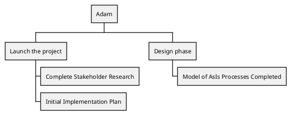
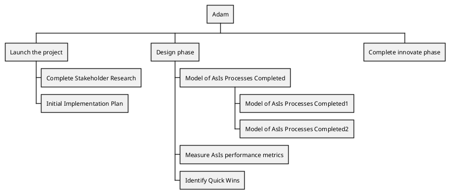

# Presentation Readme

## Steps to getting the markdown so Reveal.js can use it:

1. Get the markdown cleaned up
2. Create a new file from the original markdown and add _pres. So romans.md becomes romans_pres.md
3. Create the appropriate breaks in the pages:
   1. Three empy lines creates a new horizontal page (normal use)
   2. Two empy lines creates a virticle page (optional pages to present)

2. 

# Cheat Sheet

### For advancing points within a slide (add this to the end of the line):

 <!-- .element: class="fragment" -->
<!-- .element: class="fragment" data-fragment-index="26"-->
### For adding a background image:

<!-- .slide:  data-background-image="markdown/img/mount.png"  --> 

### for adding auto-animate 

<!-- .slide: data-auto-animate="" -->

### These are more options for .slide 

```html
data-background-color="aquamarine"
```

Use this to make the font as large as possible to fit in the screen:

```html
class="r-fit-text"
```
set color font etc
```
style="color:white"
```
```html
<!-- .slide: data-background-image="https://johnwry.github.io/dm2/markdown/Romanos/img/scroll.png" data-background-size="300px" data-background-position="left" data-background-opacity="0.5"-->

<!-- .element: style="color:#1c87c9; -webkit-text-stroke: 2px white; -webkit-font-smoothing: antialiased; text-shadow: 2px 2px #ccc;" -->
```
```
data-background-position="right 25% bottom 25%"
```

# PANDOC
```
pandoc -f docx "Haciendo Hacedores de Discípulos Maestro.docx" -t markdown --wrap=none --markdown-headings=atx --extract-media=media -o discipulado2.md
```

--reference-doc=custom-reference.docx //not sure about location setting but this is the command to run pandoc with a reference docx to produce equal dm2 files.

```bash
pandoc --reference-doc /Users/johnwry/.local/share/custom-reference.docx -o test.docx romanos9-16_pres.md

```

# Steps to convert Word to Markdown
1. Convert using pandoc (command above)
2. Clean up markdown

	a. make sure headers (# to ######) are in place
	b. find/replace the following:
		```
		"]{.ul}**" to "</u>__"
		```
		and 
		```
		"**[" to "__<u>"
		```

# Animations

view-source:https://martinomagnifico.github.io/reveal.js-appearance/demo.html#/

<canvas data-chart="line">
Year, 1976, 1978, 1980, 1982, 1984, 1986, 1988, 1990, 1992, 1994, 1996, 1998, 2000, 2002, 2004, 2006, 2008, 2010, 2012, 2014
Stay at home Fathers, 20.6, 22.5, 24.8, 30.9, 28.7, 31.3, 34.6, 40.4, 44.6, 41.3, 43.5, 44.2, 47.7, 52.2, 50.1, 52.9, 53.4, 53, 55.4, 53.8 
</canvas>

- one 
<!-- .element: class="animated fadeInDown slower" data-delay="120" -->
- two 
<!-- .element: class="fragment animated bounceInLeft"  -->





## Images + Captions

```markdown

<figcaption>
Trillando con bueyes 1865-1872 [^1]
</figcaption>
[^1]: https://www.wdl.org/en/item/14029/
```

## Quiz sheet


<!-- .slide: data-background-iframe="https://quizizz.com/join" id="examen_quiz_" data-menu-title="QUIZ" data-preload -->
   <script data-quiz >
   quiz = {};
  </script>

## outline text

-webkit-font-smoothing: antialiased

