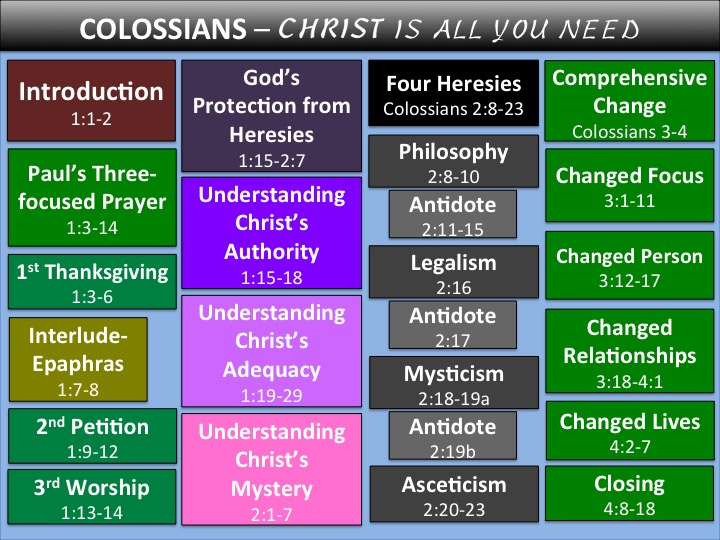

{width="7.458333333333333in" height="5.59375in"}{width="5.965277777777778in" height="4.478472222222222in"}

{width="3.161111111111111in" height="1.125in"}

Copyright © **2016 by DM Multiplied, Inc**

All rights reserved.

Copyright © **2016 by DM Multiplied Inc**

Reservados todos los derechos.

**Política de Derechos de Autor.** La traducción, la reedición, la duplicación de archivos, la distribución por sitio web o correo electrónico no autorizada de cualquier porción de este material en cualquier forma, sin el consentimiento expreso por escrito de DM2® está estrictamente prohibido. Cualquier persona puede usar los materiales de DM2® para su propio estudio personal o para la enseñanza de una clase con tal que el logo DM2® y esta política de derechos de autor se incluya en los materiales usados para enseñar la clase. Cualquier persona puede descargar una copia a una computadora, imprimir o hacer fotocopias de papel para una clase o grupo de estudio de la Biblia; Sin embargo, ninguna cobranza puede ser hecha por este material o para la realización de una clase usando este material, excepto por el costo real de la copia. Nadie está autorizado para realizar NINGÚN cambio en este material con derechos de autor. Para una descripción más completa de la política de DM2® respecto al uso de materiales DM2®, consulte al sitio web del DM2 en EE.UU. www.dm2usa.org.

**Impreso y Propiedad de:**

**DM2®**

**Disciple Makers Multiplied**

**PO Box 7758**

**Beaumont, TX 77726-7758**

**Para** **más** **información:**

**Escríbenos** **a:** **disciplemakersmultiplied\@gmail.com**

**www.DM2USA.org**

**\
**

**COLOSENSES**

> **Colosenses 1:1-2 --** Una introducción al libro **7**
>
> **Colosenses 1:3-14 --** La oración de Pablo de tres enfoques **14**
>
> **Colosenses 1:15-18 --** La protección de Dios de Herejías:\
> \--Entender la autoridad soberana de Cristo **28**
>
> **Colosenses 1:19-29 --** La protección de Dios de Herejías:\
> \--Entender la suficiencia de Cristo **36**
>
> **Colosenses 2:1-7 --** La protección de Dios de Herejías:\
> \--Entender el misterio de Cristo **52**
>
> **Colosenses 2:8-23 --** Examinando las Cuatro Herejías **62**
>
> **Colosenses 2:8-10 --** Filosofía, la primera herejía **62**
>
> **Colosenses 2:16 --** El legalismo, la secunda herejía **76**
>
> **Colosenses 2:18-19a --** El misticismo, la tercera herejía **80**
>
> **Colosenses 2:20-23 --** El ascetismo, el cuarto herejía **84**
>
> **Colosenses 3:1-11 --** Un enfoque cambiado **88**
>
> **Colosenses 3:12-17 --** Una persona cambiada **101**
>
> **Colosenses 3:18-4:1 --** Relaciones cambiados **107**
>
> **Colosenses 4:2-7 --** Vidas cambiadas **129**
>
> **Colosenses 4:7-18 --** Comentarios de cierre **133**

**\
**

**Colosenses**

**Cristo es Todo lo que Necesitas**

Pablo escribió esta breve carta de 95 versículos desde una celda de prisión en Roma. Podrías llamarla las \"95 tesis\" de Pablo, sobre la autoridad y suficiencia de Cristo. Nunca encontraras un mayor discurso sobre la grandeza de Cristo. Un estudio cuidadoso de Colosenses proporcionará una apreciación humilde de la autoridad suprema y suficiencia absoluta de Jesucristo.

El apóstol Pablo expresó que Jesucristo es la máxima autoridad y el sustentador completo de los creyentes. Proclamó a Cristo como la única fuente que es capaz de satisfacer por completo a nuestra sed. A través del apóstol Pablo, el Espíritu Santo advirtió a los colosenses de la superficialidad de la filosofía, el legalismo, el misticismo y el ascetismo. Estos son sustitutos baratos de Cristo que vive en y a través de ti. Pablo mostró que la filosofía humana no puede proporcionar una explicación para, o una comprensión de la vida. Cada uno de estos errores toma tus ojos fuera de Jesús como la fuente y el sustento de tu vida. Colosenses responde a la pregunta: \"¿Es Cristo suficiente?\" O, más específicamente, \"¿Es Él suficiente para ti?\"

Es significativo que el Espíritu Santo sólo se menciona una vez en esta narrativa (Col. 1: 8). Al explicar la vida cristiana sin enfatizar en el Espíritu Santo, Pablo elimina la tendencia hacia el misticismo, mostrando que el ministerio del Espíritu Santo es, ultimadamente Cristo en ti. En una era (2016 d.C.), cuando se mistifica la obra del Espíritu Santo, el énfasis de Pablo en Colosenses es algo que deberíamos de estudiar. Mientras algunos enseñan que a los creyentes les falta algo y que necesitan una segunda bendición o alguna experiencia novedosa para ser completos, Colosenses enfatiza todo lo contrario, afirmando que ya estamos completos en Cristo.

**La Autoridad de Cristo** -- ¿Crees tú que Jesucristo el Creador gobierna supremo y soberano sobre Su creación? ¿Reconoces que en la creación Él está por encima de todo, incluyendo todos los así llamados dioses, ángeles, demonios, animales y personas? Todos nosotros deberíamos hacer una pausa y honestamente preguntar si hay algo que eclipse a Cristo en nuestro pensamiento. Aunque muchas personas en nuestro día confiesan que Cristo es bueno o importante, lo ven como una sola autoridad entre muchas. Si esto te describe, el libro de Colosenses fue diseñado para cambiar tu opinión.

**La suficiencia de Cristo** -- ¿Crees que Cristo es suficiente? ¿Estas convencido de que Jesucristo es suficiente para todas tus necesidades espirituales? ¿Es Jesucristo ***parte*** de la respuesta? o ¿Es ***la*** respuesta misma? ¿Te has visto alguna vez buscando a actividades religiosas como el ayuno, la devoción más profunda o la penitencia para mantenerte en línea espiritualmente? ¿Qué influencia tiene en tu mente la filosofía secular contemporánea? En el libro de Colosenses, aprenderás que nada puede sustituir a Jesucristo en el cumplimiento de tus necesidades espirituales. Aunque muchos creyentes creen que Cristo es bueno para sus vidas, no están muy convencidos de que Él es suficiente.

Colosenses exalta a Jesucristo y muestra que cualquier cosa que te lleve lejos de una dependencia en Él es ilegítima.

**El Libro de Colosenses**

***Cristo es todo lo que necesitas\
*\
**

I.  **Colosenses 1:1-2 -- Una Introducción al Libro**

    A.  **Un Análisis de Colosenses**
    
        1.  Una corta **[historia]{.ul}** de Colosas
    
            a.  Colosas era una ciudad en el **[centro]{.ul}** de Asia Menor, o la actual Turquía.
    
            b.  Históricamente fue una ciudad **[importante]{.ul}** en la parte suroeste del imperio frigio (1200 -- 800 a.C.) que precedió la llegada de los griegos bajo Alejandro el Grande.
    
            c.  Habían dos **[ciudades]{.ul}** que formaban un triángulo con la ciudad de Colosas. Eran Laodicea (Apocalipsis 3:14-22) y Hierápolis. Colosenses 4:13
    
                1.  Cuando Pablo escribió esta epístola, Colosas había sido eclipsada en **[tamaño]{.ul}** e importancia por Laodicea y Hierápolis.
    
                2.  En su comentario sobre Colosenses, el obispo Lightfoot escribió: \"Sin duda Colosas fue la iglesia **[menos]{.ul}** importante de la cual cualquier epístola de San Pablo se dirigió.\"
    
            d.  Colosas fue anfitriona de una próspera industria **[textil]{.ul}** y fue particularmente famosa por su oscura (color carmesí, púrpura o negra brillante) lana, llamada colosiana.
    
            e.  Durante siglos una ruta **[comercial]{.ul}** importante (autopista) que pasó desde Éfeso hasta el Éufrates Superior atravesaba Colosas.
    
                1.  Más tarde, alrededor del siglo **[V]{.ul}** a.C., la ruta se desvío por Laodicea.
    
                2.  Muchos concluyen que ello ha contribuido al debilitamiento de Colosas, finalmente relegándola a un mero pueblo de **[campo]{.ul}**.
    
            f.  Ocasionalmente los **[ejércitos]{.ul}** invasores viajaban a o desde Europa pisoteando el área de Colosas.
    
        2.  El **[estado]{.ul}** de Colosas
    
            a.  Los habitantes de la ciudad habrían sido principalmente gentiles, aunque se dice que el Imperio Asirio exilió unos 2.000 o más Israelitas a la región en el siglo V a.C. Aun así, la mayoría de los habitantes eran **[nativos]{.ul}** frigios o griegos.
    
            b.  Aunque mucho más pequeña que sus vecinos, Colosas disfrutó de su participación en la **[riqueza]{.ul}**.
    
            c.  La historia nos dice que un terrible terremoto destruyó Colosas en el año 60 d.C. durante el reinado del emperador Nerón. Aunque fue reconstruida más tarde, Colosas nunca recuperó su antiguo **[estatus]{.ul}** - un estatus que ya estaba desvaneciendo en el tiempo de Pablo.
    
            d.  Debido a las incursiones turcas en el siglo XII d.C., la **[ciudad]{.ul}** cayó y el sitio fue completamente abandonado.
    
            e.  Hoy Colosas yace en ruinas en el Valle de Licos, asfixiada debajo de 800 años de **[tierra]{.ul}** y residuos.
    
            f.  Sólo recientemente han comenzado las excavaciones, provocando el entusiasmo tanto del **[mundo]{.ul}** arqueológico cristiano como del secular.
    
        3.  La **[iglesia]{.ul}** de Colosas
    
            a.  Probablemente Pablo viajó cerca de la ciudad en su segundo **[viaje]{.ul}** misionero, pero no tuvo la aprobación de Dios para evangelizar allí. Hechos 16:6-8, Colosenses 2:1
    
                1.  Se cree que la evangelización de Colosas debió haber sido la **[obra]{.ul}** de Epafras (Col. 1:7, 4:12-13), un creyente que pudo haberse salvado bajo el ministerio de Pablo (tercer viaje misionero) durante su período de tres años en Éfeso (100 millas al este). Hechos 19:10, 20:31
    
                2.  Además, pudo haber sido durante la estancia de Pablo en Éfeso que Filemón fue **[llevado]{.ul}** al Señor (Filemón 19). En algún momento la iglesia de Colosas eligió congregarse en la casa de Filemón para sus reuniones.
    
            b.  Cualquiera que sea el caso, Pablo escuchó acerca de su **[fe]{.ul}** (Col. 1:4, 8, 9, 2:1), así como también de algunos errores serios que requerían aclaración inmediata y corrección.
    
                1.  Sorprendentemente, la redacción de este texto en el 60-61 d.C. habría sido justo antes, o incluso justo después, del terremoto del 60 d.C. De todos modos, Pablo parecía totalmente desconocer de ese evento cuando escribió.
    
                2.  Mientras escribía esta **[epístola]{.ul}**, Pablo estaba padeciendo su primer encarcelamiento en la ciudad de Roma. Estaba en espera de juicio debido a su apelación a César.
    
            c.  Parece que la iglesia de Colosas eventualmente sucumbió a la adoración de **[ángeles]{.ul}**. Miguel el Arcángel llegó a ser conocido como el santo protector de la ciudad. Él supuestamente la salvó de una inundación desastrosa como se refleja en el arte medieval.
    
    B.  **El Ataque a los Colosenses**
    
        1.  Satanás ataca la obra de Dios a través de la difusión de falsos evangelios o a través de la enseñanza de **[métodos]{.ul}** falsos de la vida cristiana. Si el diablo puede distraer a un creyente de la suficiencia de Cristo de alguna manera, él está feliz. Colosenses 2: 1-4; 2 Corintios 2:11, 11: 3, 14; Efesios 6:12; 1 Pedro 5:8-9; Santiago 4:7
    
        2.  Las falsas enseñanzas de la antigua Colosas no **[negaron]{.ul}** por completo a Jesucristo como Salvador. En su lugar, inteligentemente disminuyeron Su autoridad como Dios venido en la carne. Ellos pusieron a Cristo en una luz inferior en las mentes de los creyentes ingenuos.
    
        3.  Las enseñanzas falsas sobre cómo vivir una vida cristiana victoriosa casi siempre atacan a la autoridad y suficiencia de Cristo. El mensaje es: \"Cristo Jesús, más algo (llene el espacio) es igual a una vida cristiana exitosa\".
    
        4.  ¿Qué estaba quitando el foco de la preeminencia y suficiencia de Cristo en Colosas?
    
            a.  **Filosofía humana**: Este **[error]{.ul}** enseña que tú necesitas a Cristo más la filosofía para el éxito en la vida cristiana.
    
                1.  Esta sutil seducción sugiere que hay quienes están **[informados]{.ul}** frente a los ignorantes.
    
                2.  Este error te hace **[mirar]{.ul}** al conocimiento humano y a la filosofía secular como las respuestas a las preguntas de la vida en lugar de mirar sólo a Cristo. Colosenses 2:6-10
    
            b.  **Legalismo ritualista**: Esta falsedad enseña que por la estricta obediencia a ciertos rituales, normas o regulaciones puedes llegar a merecer el favor de Dios. Este error te engaña al quitar tus ojos de Cristo y ponerlos en tus propios **[esfuerzos]{.ul}** y logros para alcanzar la espiritualidad. Colosenses 2:16-17
    
            c.  **Misticismo experiencial**: Esta creencia errónea implica que careces y que necesitas de algo **[más]{.ul}** para llegar a ser un creyente completo. Este error a menudo implica una necesidad de tener visiones, profecías personales, encuentros con ángeles, o experiencias sobrenaturales.
    
                1.  Este **[falso]{.ul}** enfoque se desarrolla invariablemente en las emociones y experiencias, más allá de la Palabra de Dios.
    
                2.  Este error hace que los creyentes **[busquen]{.ul}** a la experiencia para la espiritualidad, en lugar de Cristo. Colosenses 2:18-19
    
            d.  **Ascetismo personal**: Este concepto popular propone que la abnegación, la austeridad, el aislamiento, la auto-privación, o el mayor fervor religioso es la verdadera **[clave]{.ul}** para la espiritualidad.
    
                1.  Curiosamente, Pablo señaló que estos no te abstendrían de los apetitos de tu **[carne]{.ul}**. Colosenses 2:20-23
    
                2.  En lugar de la vida abundante que es por **[gracia]{.ul}** mediante la fe, este concepto ve erróneamente a la auto-privación o auto-humillación como la clave para una vida abundante.
    
        5.  Todos estos cuatro errores son constantemente reempacados, a menudo por buenos intencionados líderes cristianos o autores famosos, y reofrecidos a la iglesia como "la clave\" o "el **[secreto]{.ul}**\" para una vida cristiana más profunda.
    
        6.  Todos estos conceptos erróneos fueron finalmente encapsulados en el gnosticismo, el cual de una forma u otra todavía existe **[hoy]{.ul}**. Sin lugar a dudas, hasta que Cristo regrese estas herejías seguirán siendo una amenaza continua y constante para nuestro progreso espiritual. Gracias a Dios por las aclaraciones que se encuentran en el libro de Colosenses.
    
    C.  **La Distribución de Colosenses**
    
        1.  Esta epístola se divide en **[tres]{.ul}** secciones.
    
            a.  Capítulo 1 -- Conociendo a Jesucristo como preeminente y suficiente para **[ti]{.ul}**
    
            b.  Capítulo 2 -- Comprendiendo tu posición en Jesucristo y que la **[verdadera]{.ul}** espiritualidad viene por medio de la gracia de Dios mediante la fe dependiente versus las falsificaciones
    
            c.  Capítulos 3-4 -- Viviendo tu vida por la fe en la suficiencia de Cristo, fortalecido por **[Él]{.ul}** para hacer Su voluntad
    
        2.  Hay 11 versículos en esta epístola que enfatizan nuestra posición en Cristo.
    
            a.  Colosenses 1:2 -- Estamos en **[Cristo]{.ul}**.
    
            b.  Colosenses 2:7 -- Estamos **[arraigados]{.ul}** en Cristo.
    
            c.  Colosenses 2:7 -- Estamos **[sobreedificados]{.ul}** en Cristo.
    
            d.  Colosenses 2:10 -- Estamos **[completos]{.ul}** en Cristo.
    
            e.  Colosenses 2:11 -- Hemos sido **[crucificados]{.ul}** con Cristo.
    
            f.  Colosenses 2:12 -- Hemos sido **[sepultados]{.ul}** con Cristo.
    
            g.  Colosenses 2:13 -- Estamos **[vivos]{.ul}** ahora con Cristo.
    
            h.  Colosenses 2:20 -- Estamos **[muertos]{.ul}** con Cristo al sistema mundial.
    
            i.  Colosenses 3:1 -- Hemos sido **[resucitados]{.ul}** juntos con Cristo.
    
            j.  Colosenses 3:3 -- Estamos **[escondidos]{.ul}** con Cristo en Dios.
    
    D.  **Colosenses 1:1-2a -- La Autoría de Colosenses**
    
        1.  Colosenses 1:1a -- Pablo firmó su nombre como el **[autor]{.ul}** de esta carta.
    
            a.  Al nacer, Pablo fue llamado Saulo. Saulo era un nombre judío que significaba \"grande\" o alguien de **[gran]{.ul}** importancia.
    
                1.  Pablo nació de padres **[judíos]{.ul}** en el territorio militar romano de Tarso. Sus padres debieron de haber sido algo afluentes ya que le habían puesto bajo la tutela de Gamaliel, un maestro principal del judaísmo en ese día. Hechos 22:3
    
                2.  Pablo **[nació]{.ul}** con la ciudadanía romana. Su padre pudo haber adquirido la ciudadanía romana a través del servicio militar. Para obtener la ciudadanía por medio del servicio militar se tenía que haber servido un mínimo de 25 años y haber recibido una despedida honorable. Hechos 5:34, 22:25-29
    
                3.  La historia proporciona solamente una breve descripción de Pablo de una fuente incierta: *un hombre de **[baja]{.ul}** estatura, con una cabeza calva y las piernas torcidas, en un buen estado del cuerpo, con las cejas unidas y la nariz un tanto aguileña, lleno de simpatía, por ahora parecía como un hombre, y ahora tenía la cara de un ángel.\
                    *
    
            b.  Como vemos en las epístolas, Saulo fue referido posteriormente casi exclusivamente como **[Pablo]{.ul}**, significando pequeño o el pequeño.
    
                1.  Él fue **[inicialmente]{.ul}** identificado como Pablo en su primer viaje misionero en Hechos 13.
    
                2.  Constantemente ser llamado **[pequeño]{.ul}** habría sido un recordatorio constante para el apóstol de su necesidad de la gracia de Dios. Sin reservas la aceptación de Pablo de este apodo mostró humildad genuina.
    
            c.  Una **[breve]{.ul}** historia de Pablo
    
                1.  **[Antes]{.ul}** de la salvación, Pablo era extremadamente religioso y farisaico. Gálatas 1:14, Filipenses 3:4-9, 1 Timoteo 1:12-15
    
                2.  Pablo **[era]{.ul}** un perseguidor agresivo de los cristianos. Hechos 22:4, 26:10-11; Gálatas 1:13
    
                3.  Pablo se salvó en un acontecimiento dramático y repentino en un **[camino]{.ul}** que conducía a la ciudad de Damasco. Hechos 9
    
                4.  Pablo fue apartado por Cristo como Su **[apóstol]{.ul}** para los gentiles. Hechos 9:15-16, 1 Corintios 15:8-10, Gálatas 2:8
    
                5.  Pablo sirvió a Dios en **[tres]{.ul}** viajes misioneros. Hechos 13-20
    
                6.  Pablo **[escribió]{.ul}** 13 libros fundamentales del Nuevo Testamento.
    
                7.  Pablo sufrió mucho por Cristo con golpes, una **[lapidación]{.ul}**, encarcelamientos y, finalmente, la ejecución en Roma alrededor del año 67 d.C. 2 Corintios 11:23-28
    
        2.  Colosenses 1:1a -- En la iglesia, Pablo poseía autoridad dada por Dios como un **[apóstol]{.ul}**.
    
            a.  Pablo era un *apóstol de Jesucristo*. Cristo salvó a Pablo y lo **[envió]{.ul}** como un apóstol, dedicado específicamente a los gentiles. Hechos 9:15-16, 22:21; Romanos 11:13; Gálatas 2:8; 1 Timoteo 2:7; 2 Timoteo 1:11
    
            b.  Pablo era un apóstol *por la voluntad de **[Dios]{.ul}*** y no por ambición personal o nombramiento humano. Vamos a considerar algunos datos generales sobre el apostolado. Gálatas 1:1, 1 Corintios 1:1, 2 Timoteo 1:1
    
                1.  La palabra apóstol significa **[enviado]{.ul}**. Los apóstoles fueron escogidos personalmente y comisionados al servicio por el resucitado Señor Jesús. 1 Corintios 9:1, 15:7-9; Hechos 9:3-6
    
                2.  Como representantes oficiales de Jesucristo y divinamente comisionados, los apóstoles pusieron el fundamento de la **[iglesia]{.ul}**. Los apóstoles fueron los portavoces de Dios. 1 Corintios 9:1-2; 2 Corintios 12:12; Efesios 2:19-20, 4:12-13; 2 Pedro 3:2b
    
                3.  Los apóstoles se convirtieron en las autoridades espirituales en la iglesia **[primitiva]{.ul}** y fueron usados ​​por Dios para escribir gran parte del Nuevo Testamento. 1 Corintios 4:8-13, 12:28; 1 Tesalonicenses 2:6; Judas 17
    
                4.  Sólo hubieron doce apóstoles nombrados **[directamente]{.ul}** por el Cordero (Ap. 21:14). No hay nuevos apóstoles siendo comisionados directamente por Dios en la actualidad. 1 Corintios 15:7-10, Efesios 2:20
    
        3.  Colosenses 1:1b -- *Y el hermano Timoteo*... Timoteo, un **[compañero]{.ul}** en la fe en Jesucristo, fue uno de los ayudantes de Pablo en el ministerio.
    
            a.  Timoteo fue el hijo de un padre **[griego]{.ul}** y una madre judía creyente. Hechos 16:1, 2 Timoteo 1:5
    
            b.  Timoteo creció en Listra, donde Pablo fue casi **[apedreado]{.ul}**. Hechos 16:2
    
            c.  Él confió en **[Cristo]{.ul}** a través del ministerio de Pablo. Hechos 14:8-20
    
            d.  Timoteo fue de un **[gran]{.ul}** ánimo para el apóstol Pablo. Filipenses 2:19-23
    
            e.  Fue un compañero **[fiel]{.ul}** servidor de Pablo. Hechos 14:6-23, 16-19; 1 Timoteo 1:3; 2 Timoteo 1:5, 3:15
    
    E.  **Colosenses 1:2 -- Los Destinatarios en Colosas**
    
        1.  Colosenses 1:2a -- *A los santos y fieles hermanos en Cristo*\... Como un **[grupo]{.ul}**, los destinatarios de esta carta fueron identificados como los hermanos santos y confiables en Cristo.
    
            a.  Ellos fueron llamados ***santos***, lo cual significa santificados o **[apartados]{.ul}**. Esta es una declaración posicional.
    
                1.  Santos habla de la posición de los creyentes en **[perfecta]{.ul}** justicia ante Dios como ya santos. Esta posición es verdadera para todos los creyentes.
    
                2.  La descripción ***santos*** es la única designación o título más usado para los creyentes en todo el Nuevo Testamento.
    
                3.  Esta descripción, o título, habla de la invariable posición del creyente en Cristo, basada en la aceptación de la **[obra]{.ul}** consumada de Cristo.
    
            b.  *Y **fieles hermanos***\... Esta descripción de los colosenses les representa como miembros fieles de la **[familia]{.ul}**. Esta es una declaración condicional.
    
                1.  Esta descripción destaca el caminar de **[fe]{.ul}** consistente de los Colosenses.
    
                2.  La mención de *fieles* ***[hermanos]{.ul}*** en la introducción de Pablo sugiere la posibilidad de la existencia de los creyentes infieles en la iglesia.
    
                3.  Obviamente Dios desea que la condición de un creyente o práctica **[diaria]{.ul}** (*fieles* *hermanos*) esté en alineación con su posición invariable en Cristo (*santos*).
    
                4.  Cuando esto es una realidad en la práctica de un creyente, lo llamamos andar en el Espíritu o caminar por la **[fe]{.ul}**. 2 Corintios 5:7, Gálatas 5:16
    
        2.  Colosenses 1:2b - Pablo se dirigió a los fieles ***hermanos [en Cristo]{.ul}* *que están en Colosas***. Vemos que aunque físicamente residían en la ciudad de Colosas, espiritualmente se encontraban ***en Cristo***.
    
    F.  **Colosense 1:2c -- Un Saludo Amigable a los Colosenses**
    
        1.  Cuando Pablo dijo, "***[Gracia]{.ul}** y paz sean a vosotros*", estaba expresando su deseo de una bendición especial para los creyentes de Colosas.
    
            a.  **[Toda]{.ul}** carta que Pablo escribió comenzó y terminó con una declaración acerca de la gracia. Colosenses 1:2, 4:18
    
            b.  Pablo creía que la **[vida]{.ul}** para el creyente debía ser vivida por gracia. ¿Y tú?
    
        2.  *Y **[paz]{.ul}***\... Pablo también deseaba que la paz de Dios descansara sobre ellos.
    
            a.  La verdadera paz viene de una comprensión de la **[gracia]{.ul}** de Dios.
    
            b.  ¿Describe **[tu]{.ul}** vida paz?
    
        3.  Colosenses 1:2b -- La declaración ***de** Dios nuestro Padre y del Señor Jesucristo* muestra la única **[fuente]{.ul}** verdadera de la cual originan tanto la gracia como la paz.
    
            a.  También hay que notar el **[orden]{.ul}** de las palabras gracia primero y luego paz.
    
            b.  Verdaderamente no se puede experimentar la paz, sin **[primero]{.ul}** ser un recipiente de la maravillosa gracia de Dios.

II. **Colosenses 1:3-14 -- Tres Enfoques de la Oración de Pablo**

    A.  **Colosenses 1:3-6 -- Parte uno: La oración de gratitud de Pablo**
    
        1.  Colosenses 1:3-6 constituye una sola oración **[larga]{.ul}** e interminable en griego. La acción de gracias de Pablo por la obra de la gracia de Dios en estos creyentes sobreabundó en una oración por ellos para que crecieran en su entendimiento de la voluntad de Dios, a fin de que siguieran dando fruto y agradando a Dios.
    
        2.  Colosenses 1:3 -- Pablo dio gracias a Dios por sus hermanos en la fe en Colosas.
    
            a.  Colosenses 1:3a -- *Damos gracias*\... Típico de Pablo, comenzó su oración dando **[gracias]{.ul}** por sus lectores. Filipenses 1:3, Romanos 1:8, Efesios 1:15-16
    
                1.  Al decir, *\"**[Damos]{.ul}** gracias\",* Pablo hizo evidente que otros creyentes estaban involucrados en la intercesión por los colosenses.
    
                2.  El verbo griego traducido dar gracias EU**CARIS**TOUMEN contiene la palabra **[gracia]{.ul}** como su raíz. Dar gracias literalmente significa hablar gozosamente de la gracia. En este caso, Pablo estaba hablando gozosamente de la gracia **de Dios** hacia los creyentes de Colosas.
    
                3.  El verbo está en tiempo presente, denotando el aspecto continuo de la acción de gracias de Pablo. Pablo y sus compañeros **[dieron]{.ul}** continuamente gracias por los Colosenses.
    
                4.  Cuando das un vistazo a Dios y empiezas a captar Sus provisiones inmerecidas, no puedes **[dejar]{.ul}** de darle gracias. La gratitud es una motivación central para vivir la vida cristiana. Fiel a este hecho, Pablo demostró gratitud en cada capítulo de Colosenses. Colosenses 1:3, 1:12, 2:7, 3:15-17, 4:2
    
                5.  No debemos perder de vista el hecho de que Pablo estaba en **[prisión]{.ul}** mientras le daba gracias aquí. ¿Estás lleno de acción de gracias en medio de las pruebas de tu vida? Santiago 1:2
    
            b.  Colosenses 1:3b -- Él dio gracias al *"**[Padre]{.ul}** de nuestro Señor Jesucristo".*
    
                1.  Pablo podría haber indicado simplemente, \"Damos gracias a Dios el Padre\", sin mencionar que era *el **[Padre]{.ul}** de nuestro Señor Jesucristo* - LBLA.
    
                2.  Esta declaración debe traer a la mente que así como Dios fue siempre un Padre fiel a nuestro Señor Jesucristo mientras estuvo en la tierra, Él es un Padre fiel a **[nosotros]{.ul}** también. Romanos 8:15, Gálatas 4: 6
    
                3.  La misma posición privilegiada que disfruta **[Jesús]{.ul}** como un hijo, también disfrutamos nosotros hoy. Efesios 1:3, Juan 17:23
    
            c.  Colosenses 1:3c -- *Siempre orando por vosotros*\... Pablo quería que los Colosenses supieran que no estaban **[solos]{.ul}** en la batalla de la vida; él y sus compañeros creyentes estaban orando constantemente por ellos.
    
                1.  ***[Siempre]{.ul}** orando*\... Pablo les recordó que oraba regularmente para ellos.
    
                2.  Más tarde, al final de esta **[carta]{.ul}**, les dirige de la misma manera que se dedicaran a la oración. Colosenses 4:2
    
                3.  La exhortación de Pablo a aquellos bajo su cuidado a siempre **[orar]{.ul}** (Col. 4:2) vino inmediatamente después de su ejemplo. En esencia, el ejemplo de Pablo dice: \"Haz lo que digo y hago.\" Él no estaba comunicando, \"Haz lo que digo, pero no lo que hago\".
    
        3.  Colosenses 1:4-5b -- La motivación del agradecimiento de Pablo era el testimonio generalizado de la fe, el **[amor]{.ul}** y la esperanza de los colosenses.
    
            a.  Colosenses 1:4a -- *Vuestra **[fe]{.ul}** en Cristo Jesús*\... Presta atención: Pablo se centró primero en su fe, no en sus obras. ¿Por qué podría ser? Si un creyente tiene una fe vibrante en Cristo, su fe se traducirá en obras loables delante de Dios. Romanos 1:5, 16:26
    
            b.  Colosenses 1:4b -- *vuestra fe **[en]{.ul} Cristo Jesús***\... Enseguida Pablo se centró en su fe siendo específicamente *en Cristo Jesús*. Su fe en la persona de Cristo inspiró la acción de gracias de Pablo.
    
                1.  Su *...fe en Cristo Jesús*\... podría hacer referencia al hecho de que ellos creyeron en Cristo y fueron **[salvos]{.ul}** por la fe, pero en este versículo Pablo incluye su fe junto con su amor, mostrando que no estaba hablando únicamente de su fe inicial en Cristo para la salvación. También estaba hablando acerca de su caminar diario de la fe. Gálatas 2:20
    
                2.  Pablo se refirió al hecho de que ellos **[diariamente]{.ul}** caminaban por la fe. Esto es comparable a los comentarios de Pablo acerca de la fe de los Tesalonicenses: *acordándonos sin cesar delante del Dios y Padre nuestro de la obra de vuestra fe, del trabajo de vuestro amor y de vuestra constancia en la esperanza en nuestro Señor Jesucristo*. 1 Tesalonicenses 1:3
    
                    a.  Si alguien le agradecería a Dios por ti, ¿mencionaría tu caminar de fe?
    
                    b.  ¿Cuál es el objeto de tu fe hoy? ¿Está edificada tu vida en un caminar continuo de fe en el Señor Jesucristo?, o ¿confías en los hombres?, o peor aún ¿en tu propia fuerza? Jeremías 17:5-8
    
            c.  Colosenses 1:4c -- *Y del amor* AGAPE *que tenéis a todos los santos*. Pablo estaba agradecido de escuchar de su amor desinteresado hacia todo el **[cuerpo]{.ul}** de Cristo. Juan 15:12
    
                1.  Romanos 5:8 describe el amor AGAPE tanto inmerecido como **[auto]{.ul}**-sacrificial.
    
                2.  1 Corintios 13:4-8 detalla 16 cualidades interrelacionadas que se **[encuentran]{.ul}** en el amor ágape.
    
                3.  En Gálatas 5:16, 22-23 aprendemos que el amor AGAPE es un fruto del Espíritu en la **[vida]{.ul}** del creyente mientras él o ella camina por la fe en el poder del Espíritu Santo y no el producto del esfuerzo propio o resolución. Colosenses 1:8, Gálatas 5:22, 1 Timoteo 1:4-5
    
            d.  Colosenses 1:5a -- *A causa de la esperanza que os está guardada en los cielos*... El caminar de fe y de amor mutuo de los colosenses fueron el resultado de su **[esperanza]{.ul}** segura.
    
                1.  Los creyentes de Colosas estaban viviendo con un **[enfoque]{.ul}** en la eternidad y no permitían que sus sufrimientos actuales aplastaran su espíritu. Efesios 1:18, Colosenses 3:2-4, Hebreos 12:1-3
    
                2.  Por definición, la esperanza bíblica es la expectación segura en contraposición a la **[duda]{.ul}**. La esperanza en el Nuevo Testamento denota certeza.
    
                3.  Al igual que con la fe, la esperanza tiene un **[objeto]{.ul}**. La esperanza se basa siempre en la Palabra de Dios y Su fidelidad. Romanos 8:24-25, 15:13; 1 Corintios 13:13
    
            e.  Colosenses 1:5b -- **Esperanza** *\...de la cual ya habéis **[oído]{.ul}** por la palabra verdadera del evangelio.* Pablo dio gracias porque desde el primer día de su salvación se habían mantenido firmemente a su esperanza.
    
        4.  Colosenses 1:5c-6 -- Pablo dio gracias a Dios por la extensión del **[alcance]{.ul}** del evangelio. \...*la palabra verdadera del evangelio, que ha llegado hasta vosotros*.
    
            a.  Colosenses 1:5c -- ¿Cuál es *la palabra verdadera del evangelio* que Pablo menciona aquí?
    
                1.  Pablo no está usando la palabra evangelio aquí como un término general para una buena noticia. Él se está refiriendo específicamente al mensaje de la **[verdad]{.ul}** que ha de ser predicado y creído para la salvación.
    
                2.  El Evangelio aquí se refiere al mensaje de **[salvación]{.ul}** que se encuentra en 1 Corintios 15:3-4.
    
            b.  Colosenses 1:6a -- El Evangelio ...*que ha llegado hasta vosotros*. Increíblemente el Evangelio había llegado incluso **[hasta]{.ul}** la ciudad decadente de Colosas.
    
            c.  Colosenses 1:6b -- \...*así como **a todo el mundo***\... Pablo dio gracias a que el mensaje del Evangelio **[les]{.ul}** había llegado, así como lo estaba alcanzando todo el resto del mundo.
    
                1.  El mensaje del Evangelio que cambia la vida es para todo el mundo, mientras que típicamente las falsas enseñanzas son representadas como para sólo unos **[pocos]{.ul}** exclusivos o privilegiados. 1 Timoteo 2:4
    
                2.  La oferta mundial del Evangelio está en marcado contraste con los mensajes exclusivos o **[secretos]{.ul}** enseñados por los falsos maestros.
    
            d.  Colosenses 1:6c -- *...y lleva fruto* \['constantemente' -- LBLA\] *y crece*\... Pablo dio gracias a Dios que el Evangelio estaba extendiéndose por todo el **[mundo]{.ul}**, y que a medida que se extendía, las personas se salvaban, y vidas eran transformadas. Romanos 1:17
    
            e.  Colosenses 1:6d -- \['Así **lo ha estado haciendo**' -- LBLA\] ***también en vosotros**...* Pablo dio **[gracias]{.ul}** en particular por el impacto de la *gracia de Dios* en la vida de los creyentes colosenses como lo probaba su propia transformación personal.
    
            f.  Colosenses 1:6e -- \...*desde el día que oísteis*\... La persona no salva debe **[escuchar]{.ul}** el mensaje de la muerte de Cristo por sus pecados y la resurrección de Cristo, para poder responder por la fe y ser salva. Romanos 1:16, 10:17; Efesios 1:13
    
            g.  Colosenses 1:6f -- \...*y conocisteis la gracia de Dios en **[verdad]{.ul}***. La comprensión de lo que merecemos por nuestros pecados y lo que Dios hizo por nosotros en la muerte de Cristo se convierte en la base apropiada para un correcto conocimiento de la gracia.
    
                1.  Es esencial para la salvación **[inicial]{.ul}** un conocimiento exacto de la gracia de Dios. Romanos 1:17
    
                    a.  La gracia no es el **[amor]{.ul}** de Dios separado de la justicia de Dios. Dios no ignoró Su justicia, a fin de mostrarnos Su gracia. Filipenses 1:9, 2 Pedro 3:18
    
                    b.  Cuando Cristo murió en la cruz como nuestro sustituto, Dios no sólo reveló su **[amor]{.ul}** perfecto, también Cristo satisfizo las demandas justas de Dios en nuestro nombre. No hay mejor imagen de la justicia servida que la muerte de Cristo por el pecado. Romanos 5:8, 8:32; 2 Corintios 5:21; Colosenses 2:13-14
    
                2.  La comprensión de la gracia de Dios en verdad no sólo es importante para nuestra salvación eterna de la penalidad del pecado (fase uno de la salvación), sino también para nuestra salvación práctica del **[poder]{.ul}** del pecado (fase dos de la salvación).
    
                    a.  No somos salvos según nuestras **[obras]{.ul}**. Somos salvos por la fe en la persona y obra de Cristo. Romanos 11:6, Gálatas 2:21, 1 Pedro 5:12b
    
                    b.  No podemos vivir tampoco la vida cristiana por nuestras propias obras. La vida cristiana es por fe, mientras **[dependemos]{.ul}** de Cristo y de sus provisiones en nuestro nombre. Romanos 1:17, Gálatas 2:20
    
        5.  Colosenses 1:6 -- *Desde el día que oísteis* *\[el evangelio\]* *y conocisteis la gracia de Dios en verdad*. Echemos un vistazo más de cerca al **[Evangelio]{.ul}** de 1 Corintios 15:1-10.
    
            a.  1 Corintios 15:1 -- La palabra *evangelio* EUANGELION en el Nuevo Testamento simplemente significa **[buenas]{.ul}** noticias. El contexto define la buena noticia. Cuando se trata del mensaje salvador o del Evangelio de nuestra salvación, descubrimos lo siguiente:
    
                1.  Dios tiene algunas noticias muy buenas para **[toda]{.ul}** la humanidad. Hechos 17:30-31
    
                2.  Las buenas noticias es que Dios ha hecho todo lo necesario para **[nuestra]{.ul}** salvación. Juan 19:30
    
                3.  Las buenas noticias es que el **[pecado]{.ul}** ha sido pagado en su totalidad por la muerte de Jesucristo, el Hijo de Dios. Hebreos 10:12
    
                4.  Las buenas noticias es que podemos tener vida eterna, porque hace mucho tiempo Cristo murió por nuestros pecados y **[resucitó]{.ul}**, tal como lo predijeron las Escrituras que lo haría. Romanos 4:24-25, 1 Corintios 15:3-4, 1 Tesalonicenses 4:14a
    
                5.  El Evangelio se trata de todo lo que **[Dios]{.ul}** ha hecho para salvar a los pecadores a través de la persona y obra de Cristo. 1 Corintios 15:1-5a, 11
    
            b.  1 Corintios 15:3a -- *Porque primeramente os he enseñado lo que asimismo recibí: **que Cristo***... La **[persona]{.ul}** quien fue el autor del Evangelio es Jesucristo.
    
                1.  La palabra *Cristo* en griego es una **[palabra]{.ul}** mucho más cargada de lo que percibimos en español. Cuando Pablo usa el término *el Cristo* estaba hablando de uno solamente, del único Libertador profetizado. Génesis 3:15, Hechos 10:36, Romanos 1:3-4
    
                2.  A menudo pensamos en el término *Cristo* como simplemente el **[apellido]{.ul}** de Jesús, pero en realidad el concepto es mucho más significativo que eso. El *Cristo* fue el Liberador venidero, o el Mesías, prometido atrás en el Jardín del Edén. Él iba a ser el Ungido de Dios enviado a rescatarnos. Lucas 2:11, Hechos 2:36
    
                    a.  El término Cristo es el equivalente griego de la palabra **[hebrea]{.ul}** Mesías. Mesías significa el ungido.
    
                    b.  El concepto de **un ungido** viene del Antiguo Testamento donde un **[profeta]{.ul}** ungiría a una persona escogida con aceite, para significar la selección de Dios de esa persona para el servicio. 1 Samuel 24:6, Salmo 105:15, Mateo 12:17-18
    
                3.  El Cristo fue el instrumento escogido por Dios **[apartado]{.ul}** para la obra de salvar a todos aquellos que vienen a Dios por la fe.
    
                4.  Como el Cristo, o el ungido, Jesús fue el escogido por Dios para ser el Salvador del **[mundo]{.ul}**. Jesucristo es el Mesías esperado. Isaías 42:1, 61:1; Lucas 4:16-21
    
                5.  Por todo esto, el Evangelio tiene que ver primero que todo con Jesús siendo el Cristo, que fue designado por Dios para venir como un **[humano]{.ul}** y salvar a la humanidad del pecado. Juan 1:29-34
    
            c.  1 Corintios 15:3b -- *Cristo **[murió]{.ul}*** \[en nuestro lugar, por nuestros pecados\]. El mensaje del Evangelio incluye la obra realizada por la muerte sustitutiva de Cristo por nosotros. Lucas 24:27
    
                1.  1 Corintios 15:3 -- La frase *Cristo murió* es el corazón del Evangelio. Si para la salvación tu confías en cualquier **[otra]{.ul}** cosa que no sea la muerte de Cristo no serás salvo. Tu fe debe reposar solamente en Cristo.
    
                2.  La Biblia afirma que *la paga del pecado es la muerte*. Cuando Cristo murió por nuestros pecados, Él **[pagó]{.ul}** el precio de nuestro perdón. La muerte de Cristo fue el pago apropiado, suficiente y único para nuestra redención.
    
            d.  1 Corintios 15:3c -- *Cristo murió por nuestros **[pecados]{.ul}***\... El gran logro del Evangelio es la muerte de Cristo por nuestros pecados personales. Su muerte fue una-vez-por-todas la paga por los pecados. Su paga por única vez proveyó todo lo necesario para nuestro completo perdón.
    
                1.  Cristo murió para que Dios pudiera **[perdonar]{.ul}** el pecado para siempre. *Porque la paga del pecado es muerte* (Rom. 6:23). A través de Su muerte, Cristo pagó tu deuda de pecado.
    
                2.  Nada más hay que hacer para resolver el problema del pecado entre Dios santo y el hombre pecador. El pecado fue completamente tratado en la **[cruz]{.ul}** de Cristo. Ya no hay ninguna necesidad de un sacrificio. 1 Pedro 3:18
    
            e.  1 Corintios 15:3d-4a -- ***Cristo murió**\...conforme a las Escrituras, y que fue sepultado*. Tenemos dos grandes confirmaciones de que Cristo, efectivamente **[murió]{.ul}** por nuestros pecados. La primera es el testimonio profético cumplido del Antiguo Testamento, y el segundo es el hecho de que Su cuerpo sin vida fue colocado en una tumba en un día en la historia.
    
            f.  1 Corintios 15:4b-5a -- \...***y que resucitó al tercer día** conforme a las Escrituras, y que apareció*\... También tenemos dos confirmaciones de resurrección **[corporal]{.ul}** literal de Cristo. En primer lugar tenemos el cumplimiento literal de las Escrituras del Antiguo Testamento y en segundo lugar tenemos testimonios de testigos.
    
                1.  Cristo es un Salvador **[viviente]{.ul}**. Si Cristo aún estuviese muerto, no podría salvar a nadie. Hebreos 7:25
    
                2.  Cristo es la fuente de vida eterna. Después de haber sido **[levantado]{.ul}** de entre los muertos, Cristo ahora ofrece vida eterna a todos los que creen en Él. Romanos 4:24-25, Juan 6:40
    
            g.  1 Corintios 15:11 -- En relación con el mensaje del Evangelio, Pablo dijo, "...*así predicamos, y así habéis **[creído]{.ul}***".
    
                1.  Debido a que Cristo murió por nuestros pecados y resucitó de nuevo como lo dice la Palabra de Dios, nosotros no **[predicamos]{.ul}** ningún otro mensaje a los inconversos para la salvación. Romanos 6:23
    
                2.  Muchas presentaciones hoy en día **[carecen]{.ul}** del mensaje básico central del Evangelio, el cual es la persona y obra de Cristo. 1 Corintios 1:23, 2:2; Gálatas 6:14
    
                3.  Si el Evangelio que predicamos no contiene las cuestiones **[básicas]{.ul}** descritas en 1 Corintios 15:3-4, no estamos predicando el **verdadero** Evangelio tal como se presenta en el Nuevo Testamento.
    
                4.  De la misma manera, si el mensaje del Evangelio que predicamos contiene adiciones a la persona y obra de Cristo no estamos fielmente predicando el **[Evangelio]{.ul}** de Cristo.
    
    B.  **Colosenses 1:7-8 -- Epafras: Un interludio en la oración de Pablo**
    
        1.  Colosenses 1:7a -- *Como lo habéis **[aprendido]{.ul}** de Epafras*. Epafras fue el testigo de Dios que fue el primero en predicar el Evangelio de la gracia a los Colosenses. Epafras fue parte de la iglesia de Colosas. Colosenses 4:12, Filemón 23
    
        2.  Colosenses 1:7b -- Pablo habló de Epafras como \...*nuestro consiervo amado*. Pablo testificó que tenía un compañero amoroso y **[socio]{.ul}** obrero confiable en la persona de Epafras.
    
        3.  Colosenses 1:7c -- *Qué es un fiel ministro de Cristo para vosotros*... Epafras ministró en el nombre de Cristo. Al mencionar la fidelidad de Epafras, Pablo astutamente los animó a seguir las enseñanzas y el ejemplo de Epafras en contraposición con aquellos que tal vez **[no]{.ul}** fueran *fieles servidores **de Cristo***.
    
        4.  Colosenses 1:8 -- *Quien también nos ha declarado vuestro **[amor]{.ul}** en el Espíritu*. Epafras fue el que le dijo a Pablo del progreso espiritual de los Colosenses, específicamente de su amor producido por el Espíritu Santo.
    
            a.  Como se mencionó en la introducción, esta es la **[única]{.ul}** referencia al Espíritu Santo en toda la epístola.
    
            b.  En Colosenses, Pablo asocia con **[Cristo]{.ul}** las actividades que normalmente se asocian con el Espíritu Santo. (Compárese Colosense 3:16 con Efesios 5:18)
    
            c.  Pablo pudo haber hecho este cambio con el fin de **exaltar** a Jesucristo en el pensamiento de los Colosenses y corregir un punto de vista defectuoso en relación con la **[verdadera]{.ul} fuente** de la espiritualidad. Este hecho les ayudaría a apreciar y depender tanto de la autoridad, como de la suficiencia de Cristo.
    
    C.  **Colosenses 1:9-12 -- Parte dos: La oración de Pablo para su continua madurez**
    
        1.  Colosenses 1:9 -- La oración de Pablo y sus compañeros estaba **[llena]{.ul}** de sincera preocupación por el bienestar de los colosenses.
    
            a.  Colosenses 1:9a -- *Por lo cual también nosotros, desde el **[día]{.ul}** que lo oímos*\... Pablo señaló que comenzaron a orar por los colosenses desde el día en que primero recibieron las noticias de su salvación.
    
            b.  Colosenses 1:9b -- *No cesamos de **[orar]{.ul}** por vosotros*\... Pablo y sus compañeros fueron persistentes en sus oraciones, recordando constantemente a los Colosenses hasta el día presente.
    
                1.  La frase *no cesamos* EU PAUOMETHA literalmente significa hacer algo sin tomar un **[descanso]{.ul}** o pausa.
    
                2.  Pablo oró porque sabía que Dios es capaz de hacer en la vida de un creyente *mucho **[más]{.ul}** abundantemente de lo que pedimos o entendemos*. Efesios 3:14-21
    
                3.  La consistencia en la **[oración]{.ul}** es tan importante como la consistencia en la enseñanza. Como Pablo, deberíamos dedicarnos a la intercesión por el pueblo de Dios.
    
            c.  Colosenses 1:9c -- *No cesamos de orar **por vosotros***... La preocupación genuina del apóstol por los creyentes colosenses puede ser vista en las **[dos]{.ul}** palabras íntimas, *por vosotros*.
    
            d.  Colosenses 1:9d -- *No cesamos de orar por vosotros, **y de pedir***\... Pedir AITEO significa **[mendigar]{.ul}**, o intensamente suplicar, en el nombre de alguien. Vemos a Pablo y sus compañeros de oración implorando a Dios para responder a sus peticiones.
    
        2.  Colosenses 1:9 -- *De orar por vosotros, y de pedir*\... Ahora vamos a centrarnos en el **[corazón]{.ul}** de la petición de Pablo por los Colosenses. ¿Cuál fue la petición central de su oración?
    
            a.  Colosenses 1:9e -- Pablo oró *que seáis llenos del conocimiento de Su voluntad*. Pablo quería que Dios **[llenara]{.ul}** abundantemente a los Colosenses con un tipo preciso de conocimiento.
    
                1.  El verbo *llenos* PLEROO transmite la idea de estar lleno todo hasta la **[cima]{.ul}**, incluso hasta el punto del desbordamiento.
    
                2.  Este verbo PLEROO está en la voz pasiva, significando que sería otra persona -- Dios en este caso -- quien **[haría]{.ul}** el llenado.
    
                3.  Pablo oró que **[Dios]{.ul}** llenara completamente a los colosenses con *conocimiento*.
    
                    a.  La palabra griega para *conocimiento* EPIGNOSIS se compone de la preposición EPI significando **[acertado]{.ul}** o apropiado y el verbo común GNOSIS *conocimiento*. Por tanto, esta palabra describe el conocimiento experiencial o de primera mano e implica el discernimiento, el reconocimiento o la percepción.
    
                    b.  Cuando Pablo oró para que Dios les diera a **[todos]{.ul}** el mismo conocimiento EPIGNOSIS, estaba dando un reproche indirecto a los falsos maestros que reclamaban tener conocimiento secreto, desconocido para la persona promedio.
    
                    c.  Es interesante, que las palabras **misterio** MUSTERION (Col. 1:26-27, 2:2, 4:3), **conocimiento** GNOSIS, EPIGNOSIS (Col. 1:9-10, 2:2, 3:10), y **plenitud** PLEROMA (Col. 1:19, 2:10) fueron usadas ampliamente por los gnósticos que enseñaban que **sólo ellos** tenían la **[plena]{.ul}** comprensión de los misterios.
    
            b.  Colosenses 1:9f -- Pablo oró específicamente para que los Colosenses fuesen *llenos del conocimiento **de Su** **[voluntad]{.ul}***.
    
                1.  Pablo obró para ayudar a los creyentes a comprender la voluntad de Dios para ellos -- el **[misterio]{.ul}** no revelado en las dispensaciones pasadas. 1 Corintios 2:7, Efesios 3:9, Colosenses 1:26
    
                2.  Pablo comprendió el inmenso **[valor]{.ul}** de la intercesión. Aunque Pablo buscó explicar claramente la verdad de Dios, sabía que la única manera para que los colosenses comprendieran la voluntad de Dios era si Dios les enseñara. 1 Corintios 3: 6
    
                3.  Del ejemplo de Pablo, deberíamos aprender no sólo la importancia de la **[oración]{.ul}**, sino también lo que debería ser el contenido de nuestras oraciones por otros creyentes. Efesios 1:16-19, 3:14-21
    
            c.  Colosenses 1:9g -- Pablo oró específicamente que los colosenses fueran llenos con una comprensión de la voluntad de Dios *en toda sabiduría...**[espiritual]{.ul}***.
    
                1.  La sabiduría espiritual **[sólo]{.ul}** puede ser comprendida por el creyente que es enseñado por el Espíritu de Dios. 1 Corintios 2:6-14
    
                2.  Una persona no salva no puede entender los **[caminos]{.ul}** de Dios. 1 Corintios 2:14
    
                3.  1 Corintios 2:6-7a -- *Sin embargo, hablamos sabiduría entre los que han alcanzado **[madurez]{.ul}**; y sabiduría, no de este siglo, ni de los príncipes de este siglo, que perecen. Mas hablamos sabiduría de Dios...*
    
            d.  Colosenses 1:9h -- Pablo también oró por los creyentes de Colosas para ser **[llenos]{.ul}** del conocimiento de la voluntad de Dios en toda *inteligencia* \['comprensión' -- LBLA\] *espiritual*.
    
                1.  La palabra *inteligencia* o *comprensión* SUNESIS en griego **[significa]{.ul}** literalmente corriendo juntos o un fluir juntos, como la unión de dos ríos. La palabra denota la capacidad de comprender los conceptos y ver las relaciones entre ellos.
    
                2.  Para *comprender* la voluntad de Dios es un proceso de combinar adecuadamente el conocimiento de la Palabra de Dios con la experiencia de la vida **[real]{.ul}**. Dado que este proceso debe ser iniciado divinamente, Pablo correctamente hizo de esto un segundo aspecto de su petición para los colosenses. Juan 14:26, 1 Corintios 2:12, Efesios 1:17-18
    
                3.  1 Corintios 3:6-7 -- *Yo planté, Apolos regó; pero el crecimiento lo ha dado Dios. Así que ni el que planta es algo, ni el que riega, sino Dios, que **[da]{.ul}** el crecimiento.* Colosenses 2:19b
    
                4.  La adquisición de la *comprensión* espiritual te **[protege]{.ul}** contra el revivir el primer año de tu vida cristiana por la vigésima vez. Santiago 1:21-25
    
        3.  Colosenses 1:10-11 -- El ser llenos del conocimiento de la voluntad de Dios *en toda sabiduría e inteligencia espiritual* produce **[resultados]{.ul}** sorprendentes. Pablo dijo a los Colosenses lo que podían esperar en respuesta a su oración.
    
            a.  Colosenses 1:10a -- \...*para que andéis como es **[digno]{.ul}** del Señor*. La primera bendición que se derivaría del conocer la voluntad de Dios en toda sabiduría e inteligencia espiritual sería un cambio en el andar.
    
                1.  Para andar de una manera digna del Señor significa que sus vidas serían un **[tributo]{.ul}** al Señor y Su gracia asombrosa. 1 Corintios 15:10, Efesios 2:7
    
                2.  Pablo sabía que si los colosenses estaban llenos del conocimiento de la voluntad de Dios en toda sabiduría e inteligencia espiritual inevitablemente **[andarían]{.ul}**, o vivirían sus vidas, de una manera que le darían el crédito al nombre de Dios. Tito 2:5b
    
            b.  Colosenses 1:10b -- ...*agradándole en todo*\... Si ellos fueran llenos del conocimiento de la voluntad de Dios, los creyentes de Colosas serían capaces de vivir una **[vida]{.ul}** completamente agradable a Dios.
    
                1.  Esto amplifica la afirmación anterior de andar de una manera digna. El resultado de un andar digno es una vida que **[agrada]{.ul}** al Padre.
    
                2.  **[Jesús]{.ul}** satisfizo plenamente al Padre como se ve en la declaración: *\"Este es mi Hijo amado, en quien tengo complacencia\"* (Mateo 17:5). Pablo oró por los Colosenses ya que quería que ellos también agradaran a Su Dios.
    
            c.  Colosenses 1:10c -- ...*llevando fruto en toda buena obra*\... El conocer la voluntad de Dios en toda sabiduría e inteligencia espiritual, permitiría a los Colosenses a **[llevar]{.ul}** fruto, en las buenas obras que Dios tenía para cada uno de ellos. Efesios 2:10, Tito 2:14
    
                1.  Un resultado natural de un **[andar]{.ul}** digno es llevar fruto. No fue el deseo de Pablo que simplemente hicieran buenas obras; Pablo quería que sus buenas obras fuesen fructíferas.
    
                2.  Este versículo implica que **[no]{.ul}** todas las buenas obras son fructíferas. ¿Cómo puede ser esto? Si las buenas obras se llevan a cabo en el esfuerzo propio de un creyente, no tienen ningún valor y no serán recompensadas ​​en el Tribunal de Cristo. Romanos 7:18, 24; 2 Corintios 5:9-11; 2 Pedro 1:8-10
    
                    a.  Filipenses 1:9 -- *Y esto pido en **[oración]{.ul}**, que vuestro amor abunde aún más y más en ciencia y en todo conocimiento*... Pablo oró por el amor de los filipenses para que fuese basado *en ciencia y en todo* *conocimiento* \['discernimiento' -- LBLA\] AISTHESIS significando percepción y plena comprensión.
    
                    b.  Filipenses 1:10 -- Él oró esto *para que \[ellos aprobaran\] lo mejor, a fin de que \[sean\] sinceros e irreprensibles para el día de Cristo*. Con el fin de **[agradar]{.ul}** a Dios, los Filipenses necesitaban primeramente tener el conocimiento y el discernimiento de la voluntad de Dios.
    
                    c.  Filipenses 1:11 -- \...*llenos de frutos de justicia que son por medio de Jesucristo, para gloria y alabanza de Dios*. En última instancia, sin embargo, el **[fruto]{.ul}** de justicia sería el producto de Cristo viviendo Su vida a través de ellos, mientras andaban por la fe en Él. Juan 15:4-5; Gálatas 2:20, 5:22
    
                3.  Las buenas acciones las cuales serán recompensadas ​​son las producidas a través de nosotros por medio de Jesucristo, mientras **[anduvimos]{.ul}** por la fe. 1 Corintios 3:12-13, 15:10; 2 Corintios 4:7; Efesios 3:16-17; Filipenses 2:12-15; Hebreos 13:21
    
            d.  Colosenses 1:10d -- Mientras Dios respondía a la oración de Pablo por los Colosenses para ser llenos del conocimiento de la voluntad de Dios, ellos estarían *creciendo en el conocimiento* EPIGNOSIS *de **[Dios]{.ul}***.
    
                1.  Un conocimiento creciente de Dios es esencial para la **[vida]{.ul}**. Cuanto más conoces a Dios cuanto menos dependes de otras cosas. Gálatas 4:9
    
                2.  Esto habla de **[más]{.ul}** que un mero conocimiento intelectual de Dios y Sus atributos, aunque nuestro conocimiento debe empezar por allí. Esto implica un conocimiento de primera mano de Dios, ganado al aprender a diario el apoyarse en Su Palabra, en medio de las pruebas y tribulaciones. Salmo 9:10, Juan 17:3, 1 Juan 2:13
    
            e.  Colosenses 1:11a -- Como **[resultado]{.ul}** de los Colosenses siendo llenos del conocimiento de la voluntad de Dios en toda sabiduría e inteligencia espiritual, también estarían *fortalecidos con todo poder, conforme a la potencia de Su gloria*. 2 Pedro 1:3-4
    
                1.  A través de conocer la voluntad de Dios en toda sabiduría e inteligencia espiritual, nos enteramos de que Él nos ha provisto de *la **[potencia]{.ul}** de Su gloria*. Efesios 1:18-19
    
                2.  Dios no está buscando creyentes inherentemente **[fuertes]{.ul}**. Él está buscando creyentes humildemente dependientes. Un creyente débil aprende rápidamente a confiar en la fortaleza de Dios, mientras que uno supuestamente firme cae víctima de la arrogancia autosuficiente. 1 Corintios 10:12; 2 Corintios 2:3-5, 12:9-10
    
            f.  Colosenses 1:11b -- Como resultado de haber sido llenos del conocimiento de la voluntad de Dios en toda sabiduría e inteligencia espiritual, los colosenses en última instancia, crecerían hasta el punto de obtener ***[toda]{.ul}** paciencia y longanimidad*.
    
                1.  La *paciencia* HYPOMONEN significa perseverar **[bajo]{.ul}** las pruebas o sobrellevar bajo las dificultades. Este tipo de fortaleza viene sólo a través de nuestro conocimiento del plan y la voluntad de Dios para con nosotros en Cristo. Por lo tanto, la fortaleza viene por el conocimiento de lo que tenemos en Cristo y de quien es Cristo para nuestro bien.
    
                2.  Aunque conceptos similares, la diferencia entre la *paciencia* y la *longanimidad* es que si bien la paciencia tiene que ver con el sobrellevar bajo las pruebas, la *longanimidad* MAKROTHYMIAN tiene que ver con el perseverar a **[largo]{.ul}** plazo en dichas pruebas. Romanos 5:3-5, Santiago 1:2-4
    
                3.  Claramente, los Colosenses necesitaban de la gloriosa **[fortaleza]{.ul}** de Dios para ser capaces de perseverar pacientemente y con longanimidad bajo las dificultades. Efesios 3:16, Filipenses 4:13
    
                4.  Debemos **[crecer]{.ul}** en nuestro entendimiento de la voluntad de Dios hasta el punto de que con gozo soportemos toda prueba, aunque al final es Cristo el que nos da la fortaleza y en última instancia, recibe toda la gloria. 2 Corintios 3:4-6
    
    D.  **Colosenses 1:12-14 -- Parte tres: La oración de alabanza de Pablo**
    
        1.  Colosenses 1:11c-12a -- *Con gozo dando **[gracias]{.ul}** al Padre*\... Si Dios contestaría a la oración de Pablo por los colosenses a ser llenos del conocimiento de la voluntad de Dios en toda sabiduría e inteligencia espiritual, los Colosenses realmente tendrían **[razón]{.ul}** para regocijarse y ser agradecidos.
    
            a.  Pablo oró con la gran esperanza de que los Colosenses gozosa y continuamente Le darían gracias. Es evidente que esto sólo ocurre cuando uno está ocupado con **[Cristo]{.ul}**, viviendo dependientemente de Él. Colosenses 3:15-16, Hebreos 12:1-2
    
            b.  Cuando un creyente es ingrato, algo anda mal con su comprensión. Quizás él no sabe la verdad, no recuerda la verdad, no aprecia la verdad o está escogiendo orgullosamente ignorarla, pero cualquiera que sea el caso, él será **[amargo]{.ul}**.
    
        2.  Colosenses 1:12b -- *Dando gracias al Padre* *que nos hizo aptos\...* La oración de Pablo continuó con la **[alabanza]{.ul}** a Dios, por sus (nuestras) futuras bendiciones en Cristo.
    
            a.  Colosenses 1:12b -- Pablo se regocijó de que nuestro Padre celestial \...*nos hizo aptos* \[cualificados\] *para participar* \['compartir' -- LBLA\] *de la herencia de los santos.*
    
                1.  Como creyentes, **[compartimos]{.ul}** de la herencia de Cristo. A través de nuestra salvación nos convertimos en co-herederos con Cristo. Romanos 8:17
    
                2.  Como el verbo *nos hizo aptos* HIKANOO (cualificados) está en el tiempo aoristo, esto es algo que Dios ya ha logrado en un punto en el tiempo en el **[pasado]{.ul}**. Como santos, nuestra cualificación para heredar es un hecho. Este es un tema que Dios ha tomado intencionalmente sobre Sí mismo para proveer a todo creyente.
    
                3.  Es de agradecer que, según este versículo, Dios y **[no]{.ul}** TÚ, es el garante (fiador) de tu herencia futura. **Nunca** estarás cualificado para ello sobre la base de tus propios méritos. Tu herencia no es algo que se gana por el buen comportamiento. Hebreos 9:15, 1 Pedro 1:4
    
                4.  El **[Espíritu]{.ul}** Santo que vive en todo creyente es la garantía de la futura participación de la herencia de Dios. Efesios 1:13-14
    
                5.  La promesa de una herencia futura para el creyente, es tan segura, como nuestra futura esperanza de la **[vida]{.ul}** eterna. Ellas van de la mano. Sorprendentemente, Dios es el aquel que nos pre-cualifica para participar (compartir) de la herencia y Lo hizo en el día de nuestra salvación. Tito 3:7
    
            b.  Colosenses 1:12c -- Pablo alabó a Dios por la futura *herencia **de los santos en luz***. Esto significa, que así como una vez éramos dueños de una porción del reino de la oscuridad, ahora como creyentes, poseemos una porción en el reino pronto a venir de la luz. Hechos 26:18, Efesios 5:8
    
                1.  En Su presciencia, Dios predestinó que todos los que **[creen]{.ul}** en Cristo tengan una parte en Su herencia. Romanos 8:28-30, Efesios 1:11, 18
    
                2.  La frase *en luz* habla de nuestra glorificación y la **[futura]{.ul}** participación en el reino eterno de Dios. 1 Pedro 1:3-8, Apocalipsis 22:5
    
            c.  1 Pedro 1:4 -- Como santos e **[hijos]{.ul}** de Dios, tenemos una herencia que es permanente.
    
                1.  Este versículo marca una clara distinción entre el cielo y nuestra herencia. De acuerdo con este versículo, el cielo no es nuestra herencia, más bien, el cielo es el banco donde se **[mantiene]{.ul}** nuestra herencia.
    
                    a.  En esta tierra, la gente puede morir antes de tener su herencia. O su herencia puede ser robada, perdida, quemada, deteriorada, etc., pero en el cielo no hay **[temor]{.ul}** de perder tu herencia.
    
                    b.  Pedro afirmó que nuestra herencia está garantizada para nosotros en nuestro hogar celestial prometido. Es segura y confiable y nunca merecida, ni siquiera en nuestro mejor día. No se puede **[perder]{.ul}**.
    
                2.  En este versículo, Pedro hizo varias declaraciones firmes respecto a la certeza de nuestra **[futura]{.ul}** participación en la herencia de Cristo en el cielo.
    
                    a.  Tenemos una herencia *incorruptible*. Siendo eterna, nuestra herencia **[nunca]{.ul}** puede ser destruida.
    
                    b.  Tenemos una herencia *incontaminada* \['inmaculada' -- LBLA\]. Nuestra herencia nunca puede ser **[arruinada]{.ul}**.
    
                    c.  Tenemos una herencia *inmarcesible* \['que no se marchitará' -- LBLA\]. Nuestra herencia nunca disminuirá o perderá su **[belleza]{.ul}**.
    
                    d.  Tenemos una herencia que está *reservada en los **[cielos]{.ul}** para* \[nosotros\]. Nuestra herencia está destinada de forma permanente para nosotros, siendo guardada por Dios para nosotros en el cielo.
    
        3.  Colosenses 1:13 -- Pablo continuó su alabanza a Dios en oración por su **[previa]{.ul}** liberación en Cristo (justificación).
    
            a.  Colosenses 1:13a -- Dios nos rescató de grave **[riesgo]{.ul}**. *El cual nos ha librado de la potestad* \['dominio' -- LBLA\] *de las tinieblas*, del poder y la jurisdicción de Satanás. Colosenses 2:15
    
                1.  Pablo **[usó]{.ul}** la voz media, o reflexiva, para el verbo *librado*, comunicando una intimidad y compasión.
    
                2.  La gramática comunica, una remoción o rescate del peligro con la meta de traer al salvado **[bajo]{.ul}** el cuidado personal de alguien.
    
            b.  Colosenses 1:13b -- Pablo también alabó a Dios por su futura inclusión en Su plan eterno diciendo, *y \[nos ha\] trasladado al **[reino]{.ul}** de Su amado Hijo*. Esta afirmación es una realidad para ser aceptada por fe, y no una experiencia para ser sentida.
    
                1.  Esta palabra *trasladado* METHISTEMI se usa para describir la mudanza o transferencia de grandes **[grupos]{.ul}** de personas, tales como ejércitos capturados o refugiados de un país a otro.
    
                2.  La historia registra que el gobernante griego Antíoco el Grande, el sexto gobernante del Imperio seléucida que gobernó desde el 222 a.C. al 187 a.C., *trasladó* METHISTEMI (la misma palabra, llevó o transportó) unos 2.000 **[judíos]{.ul}** desde Babilonia a Colosas.
    
                3.  Se trata de una hermosa descripción de nuestro **[cambio]{.ul}** de posición como creyentes. Dios nos removió de estar *en Adán* y nos puso *en Cristo*. Esto es parte de nuestra herencia como santos. 1 Corintios 12:22, Efesios 2:1-6
    
        4.  Colosenses 1:14 -- Pablo **[terminó]{.ul}** su oración de alabanza con una afirmación de nuestra posición de gracia como irreprensibles. Efesios 1:4, 7
    
            a.  Colosenses 1:14a -- *En quien tenemos redención por Su sangre*\... Pablo estalló en elogios por el **[precio]{.ul}** que Cristo pagó para comprar nuestra libertad espiritual.
    
                1.  Sorprendentemente, esta es la posesión actual de **[cada]{.ul}** creyente en Cristo. Observa que tenemos esta redención *en Él*, en Cristo.
    
                2.  En el aquí y ahora, como resultado de nuestra unión con Cristo, hemos sido redimidos. Al pagar el precio requerido, Cristo nos compró fuera del mercado de los **[esclavos]{.ul}** del pecado.
    
                3.  Esto no es una bendición que obtuvimos debido a algo que hicimos o que tenemos que hacer, sino que es nuestra a través de la pura **[gracia]{.ul}** de Dios.
    
            b.  Colosenses 1:14b -- \...*en quien tenemos redención por Su sangre, **el perdón de pecados***\... Junto con el apóstol Pablo, debemos regocijarnos de alabanza y de acción de gracias por la remisión de nuestros **[pecados]{.ul}** a causa de la muerte de Cristo por nosotros.
    
                1.  Puesto que la pena del pecado ha sido pagada en su **[totalidad]{.ul}** en nuestro lugar, Dios pudo perdonarnos eternamente por todos nuestros pecados.
    
                2.  Aunque la frase \"pedir perdón\" es una frase muy popular en el evangelismo moderno, no es un requisito para la salvación bíblica. Si tú pudieras ser perdonado simplemente pidiendo perdón, entonces **[Cristo]{.ul}** murió en vano.
    
                3.  Cuando una persona confía en Cristo, Dios reconoce la muerte de Cristo como su sustituto. Por lo tanto, Dios es **[libre]{.ul}** de perdonar sin ninguna súplica del pecador, debido a que la pena del pecado ya fue pagada en su totalidad en el Calvario.

III. **Colosenses 1:15-18 -- La Protección de Dios de las Herejías: Comprendiendo la Autoridad Soberana de Cristo**

     A.  **Introducción: Ataques a la deidad de Cristo**
    
         1.  La Filosofía: Este error, referido en Colosenses 2:8, enfatiza el seguir a la filosofía humana y al conocimiento secular. Engaña a los **[creyentes]{.ul}** con el pensamiento de que Cristo es insuficiente y que por lo tanto necesitan llegar a comprender la vida mediante la filosofía.
    
             a.  La vida basada en la filosofía coloca la **[lógica]{.ul}** secular y el razonamiento humano superior y por encima de una viva relación con Cristo como se encuentra en la Escritura.
    
             b.  Salomón, el humano más sabio (aparte de Jesucristo) que alguna vez vivió (más sabio que Sócrates, Platón, Aristóteles, Buda, Confucio, etc.), llegó a la conclusión de que las filosofías e ideologías humanas **[caen]{.ul}** miserablemente cortas de darle un sentido a la vida. Eclesiastés 1:2-3
    
             c.  Cristo dijo que Él es el único **[camino]{.ul}**, la verdad y la vida. Pedro agregó que todo lo que necesitamos para la vida y la piedad se encuentra en el verdadero conocimiento de Cristo. 2 Pedro 1:3
    
             d.  Pablo reveló en Colosenses 1:27 que el misterio de la vida es *Cristo **[en]{.ul}** nosotros*. Colosenses 2:2-3 ilustra aún más esta verdad.
    
         2.  El legalismo: Colosenses 2:16-17 retrata una mezcla del ritualismo y la ley con la verdad de Cristo. Este error produce un cristianismo basado en las **[obras]{.ul}** que se convierte en nada más que un sistema opresivo de legalismo. Hechos 15:1-11
    
             a.  Este **[error]{.ul}** cambia la comunión con Cristo por regulaciones legalistas y rituales religiosos. Muchas iglesias caen en la trampa de creer que la piedad se puede obtener mediante el cumplimiento de las reglas y haciendo rituales en lugar de a través de una relación vibrante, basada en la fe con Cristo. Filipenses 3:9
    
             b.  Cuando los creyentes están cautivos en este error, se caracterizan típicamente por la rigidez, la intolerancia, el farisaísmo y el orgullo más que por la autenticidad **[humilde]{.ul}**.
    
             c.  A lo largo de los siglos, esta desviación ha tornado a creyentes en cosas que no son más que símbolos de Cristo, pero desprovistos de Cristo Mismo. Podrías decir que los creyentes se han centrado en la **[sombra]{.ul}** en lugar de la sustancia, o en el reflejo en lugar de la realidad. Colosenses 2:17
    
         3.  El misticismo: Colosenses 2:18 señala el error del *misticismo espiritual*. Este error atrae a los creyentes para **[centrarse]{.ul}** en las experiencias y los abre a la explotación a través de líderes engañosos.
    
             a.  Este error encanta a los creyentes con lo fantástico, lo inexplicable y lo sobrenatural. **[Cambia]{.ul}** la autenticidad de una comunión con Cristo basada en la fe por un \"cristianismo\" basado en las llamadas señales, experiencias místicas y explotaciones espirituales.
    
             b.  Esta desviación exalta lo místico. A menudo humilla a sus adherentes con requisitos tontos. A veces promueve una fijación en seres espirituales, ya sean ángeles o demonios. Se jacta en **[sueños]{.ul}** y visiones (profecías).
    
             c.  Esta desviación prefiere los milagros al **[Maestro]{.ul}** y busca los regalos en lugar del Dador.
    
         4.  El ascetismo: Colosenses 2:20-23 describe un cristianismo basado en la determinación **[humana]{.ul}** a través de la práctica del *ascetismo*.
    
             a.  Este error aboga por las así llamadas "disciplinas espirituales" y promueve la auto-negación como la **[clave]{.ul}** para la piedad. Cambia una dependencia sincera en Cristo por la rígida autodeterminación.
    
             b.  En lugar de apuntar a las personas a un consistente andar de **[fe]{.ul}** para vivir la vida abundante, este error requiere equivocadamente de los creyentes el tratar de mejorarse por sí mismos mediante el esfuerzo humano y la auto-dependencia.
    
             c.  Este error desprende al creyente de Cristo, que es la verdadera cabeza de la iglesia. Promueve la dependencia en los esfuerzos humanos en lugar de **[Cristo]{.ul}**.
    
         5.  En un estudio de la historia de la iglesia, hallamos que finalmente el gnosticismo se desarrolló a partir de una **[mezcla]{.ul}** de todos estos falsos conceptos. Por desgracia, no estamos fuera de peligro en la actualidad. Estas herejías continúan el asalto diariamente a la iglesia.
    
             a.  Según la historia, durante el segundo y tercer siglo después de Cristo, los gnósticos, en una **[forma]{.ul}** u otra, abrazaron y promovieron estas desviaciones.
    
             b.  Debemos darnos cuenta de que las herejías colosenses siguen siendo una amenaza constante al cristianismo. Una o más de estas áreas es casi seguro que han afectado a cada creyente moderno. El crecimiento como creyente llega cuando Dios nos convence de que **[Cristo]{.ul}** es todo lo que necesitamos y Él tiene todas las respuestas.
    
         6.  Entonces, ¿qué tienen todos estos **[errores]{.ul}** en común?
    
             a.  Cada error da una lealtad superficial a Cristo, pero no promueve la total dependencia en Su suficiencia. Cada uno es ante todo una afrenta a la suficiencia de Cristo para **[vivir]{.ul}** la vida abundante.
    
             b.  En todos estos errores el creyente es engañado a vivir por el esfuerzo humano más que *por la **[fe]{.ul}** en el Hijo de Dios, el cual nos amó y se entregó a Sí mismo por nosotros.* Gálatas 2:20b
    
             c.  En última instancia, estos errores **[menosprecian]{.ul}** la suficiencia de Cristo y conducen a la falsa idea de que Cristo no es suficiente. Nos volvemos fácilmente como Esaú y vendemos nuestra primogenitura por un tazón de lentejas.
    
     B.  **Colosenses 1:15-18 -- Articulando la deidad de Cristo**
    
         1.  Colosenses 1:15 -- Como Dios-hecho-visible, Jesucristo ocupa el **[primer]{.ul}** lugar en toda la creación.
    
             a.  Colosenses 1:15a -- ***Él es** la imagen del Dios invisible*\... Él es la persona más grande a emerger alguna vez en la historia humana. 2 Corintios 4:4
    
                 1.  En la encarnación, Jesús **[vino]{.ul}** a semejanza de Dios. Jesús es ambos, de Dios y Dios al mismo tiempo. Juan 1:1-2, 14; Gálatas 4:4; 1 Timoteo 6:16
    
                 2.  Puesto que Cristo es **[Dios]{.ul}**, Él fue capaz de convertirse en la revelación de Dios a la humanidad. Juan 6:46, Juan 14:8-10
    
                 3.  Cristo es la manifestación visible del Dios invisible. Absolutamente **[nadie]{.ul}** más puede válidamente hacer esta afirmación. Juan 1:18
    
             b.  Colosenses 1:15b -- *Él es la **[imagen]{.ul}** del Dios invisible*\... Cristo es la ejemplificación exacta de Dios Padre. Hebreos 1:3
    
                 1.  Adán fue creado a imagen y semejanza de Dios. Incluso **[después]{.ul}** de la caída, continuó reflejando algo de la semejanza de Dios, sin embargo, sólo Cristo es la representación exacta de Dios. Génesis 9:6, 1 Corintios 11:7
    
                 2.  Cristo es la expresa **[imagen]{.ul}** EIKON del Dios invisible.
    
                     a.  Esta palabra *imagen* EIKON fue utilizada de la imagen del César sobre la moneda (Lucas 20:24-25) y de los ídolos representando los hombres, **[aves]{.ul}** y otros animales. Romanos 1:23
    
                     b.  Una **[copia]{.ul}** fotográfica de un documento sería una ilustración moderna de esta palabra. Una copia fotográfica de un documento se convierte en la representación exacta (imagen) del documento original.
    
             c.  Colosenses 1:15c -- *Él es la imagen del **Dios invisible***. ¿Por qué fue significativa, especialmente a los creyentes colosenses, esta afirmación sobre Dios siendo invisible?
    
                 1.  El punto hecho en este versículo **[apuntó]{.ul}** directamente a la herejía. La historia de la Iglesia muestra que a medida que las herejías del capítulo dos avanzaban, Jesucristo vino a ser considerado como una de las muchas emanaciones de Dios. Cristo fue visto como un mero peldaño en una progresión multinivel hacia Dios.
    
                 2.  Si Jesucristo es efectivamente la manifestación visible del Dios invisible, podemos llegar a conocer a Dios, simplemente llegando a **[conocer]{.ul}** a Jesús. No hay pasos necesarios y nada es oculto en este proceso.
    
         2.  Colosenses 1:15 -- Jesucristo ocupa el primer lugar como el **[principal]{.ul}** humano de todos los tiempos.
    
             a.  Colosenses 1:15d -- *El **primogénito** de toda creación*\... La palabra *primogénito* PROTOTOKOS en griego significa primero en orden o rango. Aunque la palabra PROTOTOKOS puede significar primogénito en orden de nacimiento en una familia, no está limitada a ese significado.
    
                 1.  Históricamente un hermano **[aparte]{.ul}** del primogénito llevaría a menudo el título de *primogénito* PROTOTOKOS.
    
                 2.  Adán podría parecer originalmente haber merecido ese **[título]{.ul}** debido a su posición en la historia humana, sin embargo, Cristo eternamente le precedió y ahora le ha reemplazado como el *primogénito* PROTOTOKOS de Dios entre los humanos.
    
             b.  Colosenses 1:15e -- *El primogénito **de toda** creación*\... significa que Él es el hombre más grande a **[emerger]{.ul}** en la historia humana.
    
                 1.  Esto **[no]{.ul}** quiere decir que el Padre creó a Cristo. Juan 1:1-3
    
                 2.  Jesucristo es llamado el primogénito de toda creación, porque **[ocupa]{.ul}** la posición principal de primer lugar en la humanidad. Hechos 4:12, 1 Timoteo 2:5
    
             c.  Colosenses 1:15f -- *El primogénito de toda **creación***\... Jesucristo es plenamente **[hombre]{.ul}**. El significado de la afirmación que Jesucristo es *el primogénito de toda creación* demuestra que sólo Él es el hombre preeminente de Dios en la historia humana. Sólo Él ocupa este honor. Romanos 1:3-4
    
         3.  Colosenses 1:16-17 -- Jesucristo ocupa el **[lugar]{.ul}** de honor más grande en la tierra, porque Él es el Creador de todo.
    
             a.  Colosenses 1:16 -- *Porque **[en]{.ul}** Él fueron creadas todas las cosas, las que hay en los cielos y las que hay en la tierra, visibles e invisibles*\... Nuestra reacción a esta afirmación podría ser: \"¿Espera un minuto? Pensé que Dios creó los cielos y la tierra\" (Génesis 1:1). Si así es como reaccionas, Pablo tuvo éxito en su afirmación. Juan 1:3
    
                 1.  Colosenses 1:16a -- Jesucristo es el originador de **[toda]{.ul}** la creación. \... *en* (EN, denotando instrumentalidad) *Él fueron creadas todas las cosas*.
    
                     a.  Este versículo comienza con ...*Porque en Él* HOTI EN AUTO (Col 1:16), una frase que expresa **[causa]{.ul}** o propósito. Puede entenderse también como **porque por Él**.
    
                     b.  En otras palabras, este versículo nos da las razones porque Jesucristo llego a **[ameritar]{.ul}** la designación de primogénito PROTOTOKOS de toda la creación.
    
                 2.  Colosenses 1:16b -- *Porque en Él fueron creadas todas las cosas, **las que hay en los cielos y las que hay en la tierra***... Cristo personalmente diseñó e **[hizo]{.ul}** todo el universo.
    
                 3.  Colosenses 1:16c -- *Porque en Él fueron creadas todas las cosas... **visibles e invisibles***\... Él hizo todo tanto en la **[esfera]{.ul}** material como en la inmaterial.
    
                 4.  Colosenses 1:16d -- *Porque en Él fueron creadas todas las cosas... **sean tronos, sean dominios, sean principados ***\['poderes' -- LBLA\]***, sean potestades*** \['autoridades' -- LBLA\]... Cristo es aquel que creó toda la jerarquía de seres **[espirituales]{.ul}** en las esferas celestiales, así como todas las autoridades humanas.
    
                     a.  Bajo la inspiración del Espíritu Santo, el punto de Pablo es mostrar el **[lugar]{.ul}** de Cristo en el universo como Creador y propietario, supremo por encima de todo. Él está por encima de las esferas invisibles de los ángeles y los demonios y las esferas visibles de la humanidad.
    
                     b.  Aunque Jesucristo creó a los seres espirituales y su cadena jerárquica de mando, Él no es una parte de esa estructura. Como Creador, Él está por **[encima]{.ul}** de toda jerarquía.
    
                     c.  ¿Entonces creó Cristo a los demonios? No, Él creó a los ángeles santos y puros los cuales se **[volvieron]{.ul}** malos y pecaminosos cuando voluntariamente siguieron a Satanás en su rebelión. Aun así, su cadena jerárquica de autoridad permaneció intacta. No cambió incluso en su rebelión pecaminosa.
    
             b.  Colosenses 1:16 -- *Todo fue creado por medio de* DIA *Él.* Jesucristo es la **[fuente]{.ul}** **principal** de todo lo creado. Hebreos 1:2
    
                 1.  Colosenses 1:16e -- ***Todo***\... La palabra *todo* PANTA es una palabra comprensiva usada dos veces en este versículo, indicando claramente que absolutamente **nada** en toda la Creación se ha creado o ha existido **[sin]{.ul}** Jesucristo.
    
                 2.  Colosenses 1:16f -- \... *fue creado*\... En griego, el verbo *fue creado* KTIZO es un verbo aoristo pasivo indicativo que indica que estas cosas no se crearon a sí mismas o se **[formaron]{.ul}** por su propia cuenta, esto es, evolución. Una fuerza externa que actuó sobre ellas las creó. Jesucristo creó todo decisivamente.
    
                 3.  Colosenses 1:16g -- \...***por medio de** Él*\... La creación sigue siendo un testimonio y prueba del poder creativo monumental de Cristo. Nada fue creado en cualquier **[otra]{.ul}** forma o por cualquier otro medio que no sea *por medio de* Jesucristo.
    
             c.  Colosenses 1:16 -- Jesucristo es el **[propósito]{.ul} principal** detrás de toda la creación.
    
                 1.  Colosenses 1:16h -- ...*todo fue creado... **para** Él*. *Para* EIS es una preposición que transmite propósito u **[objetivo]{.ul}**.
    
                 2.  Colosenses 1:16i -- ...*todo fue creado...* *para **Él***... Todo fue creado para ser posesión **[propia]{.ul}** de Cristo y para Su propio buen placer. El propósito principal de la creación al existir se puede encontrar en los justos y perfectos santos consejos de su Creador Jesucristo. Romanos 11:36, Apocalipsis 4:11
    
             d.  Colosenses 1:17 -- *Y Él es **[antes]{.ul}** de todas las cosas*\... Jesucristo es el **precursor principal** de todo. Él existió eternamente antes de que se iniciara la Creación. Juan 1:3
    
                 1.  Colosenses 1:17a -- *Y **Él** es antes de todas las cosas*\... Debido a la colocación gramatical del pronombre *Él*, esta frase podría entenderse como \"Él y nadie más\". Juan 8:58
    
                 2.  Colosenses 1:17b -- *Y Él **es** antes de todas las cosas*\... Podemos notar el uso de la palabra *es* en el tiempo presente en este versículo en contraste con el tiempo pasado fue. Él es (no **[fue]{.ul}**) antes de todas las cosas. Esto acentúa el hecho de que Jesucristo, como Dios eterno, siempre fue y siempre **es** y será siempre antes de todas las cosas.
    
             e.  Colosenses 1:17 -- \...*y todas las cosas en Él **[subsisten]{.ul}***. Jesucristo es el **sustentador principal** de toda la creación.
    
                 1.  La idea de este versículo avanza más allá de la creación de todas las cosas a la preservación de todas las cosas mismas. Por implicación, **[sin]{.ul}** Cristo todo simplemente se desintegraría. Hechos 17:28, Hebreos 1:3
    
                 2.  Este versículo indica que Jesucristo no está distante o separado de Su creación. Él está íntimamente involucrado, incluso en los asuntos más insignificantes de esta **[vida]{.ul}**, incluyendo los cuidados de cada individuo. Salmo 139:1-18, Lucas 12:6-7
    
         4.  Colosenses 1:18 -- *Y Él es la cabeza del cuerpo que es la iglesia*... Cristo ocupa el primer lugar de honor PARA NOSOTROS, porque Él es la **[cabeza]{.ul}** de la iglesia.
    
             a.  Colosenses 1:18a -- Nota que ***Él es la [cabeza]{.ul}*** del cuerpo, no ***una*** cabeza del cuerpo.
    
                 1.  No hay ninguna autoridad en el cuerpo de Cristo que sea mayor o que alguna vez pueda tomar el **[lugar]{.ul}** de Jesucristo. Efesios 1:22-23
    
                 2.  Aunque el pastor y los ancianos de un cuerpo local merecen respeto, no son la cabeza de la iglesia; ellos están **[bajo]{.ul}** la autoridad de Cristo. 1 Timoteo 5:17, 19, 1 Pedro 5:1-5
    
                 3.  Hay grupos cristianos que afirman que su líder ocupa el lugar de Cristo (vicario de Cristo). Esto es un **[insulto]{.ul}** a Jesucristo. Colosenses 2:18-19
    
             b.  Colosenses 1:18b -- *Y Él es la cabeza **del** **cuerpo***... Sólo Cristo es la cabeza de Su cuerpo, la iglesia. Apocalipsis 19:7
    
                 1.  Cristo es la cabeza de Su cuerpo, el cual es un **[solo]{.ul}** cuerpo formado por todos los creyentes. 1 Corintios 12:12-13, Efesios 4:15
    
                 2.  En el cuerpo humano, el cuerpo responde a la dirección de la **[cabeza]{.ul}**. Colosenses 2:19
    
                 3.  Cuando la cabeza no es capaz de **[controlar]{.ul}** correctamente el cuerpo, el cuerpo se vuelve disfuncional o paralizado, indicando una enfermedad o lesión grave. Esto es cierto también del cuerpo de Cristo.
    
             c.  Colosenses 1:18c -- *Y Él es la cabeza del cuerpo que es **la iglesia***\... Cristo es **[primero]{.ul}** en la iglesia. Efesios 1:22
    
                 1.  Sin importar si sea aceptado o reconocido, Jesucristo es el número **[uno]{.ul}** en Su iglesia. Por tanto, la iglesia debe responder exclusivamente a Él.
    
                 2.  Cristo tiene la **[última]{.ul}** palabra de autoridad en lo que respecta a Su cuerpo y esposa. Sólo Él mantiene el derecho último para decidir si Su iglesia seguirá existiendo en una comunidad o no. Revelación 2-3
    
         5.  Colosenses 1:18 -- \...*Él que es el principio*\... Jesucristo **[ocupa]{.ul}** el primer lugar como el *principio*.
    
             a.  Esto **[no]{.ul}** quiere decir que Cristo apareció en el principio, más bien que Él es el iniciador de todo lo que existe.
    
             b.  Una cosa es ser el primero creado, pero otra muy distinta ser la fuente y el motivo de la existencia de todo. Cristo es la **[fuente]{.ul}** de toda sustancia. *...y sin Él nada de lo que ha sido hecho, fue hecho*. Juan 1:3
    
             c.  Si rebobinas los rollos de la historia, llegarías justo a los pies de Cristo. Él es el **[autor]{.ul}** y Creador de todo cuanto existe.
    
         6.  Colosenses 1:18c -- \...*el primogénito de entre los muertos.*.. Jesucristo ocupa el primer lugar como el primogénito PROTOTOKOS de entre los **[muertos]{.ul}**. Hechos 2:24
    
             a.  Cristo fue el primer ser humano que **[resucitó]{.ul}** de entre los muertos **para jamás volver a morir**. 1 Corintios 15:20
    
             b.  Sencillamente, Cristo es la primera persona en **[conquistar]{.ul}** por completo alguna vez la muerte. Romanos 6:9
    
             c.  Cristo hizo algo que ninguna otra persona haya hecho jamás. Él no fue simplemente resucitado; volvió de la muerte para **[nunca]{.ul}** jamás afrontar la muerte. Romanos 6:10
    
             d.  El **[vientre]{.ul}** desafiante de la muerte dio a luz a un primogénito, Jesucristo. La palabra primogénito sugiere la anticipación de más nacimientos a seguir. Romanos 6:5, 8; Apocalipsis 1:5
    
                 1.  Ya que Él es el primogénito, la implicación es que hay una nueva **[familia]{.ul}**. Realmente, Él fue el comienzo de una nueva humanidad, el primogénito de la nueva creación. 2 Corintios 5:17, Hebreos 2:9-10, Santiago 1:18
    
                 2.  Debido a que Jesucristo conquistó a la muerte y volvió a resucitar tenemos la expectativa segura (**[esperanza]{.ul}**) de que Él puede y nos levantará también a nosotros de la muerte en el futuro. Hechos 3:15, Romanos 6:4-5
    
         7.  Colosenses 1:18d -- Una afirmación de resumen: ...*para que **en todo** **[tenga]{.ul} la preeminencia ***\['primacía' -- LBLA\]... Nuestro Salvador Jesucristo ocupa el primer lugar en todo.
    
             a.  Las palabras *para que* en esta frase son una cláusula HINA, o una cláusula de propósito. Esta cláusula en griego informó a los lectores que todo lo anteriormente mencionado en los versículos 15-18 fue mencionado con el propósito de mostrar la autoridad de Cristo -- de que Él ocupa el **[rango]{.ul}** más alto posible en toda esfera.
    
             b.  ¿**Con qué frecuencia** debe *ocupar la preeminencia* Cristo en tu vida? Como *preeminencia* PROTEUO es un participio de tiempo presente, voz activa la respuesta sería: \"**[Siempre]{.ul}**, continuamente, y ahora mismo.\"
    
             c.  ¿En **cuántas áreas** debe *ocupar la preeminencia* Cristo? *\"¡En **[todo]{.ul}**!\"*

IV. **Colosenses 1:19-29 -- La Protección de Dios de las Herejías: Comprendiendo la Suficiencia de Cristo**

    A.  **Colosenses 1:19-23 -- La suficiencia de Cristo en Su obra de reconciliación**
    
        1.  Colosenses 1:19 -- La sabiduría de Dios en Su elección de **[Cristo]{.ul}** puede ser vista en esta frase: *por cuanto agradó al Padre que en Él habitase toda plenitud* PLEROMA.
    
            a.  Fue totalmente agradable al Padre que en Cristo ***[habitase]{.ul}** toda plenitud*.
    
                1.  Lo que esto significa prácticamente para ti, es que **[no]{.ul}** tienes que ir en una búsqueda fuera de Cristo para encontrar las respuestas de la vida. Colosenses 2:10
    
                2.  Todo lo que necesitas para una vida **[piadosa]{.ul}** se encuentra en la persona de Cristo. 2 Pedro 1:2-4
    
            b.  Virtualmente todas las religiones alrededor del mundo afirman tener integridad o pleno conocimiento, sin embargo, la verdadera plenitud se encuentra solo en Jesucristo. Todo lo necesario para entender la vida **[habita]{.ul}** en Cristo. 2 Pedro 3:18
    
                1.  En los escritos **[gnósticos]{.ul}** el concepto de plenitud se refiere a una compleja serie de emanaciones angélicas que fueron representadas como niveles de mediación entre Dios y el hombre. 1 Timoteo 2:5
    
                2.  Jesús, siendo **[totalmente]{.ul}** Dios, expresa toda la plenitud de Dios en Su cuerpo humano; por lo tanto, si una persona tiene a Cristo como Salvador no hay necesidad de ningunos supuestos agentes mediadores, por ejemplo, ángeles u oraciones a María y/o a otros santos difuntos.
    
                3.  En todo el mundo a lo largo de la historia, la mayoría de los **[cultos]{.ul}** han rechazado de un modo u otro la suficiencia de Cristo (Su plenitud), diciendo que necesitan algo aparte de, o en adición a, Cristo. Mateo 11:27
    
            c.  Jesucristo es el único humano que alguna vez haya existido que puede responder a **[todas]{.ul}** las preguntas de la vida. No es necesario buscar más allá de Él para darle sentido a la vida. Cristo es realmente todo lo que necesitas.
    
        2.  Colosenses 1:20 -- La tarea indescriptible de reconciliar con Dios el Padre a la humanidad **[pecadora]{.ul}** y a una creación arruinada se le dio a Cristo.
    
            a.  Colosenses 1:20a -- *Y por medio de Él reconciliar Consigo **todas las cosas***\... Sólo hay una persona que es **[capaz]{.ul}** de reconciliar a toda la creación de regreso a Dios y este es el hombre Cristo Jesús. 1 Corintios 15:20-28
    
                1.  El **[objetivo]{.ul}** final de la reconciliación es el de traer consigo una restauración completa del hombre con su Dios Creador. 1 Timoteo 2:5-6
    
                    a.  En el Jardín del Edén la humanidad se convirtió en **[enemiga]{.ul}** de Dios a través del pecado. La muerte de Jesús por nuestros pecados y resurrección proveyó el medio para que seamos llevados de vuelta a la amistad con Dios. 1 Pedro 2:24-25
    
                    b.  Aunque la **[humanidad]{.ul}** necesita reconciliarse con Dios, cuando se trata de la reconciliación, la humanidad ha sido siempre el problema. El orgullo pecaminoso del hombre le ha impedido ser llevado de vuelta a Dios. Romanos 5:12, 16
    
                    c.  Debido a que la humanidad es **[culpable]{.ul}** de crear la enemistad, Dios en Su gracia resolvió el problema proveyendo a Cristo como un sacrificio propiciatorio.
    
                2.  La reconciliación significa que tú **[cambiaste]{.ul}** completamente de ser un enemigo para convertirte en un amigo. La reconciliación crea una paz verdadera y duradera entre antiguos enemigos. Romanos 5:1, 8: 1; 2 Corintios 5:18-20; Efesios 2:16
    
                3.  Dado que todos los seres humanos están en desacuerdo con Dios, cada uno de nosotros necesita la reconciliación. Todo ser humano es totalmente **[pecaminoso]{.ul}** e incapaz de acercarse de forma independiente al Santo e Impecable Creador. Romanos 5:10, Efesios 2:13-18
    
                4.  La muerte sacrificial expiatoria de Jesucristo en la **[cruz]{.ul}** proveyó el único medio adecuado para ser reconciliados con Dios. El hombre, por medio de la filosofía, obras religiosas, experiencias místicas o de auto-reformación nunca podrá lograr la restauración con Dios. Colosenses 1:20-22
    
                5.  Dios desea que **[toda]{.ul}** la creación se reconcilie con Él, y eso es lo que Cristo vino a hacer a través de Su muerte en la cruz.
    
                    a.  Cuando este versículo dice que Dios está reconciliando Consigo todas las cosas por medio de Cristo, no implica que todas las personas se **[salvarán]{.ul}**.
    
                    b.  La Biblia nunca enseña universalismo: la **[falsa]{.ul}** creencia de que todas las personas se salvarán al final. Apocalipsis 20:11-15
    
                    c.  Mas Dios si **[desea]{.ul}** que todos sean salvos, y obró, y continúa obrando con ese fin. 2 Corintios 5:15, 1 Timoteo 2:4, 1 Pedro 3:18
    
            b.  Colosenses 1:20b -- *Haciendo la paz mediante la **[sangre]{.ul} de Su cruz***\... La muerte de Cristo fue un sacrificio de sangre que permitió la reconciliación de todas las cosas con Dios. Este no podía ser un sacrificio de animal, grano o aceite.
    
                1.  En Su muerte como un sacrificio, Cristo no murió sofocado, estrangulado o ahogado; **[murió]{.ul}** por medio de la muerte violenta del derramamiento de sangre en la crucifixión. Mateo 26:28; Romanos 3:25, 5:9; Efesios 1:7; Colosenses 1:14
    
                2.  Hebreos 9:22 -- *Y casi todo es purificado, según la Ley, con sangre; y sin derramamiento de **[sangre]{.ul}** no se hace remisión* \['no hay perdón' -- LBLA\]. Levítico 17:11
    
            c.  Colosenses 1:20c -- *Y por medio de Él reconciliar Consigo todas las cosas, así las que están en la tierra como las que están en los **[cielos]{.ul}***\... Este versículo enseña que a Cristo le fue dado la responsabilidad de la reconciliación Consigo mismo de *todas las cosas*. Esto incluye a la tierra con el cielo (el hombre con Dios), y al cielo con la tierra (Dios con el hombre). Romanos 8:18-25
    
        3.  Colosenses 1:21-23 -- La naturaleza de la **[gracia]{.ul}** de Dios que todo lo abarca, y que es suficiente, se ve en la plena confianza del Padre en el Hijo. El Padre estuvo complacido en confiar al Hijo la responsabilidad de reconciliar Consigo mismo a la humanidad rebelde.
    
            a.  Colosenses 1:21 -- En nuestra condición anterior, a causa de nuestro pecado, éramos extraños y **[ajenos]{.ul}** a Dios.
    
                1.  Colosenses 1:21a -- *Y a vosotros también,* *que erais en otro tiempo **extraños***\... Originalmente como enemigos, estábamos separados \['alejados'-- LBLA\] de **[Dios]{.ul}**.
    
                    a.  *Extraños* APALLOTRIOO en griego viene de APO, que es un prefijo enfatizando **separación** más la palabra ALLOTRIOS, un verbo significando **alienar**. Nosotros éramos completamente alienados (alejados) **[de]{.ul}** Dios.
    
                    b.  Nuestro **[estado]{.ul}** original de alienación retrataba enemistad, hostilidad y la falta de respuesta en relación a Dios.
    
                2.  Colosenses 1:21b -- *Que erais en otro tiempo extraños y **enemigos en vuestra mente***\... En nuestro estado perdido, éramos **[enemigos]{.ul}** hostiles de Dios en nuestro modo de pensar.
    
                    a.  La palabra *enemigos* ECHTHROS significa lleno de odio, **[hostil]{.ul}**, adversario o rival.
    
                    b.  Como inconversos, todos nuestros pensamientos hacia Dios eran adversos. Esta es la condición natural de la humanidad **[perdida]{.ul}**. Génesis 6:5-6, Jeremías 17:9, Mateo 15:18-20, Efesios 2:1-3
    
                    c.  Incluso para el creyente, el pecado comienza *en* \[la\] ***[mente]{.ul}***. Cuando permitimos el pensamiento errado llegamos a ser hostiles a Dios. Romanos 8:7, Efesios 4:17-19
    
                3.  Colosenses 1:21c -- *Haciendo malas obras*\... En nuestro estilo de vida anterior éramos **[malvados]{.ul}** en nuestra conducta. Estábamos separados de Dios no sólo en nuestra forma de pensar malvada, sino también en nuestras acciones.
    
            b.  Colosenses 1:21d-22 -- Contrariamente, ahora en nuestra **[nueva]{.ul}** posición tenemos una amistad con Dios.
    
                1.  Colosenses 1:21a -- ***[Ahora]{.ul}** os ha reconciliado **en Su cuerpo de carne**, por medio de la muerte*\... Mientras estuvo en Su cuerpo terrenal Cristo nos reconcilió mediante la muerte. Hebreos 10:10, 19-20; 1 Pedro 2:23-24, 3:18
    
                    a.  Pablo declaró la reconciliación de los creyentes colosenses como un **[hecho]{.ul}** cuando dijo: *ahora os ha reconciliado*. *Ahora* es la palabra NUNI, significando, en este mismo momento.
    
                    b.  Tu reconciliación es un acto de restauración que ocurrió en un **[punto]{.ul}** en el tiempo, al momento en que creíste. Aunque estabas alienado de Dios, en la salvación fuiste restaurado permanentemente a tu legítimo dueño. Romanos 5:10
    
                    c.  Tu reconciliación se basa en el sacrificio de Cristo en la cruz y sucedió en el momento preciso en que creíste. No se basa en las buenas **[obras]{.ul}**. Colosenses 1:3-6, 20
    
                    d.  Como la reconciliación se basa en la obra de Cristo, esta dura para siempre. Tu estas una de dos, o reconciliado o **[no]{.ul}** reconciliado. Tu reconciliación no depende de la fidelidad después de la salvación. Juan 5:24, 1 Pedro 1:3-5
    
                2.  Colosenses 1:22b -- Cristo nos reconcilió\...*en Su cuerpo de carne, por medio de la **[muerte]{.ul}***... En Su muerte en la cruz, en Su cuerpo físico, Cristo ganó nuestra reconciliación. 1 Pedro 2:24
    
                    a.  Es interesante notar que aquí, en este pasaje Pablo señaló que la reconciliación se basa en la muerte física, corporal de **[Cristo]{.ul}** en la cruz, y no solamente en el aspecto espiritual de la muerte de Cristo. Hebreos 9:28; 10:5,10
    
                    b.  Los gnósticos difundieron una **[herejía]{.ul}** llamada docetismo, la cual propuso que Jesucristo en la realidad no tuvo un cuerpo material. Ellos plantearon la hipótesis de que sólo Él parecía tener un cuerpo material y que por lo tanto, la muerte física de Cristo no tuvo valor en nuestra reconciliación. 1 Juan 4:2, 2 Juan 1:7
    
                        i.  Basados en esta filosofía, los gnósticos rechazaron totalmente la encarnación y la muerte **[física]{.ul}** literal de Cristo, así como lo hacen muchas sectas hoy. Hechos 5:30
    
                        ii. Los gnósticos basaron su herejía en una filosofía de que todas las sustancias físicas o materiales son intrínsecamente **[malos]{.ul}**. Por lo tanto, supusieron erróneamente que si Cristo hubiese tenido un cuerpo físico, habría sido innatamente corrupto.
    
                        iii. Los gnósticos llegaron a la conclusión errónea de que Cristo no murió realmente físicamente, ya que según su creencia, Él no tuvo un **[cuerpo]{.ul}** físico. Esta herejía fue, por supuesto, una afrenta al Evangelio, que incluye la muerte física y espiritual de Cristo. Juan 1:14, 1 Pedro 3:18
    
                    c.  En relación a la doctrina de la salvación, debemos tener cuidado de no exagerar o subestimar cualquiera de los aspectos físicos o espirituales de la **[muerte]{.ul}** de Cristo en la cruz.
    
                3.  Colosenses 1:22c -- Esto fue *para presentaros santos...delante de Él*... Cristo tuvo un **[propósito]{.ul}** específico para nosotros *en* el tiempo, así como en la eternidad cuando Él nos salvó. Él no nos salvó para que seamos los mismos. Él quiso cambiarnos y hacernos santos en nuestra vida diaria. Romanos 6:22, 12:1-2; Efesios 2:10; Tito 3:8
    
                4.  Colosenses 1:22d -- Al decir, "*presentaros santos y sin mancha e irreprensibles delante de Él\",* Pablo estaba hablando del **[crecimiento]{.ul}** espiritual, no de la glorificación como este pasaje lo confirmará.
    
                    a.  En nuestra futura glorificación, la santidad, el estar sin mancha y ser irreprensibles están garantizados. Estas cosas serán verdad de todo creyente en el **[cielo]{.ul}**, pero eso no es lo que Pablo se refería a aquí. Filipenses 2:15
    
                    b.  Cristo nos salvó porque quería que nos presentáramos **[ante]{.ul}** el Padre en máxima santificación práctica (segunda fase de la salvación) en el tiempo. Este es uno de Sus objetivos en reconciliarnos con Dios. Génesis 6:9, Lucas 1:6, 1 Tesalonicenses 2:10
    
                5.  Colosenses 1:22e -- \...*para presentaros santos y sin mancha e irreprensibles **delante de Él***... Cristo quiere **[presentarte]{.ul}** en máxima santificación práctica (madurez completa) ante el Padre en tu andar diario.
    
                    a.  *Delante de Él* KATENOPION significa delante del **[rostro]{.ul}**, ante la presencia de, a la vista de, o ante uno como testigo. 2 Corintios 2:17, 4:2b; Santiago 4:10
    
                    b.  La idea de estar a la vista *delante de Él* (Dios) se usa algunas veces en el Nuevo Testamento para describir la visión de Dios de nosotros **[aquí]{.ul}** y ahora en la tierra. 2 Corintios 12:19, 1 Timoteo 5:21: 1 Tesalonicenses 4:3a, Hebreos 12:14, 1 Pedro 1:15-16, Judas 24
    
                    c.  Lo que esto quiere decir es que el objetivo último de Dios en reconciliarte a Sí mismo, es para que Cristo te pueda presentar delante de Dios en la máxima santificación práctica, mientras estés todavía **[viviendo]{.ul}** esta vida. Juan 17:17; Efesios 4:13, 5:25-27; Filipenses 3:12-15
    
                        i.  Esto de ninguna manera describe o implica la perfección **[sin]{.ul}** pecado.
    
                        ii. Las herejías que se estaban desarrollando en la iglesia de Colosas habrían puesto en peligro grave la perspectiva de máxima santificación práctica en su vida **[diaria]{.ul}** (madurez).
    
                        iii. Por esta razón, en el versículo 23, como veremos más adelante, Pablo dio una condición a este objetivo, un *\"**[si]{.ul}**\",* a los creyentes que estaban en riesgo de no llegar a ser santos, sin mancha e irreprensibles en su vida diaria.
    
                    d.  Estos tres términos (*santos y sin mancha e irreprensibles*) se refieren todos a la **[madurez]{.ul}** cristiana y nuestra santificación diaria y no exclusivamente a nuestra futura glorificación. Job 1:1, Hebreos 11:5
    
                6.  Colosenses 1:22f -- *Presentaros **santos** y sin mancha e irreprensibles delante de Él*... El adjetivo ***[santo]{.ul}*** HAGIOS significa literalmente diferente. Los templos fueron descritos por este término, significando que ellos no eran edificios ordinarios o mundanos. Eran diferentes en propósito y uso.
    
                    a.  Los autores del Nuevo Testamento desarrollaron aún más el significado de santo HAGIOS para describir **[tanto]{.ul}** la **condición** como la posición del creyente. El contexto indicará a cual se estaría refiriendo. 1 Corintios 1: 2
    
                    b.  Los creyentes deben ser separados del **[pecado]{.ul}** y apartados para el uso específico de Dios en el tiempo (Rom. 6:22, 2 Cor. 7:1), y en última instancia serán eternamente separados del pecado, apartados para el uso específico de Dios en la gloria futura. Efesios 5: 25-27, 1 Tesalonicenses 3: 12-13
    
                7.  Colosenses 1:22g -- *Presentaros santos y **sin mancha** e irreprensibles delante de Él*... *Sin mancha* AMOMOS es un adjetivo que significa no tener ninguna mancha, **[defecto]{.ul}**, vergüenza o deshonra.
    
                    a.  A en AMOMOS significa sin, y MOMOS significa **[mancha]{.ul}** o defecto.
    
                    b.  En este contexto, Pablo usa este término para describir cómo Dios quiere vernos en nuestra **[vida]{.ul}** aquí abajo. Efesios 5:27, Filipenses 2:15
    
                8.  Colosenses 1:22h -- *Presentaros santos y sin mancha e **irreprensibles** delante de Él*... *Irreprensibles* ANEGKLETOS describe intachabilidad **[legal]{.ul}**.
    
                    a.  ANEGKLETOS se deriva de A significando ***no*** y EGKALEO significado **procesado** o **acusado ante un tribunal de [justicia]{.ul}**.
    
                    b.  Una persona que es *irreprensible* está **[libre]{.ul}** de cargos o acusaciones. 1 Timoteo 3:10, Tito 1:6-7
    
            c.  Colosenses 1:23 - ¿Qué necesitaban los colosenses para **[beneficiarse]{.ul}** de la suficiencia de Cristo en relación con su santificación? Bueno, vamos a ver la información que se encuentra en este versículo.
    
                1.  Colosenses 1:23a -- *Si en verdad* (condición de 1ª clase) *permanecéis... en la **[fe]{.ul}***\... Aquí Pablo usa una condición de primera clase en griego como una precaución o advertencia. Esta declaración podría leer así, \...*Si ...permanecéis* *en la fe* y vamos a asumir que lo harán.
    
                    a.  En otras palabras, él asumió su declaración para ser **[verdad]{.ul}** por el bien del argumento. Por esta gramática quería llamar la atención de sus lectores.
    
                    b.  La santificación práctica diaria de los colosenses estaba en **[riesgo]{.ul}**. No era garantizada. Mediante el uso de una declaración *\"si\",* Pablo estaba tratando de detenerles y hacerles pensar.
    
                    c.  Aunque, por esta condición de primera clase, el apóstol Pablo expresó que **[esperaba]{.ul}** que *permanecieran en la fe*, no era garantizado absolutamente que lo harían. En última instancia su madurez dependía de si permanecerían o no en la fe. 1 Pedro 1:15-16
    
                2.  Colosenses 1:23b -- *Si en verdad permanecéis... en **la [fe]{.ul}*** TE PISTEI\... La frase *la fe* se refiere a todo el cuerpo de la verdad cristiana (la Palabra de Dios) la cual se enseñaba a los santos a través de los apóstoles y profetas. Gálatas 1:23: 1 Timoteo 4:1, Judas 3
    
                    a.  El apóstol Pablo **[supo]{.ul}** la importancia del aferrarse a la sana doctrina. Él sabía que ***si*** mantenemos la integridad de la sana doctrina esto afecta positivamente nuestro progreso espiritual. 2 Timoteo 4:7
    
                    b.  Él igualmente sabía, cómo podría afectarnos negativamente ***si*** no nos **[aferramos]{.ul}** a la sana doctrina. 1 Timoteo 1:19-20
    
                    c.  Es importante entender que *la fe* que se ha mencionado aquí no se refiere a nuestro **[andar]{.ul}** práctico de *fe*. Romanos 1:17
    
                3.  Colosenses 1:23c -- Examinemos ahora la precaución de Pablo acerca de nuestro crecimiento espiritual. *Si en verdad permanecéis **[fundados]{.ul}** y firmes en la fe, y sin moveros de la esperanza del Evangelio*\...
    
                    a.  La frase *fundados* \['bien cimentados' -- LBLA\] describe el hecho de que hemos sido colocados sólidamente sobre un cimiento **[firme]{.ul}** y por lo tanto tenemos toda razón para tener éxito en nuestra santificación.
    
                        i.  *Fundados* THEMELIOO es un participio de tiempo perfecto que enfatiza una estabilidad que se estableció en algún momento en el tiempo **[pasado]{.ul}** y que continúa en el presente.
    
                        ii. El participio también está comunicando en la voz pasiva que alguien más, **[Dios]{.ul}**, en este caso, provee esta estabilidad.
    
                        iii. Por lo tanto, *Si en verdad permanecemos... en la fe* basados en el **[hecho]{.ul}** de que hemos sido *fundados* sobre un cimiento sólido, seremos presentados como *santos y sin mancha e irreprensibles* *delante del* Señor.
    
                    b.  ***Si en verdad permanecéis**\... firmes en la fe*... La palabra *firme* HEDRAIOS viene de la palabra **[silla]{.ul}** HEDRA y transmite la idea de ser colocado o seguro. La madurez del creyente depende del reposar totalmente, sin moverse, en la verdad recibida.
    
                    c.  ***Si en verdad permanecéis**\...firmes en la fe, y **sin [moveros]{.ul}**..*.
    
                        i.  *Moveros* METAKINEO es un participio de tiempo presente acentuando que el camino para la máxima santificación es el nunca **alejarse de** la **[esperanza]{.ul}** encontrada en el Evangelio. Hebreos 3:6
    
                        ii. Las **[tres]{.ul}** afirmaciones *fundados*, *firmes* y *sin* *moveros* tendrían una connotación emocional para los colosenses.
    
                        iii. El valle Licos, donde se situaba la pequeña ciudad de Colosas, era una **[región]{.ul}** muy inestable geológicamente y podría haber sido apodada el callejón del terremoto. Más o menos al momento de la redacción de esta epístola, la región entera sufrió un terremoto masivo.
    
                    d.  *Sin moveros **de la [esperanza]{.ul} del Evangelio***\... significa que no se alejaran o se conmovieran de una postura sólida en la esperanza derivada del Evangelio. Anteriormente aprendimos que la *esperanza del Evangelio* es esencial para mantener la fructividad. Colosenses 1:4-6
    
                4.  Colosenses 1:23d -- *Del Evangelio*\... Pablo habló del **[poder]{.ul}** alterador de la vida dinámica que procede del Evangelio. Romanos 1:16
    
                    a.  *El Evangelio que **habéis oído***\... El Evangelio es un mensaje dinámico. Recuerda *que la fe es por el oír, y el oír, por la palabra de Dios*. Los Colosenses no sólo habían escuchado el Evangelio, sino también sabemos que lo creyeron. Romanos 10:17, Efesios 1:13
    
                    b.  *El Evangelio que habéis oído, **el cual se predica en toda la creación que está debajo del cielo***\... El **[Evangelio]{.ul}** es un mensaje que está diseñado por Dios para ser infeccioso, indomable y explosivo. Romanos 5:18
    
                    c.  *El Evangelio que habéis oído, el cual se predica en toda la creación que está debajo del cielo; del cual yo Pablo fui hecho **[ministro]{.ul}*** (servidor). Pablo voluntariamente sufrió y se sacrificó por el Evangelio, porque sentía que la inversión en el Evangelio era digna de cada onza de su energía.
    
                5.  Breve resumen: Pablo quería que los colosenses fuesen santos, sin mancha e irreprensibles delante del Señor en su vida diaria, sin embargo, **[sabía]{.ul}** que esto dependía de una continua perseverancia firme en las verdades que habían recibido.
    
                    a.  ***Si*** ellos no permanecían firmes en la **[verdad]{.ul}** que habían recibido, no progresarían en su santificación. Ellos no vivirían una vida santa, sin mancha e irreprensible delante de Dios en sus vidas diarias.
    
                    b.  En el siguiente capítulo, Pablo presentaría **[cuatro]{.ul}** amenazas que se oponen a la santificación (fase dos de la salvación). Cualquiera de estas amenazas podrían sustituir fácilmente a Cristo y alejar a los creyentes de la fe.
    
                    c.  El malentendido de la **[verdad]{.ul}** bíblica se traducirá en un crecimiento espiritual inhibido. 2 Timoteo 3:15, Hebreos 5:12-6: 1, 1 Pedro 2:2
    
    B.  **Colosenses 1:24-29 -- La suficiencia de Cristo en la Iglesia, Su novia**
    
        1.  Colosenses 1:24 -- **[Pablo]{.ul}** gozosamente sufrió por Cristo mientras él ministraba a la iglesia.
    
            a.  Colosenses 1:24a -- *Ahora me **[gozo]{.ul}** en lo que padezco*\... Pablo contaba su sufrimiento siendo una bendición. 2 Timoteo 2:10, 2 Corintios 1:5
    
                1.  *Gozo* CHAIRO, es un verbo en tiempo **[presente]{.ul}**, destacando el regocijo constante y continuo de Pablo mientras sufría por el cuerpo de Cristo, la iglesia. Hechos 9:4, Romanos 8:17-18
    
                2.  Pablo se regocijó por el **[valor]{.ul}** eterno de sufrir junto con Cristo. 2 Corintios 12:9-10, 1 Timoteo 1:12-13, 1 Pedro 1:6
    
            b.  Colosenses 1:24b -- *...**en mi carne***... Pablo experimentó el dolor físico y el sufrimiento de Cristo y Su iglesia. Incluso mientras **[escribía]{.ul}** esta carta, el apóstol estaba bajo guardias de veinticuatro horas al día, sufriendo en cadenas como un prisionero. 2 Corintios 7:4-5, Efesios 4:1, Colosenses 4:10, 2 Timoteo 1:8
    
            c.  Colosenses 1:24c -- ...\['hago mi parte' -- LBLA\] ***por Su [cuerpo]{.ul}***\... Pablo tenía un propósito en su sufrimiento. De muchas maneras y en múltiples ocasiones Pablo soportó riesgos, incluyendo el cansancio, las persecuciones, y la enfermedad como su contribución al crecimiento de la iglesia, el cuerpo de Cristo. 2 Corintios 11:23-28
    
            d.  Colosenses 1:24d -- \...*y cumplo*... *lo que **[falta]{.ul}** de las aflicciones de Cristo*. Pablo consideró sus sufrimientos por la iglesia su manera de vicariamente sufrir por Cristo.
    
                1.  El propósito de Pablo en el sufrimiento era el de ***[cumplir]{.ul}***, llenar o completar lo que todavía faltaba de los sufrimientos de Cristo. La frase *cumplir* ANTANAPLEROO comunica la idea de estar de pie en la fila y esperando pacientemente para hacer tu parte cuando llegue tu turno.
    
                2.  Como el enemigo no puede alcanzar a Cristo, se dirige al **[pueblo]{.ul}** de Cristo. 1 Timoteo 3:12, Filipenses 3:10
    
                3.  La unión entre Cristo y Su cuerpo, la iglesia, es tan fuerte e íntima que Cristo toma la persecución contra los **[santos]{.ul}** como una lesión personal. Hechos 9:4
    
                4.  Cuando **[compartes]{.ul}** de las *aflicciones de Cristo* por medio de la persecución, realmente resulta ser una comunión íntima con Cristo y un gran beneficio espiritual para el cuerpo de Cristo. *La muerte actúa en nosotros, y en vosotros la vida*. 2 Corintios 4:10-12
    
        2.  Colosenses 1:25 -- Pablo tomó Su **[servicio]{.ul}** a la iglesia de Cristo seriamente.
    
            a.  Colosenses 1:25a -- *De la cual fui hecho ministro*\... Dios comisionó a Pablo como un *ministro* DIAKONOS para servir a todo el cuerpo de Cristo. Las calificaciones de un buen mayordomo son la fidelidad (Col 1:7), la honradez (1 Cor. 4:2), y un corazón para servir. 2 Corintios 3:5, 1:21
    
            b.  Colosenses 1:25b -- *Fui hecho ministro, según la administración de Dios que me fue dada*... *Administración* OIKONOMIA es una palabra que describe un superintendente que administra un **[hogar]{.ul}**.
    
                1.  En aquellos días, el mayordomo era típicamente un **[esclavo]{.ul}** calificado y confiable, quien cuidaría de los asuntos y recursos de su amo. Lucas 12:42
    
                2.  En el caso de Pablo, estaba cuidando a la entidad más importante del mundo, la **[iglesia]{.ul}** de Jesucristo. Desde los días de Pablo, las naciones han surgido y caído, las organizaciones han ido y venido, y sin embargo, después de casi 20 siglos la iglesia sigue marchando. Mateo 16:18
    
            c.  Colosenses 1:25c -- *Fui* *hecho ministro... **[para]{.ul}** **con** vosotros*... Pablo se sentía directamente responsable de la iglesia de Colosas. Observamos que Pablo trabajó, oró, enseñó y vivió para el beneficio exclusivo de la familia de Dios. Él no estaba sirviendo para la ganancia personal o gloria. 1 Tesalonicenses 2:1-12
    
            d.  Colosenses 1:25d -- El apóstol Pablo trabajó muy **[duro]{.ul}** en su servicio a la iglesia ...*para que anuncie cumplidamente* \[Lit. haga plena\] *la palabra de Dios* Colosenses 2:1
    
                1.  Él, en su enseñanza, no les **[privó]{.ul}** de nada que fuese útil para ellos. Hechos 20:20, 2 Tesalonicenses 2:4
    
                2.  Él les enseñó **[todo]{.ul}** el consejo de Dios, tal como nosotros deberíamos en nuestro ministerio a la iglesia. Hechos 20:26-27, 2 Corintios 2:17
    
        3.  Colosenses 1:26-27 -- El objetivo de Pablo era revelar y clarificar la **[voluntad]{.ul}** de Dios para la iglesia.
    
            a.  Colosenses 1:26a -- ***El misterio** que había estado **[oculto]{.ul}** desde los siglos y edades*\... La tarea de Pablo era disipar cualquier misterio que rodeaba a la fe cristiana, enseñando claramente la verdad.
    
                1.  Resulta interesante que, términos como *misterio* MUSTERION y *oculto* APOKRUPTO más tarde fueron usados incorrectamente por los gnósticos para referirse a sus ceremonias **[secretas]{.ul}** en su culto de adoración. Afirmaron que sólo los iniciados conocían y entendían los misterios.
    
                2.  Bajo la inspiración, Pablo incluyó estos términos en su **[carta]{.ul}** para disipar los misterios y corregir abiertamente la comprensión errónea concerniente a cómo vivir la vida abundante.
    
                3.  Sin duda, por medio del libro de Colosenses, el Espíritu Santo anticipó la herejía gnóstica, así como muchos errores relacionados presentes en la actualidad. Sería muy conveniente que cada creyente de una atención especial a la **[verdad]{.ul}** que se encuentra en Colosenses.
    
                4.  La verdad ya ha sido revelada y el misterio disipado. No necesitas una revelación sobrenatural **[secreta]{.ul}** o alguna nueva profecía especial. Sólo necesitas conocer lo que ya ha sido revelado en la Palabra. 2 Corintios 11:2-4
    
            b.  Colosenses 1:26b -- *El misterio **que había estado oculto desde los siglos y edades ***\['generaciones pasadas' -- LBLA\]\... significa que los profetas y **[santos]{.ul}** del Antiguo Testamento no comprendían las cosas reveladas a nosotros por los apóstoles y profetas del Nuevo Testamento concernientes a la iglesia. Mateo 13:16-17, 34-35; 1 Pedro 1:10-12
    
                1.  Un misterio en el Nuevo Testamento se refiere a la **[verdad]{.ul}** revelada abiertamente que no se entendía previamente en el Antiguo Testamento.
    
                    a.  Romanos 16:25 -- *Y al que puede confirmaros según mi Evangelio y la predicación de Jesucristo, según **la revelación del misterio que se ha mantenido [oculto]{.ul}** \[**'en secreto'** -- LBLA\] **desde tiempos eternos**...*
    
                    b.  Romanos 16:26 -- ***pero que ha sido manifestado ahora**, y que por las Escrituras de los profetas, según el mandamiento del Dios eterno, se ha dado a conocer a **[todas]{.ul}** las gentes para que obedezcan a la fe...*
    
                2.  En el Nuevo Testamento Jesucristo se **[muestra]{.ul}** ser tanto la revelación como la esencia *del misterio*. Efesios 3:1-10
    
                    a.  Efesios 1:9-10 dice: "*Dándonos a conocer el misterio de Su voluntad, según Su beneplácito, el cual se había propuesto en Sí mismo, **de reunir todas las cosas en [Cristo]{.ul}**, en la dispensación del cumplimiento de los tiempos, así las que están en los cielos, como las que están en la tierra"*. Esto habla del rol de Cristo en nuestra reconciliación.
    
                    b.  Colosenses 1:27 dice: *"A quienes Dios quiso dar a conocer las riquezas de la gloria de este misterio entre los gentiles; **que es [Cristo]{.ul} en vosotros**, la esperanza de Gloria".* Esto habla del rol de Cristo en nuestra santificación.
    
                    c.  Colosenses 2:2 dice: *"Para que sean consolados sus corazones, unidos en amor, hasta alcanzar todas las **[riquezas]{.ul}** de pleno entendimiento, **a fin de conocer el misterio de Dios el Padre, y de Cristo"**.* Esto habla de la suficiencia de Cristo.
    
                3.  Nuestra comprensión del *misterio* en el Nuevo Testamento gira alrededor de la persona y obra de Jesucristo.
    
                4.  Jesucristo es la suma de todo lo que Dios quiso lograr. Cristo fue la **[respuesta]{.ul}** a todo dilema que el hombre alguna vez tuvo. Todas las grandes preguntas eternas se resolvieron en Él.
    
                    a.  ¿Cómo Dios reconciliaría a judíos, gentiles e incluso a la creación Consigo mismo y luego uno al otro? El misterio se resolvió en **[Cristo]{.ul}**.
    
                    b.  ¿Cómo haría Dios a Sus reconciliados santos en su vida y conducta? *Cristo en nosotros* resuelve el misterio de nuestro ser **[santos]{.ul}** en conducta.
    
            c.  Colosenses 1:26c -- *El misterio... que ahora ha sido manifestado a Sus santos*. Pablo da a conocer abiertamente toda la **[verdad]{.ul}** al pueblo de Dios.
    
                1.  Qué contraste con los falsos maestros que aman presumir de ser los únicos que entienden misterios y de jactarse acerca de tener una **[posición]{.ul}** ventajosa con Dios.
    
                2.  En lugar de codificar el mensaje, el verdadero cristianismo siempre trata de hacer que **[toda]{.ul}** la iglesia entienda los misterios.
    
            d.  Colosenses 1:27a -- Fue para nosotros los **[santos]{.ul}** *quienes Dios quiso dar a conocer las riquezas de la gloria de este misterio **entre los gentiles***... ¿Que era tan valioso acerca del misterio que Dios tomaría tan grandes medidas para revelarlo a nosotros que somos gentiles?
    
                1.  Nota que cuando Dios reveló el misterio mediante la predicación de Pablo, Él voluntariamente decidió incluir a los **[gentiles]{.ul}**.
    
                2.  Nota cuidadosamente que Dios no reveló meramente este misterio; Él hace *conocer las **[riquezas]{.ul} de la gloria** de este misterio*.
    
                3.  Hay grandes *riquezas* (PLOUTOS **[riqueza]{.ul}** espiritual, bendición y abundancia) involucradas en comprender este misterio. Efesios 3:8-10, Romanos 11:33
    
                4.  Así que, ¿cuál es el misterio? ¿Qué es lo que lo hace tan valioso?
    
            e.  Colosenses 1:27c -- El misterio *es **[Cristo]{.ul}** en vosotros, la esperanza de gloria*.
    
                1.  *Cristo en ti,* significa que tienes Su suficiencia a tu disposición las veinticuatro horas del día. Esto es lo que hace posible la **[vida]{.ul}** abundante.
    
                2.  Este es el aspecto único del cristianismo que nunca fue revelado en el Antiguo Testamento. Esto es lo que te da una futura **[esperanza]{.ul}** de gloria. Juan 7:38-39, Romanos 8:23-24, 2 Corintios 1:22, Efesios 1:14
    
                3.  El Antiguo Testamento reveló que un Rey venidero establecería un reino físico en la tierra. El Antiguo Testamento reveló que este rey sería Emanuel, **[Dios]{.ul}** con nosotros.
    
                4.  Sin embargo, el hecho de que Dios Mismo, en la persona de Jesucristo, vendría **a morar en cada creyente individual incluyendo a los gentiles** no se encontraba en ningún lugar del Antiguo Testamento. Este hecho fue realmente un misterio no revelado.
    
        4.  Colosenses 1:28-29 -- Pablo describió la **[labor]{.ul}** extensiva y continua en Su ministerio de revelar el misterio de Dios a la iglesia.
    
            a.  Colosenses 1:28a -- *A quien anunciamos*\... Pablo y los otros apóstoles anunciaron a una **[persona]{.ul}**, a Jesucristo, como la provisión de Dios para la vida abundante. 1 Timoteo 3:16
    
                1.  Pablo no predicó algún programa, sistema de religión, catecismo, proceso, experiencia o filosofía como la **[respuesta]{.ul}** para vivir una vida cristiana victoriosa.
    
                2.  De la misma manera, debemos de anunciar la dependencia de Jesucristo, la persona del misterio de Dios, como la **[única]{.ul}** fuente de la cual vivimos la vida abundante. Juan 7:37-39
    
            b.  Colosenses 1:28b -- ***Amonestando a [todo]{.ul}** hombre*... Pablo buscó revelar el misterio a todo creyente. Podemos pensar en la amonestación como enseñando con un enfoque correctivo.
    
                1.  *Amonestar* NOUTHETEO es un participio del tiempo presente derivado de NOUS significando mente y TITHEMI significando colocar o poner. Pablo repetitiva y enfáticamente recalcó la verdad en sus **[mentes]{.ul}**.
    
                2.  Esto es como un **[padre]{.ul}** que marca algo en el pensamiento de un niño por la advertencia repetitiva. Amonestar es un concepto más fuerte que la mera enseñanza. 1 Tesalonicenses 2:11
    
                3.  Por implicación, nosotros, como maestros de la Biblia debemos perseverar en la tarea de poner la verdad de la Palabra de Dios en los **[corazones]{.ul}** de nuestra audiencia. Lo hacemos prácticamente por la exhortación, prevención, reprensión y advertencia repetitiva.
    
            c.  Colosenses 1:28c -- ***Enseñando** a todo **[hombre]{.ul}** en toda sabiduría*\... Pablo no sólo corrigió a la iglesia a través de la **amonestación**, él **enseñó** a todos por la instrucción. 2 Timoteo 4:2, 24
    
                1.  La enseñanza es un ministerio de la explicación y clarificación en oposición a la **[naturaleza]{.ul}** correctiva de la amonestación.
    
                2.  La enseñanza es el proceso de **[exponer]{.ul}** sistemáticamente la verdad.
    
                3.  Aunque la amonestación es siempre importante, Pablo fue un **[paso]{.ul}** más allá. También ***enseñó*** a toda la iglesia con gran sabiduría e instrucción cuidadosa. 2 Timoteo 4:2
    
                4.  A través de la instrucción, él explicó los objetivos del misterio, *Cristo en vosotros,* que cambian la **[vida]{.ul}**.
    
                5.  Esto se reitera en la frase anexa *enseñando...**en [toda]{.ul} sabiduría***. La enseñanza que Pablo describió aquí no es sólo la transferencia de conocimiento. La sabiduría se aplica realmente al conocimiento adquirido. Filipenses 1:9-10
    
                6.  Podemos percibir un **[objetivo]{.ul}** muy práctico en la enseñanza de Pablo. Sus aprendices no estaban simplemente llenando cuadernos con la verdad de la Biblia; sus vidas estaban siendo realmente cambiadas por la verdad. Juan 17:17, Romanos 12:2, 1 Tesalonicenses 1:5-6, 1 Timoteo 1:5, 2 Timoteo 3:16-17
    
            d.  Colosenses 1:28d -- Pablo proclamó el misterio ***Cristo en vosotros*** con un objetivo específico en mente. Él enseñó y explicó el misterio...*a fin de presentar perfecto en Cristo Jesús a **[todo]{.ul}** hombre*...
    
                1.  La frase ***a** **todo hombre*** PANTA ANTHROPON se encuentra **[tres]{.ul}** veces en este versículo y es una frase que incluye a ambos sexos, varón y mujer.
    
                2.  Esta frase recalca la necesidad que todos tenemos de comprender en un sentido práctico lo que ***[Cristo]{.ul}** en vosotros* realmente significa.
    
                3.  Cristo vive en **[todo]{.ul}** creyente, pero no todos los creyentes comprenden la importancia de este hecho que cambia la vida. Este versículo muestra cómo Pablo puso su vida en la línea para comunicar a todo creyente esta verdad fundamental.
    
            e.  Colosenses 1:28e -- \...*a fin de **presentar** **[perfecto]{.ul} en Cristo** Jesús a todo hombre*\... Pablo predicó el misterio de Cristo con la anticipación de presentar a cada uno completo y maduro en Cristo en su vida diaria. Gálatas 2:20, Colosenses 1:22-23
    
                1.  La idea de *presentar* aquí es una recurrencia del versículo 22, donde él habló de presentarnos ante **[Dios]{.ul}** santos, sin mancha e irreprensibles como creyentes en nuestra vida diaria.
    
                2.  Pablo no simplemente quería evangelizar a las personas. Trabajó sin descanso para ver a aquellos que creen lograr el objetivo final. Se esforzó por presentarlos a Dios **[maduros]{.ul}**.
    
                3.  Entonces, ¿qué significa el presentar a alguien *perfecto en Cristo*?
    
                    a.  *Perfecto* es la palabra griega TELEIOS que significa **[maduro]{.ul}** o totalmente crecido. Esto describe a algo que tiene todas sus partes esenciales. Lo que Pablo buscaba en su servicio era que todo creyente creciera y se volviera completamente maduro.
    
                    b.  Pablo quería que todos los creyentes en la iglesia se **[gozaran]{.ul}** de todas las riquezas de la vida abundante y que no tropezaran por la vida o que simplemente existieran. Juan 10:10b
    
                    c.  Él no quería que ni un **[solo]{.ul}** hijo o hija de Dios fallara en lograr la plenitud (completitud) espiritual. Gálatas 4:19; Efesios 3:14-19, 4:13; Filipenses 3:10-14
    
                    d.  Pablo sabía que la plenitud dependía de que tan bien comprendieran ellos la **[voluntad]{.ul}** de Dios para los creyentes -- el misterio esperanzador de la vida abundante -- el misterio de *Cristo en vosotros*.
    
            f.  Colosenses 1:29a -- *Para lo cual también **[trabajo]{.ul}***... Pablo estaba tan absolutamente convencido de la importancia del misterio que voluntariamente lo dio todo para su expansión.
    
                1.  La palabra griega *trabajo* KOPIAO significa trabajar hasta que uno esté completamente cansado y mermado de toda **[energía]{.ul}**. Esta palabra se usa para describir el trabajo exhaustivo. Pablo no dio el mínimo esfuerzo; se esforzó hasta el punto del agotamiento.
    
                2.  Pablo usó el término ***[trabajo]{.ul}*** en el tiempo presente para comunicar su continuo esfuerzo intensivo presente para ellos.
    
                3.  Con el fin de comunicar a *Cristo en vosotros, la esperanza de gloria* a la iglesia, Pablo dio su todo, incluso hasta el **[punto]{.ul}** del agotamiento físico extremo.
    
            g.  Colosenses 1:29b -- *Para lo cual también trabajo, **[luchando]{.ul}***... La palabra *luchando* AGONIZOMAI se usa para describir el esfuerzo extremo especialmente a través de la incomodidad. Obtenemos nuestra palabra española agonizar de esta palabra griega.
    
                1.  En los escritos antiguos la palabra AGONIZOMAI describió los esfuerzos **[extremos]{.ul}** de aquellos que contendían en los deportes públicos, peleas y luchas cuerpo a cuerpo. 1 Corintios 9:25
    
                2.  AGONIZOMAI transmitió la idea de esforzarse al extremo para **[ganar]{.ul}**. Podríamos entender el significado de la palabra cuando la comparamos con el empuje de un atleta que, con el fin de ganar, se esfuerza al límite incluso cuando todo músculo le grita, \"para".
    
            h.  Colosenses 1:29c -- *Luchando según la potencia de Él, la cual actúa poderosamente **en mí***. Nota la **[esfera]{.ul}** en la cual Dios actuó; estaba *en* Pablo. Esto habla del hecho de que Dios esta obrando por el bien de los demás en y a través de un siervo presentado.
    
                1.  La **[obra]{.ul}** de Dios a través de Pablo no se basó principalmente en las habilidades de Pablo. Se basó en la habilitación de Dios. 2 Corintios 3:4-5
    
                    a.  No fue a **[través]{.ul}** de su educación superior en el judaísmo que Dios obró, aunque, sin duda, su educación fue amplia e impactante. Hechos 22:3, Filipenses 3:6-8
    
                    b.  Dios no **[obró]{.ul}** a través del apóstol Pablo basado en su herencia, aunque él fue un *hebreo de hebreos*. Romanos 11:1, 2 Corintios 11:22, Filipenses 3:5
    
                    c.  No fue a causa de sus metodologías expertas, sus estrategias impactantes **[misioneras]{.ul}** o inclusive su gran ética laboral que Dios fue capaz de obrar a través de Pablo. Romanos 15:15-18, 1 Corintios 15:9-11
    
                2.  Dios fue capaz de obrar a través de Pablo, simplemente porque Pablo fue un **[vaso]{.ul}** presentado a Dios que podía usar libremente. Dios da poder a las personas presentadas para el servicio eficaz. Romanos 15:13, 2 Corintios 4:7
    
                    a.  Esto es algo totalmente **[ajeno]{.ul}** a la experiencia de los inconversos.
    
                    b.  Esto también es algo que los creyentes **[carnales]{.ul}** no aprecian y que rara vez lo experimentan prácticamente, porque viven confiando en la sabiduría humana y no en el poder de Dios. Jeremías 17:5-8, 1 Corintios 2:4-5
    
            i.  Colosenses 1:29d -- Por último, una traducción literal de este versículo dice, *\"para lo cual también **[trabajo]{.ul}**, esforzándome según Su obrar **ENERGEIA** que está actuando **ENERGEO** en mí, en poder **DYNAMEI**\".*
    
                1.  *Esforzándome según Su obrar...* *Esforzándome* ENERGEIA es un sustantivo que significa eficaz, **[activo]{.ul}** o pertinente a la acción.
    
                2.  *Que está actuando ENERGEO en mí*. El verbo *actuando* ENERGEO es una frase en presente, participio de voz media en griego. Esto significa que **[Dios]{.ul}** era Aquel que actuaba enérgicamente, siendo eficaz y produciendo resultados en y a través del apóstol.
    
                3.  *Actuando en mí, en **[poder]{.ul}** DYNAMEI...* El sustantivo poder DYNAMEI comunica fuerza, poder o energía.
    
                4.  Los mismos sustantivos ENERGEIA y DUNAMIS, y el verbo ENERGEO se usaron para describir el **[poder]{.ul}** que Dios ejerció en la resurrección de Cristo de entre los muertos.
    
                5.  Efesios 1:19-20 -- *Según la **operación*** \['**eficacia' -- LBLA**\] **ENERGEIA** *del poder de Su fuerza* **DUNAMIS***, la cual **operó *****ENERGEO** *en Cristo, **[resucitándole]{.ul}** de los muertos y sentándole a Su diestra en los lugares celestiales.*
    
                6.  Podemos concluir que Pablo luchó **[mucho]{.ul}** en sus esfuerzos misioneros, pero sólo recibiendo activamente una infusión constante del poder de Dios. Él no confiaba en sí mismo. Él estaba confiando en el poder de Cristo. Recuerda que es *Cristo en ti* el misterio de Dios revelado.

V.  **Colosenses 2:1-7 -- La Protección de Dios de las Herejías: Entendiendo el Misterio de Cristo**

    A.  **Colosenses 2:1-3 -- Pablo libró una batalla**
    
        1.  Colosenses 2:1 -- Pablo estaba involucrado en una **[lucha]{.ul}** agotadora y ardua por las iglesias del valle Licos.
    
            a.  Colosenses 2:1a -- *Porque quiero que sepáis*\... La palabra de apertura ***[porque]{.ul}*** enlaza atrás esta sección al pasaje anterior. Esto no es un tema nuevo, sino una continuación de la profunda preocupación del apóstol por las iglesias empezando atrás en Colosenses 1:24.
    
            b.  Colosenses 2:1b -- *...qué gran lucha*... transmite la idea de una enorme disputa, conflicto o batalla. Pablo estaba agresivamente **[luchando]{.ul}** por la existencia duradera de la iglesia en esa región del mundo.
    
                1.  Pablo estaba profundamente angustiado sobre ellos. La palabra *luchando* AGONIZOMAI en Colosenses 1:29 tiene la misma **[raíz]{.ul}** que la palabra *solicitud* (RV 1909) AGON en Colosenses 2:1. Obtenemos nuestra palabra agonía en español de este término.
    
                2.  Pablo usó *luchando* como un verbo en tiempo **[presente]{.ul}**, comunicando su continua atención pastoral y preocupación por los Colosenses. Día tras día, Pablo luchó apasionadamente para su éxito.
    
            c.  Colosenses 2:1c -- ...*qué gran lucha tengo por vosotros y por los que están en Laodicea, y por todos los que no me han visto en persona*. Aquí observamos la **[profundidad]{.ul}** del conflicto del alma que Pablo experimentó por la iglesia de Colosas.
    
                1.  Pablo quería que **[todo]{.ul}** el cuerpo de la iglesia supiese que estaba librando una batalla abierta a través de la oración intercesora por ellos.
    
                2.  Cabe destacar que, aunque Pablo no **[conocía]{.ul}** personalmente a la mayoría de estas iglesias, no obstante, oró intensamente para su progreso espiritual. Lo cual es un llamado a la acción para nosotros hoy en día a orar, incluso por las iglesias que no conocemos personalmente.
    
        2.  Colosenses 2:2 -- *Para que sean alentados sus **[corazones]{.ul}***... La palabra *para* HINA transmite propósito. Pablo tenía un doble propósito en su lucha de intercesión por los creyentes: 1) que sus corazones sean alentados, y 2) que pudieran alcanzar **[toda]{.ul}** la riqueza que ya era de ellos en Cristo.
    
            a.  Colosenses 2:2a -- *Para que sean alentados sus corazones, y **[unidos]{.ul}** en amor*... El apóstol Pablo sabía que cuando el cuerpo de Cristo está *unido en amor* esto resultaría en creyentes alentados.
    
                1.  La palabra *alentar* PARAKALEO significa llegar al lado e instar a seguir. El aliento viene de saber que no estás en la batalla **[solo]{.ul}**; alguien está a tu lado. Efesios 4:15-16
    
                2.  Aunque hay muchos miembros en el cuerpo de Cristo, Cristo tiene un **[solo]{.ul}** cuerpo. Cristo quiere que todos los miembros de Su cuerpo trabajen juntos para el crecimiento mutuo y luego como una unidad sean el pilar de luz y de verdad al mundo. 1 Corintios 12:11-14, Efesios 2:21-22, Filipenses 1:27, 1 Timoteo 3:15
    
                3.  Gran aliento existe en la verdadera **[unidad]{.ul}** cristiana. Los creyentes pueden involucrarse en todo tipo de actividades sin salida suponiendo que van a encontrar la inspiración para la vida. Debemos entender que nunca vamos a encontrar el verdadero aliento fuera de Cristo y Su cuerpo. Filipenses 2:2
    
                4.  La unidad tiene el poder de **[calmar]{.ul}** y consolar nuestros corazones. Pablo entendió la importancia de la unidad tan profundamente que, sin vacilar, cayó de rodillas en el combate espiritual, rogando a Dios por la verdadera unidad en el cuerpo de Cristo.
    
            b.  Colosenses 2:2b -- ...***hasta alcanzar** todas las riquezas*\... Pablo luchó en oración para que los creyentes conocieran y comprendieran todas las riquezas que eran suyas en Cristo.
    
                1.  En Cristo hemos sido **[bendecidos]{.ul}** con riqueza espiritual incalculable. Efesios 1:3, 3:8-9; 2 Pedro 3:18
    
                2.  Una persona, ya sea rica o pobre, que llega a **[conocer]{.ul}** el misterio de Dios, Jesucristo, como se revela en las Escrituras es de hecho una persona rica. Filipenses 3:7-14
    
            c.  Colosenses 2:2c -- \...***de pleno** entendimiento*\... En contraste con el desánimo de la incertidumbre, Dios quiere que estemos animados, **[plenamente]{.ul}** convencidos de la verdad de Su Palabra y de Su gracia abundante para que podamos venir a disfrutar verdaderamente de toda la riqueza que es nuestra en Cristo.
    
                1.  La frase ***[pleno]{.ul}** entendimiento* nos recuerda que podemos estar seguros de la verdad de la Palabra de Dios.
    
                2.  Vivimos en un mundo donde la gente bromeando dice que no hay nada seguro excepto la **[muerte]{.ul}** y los impuestos. La cultura popular asimismo enseña que no hay verdad absoluta. Juan 18:38
    
                3.  Por el contrario, el reclamo de Jesús, el apóstol Pablo, y prácticamente de toda la Escritura es que tú puedes **[conocer]{.ul}** la verdad y que la verdad trae libertad. Juan 8:32
    
            d.  Vivimos en una época en que muchos maestros afirman que es bueno vivir con una **[duda]{.ul}** saludable acerca de la salvación. Para estos predicadores es una buena cosa el tener un grado de incertidumbre e inseguridad acerca de tu salvación.
    
                1.  Algunos maestros dicen que tú no puedes realmente saber si en realidad eres salvo hasta que tu mueras. Sostienen que si continúas fiel a Cristo toda tu vida, entonces, y sólo entonces, puedes estar **[seguro]{.ul}** de que eres verdaderamente salvo.
    
                2.  Por desgracia, los que creen esto se vuelven **[culpables]{.ul}** de enseñar un evangelio de salvación por obras.
    
                3.  Cuando crees que las buenas obras juegan un papel importante en tu salvación, estarás sometido a una gran incertidumbre e inseguridad, no podrás **[disfrutar]{.ul}** de la seguridad que Pablo quería que los colosenses poseyeran.
    
                4.  Pablo declaró que su objetivo era que los creyentes alcanzaran *todas las riquezas* *de pleno entendimiento*. El propósito del Nuevo Testamento no es **[poner]{.ul}** en duda nuestra salvación, sino más bien para proveer una seguridad sólida de nuestra salvación. Juan 20: 30-31, 2 Timoteo 1:1, 1 Juan 5:10-13
    
            e.  Colosenses 2:2d -- \...*de pleno **entendimiento***\... Pablo usó la frase *pleno entendimiento* \['una plena seguridad de comprensión' -- LBLA\] para transmitir la idea de la **[razón]{.ul}** basada en la deducción lógica.
    
                1.  El tener una comprensión bíblica de **[Cristo]{.ul}** y de Su salvación es absolutamente esencial para la seguridad. Sin la seguridad de nuestra posición en Cristo y la gracia en la cual estamos firmes, no podemos gozar de todas las riquezas que son nuestras en Cristo. 2 Pedro 1:3-4
    
                2.  La **[falsa]{.ul}** enseñanza infiltrada en la iglesia de Colosas reflejó mucho de lo que vemos en las iglesias de hoy. Se nos dice que Cristo no es suficiente para nuestras necesidades. Nos quieren hacer creer que necesitamos una nueva filosofía, más normas y reglamentos, nuevas experiencias, o más dominio propio para dominar nuestros deseos.
    
                3.  Todos estos errores **[remueven]{.ul}** a los creyentes de la suficiencia de Cristo y disminuyen Su valor como el solucionador de los problemas de la vida.
    
            f.  Colosenses 2:2e -- \... *a fin de conocer el misterio de Dios el Padre, y de Cristo.* LBLA lee, "resultando en un **[verdadero]{.ul}** conocimiento del misterio de Dios, es decir, de Cristo".
    
                1.  Las inescrutables **[riquezas]{.ul}**, abundancia y la gracia que Dios tiene para nosotros son hallados exclusivamente en la persona de Jesucristo. 2 Pedro 1:3-4
    
                2.  Pablo luchó (Col. 2:1) y trabajó (Col. 1:29) en la oración por los creyentes de Colosas y las iglesias vecinas para comprender **[verdaderamente]{.ul}** el misterio de Dios, que es Cristo Mismo.
    
        3.  Colosenses 2:3a -- Pablo quería que Cristo, el misterio de Dios, fuere **[claramente]{.ul}** entendido por los Colosenses ya que todos los tesoros de la sabiduría y el conocimiento sólo se encuentran en ***Cristo***. Tenemos que saber que el \"secreto\" para la vida espiritual se encuentra escondido en Cristo.
    
            a.  Colosenses 2:8-9 - En este capítulo vamos a ver que el **[secreto]{.ul}** para una vida piadosa no se encuentra en alguna filosofía humana.
    
                1.  Una filosofía **[nueva]{.ul}** o alguien asegurando tener un conocimiento más elevado podría fácilmente haber deslumbrado a algunos creyentes del primer siglo.
    
                2.  Incluso hoy en día, algunos creyentes enseñan que las respuestas de la vida se encuentran en una mezcla del pensamiento freudiano y la verdad **[bíblica]{.ul}**.
    
                3.  Dado que muchos dicen, \"Toda verdad es la verdad de Dios\", algunos creyentes enseñan que la filosofía secular debe ser aceptable, pero sólo porque la **[verdad]{.ul}** pertenece a Dios no significa que la filosofía de este mundo sea la correcta. Santiago 3:13-18
    
                4.  Podemos saber con certeza que el tesoro escondido de la sabiduría y el conocimiento se encuentra **[sólo]{.ul}** en el misterio de Dios, Jesucristo. Colosenses 2:3
    
            b.  Colosenses 2:16-17 -- El secreto para una vida piadosa no se encuentra en el **[legalismo]{.ul}** ritualista o religioso.
    
                1.  Aquellos que enseñan que hay que guardar la ley para ser un cristiano fiel y agradable a Dios terminan reemplazando una vida de *gracia por medio de la **[fe]{.ul}*** con los esfuerzos humanos.
    
                2.  Estos individuos no han encontrado que Cristo Jesús sea la provisión única de Dios para la vida piadosa. Ellos reemplazan a la comunión con Cristo por una **[lista]{.ul}** de normas y regulaciones.
    
                3.  Por fuera, los creyentes legalistas pueden parecer estar haciendo todo bien, pero se están perdiendo del gozo de la **[verdadera]{.ul}** comunión con Jesucristo. Estos creyentes tienden a ser mecánicos en su cristianismo cuando carecen de la vitalidad de la comunión con Cristo. 2 Timoteo 3:5
    
                4.  Los fariseos vivían vidas estériles. Por fuera no se podía encontrar ninguna culpa con su forma de vida, pero en el interior eran de corazones **[fríos]{.ul}**, egoístas y codiciosos y carentes de una verdadera relación con Dios. Mateo 23:25, Lucas 11:39, Juan 8:19
    
                5.  Los legalistas tienden a ser **[críticos]{.ul}**, duros e inflexibles, con aires de suficiencia, sintiendo que son los únicos que verdaderamente están bien con Dios.
    
            c.  Colosenses 2:18-19 -- El secreto para una vida piadosa no se encuentra en tener experiencias **[místicas]{.ul}**.
    
                1.  Aquellos que enseñan este error reemplazan una relación bíblica con **[Cristo]{.ul}** por las experiencias sobrenaturales.
    
                2.  Si tienen que hacer una elección, optan por poner mayor valor en sus experiencias que en la **[Palabra]{.ul}** de Dios.
    
                3.  Si tienen que decidir entre algo que vieron o experimentaron, y lo que realmente dice la **[Biblia]{.ul}**, van generalmente con lo anterior sobre la Palabra de Dios escrita.
    
            d.  Colosenses 2:20-23 -- Y finalmente, el secreto para una vida piadosa no se **[encuentra]{.ul}** en el ascetismo personal.
    
                1.  El cristiano ascético cree que por la dureza autoimpuesta o humillación personal ganará una mayor espiritualidad y libertad del permitirse en **[pecados]{.ul}** carnales.
    
                2.  Las cosas como el yoga oriental, la meditación trascendental y **[dietas]{.ul}** especiales no son la respuesta para la verdadera paz y una vida próspera. El hecho es que lo contrario sucede realmente.
    
                3.  Mientras un creyente continúa aplicando fielmente las presiones del ascetismo, él o ella puede producir conformidad externa, pero en el momento en que uno se relaja, la **[carne]{.ul}** regresa con una venganza. Colosenses 2:23
    
        4.  Colosenses 2:3b -- Cristo es la persona\...***en quien están [escondidos]{.ul} todos los tesoros** de la sabiduría y del conocimiento*.
    
            a.  Hay **[riquezas]{.ul}** increíbles en la comprensión de los planes y propósitos de Dios. Hay riqueza incomprensible en un conocimiento completo de los pensamientos y percepciones infinitas de Dios almacenados en conocer a Cristo Jesús, nuestro Señor.
    
            b.  No hay ni una pizca de **[sabiduría]{.ul}** o conocimiento, que tú necesites para vivir esta vida, que ya no sea accesible para ti en conocer íntimamente a Jesucristo. 2 Pedro 1:3
    
        5.  Colosenses 2:3c -- Cristo\...*en quien están escondidos todos los tesoros **de la sabiduría y del conocimiento***. Todo lo que necesitas para una vida **[piadosa]{.ul}** abundante se encuentra en conocer íntimamente a Jesucristo.
    
            a.  El *conocimiento* es la iluminación dada por Dios para ser capaces de entender Su Palabra y **[voluntad]{.ul}**.
    
            b.  La *sabiduría* es la habilidad dada por Dios para seguir adelante y prácticamente usar el conocimiento de la Palabra de Dios y la voluntad en tu vida **[diaria]{.ul}**.
    
            c.  El creyente que sólo superficialmente o académicamente conoce al **[Señor]{.ul}** no posee o experimenta verdaderamente este entendimiento. Cristo es una persona para conocer íntimamente, no una asignatura que se aprende en la escuela. El conocer al Señor se traduce en un andar dependiente de la fe. Salmo 9:10, Daniel 11:32, Juan 17:3, Hebreos 12:1-2
    
    B.  **Colosenses 2:4-5 -- Pablo advirtió del peligro**
    
        1.  Colosenses 2:4 -- *Y esto lo digo para que nadie os engañe con palabras persuasivas* \[Lit. 'razonamientos o argumentos persuasivos'\]*.* Pablo advirtió a los colosenses a no ser **[engañados]{.ul}**. Gálatas 1:6-9, 3:1
    
            a.  Colosenses 2:4a -- Pablo estaba preocupado por los Colosenses, es posible que estaban en **[peligro]{.ul}** de engaño. \...*para que nadie os engañe*\... 2 Corintios 11:3-4, 13-15
    
                1.  La palabra *engañe* PARALOGIZOMAI es una palabra de dos partes en griego. PARA significa **con** o **junto** y LOGIZOMAI significa **razonar** o **usar la lógica**. Podrías decir que significa agregar o combinar algo con la **[razón]{.ul}** o la lógica.
    
                2.  El engaño es exactamente eso. Es una combinación inteligente de la falsedad con el **[buen]{.ul}** razonamiento.
    
                3.  Aunque en el siguiente versículo Pablo fue elogioso de estos creyentes de Colosas ya que estaban actualmente manteniéndose **[firmes]{.ul}**, se desprende claramente de esta advertencia de que incluso el \"más fuerte\" creyente puede ser engañado y por lo tanto debe permanecer en guardia y prestar atención a esta advertencia. Colosense 2:5
    
            b.  Colosenses 2:4b -- ...*con palabras persuasivas*\... Los falsos maestros a menudo **[tratan]{.ul}** de ganar conversos a través de argumentos aparentemente sabios que son incorrectos. 2 Pedro 2:1, 17-19
    
                1.  Los falsos maestros rara vez vienen a través de la **[puerta]{.ul}** principal proclamando sus heterodoxias en un lenguaje claro. Hechos 20:29-31
    
                    a.  En su lugar, los falsos maestros usan **[palabras]{.ul}** persuasivas para ganar una audiencia con los creyentes desprevenidos. Ellos, entonces, sigilosamente los orientan hacia sus objetivos sinuosos. 2 Corintios 2:17a; Judas 4, 8, 10-16, 18-19
    
                    b.  Tu verdadera protección está en revestirte de Cristo como lo representado en las piezas individuales de la **[armadura]{.ul}** de Dios. Romanos 13:12-14, Efesios 6:10-18
    
                2.  Los colosenses ya poseían el tesoro lleno de la sabiduría y del conocimiento de Dios en la persona de Jesucristo, ellos no tenían que mirar más allá de Él para la adquisición de la **[verdad]{.ul}**. Colosenses 2:3, 3:15-16
    
                3.  ¿Qué tipo de lógica podría seducirte? ¿Qué retórica que suene bien podría engañarte? La aceptación de lo que **[parece]{.ul}** ser correcto, sin comprobarlo con de la Palabra de Dios, ha llevado a la caída de muchos. Hechos 17:11
    
        2.  Colosenses 2:5 -- *Porque aunque estoy ausente en cuerpo, no obstante en espíritu estoy con vosotros\...* Pablo usó la jerga militar para felicitar a los colosenses por su disposición a **[luchar]{.ul}**.
    
            a.  Colosenses 2:5a -- Aunque Pablo no estaba físicamente presente en Colosas, en su **[espíritu]{.ul}** se gozaba *mirando \[su\] buen orden*.
    
                1.  Al usar el término *buen orden* \['buena disciplina' -- LBLA\] TAXIS, Pablo empleó un concepto militar usado para describir a un bien ordenado, descendente-en-**[rango]{.ul}**, escuadrón de soldados listos para el combate.
    
                2.  Aunque habían **[falsos]{.ul}** maestros en marcha, el apóstol se sentía seguro de que los Colosenses estaban listos para la batalla.
    
                3.  ¿Estamos listos para la defensa cuando se trata de la falsa enseñanza? ¿Hemos adoptado la moderna actitud de **[tolerancia]{.ul}** del no hacer olas cuando se trata de las diferencias doctrinales? Espero que este no sea el caso.
    
            b.  Colosenses 2:5b -- Pablo también se gozó al ver su **[firmeza]{.ul}**. *Gozándome y mirando... la firmeza de vuestra fe en Cristo.*
    
                1.  La palabra para *firmeza* STEREOMA significa firme, **[sólida]{.ul}** o estable. Originalmente, el término describe la postura militar desarrollada por los griegos, donde se superponían los escudos y las lanzas extendidas mientras las tropas avanzaban al unísono.
    
                2.  Mediante el uso de este término, Pablo describió metafóricamente la unidad de la iglesia de Colosas. Él los consideraba una firme y estrecha unidad **[inquebrantable]{.ul}**.
    
                3.  Su firmeza se basaba en la ***[fe]{.ul}** en Cristo*, no en sus fortalezas personales. Pablo, percibía que estaban apoyados firmemente en Cristo y sabía que esto aseguraría su victoria final.
    
            c.  En resumen, Pablo se gozó porque estaba seguro de que los colosenses estaban en guardia **[contra]{.ul}** las falsas enseñanzas.
    
                1.  Ellos estaban posicionados como un grupo bien preparado y disciplinado de **[soldados]{.ul}**.
    
                2.  Ellos estaban posicionados con una postura, tomados del brazo en su **[fe]{.ul}** activa en Cristo.
    
                3.  Es bastante obvio que Pablo había hecho un **[gran]{.ul}** trabajo de discipulado con Epafras. Como un hacedor de discípulos, Epafras había ido y duplicado los esfuerzos de Pablo en la vida de los Colosenses.
    
    C.  **Colosenses 2:6-7 -- Pablo apuntó hacia Cristo**
    
        1.  Colosenses 2:6 -- *Por tanto, de la manera que recibisteis a Cristo Jesús el Señor, así andad en Él* -- LBLA. Esta es la primera **[directiva]{.ul}** dada a los creyentes en el libro de Colosenses.
    
            a.  Colosenses 2:6a -- *Por tanto, de la manera que recibisteis a Cristo Jesús **[el]{.ul}** Señor*... -- LBLA o ***al** Señor Jesucristo* -- RV1960, son buenas traducciones del texto griego.
    
                1.  Este versículo **[no]{.ul}** debe leerse como la Nueva Versión Internacional (NVI), la Nueva Traducción Viviente (NTV), y los traductores de la Nueva Biblia al Día (NBD) quienes tradujeron: *de la manera que recibieron a Cristo Jesús **como** Señor.*
    
                2.  Este sería el **[único]{.ul}** lugar en el NT donde el artículo *\"el\"* o la contracción "al" (*ton*) se traduce usando la palabra en Español \"como\".
    
                3.  No recibimos a Jesucristo **como** Señor, pero si recibimos *a Cristo Jesús **[el]{.ul}** Señor*.
    
                    a.  Nuestra salvación no era una promesa, esfuerzo o **[trato]{.ul}** que hicimos con Dios por medio del cual le hicimos Señor de nuestras vidas con el fin de merecer la salvación.
    
                    b.  Recibimos a Cristo como nuestro Salvador por la simple **[fe]{.ul}** como la de un niño en la persona y obra de Cristo. Hechos 16:31, Efesios 2: 8-9, Juan 3: 16-17
    
            b.  Colosenses 2:6b -- *De la manera que **[recibisteis]{.ul}** a Cristo Jesús el Señor, así andad en Él*\... Pablo quería que los colosenses siguieran caminando con Cristo de la misma forma en que Lo recibieron primero.
    
                1.  Lo que vemos aquí es que de la misma manera en que recibimos a Cristo por la **[fe]{.ul}** en la salvación, somos ahora mandados a andar a diario en Él.
    
                    a.  Según Juan 1:12, recibir a Jesucristo es **[creer]{.ul}** en Su nombre. Su nombre representa lo que Él es y lo que hizo. Como Cristo, Él es el Dios-hombre, quien murió por nuestros pecados y resucitó al tercer día.
    
                    b.  Gálatas 3:3 muestra que comenzamos nuestro caminar cristiano por medio del Espíritu Santo y que, por lo tanto, vamos a continuar en el poder del Espíritu Santo y **[no]{.ul}** recurrir al poder de la carne. Por fe andamos conforme al Espíritu Santo. 2 Corintios 5:7
    
                    c.  Hebreos 10:38 muestra que si nosotros como creyentes **[retrocedemos]{.ul}** de un andar de fe, desagradamos a nuestro Señor. Hebreos 11:6
    
                    d.  Romanos 1:17 enseña que la persona justificada está para **[vivir]{.ul}** por fe y para fe. *Porque en el Evangelio la justicia de Dios se revela **por fe y para fe**, como está escrito: "Mas el justo por la fe vivirá".*
    
                2.  Colosenses 2:6c -- ¿Qué quiso decir Pablo con\...*así **[andad]{.ul}** en Él*?
    
                    a.  El verbo de acción *andad* PERIPATEO viene de PERI significando alrededor y PATEO andar o caminar. Puesto que Pablo usó la palabra *andad* como un mandato de tiempo **[presente]{.ul}**, esto comunicó el requisito de andar de esta manera ahora mismo. Pablo instruyó a los Colosenses a caminar a diario con el Señor por la fe.
    
                    b.  Debemos proceder a caminar con Jesús de la misma manera en que primeramente confiamos en Él. Nosotros Le recibimos por la fe y así es **[como]{.ul}** estamos ahora para caminar con Él. Gálatas 3:2-3
    
                    c.  Cada día debes de despertar y proceder a caminar confiando en Cristo para vivir Su vida en y a través de ti. En ambos aspectos **[públicos]{.ul}** y privados de tu vida se te manda a caminar por la fe. Deberíamos a diario, no únicamente el domingo, andar de esta manera. Gálatas 2:20
    
                    d.  Deberíamos mantenernos al paso del Espíritu Santo, en **[yugo]{.ul}** juntamente con Él. Romanos 8:13, Gálatas 5:16
    
                3.  Colosenses 2:6d -- \...***[en]{.ul}** Él*. En la salvación todos los creyentes son colocados en Cristo. Gálatas 3:27
    
                    a.  Cuando te convertiste en un creyente, naciste de nuevo como una **[nueva]{.ul}** creación en el cuerpo de Cristo. Ya no estás en Adán. Ahora tienes una nueva identidad en Cristo. 2 Corintios 5:17
    
                    b.  Efesios 1:3 -- En Cristo has sido **[bendecido]{.ul}** *con toda bendición espiritual en los lugares celestiales*. Colosenses 3:1-3
    
        2.  Colosenses 2:7 -- Usando la metáfora de un **[árbol]{.ul}**, Pablo explicó lo que tu experiencia será a como *caminas* y maduras en Cristo.
    
            a.  Colosenses 2:7a -- *Arraigados*\... En la salvación quedamos firmemente **arraigados** en Cristo. Efesios 3:17
    
                1.  Debido a que este participio **[arraigados]{.ul}** RHIZOO está en el tiempo perfecto, implica una continua realidad presente que fue establecida en un acontecimiento pasado.
    
                2.  El creyente fue arraigado en Cristo en el punto de la sola **[fe]{.ul}** en solo Cristo para la salvación. Después en la vida diaria el creyente continúa arraigado profundamente en Cristo como Su fuente.
    
                3.  El estar arraigados habla de estabilidad. No hay mayor estabilidad que estar **[firmemente]{.ul}** arraigados en Jesucristo, Dios Mismo, quien totalmente pagó nuestra deuda de pecado y resucitó de nuevo en nuestro nombre. Romanos 8:31-39
    
                4.  El estar arraigados habla de sustento. Verdaderamente nuestra capacidad de estar firmes en la **[vida]{.ul}** viene solamente de Cristo. Él es la vid vivificante y nosotros los pámpanos. Sin Él, ciertamente, no podemos hacer nada. Salmo 92:13; Jeremías 17:7-8; Juan 15:1, 2
    
            b.  Colosenses 2:7b -- *y sobreedificados* *en Él*... Tú comienzas tu vida cristiana al estar arraigado en **[Cristo]{.ul}**. El proceso de maduración de Dios es que continúas a crecer en Cristo.
    
                1.  Dios quiere que te expandas hacia **[arriba]{.ul}** a través de una comunión práctica, diaria, y basada en la fe con Cristo. Efesios 4:15b
    
                2.  *Sobreedificados* EPOIKODOMEO significa que se sobreedifica en **[capas]{.ul}**, una encima de la otra. Esto es precisamente cómo crece un árbol. Cada año se añade una nueva capa en la parte superior de la antigua. Normalmente hay más o menos 1 mes de nuevo crecimiento resultando en un nuevo anillo y luego unos 11 meses de solidificación.
    
                3.  Aunque *sobreedificados* está en el tiempo presente, también está en la voz pasiva. Esto significa que no sólo es **[Dios]{.ul}** aquel quien da el crecimiento, Él también está trabajando continuamente para hacer que crezcas. 1 Corintios 3:6-10
    
            c.  Colosenses 2:7c -- *...y confirmados en la fe, así como habéis sido enseñados\...* A medida que maduras, no sólo debes ser sobreedificado y crecer en Cristo, debes establecerte en tu fe. Esto nos recuerda de un gran árbol que está colocado al lado del **[agua]{.ul}**. Salmo 1:3
    
                1.  Nos establecemos firmemente en nuestras vidas mediante la retención de lo que nos fue **[enseñado]{.ul}** originalmente. Gálatas 5:7-8, Efesios 4:11-14, 2 Timoteo 3:14-15
    
                2.  La palabra *confirmados* BEBAIOO es un participio de tiempo presente voz pasiva que describe a un creyente que está en el proceso de ser firmemente **[anclado]{.ul}** *en la fe*, el cuerpo de la verdad que creemos.
    
                3.  Epafras aparentemente había **[enseñado]{.ul}** a los colosenses muy bien, pero el verbo en tiempo presente *confirmados* destaca para nosotros la necesidad continua de ser establecidos a diario en la verdad. Efesios 4:22-24
    
                4.  Efesios 4:12b-13 -- \...*para la edificación del cuerpo de Cristo, **[hasta]{.ul}** que todos lleguemos a la unidad de la fe y del conocimiento del Hijo de Dios, a un varón perfecto, a la medida de la estatura de la plenitud de Cristo*.
    
            d.  Colosenses 2:7d -- *...abundando en acciones de gracias*. La metáfora ahora retrata a un árbol llevando **[fruto]{.ul}**. Nosotros llegamos a experimentar una cosecha abundante de gratitud.
    
                1.  La palabra *abundando* PERISSEUO significa rebosando, desbordando, o **[llenado]{.ul}** hasta el borde. Mientras caminamos por la fe podemos esperar estallar de gratitud.
    
                2.  Esta *acción de gracias* habla de la transformación interna, una verdadera **[marca]{.ul}** de alguien que está caminando por la fe y creciendo en Cristo.
    
                3.  La pseudo-espiritualidad, creada por las herejías que vamos a ver, **[cambia]{.ul}** nuestras acciones, pero no nuestras actitudes.
    
            e.  Las cuatro herejías de Colosenses 2 son simplemente modificaciones externas. Por el contrario, la metáfora del **[crecimiento]{.ul}** como se muestra en este pasaje se ocupa del cambio interno que resulta en llevando fruto. Esto es lo que Dios quiere y esto sólo está disponible en Cristo, el misterio revelado de Dios. 1 Timoteo 3:16

VI. **Colosenses 2:8-23 -- Examinando las Cuatro Herejías**

    A.  **Colosenses 2:8-10 -- Filosofía, la primera herejía**
    
        1.  Colosenses 2:8 -- Pablo **[advirtió]{.ul}** del peligro de la filosofía. Proverbios 1:1-7
    
            a.  Colosenses 2:8a -- La frase, *Mirad que*\..., es un mandato en tiempo **[presente]{.ul}** por la negación del Griego ME dando al mandato un énfasis similar a \"!Cuidado con!\" Ya que el mandato está en la voz activa, era su responsabilidad personal el tener una continua vigilancia.
    
            b.  Colosenses 2:8b -- *Mirad que nadie os engañe* \['os haga **[cautivos]{.ul}**' -- LBLA\]\... es el lenguaje que se usa para describir a una persona tomada como un prisionero de guerra. En aquellos días, el ser un prisionero de guerra significaba que finalmente serías vendido y convertido en esclavo de alguien.
    
                1.  La mayoría de las víctimas, o de convertidos a cultos, salen de las **[iglesias]{.ul}** en lugar de directamente del mundo inconverso.
    
                2.  En otras palabras, los creyentes desprevenidos y expuestos, caen fácilmente cautivos de los **[cultos]{.ul}**. No debes olvidar que estás en una batalla mortal. No debes dormirte en tu buena profesión de Cristo o volverte complaciente en tu fe. Eso es peligroso. 1 Timoteo 1:18-20
    
            c.  Colosenses 2:8c -- *Mirad que nadie os engañe por **[medio]{.ul}** de filosofías* \['su filosofía' -- LBLA\]*.* La herejía de la filosofía es el error de caer presos de un punto de vista humano engañoso.
    
                1.  En griego la palabra *filosofía* PHILOSOPHIA es una palabra compuesta derivada de PHILOS amigo y SOPHIA sabiduría. Literalmente significa el **[amor]{.ul}** a la sabiduría o de la ciencia. Esta es la única ocurrencia de esta palabra en la Biblia.
    
                2.  El léxico de Thayer define la filosofía como \"el amor y la **[búsqueda]{.ul}** de la sabiduría\". Thayer afirmó que la filosofía se usó en los escritos griegos para describir la habilidad de, o el celo por, cualquier arte, la ciencia o rama del conocimiento.
    
                3.  Curiosamente, el uso singular de Pablo de la palabra vino con un matiz negativo describiendo a la especulación humana sin valor y a los sustitutos engañosos para la **[verdad]{.ul}**.
    
                4.  Sería bueno considerar aquí a las **[principales]{.ul}** escuelas de filosofía abrazadas en la sociedad romana de la época. Estas filosofías son todavía muy prevalentes en una forma u otra en el mundo de hoy.
    
                    a.  **[Cinco]{.ul}** escuelas de filosofía eran importantes o prominentes en el tiempo de los escritos de Pablo. Fueron el cinismo, el hedonismo, el escepticismo, el estoicismo y el epicureísmo.
    
                    b.  En la época de Pablo, la filosofía griega había sufrido un **[cambio]{.ul}** en el enfoque de lo que los filósofos antiguos querían entender. Originalmente trataron de comprender a los principios fundamentales de la existencia, el saber, la sustancia, la causa, la identidad, el tiempo y el espacio (la metafísica).
    
                    c.  No obstante, en los días de la escritura del Nuevo Testamento, los filósofos estaban más interesados ​​en saber cómo ser dignos y vivir una buena vida que comprender la base de la vida misma. Su enfoque cambió a la comprensión de los temas de la **[ética]{.ul}**, la virtud y la calidad del carácter.
    
                    d.  Dos escuelas de filosofía deben ser consideradas debido a que sus devotos se mencionan en Hechos 17:18. Estos filósofos ridiculizaron las enseñanzas de Pablo acerca de Cristo y la resurrección de los **[muertos]{.ul}**.
    
                        i.  La primera escuela de filosofía era el estoicismo.
    
                            a.  Zenón de Citio fundó el estoicismo en Atenas alrededor del año 300 a.C. Esta enseñanza afirmó que la sabiduría era ganada por la abstinencia de la **[pasión]{.ul}**.
    
                            b.  Los estoicos creían que la sabiduría se alcanzaba por medio de la meditación y una indiferencia hacia el **[dolor]{.ul}** y el placer.
    
                            c.  El estoicismo postuló que la sabiduría ocurre cuando la **[razón]{.ul}** controla a las pasiones. Por el contrario, el mal ocurre cuando la pasión controla a una persona.
    
                            d.  Curiosamente, las filosofías estoicas **[condujeron]{.ul}** a la vida virtuosa, apoyándose en la autodisciplina y el autocontrol.
    
                        ii. La segunda escuela de filosofía era el epicureísmo.
    
                            a.  En general, el epicureísmo, estableció en Atenas alrededor del año 300 a.C. por Epicuro, tenía poca preocupación por la religión. Para ellos la religión y la ignorancia iban de la **[mano]{.ul}**.
    
                            b.  Según su razonamiento, los dioses existían, pero muy **[lejos]{.ul}** en el espacio, y generalmente estaban desinteresados de la humanidad.
    
                            c.  Los epicúreos no creían en la **[vida]{.ul}** después de la muerte, haciéndoles la versión griega de los saduceos judíos.
    
                            d.  El epicureísmo fue típicamente la filosofía de la nobleza que quería ser considerada **[sabia]{.ul}** y virtuosa en público, sin embargo, en su vida privada practicaban el hedonismo o placer carnal, ya que básicamente, la felicidad era el verdadero objetivo de sus vidas.
    
                        iii. Aunque estas dos filosofías se basaron en paradigmas muy **[diferentes]{.ul}**, su manifestación exterior en la sociedad era similar. En la vida pública, tanto los estoicos como los epicúreos buscaban ser virtuosos.
    
                ```{=html}
                <!-- -->
                ```
                5.  La filosofía no tiene la **[Palabra]{.ul}** de Dios como su autoridad. En última instancia, todas las filosofías tratan de explicar o entender la vida aparte de Cristo como nuestra fuente y suficiencia.
    
                    a.  Debido a este hecho triste, sin duda alguna la filosofía humana en última instancia, te llevará **[lejos]{.ul}** de Dios. En lugar de conducirte a confiar en Dios, te llevará a confiar en la sabiduría de los hombres para las respuestas de la vida.
    
                    b.  Es importante **[notar]{.ul}** que la ***filosofía***, y no el **conocimiento**, es lo que se condena aquí.
    
            ```{=html}
            <!-- -->
            ```
            d.  Colosenses 2:8d -- Según Pablo, las filosofías son ***[huecas]{.ul}*** \['vanas' -- LBLA\].
    
                1.  Cuando se trataba de explicar los problemas de la vida, Pablo llamó a las filosofías *huecas sutilezas*. En griego la palabra *huecas* KENOS significa **[sin]{.ul}** sustancia; esto describe a las distorsiones huecas o tontas que conducen a la desilusión. Las filosofías no puede satisfacer las insistentes preguntas de la vida.
    
                2.  En el Nuevo Testamento Phillips esta palabra se traduce como *altisonantes **[tonterías]{.ul}***. Esa es una muy buena descripción.
    
                3.  En Deuteronomio 32:45-47 cuando Moisés relacionaba a las palabras de Dios con los Israelitas, dijo, "*Porque no os es cosa vana; es vuestra **[vida]{.ul}***". La palabra de Dios no es sin substancia. Por el contrario. La palabra de Dios da vida. Salmo 119:105, Proverbios 6:23, 2 Pedro 1:19
    
            ```{=html}
            <!-- -->
            ```
            d.  Colosenses 2:8e -- Las filosofías no son solo *huecas*, son **[sutilezas]{.ul}**.
    
                1.  Las filosofías son descritas como *sutilezas* APETE. La sutileza es lo que da una impresión **[falsa]{.ul}** o de poca confianza o corrupta.
    
                2.  La palabra *sutilezas* APETE significa **[engañar]{.ul}**. Las *huecas sutilezas* de la filosofía describen acertadamente las palabras persuasivas de la humanidad del intelectualismo.
    
                3.  Pablo, estando bien informado de las filosofías de su **[tiempo]{.ul}**, las consideraba con recelo y rechazo. Fue rápido para llamarlas falsas y engañosas.
    
                4.  ¿Qué lugar ocupa la filosofía en tu vida? ¿Estas obteniendo tu comprensión de la vida desde puntos de vista humanos de la filosofía encontrados en los libros de autoayuda, medios de comunicación, el Internet, el sistema de educación, o de la preciosa Palabra de Cristo? Colosenses 3:15-16
    
        ```{=html}
        <!-- -->
        ```
        2.  Colosenses 2:8 -- Pablo demostró por qué la filosofía era **[deficiente]{.ul}** y debía ser rechazada decisivamente.
    
            a.  Colosenses 2:8f -- Deberíamos rechazar a la filosofía debido a su **[origen]{.ul}**. La filosofía es \...*según las tradiciones de los hombres*.
    
                1.  Pablo supo que la filosofía de su tiempo y de sus adherentes, por ejemplo, Sócrates, Platón y Aristóteles, seguían las tradiciones de los **[hombres]{.ul}**.
    
                2.  Los ancestros ​​de la cultura griega habían **[transmitido]{.ul}** la filosofía de generación en generación en un formato escrito. Así que cuando Pablo describió de donde se originó la filosofía, fue rápido en demostrar que su fuente fue el hombre, no Dios. Santiago 3:13-18
    
                3.  1 Corintios 1:19-20 -- *Pues está escrito: **[Destruiré]{.ul}** la sabiduría de los sabios, y desecharé el entendimiento de los entendidos. ¿Dónde está el sabio? ¿Dónde está el escriba? ¿Dónde está el disputador de este siglo? ¿No ha enloquecido Dios la sabiduría del mundo*?
    
                4.  1 Corintios 1:21 -- *Pues ya que en la sabiduría de Dios, el mundo no conoció a Dios mediante la sabiduría, agradó a Dios **[salvar]{.ul}** a los creyentes por la locura de la predicación*.
    
                5.  1 Corintios 2:6-7 -- *Sin embargo, hablamos sabiduría entre los que han alcanzado madurez; y sabiduría, no de este siglo, ni de los príncipes de este siglo, que perecen*. *Más hablamos sabiduría de Dios en misterio, la sabiduría oculta, la cual Dios predestino antes de los siglos para nuestra **[gloria]{.ul}***.
    
            b.  Colosenses 2:8g -- Deberíamos rechazar a la filosofía debido a su **[sustancia]{.ul}**. La filosofía es *\...conforme a los rudimentos del mundo, y no según Cristo.*
    
                1.  La palabra *rudimentos* STOICHEION, \['los principios elementales' -- LBLA\], proviene de una palabra que significa **[alinear]{.ul}** o hacer el ABC.
    
                2.  La filosofía es un método fracasado usado por el mundo para hacer que la gente se comporte. Todo se reduce al esfuerzo humano y a la inutilidad de detener a la carne simplemente para decir no al **[pecado]{.ul}**. Colosenses 2:23
    
                3.  La filosofía es la **[manera]{.ul}** del mundo, no la manera de Dios, de cambiar a las personas y a la sociedad. Esta manera de control es muy sencilla como el decir, \"no\" a un niño.
    
                4.  El inconverso por defecto, vive su **[vida]{.ul}** según los vanos engaños de la *filosofía*, las *tradiciones* y los *rudimentos* (principios elementales). La gente salva que anda según la carne normalmente vive sus vidas por estos mismos principios.
    
                5.  Por eso Pablo tan enfática y claramente **[rechazó]{.ul}** a la filosofía como un sustituto vano para *Cristo en ti*, la provisión del misterio de Dios para vivir una vida espiritual. Pablo dijo a los colosenses que aprendieran a caminar por la fe, dependiendo de Jesucristo.
    
            c.  Colosenses 2:8h -- Finalmente, deberíamos rechazar a la filosofía debido a su cambio **[distorsionado]{.ul}** de enfoque. La filosofía *no* es *según Cristo*.
    
                1.  Para muchos creyentes, la lógica de la filosofía, o sustituye a Cristo o lo **[hace]{.ul}** demasiado insignificante o insuficiente para explicar la vida o incluso para resolver los problemas de la vida. Por lo tanto, como dice Pablo, la filosofía *no* es *según Cristo*.
    
                2.  La filosofía falla, **[ante]{.ul}** todo, porque disminuye a Jesucristo como la respuesta, y Lo sustituye o descarta como insuficiente.
    
                3.  El hecho es que la filosofía siempre decepciona. Te deja buscando por **[más]{.ul}**. Sin embargo, en Jesucristo todo creyente tiene todo lo necesario para la vida y la piedad. 2 Pedro 1:3-4, 3:17-18
    
                4.  Cada vez que alguien te dice que tiene la respuesta para la vida, si su respuesta no conduce a Jesucristo como **[capaz]{.ul}** y suficiente, es mera filosofía y finalmente te fallará, garantizado. Romanos 1:21-22
    
                5.  Cristo es aquel y único cofre del tesoro de Dios lleno de **[toda]{.ul}** *la* *sabiduría y del conocimiento.* Juan 10:10, Colosenses 2:3
    
    ```{=html}
    <!-- -->
    ```
    A.  **Colosenses 2:9-15 -- El conocer la persona y obra de Cristo protege contra la herejía**
    
        1.  Colosenses 2:9-10 -- El conocimiento de Cristo como la provisión de Dios nos **[protege]{.ul}** contra la herejía de la filosofía.
    
            a.  Colosenses 2: 9 -- Elegimos a Cristo sobre la filosofía, porque como Dios encarnado, Él solo es suficiente para toda necesidad. *Porque en Él **[habita]{.ul}*** (tiempo presente) *corporalmente toda la plenitud de la Deidad.* Colosense 1:19
    
                1.  En primer lugar, debemos entender que la frase ***en [Él]{.ul}***, está en una posición enfática en la oración en griego, profundizando el contraste que encontramos entre Jesucristo y cualquier sustituto.
    
                2.  Un filósofo puede **[ofrecer]{.ul}** un conocimiento superior, pero ningún otro que no sea Jesucristo puede ofrecerse a sí mismo como el Dios-hombre.
    
                3.  La plenitud o completitud de Cristo nos comunica que finalmente Él tiene todas las **[respuestas]{.ul}** a las perplejidades de la vida. La plenitud se encuentra en ningún otro que Jesucristo, así que si quieres respuestas a las preguntas de la vida, no busques más. Si confías en la filosofía, saldrás de allí decepcionado. Romanos 9:33b
    
                4.  Jesucristo es superior a cualquier filosofía, porque Él es Dios venido en carne humana, y agradecidamente, ahora Él **[permanece]{.ul}** para siempre en nosotros. Colosenses 1:28
    
                5.  El término *plenitud* PLEROMA fue originalmente usado por las religiones de culto para describir la **[suma]{.ul}** total de las cualidades de su falsa deidad. Eventualmente, bajo el gnosticismo, los falsos maestros enseñaron que Jesucristo no era más que uno de los muchos escalones o intermediarios que conducen a la *plenitud*.
    
                6.  Obviamente este **[error]{.ul}** fue una afrenta a la suficiencia de Cristo por proveernos con la vida abundante. Juan 10:10
    
            b.  Colosenses 2:10a -- *Y vosotros **[estáis]{.ul}** completos en Él*. Elegimos a Cristo sobre la filosofía, porque en Él, como Su pueblo, en realidad no nos falta nada.
    
                1.  Esta verdad debe ser anunciada a todos a través de la cristiandad. Nuestra posición en Cristo nos asegura la bendición de no faltarnos **[nada]{.ul}** de lo necesario para una vida santa y abundante.
    
                    a.  Como hemos observado, el verbo *completos* PLEROO significa hacer **[lleno]{.ul}**. El hecho de que está en el tiempo perfecto en griego trasmite que, aunque el llenado ya tomó lugar en el pasado, tiene un efecto continuo todo el camino hasta el presente.
    
                    b.  En otras palabras, **[permanecemos]{.ul}** continuamente *completos en Él*.
    
                2.  A través del **[verdadero]{.ul}** conocimiento de Jesucristo, tenemos todo lo que necesitamos para la vida y la piedad. No hay tal cosa como una segunda categoría, el creyente menos-que-completo. 2 Pedro 1:3-4
    
            c.  Colosenses 2:10b -- ¿Por qué elegir a Cristo sobre la filosofía? Debido a que \"\[Cristo\] *es la **[cabeza]{.ul}** de todo principado y potestad\".*
    
                1.  Hay **[muchas]{.ul}** supuestas autoridades que te dicen que Cristo no es suficiente. Este versículo nos dice que Cristo está sobre todas las llamadas autoridades que dicen tales vanidades. Los sabios te puede decir todo tipo de falsedades elevadas, pero la mayor autoridad de todas, Jesucristo, tiene la última palabra.
    
                2.  **[Cristo]{.ul}** es verdaderamente supremo. Sólo Él está sobre, y no es parte de, lo angélico, o supuesta iluminada, esfera. Como Dios, Él es el Creador, y como hombre, Él es el primogénito, el hombre principal de todos los tiempos.
    
                3.  Cristo es supremo inconmensurable, sobre todas las autoridades ya sea angélica o humana; así que no mires a la filosofía humana o a quien **[afirma]{.ul}** tener las respuestas. Mira sólo a Cristo y permite que Su Palabra more abundantemente dentro de ti. Colosenses 3:16
    
        2.  Colosenses 2:11-13a -- Debemos entender cómo nuestra identificación con Cristo, y no la filosofía, nos da la verdadera **[victoria]{.ul}** sobre la naturaleza pecaminosa.
    
            a.  Colosenses 2:11a -- *En Él también*\... Nota el uso de la frase *en Él* en este versículo. Esta afirmación nos recuerda una vez más de nuestra identificación con Jesucristo. Todos los creyentes se **[encuentran]{.ul}** posicionalmente en Cristo: *en Él*. Efesios 1:3
    
            b.  Colosenses 2:11b -- ***También*** ***fuisteis circuncidados** con circuncisión no hecha a mano\...* Mediante una operación espiritual **[hecha]{.ul}** en ti en el momento de tu salvación, ahora tienes la verdadera libertad espiritual del dominio de tu carne.
    
                1.  La circuncisión física separó a la nación israelita de otras naciones, haciéndole única, **[apartada]{.ul}** para Dios. En esta cirugía física había un corte de la piel innecesaria, una separación en la carne del cuerpo físico.
    
                2.  Recordamos que la circuncisión física era una **[señal]{.ul}** del pacto entre Dios y Abraham y entre Dios y los descendientes físicos de Abraham.
    
                3.  Sabemos por las Escrituras que la circuncisión física nunca ha sido un requisito para los creyentes, ya sea para la salvación o la santificación, pero espiritualmente hablando **[cada]{.ul}** creyente ha sido circuncidado. Filipenses 3:3
    
            c.  Colosenses 2:11c -- *También* *fuisteis circuncidados con circuncisión no hecha a mano\...* En la salvación **[tuvimos]{.ul}** la operación espiritual de la circuncisión hecha en nosotros. Aquí entendemos que Pablo está hablando de la circuncisión no literal, la cual es verdadera de cada creyente y que ocurre en el momento de la salvación. Romanos 2:29
    
                1.  *También* *fuisteis circuncidados*... La circuncisión del creyente se da como un **[hecho]{.ul}**.
    
                2.  \... *con circuncisión no hecha a mano...* Podemos ver que fue hecha **[sin]{.ul}** médicos humanos.
    
                    a.  Gramaticalmente, esta circuncisión está en la **[voz]{.ul}** pasiva, mostrando que fue hecha para el creyente y no por el creyente.
    
                    b.  Ya que esto se dice ser verdadero de **[todos]{.ul}** los creyentes y que fue hecho sin la mano del hombre, concluimos que esta es la **circuncisión espiritual** hecha por Dios en el momento de la salvación.
    
            d.  Colosenses 2:11d -- ***Al echar*** \['quitar' -- LBLA\] *de vosotros el cuerpo pecaminoso carnal\...* ¿Qué ha pasado en esta circuncisión y cuál es su importancia? La carne, o nuestra naturaleza **[pecaminosa]{.ul}**, se cortó quirúrgicamente de nosotros y finalmente será destruida. El Gran Médico hizo esta gran obra.
    
                1.  La palabra *echar* APEKDUSIS en griego es un sustantivo que significa poner a un lado completamente. Esta palabra se usa para describir a algo apartado para **[nunca]{.ul}** ser usado de nuevo -- como se podría hacer con una prenda desgastada.
    
                2.  La palabra *echar* connota la separación, pero **[no]{.ul}** la destrucción o erradicación.
    
                3.  En la circuncisión, la carne del prepucio se corta quirúrgicamente del cuerpo humano, y se **[pone]{.ul}** a un lado. Más tarde se desecha este pedazo de carne.
    
                4.  En la circuncisión espiritual, la naturaleza pecaminosa fue separada, perdiendo la conexión **[directa]{.ul}** con nosotros. Finalmente, en el rapto cuando nuestros cuerpos sean cambiados para siempre, la naturaleza pecaminosa que fue cortada en la salvación será eliminada completamente.
    
                5.  Por ahora debemos entender que el impacto directo de la naturaleza pecaminosa y el efecto en nuestras **[vidas]{.ul}** ha sido cortado. Esto es de gran importancia y es otra manera de afirmar Romanos 6:2, 6, 10-11.
    
            e.  Colosenses 2:11e -- *Al echar de vosotros **el cuerpo pecaminoso carnal.**..* En las Escrituras, la palabra para *cuerpo* SOMA normalmente se refiere al cuerpo humano físico real, pero esto, obviamente, **no** está diciendo que nuestro cuerpo **[humano]{.ul}** fue removido o echado a un lado.
    
                1.  Un segundo significado de la palabra cuerpo SOMA es la **sustancia o [esencia]{.ul}** de un objeto en contraste con su **sombra o silueta**. Este es el significado que Pablo usó aquí.
    
                2.  En el versículo 17 hay un ejemplo de Pablo usando este significado secundario de **[cuerpo]{.ul}** SOMA. *Todo lo cual es sombra de lo que ha de venir; pero el **cuerpo*** \[Lit. la sustancia\] SOMA *es de Cristo*.
    
                3.  La frase *el cuerpo pecaminoso carnal*, se refiere entonces a la **[naturaleza]{.ul}** carnal dentro de nosotros que fue circuncidada, desconectada y echada a un lado por medio de la circuncisión de Cristo cuando Cristo fue cortado de la vida en Su muerte en la cruz.
    
                4.  De Romanos 6:11 sabemos que como creemos por la fe en este hecho podemos disfrutar de la libertad de la tiranía de la carne. A causa de la circuncisión espiritual, la carne ha perdido sus **[derechos]{.ul}** para controlarnos.
    
            f.  Colosenses 2:11f -- *En la circuncisión de Cristo*\... La carne fue dejada inoperante (sin poder) sobre nosotros cuando Cristo fue muerto, o cortado, en la **[cruz]{.ul}**. Romanos 6:6
    
                1.  En la NVI la frase *la circuncisión de Cristo* se traduce la circuncisión hecha por Cristo. Esta traducción no se **[ajusta]{.ul}** a la estructura gramatical pasiva del griego.
    
                2.  La frase, *en la circuncisión de Cristo* se refiere a la muerte de Cristo en la **[cruz]{.ul}** como el contexto lo confirma. El siguiente versículo confirma esta interpretación, hablando de Su sepultura y resurrección y nuestra relación con ello. Daniel 9:26
    
                3.  La **[gloria]{.ul}** de la cruz es que la obra de Cristo no sólo se ocupa de nuestros pecados (plural); también se ocupa de nuestro pecado (singular), también referida como la naturaleza pecaminosa, la carne o la naturaleza carnal. Romanos 6:9-10
    
                    a.  Cuando fuimos crucificados juntamente con Cristo, el **[acceso]{.ul}** directo de nuestra carne pecaminosa en nuestros corazones y vidas se cortó quirúrgicamente. Gálatas 2:20
    
                    b.  La carne (naturaleza pecaminosa) no fue destruida inmediatamente, pero su línea de acceso directo a nosotros fue desvinculada, o **[cortada]{.ul}** instantáneamente.
    
                    c.  Dios ha separado de nosotros el derecho de nuestra naturaleza pecaminosa de **[gobernar]{.ul}** libremente en nuestros cuerpos mortales. Romanos 6:12
    
                4.  *En la circuncisión de Cristo*\... Ahora, debido a esta cirugía espiritual hecha a nosotros por Dios en la salvación ya no tenemos que obedecer a los deseos de la naturaleza pecaminosa, ni **[ceder]{.ul}** a su autoridad. Esta victoria se convirtió en nuestra a través de nuestro ser co-crucificados con Cristo. Romanos 6:6-7
    
            g.  Colosenses 2:12a -- El beneficio de tu co-muerte y co-sepultura con Cristo es el simple hecho de que **no tienes que matar a la carne. Tú [ya]{.ul} estás muerto a ella**.
    
                1.  Colosenses 2:12a -- *Sepultados con Él en el bautismo*\... Cuando Cristo fue cortado de la **[vida]{.ul}** (circuncisión) en Su muerte en la cruz, nosotros morimos juntamente con Él y también fuimos co-sepultados con Él.
    
                    a.  *Sepultados* \['habiendo sido sepultados' -- LBLA\]... Aquí vemos nuevamente la voz pasiva en el griego, en lo que respecta a nuestro bautismo **[en]{.ul}** Su muerte. Esto es algo hecho al creyente por Dios, y no algo hecho por el creyente.
    
                    b.  Romanos 6:3-5 muestra nuestra identificación con la persona de Cristo como siendo absolutamente **[real]{.ul}** en la mente de Dios.
    
                    c.  En el **[momento]{.ul}** de la salvación fuimos puestos en Jesucristo y eternamente identificados con Él, tanto en Su muerte como sepultura. Romanos 6:8; Gálatas 2:20; Colosenses 2:20, 3:3
    
                    d.  Debido a este hecho, Dios nos considera **[muertos]{.ul}** a la naturaleza pecaminosa y vivos para Dios en Cristo. Nuestra naturaleza pecaminosa no está muerta, pero en nuestra co-crucifixión con Cristo la línea del control e influencia directa de la naturaleza carnal, fue cortada. Romanos 6:2, 7
    
                2.  El bautismo es de gran significado espiritual, ya que es un **[acto]{.ul}** de identificación.
    
                    a.  En el mundo antiguo con todos sus ritos de iniciación, esto fue muy importante para el Espíritu de Dios el **[hacer]{.ul}** una aclaración aquí.
    
                    b.  Los cultos de misterios como los gnósticos y los antiguos esenios practicaban bautismos o lavados ceremoniales como parte del convertirse en un **[seguidor]{.ul}** iluminado o devoto.
    
                    c.  Lo qué Colosenses 2:12 muestra es que en Cristo, y con Cristo, hemos recibido un bautismo espiritual (identificación) que espiritualmente hablando, nos **[coloca]{.ul}** en la tumba juntamente con Cristo.
    
                    d.  La muerte de Cristo se ha convertido en **[nuestra]{.ul}** muerte. A menudo creyentes bien intencionados dicen cosas como: \"Tienes que morir\", o \"debes crucificarte a ti mismo\", en lugar de decir, "debes ahora gozar tu ubicación posicional como uno quien ya ha muerto con Cristo". Gálatas 2:20
    
                    e.  Estos son dos conceptos muy diferentes: uno se basa en el esfuerzo **[humano]{.ul}** y luchando por llegar a ser muerto, y el otro se basa en la fe en el hecho de que Dios ya nos unió con Cristo en Su cruz, tumba y resurrección.
    
                    f.  Debes considerar lo siguiente.
    
                        i.  Cuando un creyente es bautizado en agua, él está recreando como un testimonio público el **[hecho]{.ul}** espiritual que ya fue colocado en la muerte, sepultura y resurrección de Cristo en el momento en que él creyó.
    
                        ii. El Espíritu Santo te bautizó en Cristo, en el preciso **[instante]{.ul}** de tu fe en solo Cristo para la salvación. Gálatas 3:27, 1 Corintios 12:13
    
            h.  Colosenses 2:12b -- *En el cual fuisteis también resucitados con Él, mediante la fe en el poder de Dios que Le levantó de los muertos*. Uno de los mayores beneficios de nuestra co-resurrección con Cristo es que ahora tenemos el **[poder]{.ul}** para vivir la vida abundante.
    
                1.  Colosenses 2:12b -- *En el cual fuisteis también **[resucitados]{.ul}** con Él*\... Nosotros fuimos resucitados con Cristo para vivir la vida de una manera nueva o distintiva. Romanos 6:4b, 11
    
                    a.  *Fuisteis también **[resucitados]{.ul}** con Él*\... Aquí tenemos un verbo aoristo pasivo indicativo. El tiempo aoristo enfatiza que esto ya ocurrió en un punto específico en el tiempo. El modo indicativo da un sentido enfático a la acción. Y la voz pasiva significa que fue algo hecho al creyente más que por el creyente.
    
                    b.  *Resucitados con Él*\... Ahora estamos vivos de entre los muertos en Cristo. Nuestro antiguo estado de estar muertos en pecado y muertos para Dios ha **[cambiado]{.ul}**. Ahora poseemos la vida de Cristo y como resultado estamos vivos para Dios. Colosenses 2:11, Juan 6:40, Efesios 2:4-6, Colosenses 3:1, 2 Corintios 5:14-17
    
                2.  Colosenses 2:12c -- Nuestra muerte, sepultura y resurrección con Cristo ocurrió \...*mediante la **[fe]{.ul}** en el poder de Dios que Le levantó de los muertos*.
    
                    a.  **[Dios]{.ul}** fue el actor aquí. En el momento en que fuiste salvo, Dios te identificó con Cristo en Su muerte, sepultura y resurrección.
    
                    b.  El mismo **[poder]{.ul}** que levantó a Jesucristo de entre los muertos es el poder que nos resucitó juntamente con Él, así que somos capaces ahora de servir en la energía sobrenatural del Espíritu Santo. Efesios 1:19-20
    
                    c.  Cuando Dios nos incluyó en la muerte, sepultura y resurrección de Jesucristo, de esta manera, nos fue dado el don extraordinario de una **[nueva]{.ul}** forma de vida que incluye la liberación de la obediencia absoluta a la naturaleza pecaminosa.
    
            i.  Colosenses 2:13 -- Pablo sigue resumiendo los versículos 11-12, enfatizando una vez más estas **[verdades]{.ul}** posicionales.
    
                1.  Colosenses 2:13a -- Veamos los dos sentidos en los cuales estábamos **[muertos]{.ul}**. Recuerda que la muerte Bíblica no quiere decir la no existencia. Esto significa separación.
    
                    a.  *Vosotros, estando* *muertos en pecados*. Estábamos muertos a Dios a causa de nuestros **[pecados]{.ul}** voluntarios.
    
                    b.  *Vosotros, estando* *muertos... en la incircuncisión de vuestra carne*. También estábamos muertos a Dios debido a nuestra conexión directa con la **[naturaleza]{.ul}** pecaminosa.
    
                        i.  Estábamos muertos en el sentido de que estábamos separados de Dios quien es la fuente y **[dador]{.ul}** de la vida.
    
                        ii. En nuestra condición natural de la incircuncisión espiritual, estábamos irremediablemente cautivos a la **[carne]{.ul}**.
    
                        iii. Afortunadamente esos terribles problemas fueron resueltos cuando fuimos hechos **[vivos]{.ul}** en Cristo.
    
                2.  Colosenses 2:13b -- *Os dio vida juntamente con Él*. Alabado sea Dios que ahora estamos **[vivos]{.ul}** con Cristo.
    
                    a.  Como parte de nuestro paquete de salvación, en nuestra identificación con Cristo Dios el Padre nos dio **[vida]{.ul}** juntamente con Cristo. Esta verdad posicional describe nuestra nueva identidad en Cristo.
    
                    b.  Ahora somos nueva creación de Dios. Hemos sido creados o hechos vivos en la **[persona]{.ul}** de Jesucristo. 2 Corintios 5:14-21, Efesios 4:23
    
        3.  **Colosenses 2:13-15 -- Cristo, no la filosofía, nos da la libertad de la [culpa]{.ul}**.
    
            a.  Colosenses 2:13c -- Cristo eliminó nuestros **[pecados]{.ul}** y nuestra culpa consumadora. *Perdonándoos todos los pecados*.
    
                1.  ***[Perdonándoos]{.ul}**...* Pablo se regocijó en la naturaleza final de nuestro perdón comprensivo. 1 Juan 2:12
    
                    a.  Al incrédulo nunca se le dice que **[pida]{.ul}** perdón de los pecados con el fin de ser salvo. Hechos 16:31
    
                    b.  Por el contrario, al incrédulo se le prometió el perdón de los pecados si él simplemente **[cree]{.ul}** en el Señor Jesucristo. Hechos 10:43, 13:39
    
                2.  ***[Todos]{.ul}** los pecados*... Pablo destacó la naturaleza comprensiva del perdón de Dios, enfatizando ***TODOS*** *los pecados*, y no sólo algunos de ellos. Miqueas 7:18-19, Salmo 103:12
    
                3.  LBLA dice, *"**Habiéndonos** perdonado todos los delitos".* Pablo se regocijó en la naturaleza personal del perdón de Dios cuando se incluyó a sí mismo y a sus **propios** pecados personales en la frase *"**[Habiéndonos]{.ul}** perdonado todos los delitos"* -- LBLA. Efesios 4:32
    
                4.  *Todos los **pecados***\... Pablo reconoció nuestros **[pecados]{.ul}** por lo que realmente son -- transgresiones. Una transgresión es un exceder deliberado e intencional del límite, una obvia indiferencia por las normas justas de Dios. Por supuesto, esta afirmación destaca la necesidad personal del perdón. Romanos 4:7
    
            b.  Colosenses 2:14a -- ***[Anulando]{.ul}** el acta de los decretos*\... Cristo, y no la filosofía, eliminó "el documento de deuda" -- LBLA que se retenía en contra de nosotros.
    
                1.  La **[deuda]{.ul}** del pecado del creyente ha sido anulada EXALEIPHO. El verbo anulado EXALEIPHO significa limpiar, borrar u obliterar.
    
                2.  Esto fue posible debido a que el perfecto Señor Jesús murió como nuestro sustituto. Las acusaciones que estaban en contra de nosotros se colocaron a **[Su]{.ul}** cuenta y por lo tanto nuestras deudas se han desaparecido para siempre.
    
            c.  Colosenses 2:14b -- ...*el acta de los decretos que había contra nosotros, que nos era contraria\...* En los días del Nuevo Testamento cuando alguien era crucificado, un aviso a menudo se adjuntaba por encima de la **[cabeza]{.ul}** del criminal delineando los crímenes que habían sido cometidos.
    
                1.  Tales señales fueron diseñadas para demostrar la legitimidad de la **[pena]{.ul}** de muerte.
    
                2.  En la mente de Dios, la lista de **[crímenes]{.ul}** que estaban en contra de nosotros fue clavada en la cruz de Cristo.
    
                3.  En la cruz, Cristo murió por los crímenes que **[nosotros]{.ul}** cometimos para que la lista de pecados que nos denunciaba pudiera ser borrada para siempre.
    
            d.  Colosenses 2:14c -- ...***[quitándola]{.ul}** de en medio y clavándola en la cruz*. La muerte de Cristo, y no la filosofía, quitó de en medio todos los decretos contra nosotros y nos absolvió de todos los cargos.
    
                1.  El verbo griego para *quitándola* AIRO está en el tiempo perfecto. Esta estructura indica que Dios tomó todos los decretos en contra de ti de en medio en un punto específico del tiempo, es decir, en el punto en que pusiste tu **[fe]{.ul}** en Cristo, con resultados que se extienden todo el camino hasta el presente.
    
                2.  Este versículo nos da el claro entendimiento de que nuestro juicio futuro no será por los **[pecados]{.ul}**. Nuestro acta de decretos (documento de deuda) ha sido quitado. Puesto que Cristo ya fue juzgado por nuestros pecados, no seremos juzgados por nuestros pecados en el futuro. Juan 3:18
    
                3.  Gracias a Dios por la cruz de Cristo donde nuestra deuda de **pecado** fue pagada completamente. Romanos 8:34
    
            e.  Colosenses 2:15 -- Cristo, y no la filosofía, desarmó a **[Satanás]{.ul}** y sus demonios.
    
                1.  Colosenses 2:15a -- *Y despojando a los principados y a las potestades*\... Aquí nos encontramos con otro logro de la cruz de Cristo. Cristo triunfó **[sobre]{.ul}** Satanás, habiéndolo derrotado por Su cruz y subsecuente resurrección.
    
                    a.  Sabemos que en la cruz tenemos el perdón de los **[pecados]{.ul}** (plural). 1 Corintios 15:3-4
    
                    b.  También sabemos que en la cruz, Dios **[cortó]{.ul}** libre todo control directo que tenía la naturaleza pecaminosa sobre nosotros mediante el establecimiento de una circuncisión espiritual. Colosenses 2:11; Romanos 6:10
    
                    c.  Lo que no sabemos es que en la cruz, Cristo hizo también el **[poder]{.ul}** absoluto de Satanás sobre nosotros ineficaz. Juan 12:31; 1 Corintios 15:23-26; Efesios 1:20-22, 3:10; Colosenses 2:15; 1 Pedro 3:22
    
                        i.  Cuando el texto dice que Cristo *despojando* APEKDUOMAI *a los principados y a las potestades*, literalmente significa que Él los desnudó, como cuando una persona se **[quita]{.ul}** rápidamente la ropa.
    
                        ii. *Despojando* **APEK**DUOMAI tiene un doble prefijo APO **lejos de** y EK **fuera de**, que destaca poderosamente y de manera significativa la **[profundidad]{.ul}** del desarme de Satanás por parte de Cristo.
    
                        iii. La obra de la cruz de Cristo deletreó la **[condenación]{.ul}** para todos los principados y potestades, especialmente a Satanás, ya que con gran entusiasmo y pasión Cristo victoriosamente los arrojó afuera.
    
                2.  Colosenses 2:15b -- *Los exhibió públicamente*\... Cristo hizo un espectáculo **[público]{.ul}** de Satanás y sus demonios triunfando sobre ellos en la cruz. La Escritura a menudo usa esta metáfora para el triunfo. La metáfora representa el regreso de un general después de una contundente victoria. Efesios 4:8-11
    
                    a.  Los **[romanos]{.ul}**, en particular, cuando regresaban de la guerra, desfilaban sus enemigos arrojándolos encadenados en la parte trasera de su procesión militar. 2 Corintios 2:14-16
    
                    b.  A partir de la literatura romana, sabemos de **[cuatro]{.ul}** criterios importantes que tenían que cumplirse para que un general conquistador recibiera una entrada triunfal célebre a su regreso a Roma.
    
                        i.  El general romano tenía que ser el vencedor real. No podía **[reclamar]{.ul}** la victoria de otro. Tenía que haber estado personalmente al mando en el campo de batalla, cuando las guerras eran realmente luchadas y ganadas.
    
                        ii. La campaña militar no podía ser una simple victoria **[parcial]{.ul}**. Su victoria tenía que ser de un éxito rotundo. Una entrada triunfal nunca fue promulgada por victorias en guerras civiles o para repeler a los invasores.
    
                        iii. Había también un requisito numérico para un desfile de entrada triunfal. El ejército sobre el cual un general presidia debía de haber dejado al menos **[5.000]{.ul}** combatientes enemigos muertos durante la campaña.
    
                        iv. La campaña militar tenía que haber **[añadido]{.ul}** nuevos territorios significativos para el Imperio Romano.
    
                    c.  Obviamente, la **[victoria]{.ul}** de Cristo fue mucho mayor que cualquier victoria del general romano, ya que Su éxito fue contra el enemigo más grande de todos los tiempos, Satanás. Hebreos 9:26
    
                    d.  En Cristo somos considerados ser **[más]{.ul}** que vencedores. Este es un gran honor posicional, dado a todo creyente, en el momento de la salvación. Romanos 8:37, 1 Juan 5: 4-5
    
                3.  Colosenses 2:15c -- ¿Cómo hizo Dios una exhibición pública de Sus enemigos? Lo hizo, *triunfando sobre ellos en la **[cruz]{.ul}***.
    
                    a.  Lo que podría haber parecido ser el **[fin]{.ul}** de los planes de Dios, e incluso del Rey de Dios, realmente se convirtió en la mayor victoria que el cielo y la tierra jamás hayan conocido. 1 Corintios 2:8
    
                    b.  Por medio de la cruz, Dios venció a **[Satanás]{.ul}** y a todos los enemigos demoníacos. Todo lo que se interpuso en el camino de nuestra salvación fue derrotado completamente.
    
                    c.  El justo murió por los injustos, por lo tanto, *el acusador de los hermanos* **[no]{.ul}** tiene caso en contra de nosotros. 1 Pedro 3:18, Apocalipsis 12:10
    
    ```{=html}
    <!-- -->
    ```
    B.  **Colosenses 2:16 -- Legalismo, la segunda herejía**
    
        1.  ¿Qué es el **[legalismo]{.ul}**?
    
            a.  El legalismo entre los **[inconversos]{.ul}**. Gálatas 2:16; Hechos 15:1, 8-11
    
                1.  Esta es la actitud mental del falso creyente quien **[busca]{.ul}** ganar o merecer la salvación por medio de rituales religiosos, esfuerzos humanos o las buenas obras. La mayoría de los cultos, y prácticamente todas las religiones, practican una forma de legalismo. Gálatas 2:4
    
                2.  Cuando alguien **[añade]{.ul}** las buenas obras como un prerrequisito o requerimiento para la salvación de lo que Cristo ya ha logrado, ellos son culpables de legalismo. Filipenses 3:2-3
    
                3.  Los inconversos legalistas piensan: \"Como yo he hecho (llene el espacio) Dios ahora me **[debe]{.ul}** la salvación\".
    
            b.  El legalismo entre los **[salvos]{.ul}**. Hechos 15:5, 11-13; Gálatas 2:4-5, 16, 3:3-5, 4:21-31
    
                1.  Esto se refiere al creyente quien busca ganar o merecer la aceptación o **[bendición]{.ul}** de Dios por medio de rituales religiosos, esfuerzos humanos, o mediante el cumplimiento de requisitos.
    
                2.  Los legalistas creen que la santificación progresiva se basa en sus obras y **[esfuerzos]{.ul}** humanos en lugar de la gracia de Dios por medio de un caminar de fe en Cristo.
    
                3.  Los creyentes legalistas dicen, \"Como he hecho (llene el espacio), Dios ahora me debe **[bendiciones]{.ul}**\".
    
            c.  Considera lo siguiente en relación al legalismo. Gálatas 5:4, Filipenses 3:1-9
    
                1.  Independientemente si es para la salvación o la santificación, un legalista queda cautivado con la determinación humana y el hacer las buenas obras para **[merecer]{.ul}** la ayuda o la bendición de Dios. Mateo 7:22-23
    
                2.  Los creyentes legalistas son **[orgullosos]{.ul}**. No han entendido que no pueden agradar a Dios por el esfuerzo humano. Romanos 7:18
    
                3.  Un legalista es cautivado consigo mismo más que con **[Cristo]{.ul}**. Sus ojos están siempre en sí mismo y su rendimiento más que en Cristo y Su suficiencia. Los legalistas se comparan a sí mismos con los demás. Gálatas 5:15, 25-26
    
                4.  Los creyentes legalistas no descansan **[únicamente]{.ul}** en el poder capacitador de Cristo para vivir la vida cristiana; sienten que tienen que hacer su parte. 2 Corintios 3:4-6, 5:7; Gálatas 3:3, 2:20
    
                5.  Algunas personas sostienen que si ellos **[no]{.ul}** viven por las leyes, principios o reglas, terminarán pecando.
    
                    a.  La ironía de esto, es que los que viven por la ley con sus normas y reglamentos, en realidad **[despiertan]{.ul}** a la naturaleza pecaminosa para romper las mismas reglas que han establecido para una vida santa. Romanos 6:14; 7:5; 8-9, 11; 1 Corintios 15:56
    
                    b.  El legalismo en realidad mueve al creyente **[lejos]{.ul}** del crecimiento espiritual, en lugar de acercarle a este. Gálatas 5:4
    
                6.  En tu situación presente en Cristo, tienes **[toda]{.ul}** la abundancia de Cristo a tu disposición. Tú estás para caminar por la fe en Él. Col. 2:3, 6, 10; Juan 15:4-5
    
        2.  Colosenses 2:16 - Pablo inició sus correcciones destinadas a la herejía del legalismo, al enseñar primero a los colosenses a no **[permitir]{.ul}** que ...*nadie \[los\] juzgue.*
    
            a.  Colosenses 2:16a -- Pablo les mandó a que no cayeran víctimas de los legalistas con su **[espíritu]{.ul}** crítico.
    
                1.  Este mandato de *no* dejar que *...nadie os juzgue* KRINETO es un imperativo de tiempo presente. El tiempo presente indica que este tipo de juzgamiento estaba ocurriendo en el **[momento]{.ul}** en que Pablo escribió. Los creyentes fueron dichos que pararan de permitir que otros interfirieran o arbitraran en sus vidas. Romanos 14:3
    
                2.  Los legalistas siempre poseen un espíritu crítico. Su austera y descortés conducta no sólo **[aplastará]{.ul}** tu espíritu, sino que te llevará al error. Si caes en sus modos, perderás una relación íntima basada en la fe con el Señor y la sustituirás por una vida pesada infructuosa, del que hacer y qué no hacer. Gálatas 5:15, 25-26
    
            b.  Colosenses 2:16b -- *Por tanto, nadie os juzgue en comida...* Un legalista se pone crítico y exigente acerca de tu vida **[privada]{.ul}**. El consumo de alimentos es una de las funciones más básicas de la vida y el legalista quiere controlarlo. Romanos 14:1-4, Marcos 7:5-23, 1 Timoteo 4:3-4
    
                1.  Los legalistas te llevarán a creer que lo que comes es de **[extremo]{.ul} significado espiritual**. Los legalistas te dirán, lo que debes o no debes comer. Ellos controlarán tu dieta, la cual, bíblicamente, no es asunto de ellos. Romanos 14:23
    
                2.  Pablo predijo que en los últimos días el mundo estaría lleno de restricciones de **[alimentos]{.ul}**. 1 Timoteo 4:3-4
    
                3.  ¿Tienes personas tratando de controlar tu dieta, diciéndote que su modo de comer es más espiritual, o que es el modo **[correcto]{.ul}**? Mateo 15:11, 15-20; Lucas 7:34
    
            c.  Colosenses 2:16c -- *Por tanto, nadie os juzgue en... bebida*... Aunque que la Biblia condena la embriaguez, el legalista quiere hacer de lo que bebes un asunto **[espiritual]{.ul}**. Efesios 5:18
    
                1.  Romanos 14:17 muestra que el futuro reino de Dios **[no]{.ul}** se trata de comer y beber, implicando consecuentemente que debemos ajustar nuestra retórica.
    
                2.  Jesús dijo, que no es lo que entra en tu cuerpo lo que contamina, sino lo que **[sale]{.ul}** de tu corazón. Mateo 15:17-20
    
                3.  1 Corintios 10:31 dice: *Si, pues, coméis o bebéis, o hacéis otra cosa, hacedlo todo para la **[gloria]{.ul}** de Dios*.
    
            d.  Colosenses 2:16d -- *Por tanto, nadie os juzgue en... cuanto a días de fiesta, luna nueva o días de reposo.* Los legalistas no sólo se ponen críticos y demandantes con respecto a lo que comes, también hacen exigencias sobre como **[adoras]{.ul}**. Romanos 14:5-6, 10
    
                1.  Los *días de fiesta* eran los días **[santos]{.ul}** y los días festivos que Moisés presentó en la Ley. Gálatas 4:9-11
    
                    a.  Esto no se refería a los **[feriados]{.ul}** u observancias nacionales que se celebraban en su país.
    
                    b.  Esto se refería a los días observados por el establecimiento religioso. Se refería a los días que todos los así llamados cristianos han observado \"**[siempre]{.ul}**\".
    
                    c.  Los legalistas creen que mediante la observación de estos **[días]{.ul}** están siendo buenas personas. Ellos piensan que agradan a Dios al observar ciertos días y que te pueden juzgar por no hacerlo, o por observar otros días. Los legalistas siempre te obligan a hacer las mismas cosas que ellos hacen.
    
                2.  Pablo también mencionó las celebraciones de ***[luna]{.ul}** nueva* que los legalistas querían requerir. Isaías 1:10-15
    
                    a.  La Luna Nueva fue un **[día]{.ul}** religioso elaborado en Israel. Sacrificios especiales se hacían en ese tiempo.
    
                    b.  Históricamente, un día de Luna Nueva, establecería el mes del calendario de las actividades religiosas en **[Israel]{.ul}**.
    
                    c.  En una celebración de Luna Nueva, se suspendería todo trabajo y no **[fiestas]{.ul}** privadas o públicas o festivales eran permitidos.
    
                    d.  Los legalistas religiosos se deleitan **[imponiendo]{.ul}** este tipo de prácticas religiosas en tu vida.
    
                3.  Pablo incluyó una mención de *días de **[reposo]{.ul}***. Los legalistas aman el obligar a los creyentes a observar su idea particular de una costumbre, el día sábado. Éxodo 20:8-11
    
                    a.  Según la **[Ley]{.ul}** Mosaica, el sábado era un día para ser fielmente recordado por la nación de Israel.
    
                    b.  El fracaso de observar fielmente el sábado daba lugar a la pena de **[muerte]{.ul}**. Éxodo 31:14-15
    
                    c.  Esta ley nunca fue instituida para la **[iglesia]{.ul}**, aunque incluso hoy los legalistas busquen esclavizar a creyentes no informados en una forma de observancia del sábado.
    
            e.  En resumen, deberíamos notar que todos los cinco elementos del legalismo mencionados en el versículo 16, tuvieron su **[origen]{.ul}** en el judaísmo. Obviamente, el judaísmo legalista, fue una de las enseñanzas heréticas perturbando a la iglesia de Colosas.
    
    C.  **Colosenses 2:17 -- Cómo protegerte de la herejía del legalismo**
    
        1.  Colosenses 2:17 -- A fin de no caer víctima del legalismo, necesitas entender el problema **[principal]{.ul}** con el legalismo.
    
            a.  Colosenses 2: 17a -- *Todo lo cual es sombra de lo que ha de venir...* El legalismo es cautivado con sustitutos **[huecos]{.ul}** o vacíos de la verdadera comunión con el Señor.
    
                1.  El legalismo es como una infatuación por la **[sombra]{.ul}** o reflejo de un objeto en lugar del objeto en sí.
    
                2.  Si te quedas atrapado en la observación de las cosas que se detallan en el versículo 16, estarás enfocado en las sombras de Cristo, anticipadas en el judaísmo antiguo y no en la **[persona]{.ul}** real de Cristo, como se revela en el Nuevo Testamento.
    
                3.  Esto podría compararse con una fotografía de un ser querido que está lejos de casa. Aunque la fotografía te **[recuerda]{.ul}** a tu ser querido, no es tu ser querido. Imagínese abrazando la fotografía después del regreso de tu ser querido. Eso sería una locura.
    
                4.  El legalismo es ese tipo de sustituto barato de una **[verdadera]{.ul}** e íntima relación con Cristo. Los legalistas quedan fijados en principios, normas y tradiciones que encuentran en las Escrituras, en lugar de Cristo Mismo. Gálatas 3:24-25
    
            b.  Colosenses 2:17b -- *Pero el cuerpo* SOMA *es de Cristo*... La libertad, versus la esclavitud del legalismo, se encuentra en Cristo. Cristo es la sustancia **[verdadera]{.ul}**; el legalismo, por otra parte es externo y sólo vagamente refleja de Cristo.
    
                1.  ¿Estas teniendo comunión con la persona de Cristo o estas yendo simplemente a través de las propuestas de la religión? ¿Estás jugando iglesiecita o estás disfrutando de la comunión con Cristo?
    
                2.  Para protegerte del legalismo, no permitas que cualquiera se convierta en tu **[juez]{.ul}** y te ponga a sentirte culpable, entrando en las minucias de tu vida personal o espiritual.
    
    D.  **Colosenses 2:18-19a -- Misticismo, la tercera herejía**
    
        1.  Colosenses 2:18 -- Vamos a discernir los peligros del misticismo.
    
            a.  Colosenses 2:18a -- ***Nadie***... Pablo comenzó de nuevo esta sección advirtiendo a los creyentes contra control externo y la manipulación. La herejía del misticismo tiene típicamente un líder carismático y controlador quien **[afirma]{.ul}** tener poderes sobrenaturales, una fe extraordinaria, o los dones señales.
    
            b.  Colosenses 2:18b -- *Nadie **os prive*** \['defraude' -- LBLA\]... La frase que *nadie os prive* está en un imperativo de tiempo **[presente]{.ul}** en griego. El uso de este tiempo verbal indica que este era un peligro muy presente en Colosas. Tú también podrías sucumbir a este error, así que también debes prestar atención a este mandato.
    
            c.  Colosenses 2:18c -- *Nadie os prive* \['defraude' -- LBLA\] ***de vuestro** **premio***\... Pablo mandó a los creyentes colosenses a no tolerar las intervenciones de cualquier persona que pudiera actuar como juez o árbitro y de alguna manera **[engañarlos]{.ul}** de la verdadera victoria.
    
                1.  *Prive* o defraude es la palabra KATABRABEUO compuesta de KATA **contra** y BRABEUO **[juez]{.ul} de línea** o **árbitro**. El uso de esta palabra implica que un árbitro puede hacer un llamado injusto resultando en tu pérdida.
    
                2.  Aunque la frase *vuestro premio* no se encuentra explícitamente en el texto **[griego]{.ul}**, la idea de descalificación está implícita en la palabra *prive* (defraude).
    
                3.  Con su enfoque en las experiencias, la herejía del misticismo sigilosamente se presenta bajo una apariencia de espiritualidad, mientras que, en realidad, te **[roba]{.ul}** de todo progreso espiritual.
    
            d.  Colosenses 2:18d -- *Nadie os prive ...afectando* \['deleitándose en...' -- LBLA\]. El misticismo pondrá un árbitro entre ti y Jesucristo. Privado (defraudado) de Jesús, te deleitaras en las cosas **[equivocadas]{.ul}**.
    
        2.  Colosenses 2:18e-19a -- Veamos **[seis]{.ul}** aspectos de la herejía del misticismo en las cuales un creyente podría erróneamente deleitarse.
    
            a.  Colosenses 2:18f - **Aspecto 1**: Típicamente, la herejía del misticismo viene con un gurú o líder espiritual quien finalmente te privará *de \[tu\] **[premio]{.ul}**, afectando humildad* \['deleitándose en la **humillación** de sí mismo' -- LBLA\] -- tu humillación de ti mismo, no la de él.
    
                1.  La herejía del misticismo a menudo alberga un supuesto líder espiritual quien cautiva y **[controla]{.ul}** a los creyentes descuidados.
    
                2.  Los líderes de la herejía del misticismo tienden a gloriarse en su gran humildad y supuesta **[posición]{.ul}** ventajosa con Dios. Ellos hacen todo lo posible para explicar sus hazañas y experiencias espirituales.
    
                3.  En este error, el líder normalmente toma el foco de atención de Cristo y el **[rebaño]{.ul}**, sin pensarlo, lo sigue, siendo **llevados lejos del Señor**. Hechos 20:30
    
                4.  Debido a su deleite con la humillación de sí mismo, ellos por lo general requerirán sumisión extrema de sus seguidores. En su búsqueda de poder sobrenatural o experiencias milagrosas ellos a menudo someten a sus seguidores a **[participar]{.ul}** en acciones degradantes o humillantes.
    
                5.  Si tienes una tendencia hacia el misticismo es probable que creas que la humildad, o la humillación de sí mismo, es el **[secreto]{.ul}** de la espiritualidad. Lamentablemente, con el trascurso del tiempo esta herejía desconecta a los creyentes de Cristo como la fuente de fortaleza de su vida.
    
                6.  Bajo el misticismo, te conviertes en **[culpable]{.ul}** de sustituir la realidad de tu comunión con Cristo con una fijación en experiencias como supuestamente viendo ángeles, teniendo visiones, u otros logros sobrenaturales.
    
                7.  Como resultado, te verás a sí mismo negativamente. Te considerarás a sí mismo indigno, siendo forzado a la humildad de la **humillación de sí mismo**. Es posible que te **[sientas]{.ul}** obligado a ayunar, a pasar largas horas en oración, a practicar vigilias nocturnas, a arrodillarte, o a dejarte golpear en la cara o empujar hacia atrás. 2 Corintios 11:20
    
                8.  Contrariamente de ser forzados a la humillación considera lo siguiente:
    
                    a.  En la iglesia, los pastores y ancianos son llamados a tiernamente pastorear el **[rebaño]{.ul}** de Dios. En el pastoreo, no debe de haber control opresivo o sumisión forzada. 1 Pedro 5:2-4, 3 Juan 9-10
    
                    b.  Ya que la **humillación de si mismo** se presenta aquí en una luz negativa, es obvio que no habla de la verdadera **[humildad]{.ul}**. La verdadera humildad es vista en Santiago 4:6 donde *Dios* *resiste a los soberbios, y da gracia a los **humildes***. y en 1 Pedro 5:6, donde Dios dice: "***Humillaos**, pues, bajo la poderosa mano de Dios, para que Él os exalte cuando fuere tiempo"*.
    
            b.  Colosenses 2:18g -- **Aspecto 2**: No dejes que nadie te *prive* \['defraude' -- LBLA\] *afectando ...culto a los ángeles*. La herejía del misticismo dirige erróneamente a los creyentes hacia una obsesión enfermiza con los **[ángeles]{.ul}**, ya sean buenos o malos (demonios). 1 Timoteo 4:1-2
    
                1.  Según la **[falsa]{.ul}** enseñanza que ya se enseñaba en los días de Pablo, y aún más tarde bajo el gnosticismo, se decía que los seres celestiales formaban parte de la plenitud necesaria para llegar a Dios.
    
                2.  Esta herejía hace a uno pensar que necesita de **[ángeles]{.ul}** u otros intermediarios sobrenaturales para acercarse a Dios, o navegar por la vida.
    
            c.  Colosenses 2:18h -- **Aspecto 3**: No dejes que nadie te *prive* \['defraude' -- LBLA\]*... entremetiéndose en lo que no ha visto...* La herejía del misticismo enseña que las experiencias sobrenaturales o de éxtasis tales como las visiones son la **[base]{.ul}**, o medida, de la verdadera espiritualidad.
    
                1.  Bajo este error, demasiado énfasis se coloca en las experiencias. Las experiencias pueden llegar a ser más importantes para ti, que la verdad de la **[Palabra]{.ul}** de Dios.
    
                2.  Los líderes que son místicos, no pararán de hablar sobre las experiencias espirituales que han tenido, con el fin de demostrar su **[declaración]{.ul}** de poder espiritual superior y autoridad.
    
                3.  La frase ***entremetiéndose*** EMBATEOU llegó a ser un **[término]{.ul}** especial usado por los cultos de misterios para describir el proceso de iniciación requerido para entrar en el círculo íntimo de su falsa religión. Es interesante que el Espíritu Santo tuvo a Pablo usando una palabra común al misticismo para exponer su error.
    
            d.  Colosenses 2:18i -- **Aspecto 4**: No dejes que nadie que esté *\...**[vanamente]{.ul}** hinchado*\... te prive (defraude). La herejía del misticismo inspira arrogancia espiritual.
    
                1.  *Vanamente hinchado* es estar lleno de **[aire]{.ul}** caliente. Esto es orgullo espiritual.
    
                2.  El misticismo afirma **[humildad]{.ul}**, cuando en realidad no es más que orgullo repulsivo.
    
            e.  Colosenses 2:18j -- **Aspecto 5**: No dejes que nadie te prive (defraude) ya que el individuo simplemente estaría *vanamente hinchado **por su propia mente carnal**.* La herejía del misticismo se caracteriza por la mente **[carnal]{.ul}** estando en control del individuo.
    
                1.  La frase *por su propia mente carnal* muestra que la herejía del misticismo no es más que una obra de la **[carne]{.ul}**.
    
                2.  El misticismo crea una desconexión con Cristo y permite que la *mente carnal,* en lugar del Señor, **[controle]{.ul}** al individuo o la iglesia.
    
            f.  Colosenses 2:19a -- **Aspecto 6**: No dejes que nadie te prive (defraude) *...no asiéndose de la Cabeza*\... El peligro más grave del error del misticismo es que genera una separación de la **[dirección]{.ul}** de Jesucristo.
    
                1.  En su esencia, esta herejía crea una distancia entre **[Cristo]{.ul}** y Su iglesia, o Cristo y el individuo. Cristo está allí, pero Él no está dirigiendo. Cristo llega a ser sustituido por la pseudo-espiritualidad de un líder carismático.
    
                2.  *No asiéndose* KRATEO\... es un participio de tiempo **[presente]{.ul}**, enfatizando la necesidad inmediata de aferrarse a Cristo. En Hechos 24: 6 la misma palabra para *prendiéndole* KRATEO se usó de los judíos quienes fuertemente echaron mano a Pablo en el templo, sujetándolo con firmeza y sin descanso.
    
                3.  Aquí Pablo usó el término *no asiéndose* KRATEO figurativamente, para comunicar intensidad y describir el **[peligro]{.ul}** que la iglesia podría experimentar si no se aferraba de su cabeza, Jesucristo, con un estricto control.
    
                4.  La verdad es que si no nos aferramos constantemente a la cabeza de la iglesia, Jesucristo, finalmente **[perderemos]{.ul}** ese necesario y vital vínculo con Él y caeremos víctimas del misticismo. Gálatas 5:4b
    
    E.  **Colosenses 2:19b -- Cómo protegerse contra la herejía del misticismo**
    
        1.  Colosenses 2:19b -- Debemos aferrarnos constantemente a nuestra **[cabeza]{.ul}** verdadera, Jesucristo, y rechazar la herejía del misticismo.
    
        2.  Colosenses 2:19c -- *En virtud de quien **[todo]{.ul}** el cuerpo*\...
    
            a.  Cristo es aquella y **[única]{.ul}** cabeza del cuerpo. Efesios 5:23
    
            b.  Obviamente, podríamos vivir bien sin una mano o un pie, pero no podemos vivir sin una cabeza. Nuestra cabeza aloja nuestro cerebro, que controla todas las funciones del cuerpo. Incluso el aire, los alimentos y el agua que **[sustentan]{.ul}** nuestra salud entran en nuestro cuerpo a través de la cabeza mediante la boca. ¡Necesitamos nuestra cabeza!
    
            c.  De la misma **[manera]{.ul}**, no podemos vivir espiritualmente sin la cabeza, Jesucristo, quien constantemente nos provee de todo lo que necesitamos para la vida y la piedad. Necesitamos de Cristo, no de algún presunto experto super-espiritual.
    
        3.  Colosenses 2:19d -- ...*nutriéndose y uniéndose por las coyunturas y ligamentos*\...
    
            a.  Como miembros individuales del cuerpo de Cristo, debemos caminar en unidad y amor, para que nos **[edifiquemos]{.ul}** el uno al otro. Efesios 4:16
    
            b.  Cristo es la única cabeza; todo el **[resto]{.ul}** de nosotros somos miembros de Su cuerpo. En lugar de cada parte rendir homenaje, o servir al llamado líder dotado, las partes individuales contribuyen al bienestar del todo para la gloria de la cabeza, Jesucristo.
    
        4.  Colosenses 2:19e -- El cuerpo entero \...*crece con el crecimiento que da Dios*. El verdadero **[crecimiento]{.ul}** espiritual viene sólo de Dios y no de algunos fenómenos misteriosos o experiencia mística. No recurrimos a aquellas cosas o a los individuos que hacen grandes declaraciones de esa manera.
    
            a.  **[Dios]{.ul}**, no alguna persona, es el único verdadero agente de crecimiento. Colosenses 2:7
    
            b.  Aunque Dios usa Su Palabra, maestros de la Biblia, y compañeros creyentes, **[Dios]{.ul}** es la causa final de todo verdadero crecimiento espiritual. 1 Corintios 3:6-7, Efesios 4:11-16
    
    F.  **Colosenses 2:20-23 -- Ascetismo, la cuarta herejía**
    
        1.  ¿Qué es el ascetismo?
    
            a.  El ascetismo es la enseñanza errónea que sugiere que la auto-**[negación]{.ul}**, la autodisciplina y el autocontrol son claves para la santificación. Este error indica que con el fin de ser santo sólo hay que dominar el cuerpo.
    
            b.  Este error concluye que el **[cuerpo]{.ul}** humano es la raíz del problema interponiéndose en el camino de nuestra piedad. Por lo tanto, el dolor auto-infligido, los controles rigurosos y las privaciones del cuerpo son necesarios para alcanzar la santidad.
    
        2.  Colosenses 2:20 -- Pablo rechazó fuertemente la utilidad de la ascesis en hacernos **[santos]{.ul}** girando al lector a las verdades de identificación. Veamos **cuatro** argumentos contra el ascetismo rápidos que se encuentran en este versículo. Todas las respuestas de Pablo derivan de la verdad posicional de estar muerto con Cristo al mundo. Gálatas 6:14
    
            a.  Colosenses 2:20a -- *Si habéis muerto*\... **Primero** Pablo dejó claro que el ascetismo no funciona para la santidad porque somos personas **[muertas]{.ul}**. ¿Eres consciente de que haz muerto con Cristo y lo que aquello significa en la práctica?
    
                1.  Esta frase *Si* es una condición de **[primera]{.ul}** clase en el idioma griego. En este contexto podríamos entenderlo como \"si haz muerto, y para el bien de la discusión vamos a suponer de que ciertamente has muerto.\"
    
                2.  En el momento de nuestra salvación, Dios nos identificó con la muerte de Cristo en la **[cruz]{.ul}**. Gálatas 2:20, Romanos 6:5-6, Colosenses 3:3
    
                3.  ¿Cuáles son algunas de las cosas que sabemos que es verdad de nosotros ahora a causa de nuestra identidad en Cristo?
    
                    a.  Sabemos que hemos muerto con Cristo al **[mundo]{.ul}**. Gálatas 6:14
    
                    b.  Sabemos que hemos muerto con Cristo a la dominación de la **[naturaleza]{.ul}** del pecado. Romanos 6:2, 6, 7, 10; Gálatas 5:24
    
                    c.  Sabemos que hemos muerto con Cristo a la **[potencia]{.ul}** y el control del diablo. Hebreos 2:14-15, Colosenses 2:15
    
                    d.  Sabemos que hemos muerto con Cristo a la **[ley]{.ul}** y su jurisdicción. Romanos 7:4-6, Gálatas 2:19, 1 Corintios 9:20
    
                    e.  Sabemos también que hemos muerto con Cristo a la carga de la **[culpa]{.ul}** en curso desde nuestros pecados, para no ser recordado de nuevo, fueron clavados en la cruz con Él. Colosenses 2:13-14
    
                4.  ¿Por qué Pablo utiliza nuestra posición de estar muertos con Cristo para explicar por qué el ascetismo no es para el creyente?
    
                    a.  Pablo declaró que la práctica de la ascesis no tiene ningún valor porque el **[dolor]{.ul}** no tiene efecto sobre los muertos. El ascetismo con su dureza auto-infligida no tiene ningún valor en hacer santa a alguien que ha muerto con Cristo.
    
                    b.  Sería tonto **[gritar]{.ul}** a una persona muerta diciendo: \"*no manipules, no gustes, no toques*\". Lo mismo sucede con los que están en Cristo que están muertos al pecado.
    
                5.  Es importante para nosotros entendamos la gran diferencia entre el esfuerzo propio de crucificar a sí mismo y el reconocimiento por la fe de nuestra posición que ya hemos **[sido]{.ul}** crucificados por Dios en la salvación. Romanos 6:6, Gálatas 2:20
    
                    a.  Mateo 16:24-26 -- Cuando Jesús dijo, "*Si alguno quiere venir en pos de mí, niéguese a sí mismo, y tome su cruz, y sígame*," no estaba mandando a **[golpear]{.ul}** el cuerpo en sujeción para producir una vida recta. Él estaba hablando de no preservar nuestras vidas como Peter acababa de sugerir (vv.21-23).
    
                    b.  1 Corintios 9:26-27 -- Cuando Pablo declaró, "*golpeo mi **[cuerpo]{.ul}**, y lo pongo en servidumbre*", no fue un error de cálculo en la que de repente cayó en el ascetismo. Estaba hablando de mimar a la carne, sino más bien por la fe a través del Espíritu de hacer morir las obras de la carne. Romanos 8:13, Colosenses 3: 5
    
                    c.  Gálatas 5:22-23 -- El autocontrol (*templanza*) es un fruto del Espíritu producido en el creyente que está caminando por la **[fe]{.ul}** y no es igual de ningún modo alguno al auto-dominio de los cristianos que promueven el ascetismo.
    
            b.  Colosenses 2:20b -- *Si habéis muerto con Cristo **a los principios elementales del [mundo]{.ul}***\... Una **segunda** razón para no practicar el ascetismo es porque se basa en modelos simplistas o elementales del mundo, formas de lograr la moralidad.
    
                1.  *A los principios elementales* El STOICHEIA se refiere a la **[rudimentaria]{.ul}**, primaria, o recetas básicas que el mundo impone a la sociedad con el fin de reforzar la conformidad. Es el método de controlar el mundo de los deseos de la carne y las indulgencias.
    
                2.  Por lo general **[regresando]{.ul}** *a los principios elementales del mundo* se convierte en el método que los cristianos mundanos fuera de control con entusiasmo emplean.
    
                3.  Por el contrario, necesitamos que se nos recuerde todos los **[días]{.ul}** de nuestra posición en Cristo como muertos al pecado y vivos para Dios. Esto nos guardará de la frustración y la ineficacia de la ascesis en generar un verdadero cambio de conducta. Romanos 6:17-18
    
            c.  Colosenses 2:20c -- ¿*por qué, como si aún vivierais en el mundo*\...? Una **tercera** razón por la que rechazamos el ascetismo es porque entendemos **[nuestra]{.ul}** posición celestial en Cristo y el hecho de que no somos parte de este sistema cósmico. Esto ayuda a evitar los métodos simplistas del mundo empleados para controlar a la gente. Efesios 2:6, Colosenses 3:1-3
    
            d.  Colosenses 2:20d -- ¿*por qué...os sometéis a preceptos*? En **cuarto** lugar, el ascetismo se basa en *preceptos* DOGMATIZO o declaraciones negativas. No practicamos el ascetismo, porque en realidad se trata básicamente de una forma degradante de la **[esclavitud]{.ul}**. El ascetismo se basa en privarse o afligirse a sí mismo con el fin de ser espiritual.
    
        3.  Colosenses 2:21-23 -- Pablo explicó algunos **[elementos]{.ul}** muy negativos del ascetismo.
    
            a.  Colosenses 2:21 -- Lamentablemente el error del ascetismo se basa en las prohibiciones y **[exigencias]{.ul}** que uno mismo se hace. Por lo tanto, Pablo pregunta: \"¿*por qué, como si aún vivierais en el mundo, os sometéis a preceptos tales como*\...?\"
    
                1.  No **[toques]{.ul}** esto! *No manipules*\...
    
                2.  No **[pongas]{.ul}** esto en tu boca! *No gustes*\...
    
                3.  Y ni siquiera pienses en que **[poner]{.ul}** un dedo en él! *No toques*...
    
            b.  Colosenses 2:22a -- (*todos los cuales se refieren a cosas destinadas a perecer con el uso*) Siguientemente Pablo apropiadamente señaló que el ascetismo **[pierde]{.ul}** rápidamente su eficacia.
    
                1.  Si intentas mejorarte o controlarte a ti mismo por auto-privación tus esfuerzos irán deshilachando en el tiempo. Vas a terminar lanzando tus esfuerzos como un vestido **[viejo]{.ul}** desigual.
    
                2.  En otras palabras, esta estrategia a la espiritualidad **no** **[durará]{.ul}** mucho tiempo y nunca te traerá la santidad que deseas.
    
            c.  Colosenses 2:22b -- El ascetismo es\...*según los preceptos y enseñanzas de los hombres*. El ascetismo sigue incorrectamente la **[lógica]{.ul}** terrenal o humana.
    
            d.  Colosenses 2:23a -- *Tales cosas tienen a la verdad, la apariencia de sabiduría*\... El ascetismo es **muy** engañoso ya que en el exterior parece estar basado en la **[sabiduría]{.ul}** de Dios. Santiago 3:13-18
    
                1.  El engaño de la ascesis es que da una solución inmediata a la vida fuera de control. Muchos cristianos gravitan en torno a una respuesta anti-bíblica si parece resolver rápidamente su **[problema]{.ul}**. Proverbios 14:12, 16:25
    
                2.  Nuestra carne opta por soluciones mundanas para proporcionar **[soluciones]{.ul}** temporales. Esto nos evita tener que lidiar con la raíz del problema, la naturaleza del pecado.
    
            e.  Colosenses 2:23b -- El ascetismo está envuelto en...*una religiosa abnegación humana (NTV)*\... es decir, **[piedad]{.ul}** artificial o hecha en casa. La naturaleza piadosa del ascetismo lo hace atractivo para los creyentes sinceros. Gálatas 3:2-3
    
            f.  Colosenses 2:23c -- En ...*en la humillación de sí mismo*...(LBLA) El ascetismo requiere que el individuo sea abatido o **[forzado]{.ul}** en sujeción. *Humillación de sí mismo* TAPEINOPHROSUNE auto-degradación sostiene la idea de obligarte a ti mismo para a experimentar un profundo sentido de insignificancia. Es básicamente una forma de golpearte a ti mismo.
    
            g.  Colosenses 2:23d -- En última instancia, la herejía del ascetismo requiere un ***[duro]{.ul}** trato del cuerpo*.
    
                1.  El ascetismo puede ir tan lejos como a fomentar crueles **[torturas]{.ul}** del cuerpo humano con el fin de ganar la espiritualidad.
    
                2.  Suponiendo ganar puntos con Dios, ha habido casos donde personas han muerto de **[hambre]{.ul}**, se han golpeado a sí mismos, o incluso sometido a la crucifixión.
    
        4.  Colosenses 2:23 -- La locura de ascetismo: *Pero carecen de valor alguno **[contra]{.ul}** los apetitos de la carne*. En ésta frase Pablo descarta el ascetismo como tristemente insuficiente para crear el cambio. ¿Porqué?
    
            a.  Inicialmente, en el versículo 20 se observó que el ascetismo no es más que los principios elementales del mundo y por lo tanto **[vacía]{.ul}** y engañosa. Colosenses 2:8
    
            b.  Aquí vemos que estos esfuerzos son inútiles \...*pero carecen de valor alguno contra los apetitos de la carne*. No refrenan los **[malos]{.ul}** deseos o previenen el comportamiento egoísta e inmoral.
    
                1.  El ascetismo no se ocupa de la **[raíz]{.ul}** del problema de la carne, la causa del pecado en nuestras vidas. En lugar de fomentar un caminar de fe centrado en Cristo, el ascetismo conduce tontamente a la futilidad de tratar de controlar la naturaleza del pecado. Romanos 7:8-11, Gálatas 5:16-17
    
                2.  Este método siempre resulta en **[fracaso]{.ul}** absoluto.
    
                3.  El ascetismo simplemente no puede **[detenerte]{.ul}** de pecar o hacerte santo. La Biblia NET traduce acertadamente, diciendo que en realidad en lugar de una vida santa, resultan los apetitos de la carne. El desastre de la ascesis es que en realidad aumenta la indulgencia carnal.
    
            c.  Al igual que con las otras tres herejías, el ascetismo es una gran **[ofensa]{.ul}** a la suficiencia de Jesucristo para cambiar a los creyentes.
    
                1.  La herejía del ascetismo **[degrada]{.ul}** la capacidad de Cristo para hacerte santo.
    
                2.  El ascetismo rechaza el importante significado de nuestra muerte con Cristo a la naturaleza de pecado, poniendo énfasis en la **[capacidad]{.ul}** de uno mismo para controlar la carne y no en nuestra identificación con la obra terminada de Cristo en la cruz. Romanos 6:10-11
    
                3.  **[Muchos]{.ul}** de las llamadas disciplinas espirituales de hoy equivalen al ascetismo.
    
                4.  Hijo de Dios, tienes una opción. Por la santidad, puedes ir con el ascetismo y confiar en tus propios esfuerzos para cambiar o puedes aprender a caminar por **[fe]{.ul}** confiando en las provisiones de Cristo para tu santificación. Colosenses 2:6

```{=html}
<!-- -->
```
VI. **Colosenses 3:1-11 -- Un enfoque cambiado: Manteniendo el enfoque en el cielo**

    A.  **Colosenses 3:1-2 -- Pablo animó a los Colosenses a desarrollar una mentalidad celestial basado en su identidad en Cristo**
    
        1.  Colosenses 3:1a -- *Si, pues, habéis **[resucitado]{.ul}** con Cristo*\... Nuestra posición en Cristo es fundamental para corregir la vida cristiana.
    
            a.  *Si, pues, habéis **[resucitado]{.ul}** con Cristo*\... La palabra si es una condición de primera clase que podría entenderse como: \"Si habéis resucitado con Cristo, **y** **supongamos que es verdad** \... por lo tanto \...\"
    
                1.  Se trata de una continuación del comentario de Pablo de Colosenses 2:20. Vimos la misma estructura condicional que indica que, fuimos de veras **[crucificado]{.ul}** con Cristo; por lo tanto, no hemos de presentar al sistema mundial.
    
                2.  Aquí, en lugar de recordar a los colosenses de su muerte con Cristo, Pablo fue un paso más allá y les recordó su resurrección con Cristo. Criados para arriba denota siendo ambos co-resucitado y co-ascendido **[con]{.ul}** Cristo. Efesios 2:6
    
                3.  Esta identificación **[con]{.ul}** Cristo era algo que se hace al creyente y no **por** el creyente.
    
                4.  Nuestro co-resurrección con Cristo es un **[hecho]{.ul}** consumado en la mente de Dios. Se le ocurrió en el momento en que ponemos nuestra fe en Cristo.
    
            b.  Fundada en posición espiritual del creyente de ser resucitado con Cristo, el apóstol dio a los colosenses **[dos]{.ul}** comandos importantes acerca de los deseos y el enfoque (seguir buscando y fijar su mente).
    
            c.  **Sólo** a base de nuestra posición de co-resucitado con Cristo seremos capaces de **[obedecer]{.ul}** correctamente estos comandos.
    
        2.  Colosenses 3:1b -- ...***buscad** las cosas de arriba*\... primer comando de Pablo para **mantener la búsqueda** está relacionada con nuestros **[deseos]{.ul}**.
    
            a.  La palabra buscan ZETEO es un verbo de la intensidad y la pasión que implica una **[búsqueda]{.ul}** diligente. Este verbo se utiliza para describir a personas determinadas a llegar al fondo de la cuestión. Mateo 2:13, 6:33; Hechos 21:31; 1 Pedro 5:8
    
            b.  Siendo un presente activo imperativo muestra que Pablo estaba exigiendo una búsqueda inmediata y proactiva en las cosas de arriba.
    
            c.  Con el fin de avanzar en nuestro **[deseo]{.ul}** de buscar las cosas del cielo, Pablo añadió dos realidades importantes acerca de nuestro Salvador resucitado.
    
        3.  Colosenses 3:1c -- Se nos manda a buscar las cosas que tienen que ver con la **obra terminada** de Cristo. ...***buscad** las cosas de arriba, **donde está Cristo [sentado]{.ul}***\...
    
            a.  Tenemos un resucitado y **[vivo]{.ul}** Salvador, que es adecuado para todas nuestras necesidades viviente. Cristo está sentado en el cielo, porque su trabajo está terminado. Hebreos 1:3, 8:1-2
    
            b.  No sólo tenemos un Salvador cualificado, pero también hemos sido **[plenamente]{.ul}** identificado con él. Nos beneficiaría enormemente de esta identificación con Él. Romanos 6:8-11
    
                1.  Si hemos muerto con Cristo y lo hicimos, entonces somos en verdad muertos al **[pecado]{.ul}**, así como él es. poder y control sobre nuestra vida pura y simple de pecado ha sido roto. Romanos 6:2
    
                2.  Si nos levantamos de nuevo con Cristo y lo hicimos, a continuación, así como él es vivo para **[Dios]{.ul}** nosotros también habremos hecho a Dios; Por lo tanto, ya no estamos obligados a seguir este sistema mundano satánico. Gálatas 6:14
    
        4.  Colosenses 3:1d -- Se nos ha mandado más buscar las cosas que tienen que ver con la **autoridad suprema** de Cristo. ...***buscad** las cosas de arriba, donde está Cristo sentado **a la [diestra]{.ul} de Dios***...
    
            a.  Sentado a la diestra de Dios el Padre, a Jesucristo se le ha dado la posición más **[exaltada]{.ul}** en todo el universo. Hebreos 4:16
    
            b.  Él y nadie más posee este puesto de **[honor]{.ul}** más alto en el cielo, y su santificación se basa en la identificación con Él allí. Romanos 6:11, 2 Timoteo 1:1
    
            c.  Puesto que Cristo ha resucitado, sentado y honrado de esta manera, podemos estar seguros de Él es adecuada para todas nuestras **[necesidades]{.ul}**, deseos, problemas y preguntas. Por lo tanto, debe mantener la búsqueda de Él. No hay nadie más digno o capaz de ayudarnos.
    
        5.  Colosenses 3:2a -- segundo comando de Pablo a **fijar su [mente]{.ul}** en las cosas de arriba se refiere a nuestro enfoque.
    
            a.  Establecer PHRONEO es otro verbo que penetra transmitiendo la idea de establecer claramente su enfoque o estar muy **[decidido]{.ul}** a algo. En Filipenses 2:5 se traduce tener esta actitud o dejar que esta mente esté en vosotros.
    
            b.  Pablo hizo un llamamiento a nuestra comprensión de las **[verdades]{.ul}** de identificación por nosotros al mando de centrarse en las cosas del cielo basado en el hecho de que se nos ha planteado de hecho con Cristo como parte de nuestra posición en él. Proverbios 23:7a
    
            c.  Las cosas de **[arriba]{.ul}** deben ser el centro de nuestro pensamiento. ¿Qué parte de nuestro pensamiento es absorbido con los asuntos celestiales? Filipenses 4:8
    
        6.  Colosenses 3:2b -- *Poned la mira **en las cosas de arriba***\... Pablo quería que les permite **[centrarse]{.ul}** en su posición celestial y las posesiones.
    
            a.  ¿Usted sabía que su ciudadanía está en el **[cielo]{.ul}**? Filipenses 3:20
    
            b.  ¿Usted sabe que tiene una **[esperanza]{.ul}** que os está guardada en los cielos? Colosenses 1:5
    
            c.  ¿Usted sabe que tiene un **[maestro]{.ul}** en el cielo que te mira? Colosenses 4:1
    
            d.  ¿Sabes que **[tienes]{.ul}** una herencia reservada en los cielos? 1 Pedro 1:4
    
            e.  ¿Sabías que haya sido bendecido con **[toda]{.ul}** bendición espiritual en los lugares celestiales? Efesios 1:3
    
            f.  ¿Sabías que se garantiza la participación en el **[reino]{.ul}** de los cielos? Colosenses 1:12, 2 Timoteo 4:18, 1 Pedro 1:3-5
    
            g.  ¿Usted sabe que ha sido hecho partícipe de un **[llamamiento]{.ul}** celestial? Hebreos 3:1
    
            h.  ¿Sabías tú que estás **[sentado]{.ul}** en Cristo en el cielo ahora? Efesios 2:6
    
        7.  Colosenses 3: 2c -- ...*no en las de la tierra*\... en las cosas que están en la **[tierra]{.ul}**.
    
            a.  Rechazar sustitutos terrenales **[baratas]{.ul}** como las herejías Pablo describe en el capítulo dos. Todas esas desviaciones le detrimento de progreso espiritual.
    
                1.  Debemos reconocer la quiebra de la filosofía, contando lo más **[simple]{.ul}**, el pensamiento elemental y el vano engaño.
    
                2.  Al ser simplemente una **[débil]{.ul}** sombra de la verdad, debemos rechazar el legalismo.
    
                3.  Debemos desechar la mística como una distracción que nos aleja de nuestra **[cabeza]{.ul}**, Jesucristo.
    
                4.  Debemos **[evitar]{.ul}** todas las formas de ascetismo como la religión de andar por casa, totalmente incapaces de cambiar nuestras pasiones y deseos carnales.
    
            b.  La historia de María y Martha es un ejemplo eterno de poner nuestras mentes en las cosas celestiales y **[no]{.ul}** en las cosas de la tierra. Lucas 10:38-42, Juan 12:2-3
    
    B.  **Colosenses 3:3-4 -- ¿Porque tener una mentalidad celestial?**
    
        1.  Colosenses 3:3a -- ¿Porque debemos buscar y fijar nuestras mentes en las cosas del cielo? La primera razón de Pablo fue: "*Porque **[habéis]{.ul}** muerto"*...
    
            a.  Pablo quería que los Colosenses alinearan su pensamiento con el pensamiento de Dios en el tema de haber **[muerto]{.ul}** con Cristo. 2 Corintios 5:14; Gálatas 5:24, 6:14
    
            b.  Nota como Pablo **[llamó]{.ul}** continuamente a sus lectores de nuevo a la verdad posicional, o de identificación, particularmente en relación con la muerte y resurrección de Cristo. Esto era obviamente de gran importancia para Pablo, y por lo tanto debe ser para nosotros también. Gálatas 2:20
    
            c.  La mención de nuestra muerte con Cristo fue intencional ya que esta **[verdad]{.ul}** es la base sobre la que Pablo construyó la doctrina de la santificación. Romanos 6:1-11
    
            d.  Porque has muerto, o has sido crucificado con Cristo, tu **[naturaleza]{.ul}** de pecado queda sin total o absoluto poder sobre ti. Romanos 6:6; Colosenses 2:11, 3:1-4
    
        2.  Colosenses 3:3b -- Pablo dio una segunda razón por la que debemos buscar fijar nuestras mentes en las cosas del cielo. Dijo: ...*y vuestra vida está **[escondida]{.ul}** con Cristo en Dios.*
    
            a.  Esta es nuestra posición actual en Cristo y nos proporciona la seguridad increíble. Esto no es sólo la seguridad eterna sino que es **[doble]{.ul}** seguridad eterna.
    
            b.  En el griego Pablo usa el tiempo perfecto en la frase *está* *escondida*. Esta gramática pone de manifiesto el punto de que Dios escondió tu vida en un punto en el tiempo en el **[pasado]{.ul}** con resultados continuos hasta la actualidad.
    
            c.  En otras palabras, tu vida ha sido escondida con Cristo en Dios y continúa siendo oculto todo el tiempo hasta esta misma **[hora]{.ul}**.
    
            d.  Cuando Dios esconde algo, ¿crees que **[cualquiera]{.ul}** puede encontrarlo? ¿Qué hay de Satanás? ¿Puede llegar a Dios y encontrar tu vida para robarte lejos? ¿Que hay de ti? ¿Puedes encontrar donde Dios ha ocultado tu vida con el fin de allanarse y sacarse de nuevo?
    
        3.  Colosenses 3:4a -- Pablo dio una tercera razón por la que debemos buscar y fijar nuestras mentes en las cosas del cielo. Dijo que Cristo es ahora nuestra **[vida]{.ul}**. *Cuando Cristo, **vuestra vida***\...
    
            a.  Juan 15:1-5 -- Jesús es nuestra fuente para **[vivir]{.ul}**. Sin Cristo no podemos hacer nada.
    
            b.  Filipenses 1:21 -- A pesar de que Pablo considera la muerte como ganancia, todos los días que vivió aquí abajo era para **[Cristo]{.ul}** y hacia Cristo. *Porque para mí el vivir es Cristo, y el morir es ganancia*\...
    
            c.  Gálatas 2:20 - Pablo consideró su vida como creyente como perteneciente a Cristo. Dijo que ya **[no]{.ul}** era el que vivía, sino Cristo que vivía en él. ...*ya no vivo yo, mas vive Cristo en mí.*
    
            d.  Colosenses 1:27 - Pablo reveló con pasión el misterio de Cristo en vosotros, *la esperanza de **[gloria]{.ul}***. Él quería que los creyentes sepan lo que significa que Cristo viva en y a través de la persona.
    
        4.  Colosenses 3:4b -- La declaración de Pablo nos da una cuarta razón para buscar y fijar nuestras mentes en las cosas del cielo. Lo hacemos porque un día Cristo se manifestará **[abiertamente]{.ul}**. *Cuando Cristo, vuestra vida, **se manifieste***\... En la segunda venida, Cristo será revelado en toda su gloria. Romanos 2:16, Apocalipsis 19:11-16
    
        5.  Colosenses 3:4b -- La quinta razón de Pablo para buscar y fijar nuestras mentes en las cosas del cielo se debe a que un día, cuando Cristo se manifieste también nosotros seremos manifestados con él en **[gloria]{.ul}**. ...*entonces vosotros también seréis manifestados **con él en gloria***\...
    
            a.  No existen condiciones que se **[dan]{.ul}** aquí. Pablo no dijo, \"Si eres digno, serás manifestado con Cristo en la gloria". La verdad es que ninguno de nosotros es digno. Todos los creyentes están garantizados la glorificación porque Cristo es nuestra vida. No hay incertidumbres en estas palabras. Romanos 8:18-19
    
            b.  Ya que con toda seguridad seremos glorificados con Cristo, no vamos a vivir con un enfoque en el aquí y el ahora. No vivas como los perdidos cuyo destino es el infierno. Vive como los que sabemos con certeza que **[estaremos]{.ul}** siempre con el Señor. Filipenses 3:18-21
    
            c.  Este mundo y sus tentaciones no son la razón por la que vivimos. Esto no es todo lo que hay. Somos extranjeros aquí. Nuestra ciudadanía está en los **[cielos]{.ul}**. Ya que un día estaremos siempre con el Señor, vamos a mantener enfocados en las cosas del cielo. Cuando Cristo nos viene a recoger volveremos junto a él, en llama de gloria. 1 Tes. 4:17-18
    
    C.  **Colosenses 3:5-11 -- Así que, *buscando las cosas celestiales y poniendo nuestra mirada en las cosas de arriba*, ¿cómo debemos vivir ahora?**
    
        1.  Colosenses 3:5a -- *Así que,* a la luz de lo que eres en Cristo.... vamos a pasar a ver cómo la verdad posicional afecta nuestro **[caminar]{.ul}** aquí abajo. Sólo en la medida a que mantienes un enfoque celestial podrás vivir en victoria aquí en la tierra; Por lo tanto, no se debe pasar por alto la verdad de la identificación.
    
            a.  *Habéis **[muerto]{.ul}** con Cristo*. Colosenses 2:20
    
            b.  *Habéis **resucitado** con Cristo*. Colosenses 3:1
    
            c.  Tienes **[doble]{.ul}** seguridad eterna\...*y vuestra vida está escondida con Cristo en Dios*. Colosenses 3:3
    
            d.  Tu vida queda resumido en el nombre "Cristo"\...*Cuando Cristo, vuestra **[vida]{.ul}***\... Colosenses 3:4a
    
            e.  **[Serás]{.ul}** glorificado, esta garantizado. ...*entonces vosotros también seréis manifestados con él en gloria*\... Colosenses 3:4b
    
        2.  Colosenses 3:5b -- ...*Haced morir, pues*... El comando aquí es literalmente **[hacer]{.ul}** muerto. La palabra griega que significa \"considerar\... como muerto\" NEKROO es un aoristo, verbo activo imperativo.
    
            a.  El verbo NEKROO significa hacer como muerto, privar de **[poder]{.ul}** o hacer morir.
    
            b.  Al usar un aoristo imperativo frente al imperativo presente, Pablo estaba al mandando a los creyentes a hacer esta acción decisivamente en lugar de habitualmente. En este caso, podría ser entendido como **[deshacerse]{.ul}** de él (matarlo) en oposición a dejar de hacerlo (pararlo).
    
            c.  Es evidente que Pablo basa su mandato en lo que acababa de decir acerca de estar posicionalmente **[muerto]{.ul}** con Cristo. *Así que*, en base a este hecho, *haced morir, pues*, en otras palabras por la fe considera como muerto los miembros de tu cuerpo. Colosenses 3:3
    
                1.  Aparte de la amputación, la única manera de hacer morir los miembros de tu cuerpo es hacerlo por la **[fe]{.ul}**. Pablo no esta regresando en su enseñanza anterior para ahora enseñar alguna forma de ascetismo.
    
                2.  Cuando cuentas los miembros de tu cuerpo terrenal como muertos, aplicas de una manera práctica la verdad posicional de tu muerte con Cristo al pecado a tu condición actual - a tu andar diario aquí en esta **[tierra]{.ul}**. Romanos 6:2, 11
    
                3.  Haced morir los miembros de tu cuerpo terrenal consiste en **[cortar]{.ul}** la corriente de influencia entre la naturaleza del pecado y tu cuerpo físico. Esto se hace mediante la fe en lo que Dios ya ha hecho. Romanos 6:6-8a, 2 Timoteo 2:11
    
                4.  Tu (la persona dentro de tu cuerpo) está muerto al pecado, entonces, por la fe **[cuenta]{.ul}** tu cuerpo como estar muerto al pecado también. Al igual que una persona muerta, no debes ofrecer las partes de tu cuerpo al pecado para convertirte en esclavo del pecado nuevamente. Debes ofrecer las partes de tu cuerpo a Dios como instrumentos de justicia. Romanos 6:12-13
    
                5.  Para interpretar esto como algo más que una cuestión de fe, significaría que Pablo estaba llamando a **[asesinar]{.ul}** tu cuerpo. Eso sería nada menos que el severo ascetismo que Pablo habló directamente en contra en Colosenses 2:20-23.
    
        3.  Colosenses 3:5c -- Vamos a echar un vistazo a tu cuerpo en relación a los pecados inmorales. ¿A qué vamos a considerar los miembros de nuestro cuerpo terrenal como muertos? Pablo habló en contra de los creyentes estar involucrados en una serie de pecados vergonzosos. Por la fe debemos hacer morir nuestro **[cuerpo]{.ul}** a los siguientes pecados.
    
            a.  Pablo se expreso sobre algunos **[pecados]{.ul}** reprobables que, obviamente, un creyente puede, pero no debe nunca, hacer. Si fuera imposible que los creyentes queden atrapados en estos pecados, como algunas personas enseñan, Pablo perdió el tiempo enseñando en contra de ellos.
    
                1.  *Fornicación* PORNEIA envuelve una **[gran]{.ul}** área de desviaciones sexuales, como el sexo prematrimonial, el adulterio, la homosexualidad, el incesto, la bestialidad, la prostitución y todas las formas de pornografía.
    
                2.  *Impureza* AKTHARSIA es un término amplio que se refiere a la inmundicia moral en pensamiento, palabra u obra. La persona impura se enfoca en el lado **[sucio]{.ul}** de todo.
    
                3.  *Pasiones desordenadas* PATHOS describe antojos depravados o **[impulsos]{.ul}** repugnantes.
    
                4.  *Malos deseos* es una frase que designa antojos totalmente impuras o un hambre por lo que es **[vil]{.ul}**.
    
                5.  *Avaricia* PLEONEXIA es una palabra compuesta en griego que significa tener-**[más]{.ul}**.
    
                6.  *Avaricia, que es idolatría*\... Dios iguala la **[codicia]{.ul}** con la idolatría.
    
                    a.  En realidad, la *idolatría* es la adoración de un **[objeto]{.ul}** para obtener ventajas personales.
    
                    b.  En la idolatría se da servicio (encender una vela, hacer una promesa, dar algo, etc.) a un objeto de culto (imagen, estatua o **[icono]{.ul}**) si se puede obtener algo a cambio (ventaja, una promoción, la salud o la riqueza) a cambio de ese objeto.
    
                    c.  Según **[Dios]{.ul}**, la idolatría no es más que pura codicia.
    
            b.  Vamos a considerar algunas **[reflexiones]{.ul}** sobre estos pecados del cuerpo.
    
                1.  Cada uno de estos **[males]{.ul}** morales representa una fuerza emocional intenso, con pasión extrema, falta de contención, el abandono físico o mental, o la inmersión completa.
    
                2.  Debido a que tu cuerpo es una entidad neutral, que en última instancia se convierte en un esclavo de la persona a quien se lo **[presente]{.ul}**. El cuerpo puede convertirse en un esclavo del pecado o un esclavo del Señor. Romanos 6:12-23
    
                3.  El cuerpo humano no es la causa del **[pecado]{.ul}**.
    
                    a.  A pesar de que tu cuerpo está bajo la **[maldición]{.ul}** de Génesis 3, y gime mientras espera el día de la redención (Rom. 8:23) todavía es el templo del Espíritu Santo de Dios. 1 Corintios 6:19-20
    
                    b.  Puesto que Dios hizo tu cuerpo su **[templo]{.ul}**, lógicamente, tu cuerpo no es intrínsecamente malo (gnosticismo).
    
                    c.  En pocas palabras, tu **[cuerpo]{.ul}** es como una vasija que esta siendo llenado por Dios el Espíritu Santo o por la naturaleza carnal. Gálatas 5:16-17
    
                4.  Romanos 8:12-13 -- Por lo tanto, por medio de la fe en el Espíritu Santo de Dios, debes hacer morir las obras de la carne. Si lo haces, **[vivirás]{.ul}**.
    
        4.  Colosenses 3:6-7 -- ¿Por qué no presentar nuestros cuerpos al pecado? Pablo dio **[dos]{.ul}** razones muy prácticas por las que debemos hacer morir los miembros de nuestro cuerpo en relación al pecado.
    
            a.  Colosenses 3:6 -- La **[primera]{.ul}** razón que Pablo da es porqué debemos evitar los pecados que acaba de mencionar debido al inminente juicio sobre los que se caracterizan por tales pecados.
    
                1.  Colosenses 3:6a -- ...*cosas **por las cuales** la ira de Dios viene*\... El inconverso, los que se entregan a este tipo de pecados, **[no]{.ul}** escaparán la ira venidera de Dios. Romanos 1:18, 1 Corintios 6:9-11, Gálatas 5:21
    
                2.  Colosenses 3:6b -- ... *sobre los **hijos de desobediencia***. La frase *sobre los **[hijos]{.ul}** de desobediencia* es la clave para la comprensión de la advertencia de Pablo. Los hijos de desobediencia se refiere al mundo no salvo y no a los santos. Efesios 2:1-3
    
                    a.  Mas bien las Escrituras dan testimonio de que los hijos de Dios están garantizados **[escapar]{.ul}** de *la ira venidera de Dios*. Juan 3:36; Romanos 5:9; 1 Tesalonicenses 1:10, 5: 9
    
                    b.  Pablo estaba diciendo que como santo uno **[nunca]{.ul}** debería encontrarse involucrado en los pecados que los hijos de desobediencia, los perdidos del mundo, que serán juzgados bajo la ira de Dios, como una forma de vida. Romanos 6:20-23, Efesios 5:6
    
            b.  Colosenses 3:7 -- Pablo dio una **[segunda]{.ul}** razón para no involucrarse en los pecados mencionados en el versículo cinco. Debemos evitar estos pecados porque describen cosas que hicimos, pero no describen lo que somos ahora.
    
                1.  Colosenses 3:7a -- ...*en las cuales* (entre los que cometen tales pecados malignos) *vosotros también **[anduvisteis]{.ul}***... Entendemos que estos males eran parte de nuestra vieja manera de vivir.
    
                2.  Colosenses 3:7b -- ...*en otro tiempo cuando **[vivíais]{.ul}** en ellas*\... Había una vez en que vivimos como parte de los que cometen tales pecados. Ese tipo de pecados son parte de nuestra antigua forma de vida y no lo que somos hoy. Romanos 6:20-23
    
                    a.  Pablo no implica por esta declaración que los creyentes no pueden cometer este tipo de **[pecados]{.ul}**.
    
                    b.  Si fuera imposible para los creyentes cometer los pecados mencionados en el versículo 5, Pablo no habría enseñado a los Colosenses de hacer **[morir]{.ul}** tales cosas.
    
                    c.  En el siguiente versículo Pablo continuó insistiendo en que **[dejemos]{.ul}** lejos tales cosas de nuestras vidas. *Pero ahora dejad también vosotros todas estas cosas*\... Colosenses 3:8a
    
        5.  Colosenses 3:8-9a -- Pablo se trasladó a otra lista de pecados que debemos **[eliminar]{.ul}** de nuestra vida. Podemos llamar a estos pecados males de temperamento.
    
            a.  Colosenses 3:8a -- *Pero ahora dejad también vosotros todas estas cosas*\... A pesar de que estos pecados pertenecían a nuestra anterior manera de vivir, que tendemos a permitir como pecados \"aceptables\" en nuestras vidas e iglesias. Pablo dijo que debemos ponerlos fuera y las **[dejemos]{.ul}** a un lado, junto con todos los pecados mencionados en el versículo cinco.
    
            b.  Colosenses 3:8b -- ***[Ira]{.ul}*** ORGE en griego, describe como un fuego lento, una emoción a largo plazo que con el tiempo hierve en furia.
    
            c.  Colosenses 3:8c -- ***[El enojo]{.ul}*** THUMOS es una emoción impulsiva. Es una brasa al rojo vivo a punto de estallar en llamas a la menor provocación. La provocación no produce este enojo, pero ten cuidado, lo revelará.
    
            d.  Colosenses 3:8d -- La ***[malicia]{.ul}*** KAKIA es una actitud rencorosa que tiene como objetivo la venganza y el daño a los demás.
    
            e.  Colosenses 3:8e -- ***[Blasfemia]{.ul}*** BLASPHEMIA es hacer falsas acusaciones que tergiversan y difaman a otros. Es destruir verbalmente a alguien.
    
            f.  Colosenses 3:8f -- ***[Palabras]{.ul} deshonestas*** AISCHROLOGIA incluye todo, desde las palabras habladas de mal gusto a la obscenidad y el lenguaje sucio. Efesios 5:4
    
            g.  Colosenses 3:9a -- ***No** **[mintáis]{.ul}*** ME PSEUDOMAI es la declaración final en esta lista de pecados y se explica por sí solo.
    
            h.  ¿Cómo podemos efectivamente dejar a un **[lado]{.ul}** todos estos pecados?
    
                1.  En primer lugar, **[no]{.ul}** es a través del razonamiento humano, culto voluntario, experiencias místicas, o las disciplinas espirituales que vamos a dejarlos a un lado. Estos métodos fueron condenados como ineficaces en el capítulo anterior.
    
                2.  La verdadera solución a **[todo]{.ul}** pecado es dependiendo de forma activa por la fe en nuestra muerte con Cristo al pecado y nuestra resurrección con Él a una vida nueva y luego sobre esa base presentar nuestros cuerpos a Dios para su uso. Romanos 6:1-13
    
        6.  Colosenses 3:9b-11 -- Pablo dio algunas razones positivas por no permitirse caer en los **[pecados]{.ul}** de la carne.
    
            a.  Colosenses 3:9b -- ...*habiéndoos **[despojado]{.ul}** del viejo hombre*... Ya nos hemos *despojado del viejo hombre* en el día de nuestra salvación. Romanos 6:6a
    
                1.  El **[viejo]{.ul}** hombre es tu vieja identidad; es el que eras en Adán.
    
                2.  Cuando naciste, naciste en la familia equivocada. Naciste en Adán; Por lo tanto, antes de la salvación eras identificado con **[Adán]{.ul}** caído.
    
                3.  En tu relación original sin esperanza en Adán, Dios te rechazó. Efesios 1:1-3
    
                4.  A continuación, en el momento en que naciste de nuevo, te despojaste del viejo hombre. El viejo hombre rechazado fue crucificado con Cristo y dejó de **[existir]{.ul}**. Romanos 6:6a
    
                    a.  Aqui *habiéndoos despojado* APEKDUOMAI significa **[desnudarse]{.ul}** por completo. APO significa alejar y EKDYO significa quitar. Es probable que Pablo acuñó esta palabra, ya que no se encuentra en los escritos griegos anteriores a la época de Pablo.
    
                    b.  La palabra *habiéndoos despojado* APEKDUOMAI en este verso es diferente de la palabra ***[dejad]{.ul}*** APOTITHEMI usado en el versículo 8.
    
                    c.  En el versículo 8 nos dijo que *dejemos* a un lado pecados específicos, pero la palabra *despojar* aquí no está diciendo que dejemos a un lado a la vieja naturaleza. Muy por el contrario, nos enseña aquí que es un **[hecho]{.ul}** consumado.
    
                    d.  El verbo *habiéndoos despojado* es un aoristo, participio voz media implicando algo que ya se ha **[hecho]{.ul}** en un punto en el tiempo en el pasado y es algo hecho para ti no por ti.
    
                    e.  La **[fuerza]{.ul}** de la palabra *habiéndoos despojado* describe el hecho de que en la salvación Dios te arrancó de tu antigua identidad en Adán (el viejo hombre) y por lo tanto esa persona ya no existe. Tu viejo hombre fue crucificado con Cristo. Romanos 6:6
    
                5.  Dios te despojó de tu viejo hombre para que tu naturaleza de pecado (también llamada la carne o el pecado que mora ti) podría rendirse impotente **[sobre]{.ul}** ti. Romanos 6:6b, 7:17-20
    
            b.  Colosenses 3:9c -- *Habiéndoos despojado* al viejo hombre con sus hechos (tu antigua identidad en Adán ya no existe), nunca debes volver atrás y consentirte de la **[carne]{.ul}**, ya sea con sus pecados de inmoralidad o pecados de temperamento. Colosenses 3:5, 3:8-9a
    
                1.  Nuevamente, ¿por qué no deberíamos pecar como creyentes? Para responder a esto, Pablo predeciblemente volvió a un argumento posicional (la identificación): \"Porque cuando **[morimos]{.ul}** con Cristo, fuimos despojados de nuestra vieja identidad en Adán\". Romanos 6:1-11
    
                2.  Colosenses 3:5 -- Por lo tanto, debes considerar los miembros de tu cuerpo terrenal como **[muertos]{.ul}**. *Haced morir, pues, lo terrenal en vosotros*\...
    
                3.  Romanos 6:2b -- ¿*Porque los que hemos muerto al pecado, ¿cómo viviremos aún en él*?
    
            c.  Colosenses 3:10a -- ...*y revestido del nuevo*\... Ya has sido revestido con el **[nuevo]{.ul}** ser.
    
                1.  Tu *nuevo* ser es la nueva persona que **[ahora]{.ul}** eres en Cristo. En lo que se refiere a Dios, el viejo hombre está muerto y enterrado. Tu tienes una nueva identidad. Has sido *revestido* ENDUO *del nuevo* hombre. Romanos 5:12-18
    
                    a.  *Revestido* ENDUO significa **[vestir]{.ul}**. Es una palabra compuesta en griego que significa literalmente sumergir en.
    
                    b.  La palabra esta en tiempo aoristo, participio voz media que muestra que esta acción ya ha pasado en un punto en el tiempo en el pasado y se hizo para ti no por ti. En el momento de la salvación, **[Dios]{.ul}** te vistió con el *nuevo* hombre.
    
                2.  Tu nuevo hombre vino a ser el **[momento]{.ul}** que creíste en Cristo y naciste de nuevo. 1 Pedro 1:3, 23
    
                3.  En el momento de la salvación, naciste de nuevo en la familia de Dios. A través de la muerte dejaste el linaje de Adán y por el **[renacimiento]{.ul}** fuiste allegado al linaje de Cristo. Juan 3:3-8
    
                4.  Ahora eres una nueva creación y eternamente relacionado con Jesucristo por **[nacimiento]{.ul}** (renacimiento). 2 Corintios 5:14-18, 1 Pedro 1:3, 23
    
                5.  Ya que has sido *revestido del nuevo*, no caigas en los pecados de la **[carne]{.ul}**.
    
            d.  Colosenses 3:10b -- ...*y revestido del nuevo, el cual conforme a la imagen del que lo creó **se va renovando hasta el conocimiento pleno***\... Tu nuevo ser, o el nuevo hombre, está diseñado por **[Dios]{.ul}** para ser fresco y renovado de forma continua. Romanos 7:22, 2 Corintios 4:16, Efesios 4:22-24
    
                1.  \...*se va renovando*\... Esta renovación es algo que **[Dios]{.ul}** mismo hace con nosotros, y es algo que él desea hacer de forma continua y permanente.
    
                2.  \...*hasta el conocimiento pleno*\... Esto dice literalmente, \"que se va renovando hasta el conocimiento **[verdadero"]{.ul}**. En otras palabras, a medida que personalmente tienes comunión con Cristo, diariamente serás renovado en tus creencias. 2 Corintios 3:18; 2 Pedro 1:3, 3:18
    
            e.  Colosenses 10c -- ...*conforme a la imagen del que lo creó se va renovando hasta el conocimiento pleno*. Dios planeó que tu vivas la vida cristiana necesitando de la comunión constante, permanente, personal e íntima con **[Jesucristo]{.ul}**.
    
                1.  Dios diseñó el nuevo ser para **[ser]{.ul}** refrescado y renovado a la semejanza de Cristo constantemente. A medida que esto sucede, tu creces. 2 Corintios 3:18
    
                2.  Si continuamente vives según la carne, cometiendo los pecados mencionados anteriormente, **[no]{.ul}** vas a crecer en el verdadero conocimiento de Cristo y no todos los días serás refrescado o renovado. Efesios 4:17-24
    
                3.  Es necesario un caminar constante de comunión con Jesucristo, porque es sólo entonces que serás refrescado, animado y edificado en esta vida. Por supuesto, este crecimiento se **[inicia]{.ul}** con la comprensión de tu identificación con Cristo en su muerte y resurrección. Colosenses 2:20; 3:1-4
    
            f.  Colosenses 3:11a -- Una **[renovación]{.ul}** *donde no hay* distinción. Para que no nos volvemos santurrones, Pablo dio una lista de diversidades para demostrar que realmente no hay diferencias entre los que están **en Cristo**.
    
                1.  *No hay griego ni judío*...
    
                    a.  Los griegos eran la elite **[social]{.ul}** en los tiempos del Nuevo Testamento. Pablo dijo que lo importante era el *nuevo* hombre no la cultura pop.
    
                    b.  Los judíos eran la élite **[religiosa]{.ul}** del día. los judíos sentían que eran las únicas personas en el mundo que podían conocer a Dios. Pablo dijo que lo importante era el *nuevo* hombre no alguna afiliación religiosa.
    
                2.  No hay distinción entre \...*circuncisión ni incircuncisión*\... Gálatas 6:15
    
                    a.  Los circuncidados se refiere a aquellos que pensaban que tenían la aprobación de Dios por medio del **[ritual]{.ul}** de la circuncisión.
    
                    b.  Los de la incircuncisión era un término de la disparidad dada por judíos circuncidados al **[resto]{.ul}** de la humanidad. Se les designa como menos puros o santos y distanciados de Dios.
    
                3.  No hay distinción entre \...*bárbaro ni escita*\...
    
                    a.  Bárbaro era un término para cualquier persona que no **[hablaba]{.ul}** la lengua griega. Con el tiempo el termino bárbaro adquirió la connotación de brutal o grosero. Lo que importaba era el *nuevo* hombre no la educación o la lengua.
    
                    b.  Los escitas eran un **[grupo]{.ul}** descrito por el historiador griego Heródoto (500 AC) como un pueblo que vivió en vagones, ofrecían sacrificios humanos, escalpaban, e incluso a veces se repartieron los cuerpos de sus enemigos muertos.
    
                    c.  Herodoto dice que los escitas bebían la **[sangre]{.ul}** de sus enemigos y utilizaban sus cráneos para beber copas.
    
                    d.  Pablo diría que lo importante era el *nuevo* hombre, no ser un corte por encima de los **[salvajes]{.ul}** de este mundo.
    
                4.  No hay distinción entre ***siervo** ni libre* \... \...
    
                    a.  Los esclavos eran la clase más **[baja]{.ul}** de los seres humanos en la sociedad griega. Tener este lote en la vida acarreaba gran desprecio. Pablo declaró que lo importante era el *nuevo* hombre y no el estatus o la falta de ella.
    
                    b.  En la sociedad griega, los hombres libres eran considerados como personas reales, y sólo ellos disfrutaban de derechos. Pablo diría que ni la **[libertad]{.ul}** ni la falta de libertad es lo que importa, porque en Cristo todos somos libres. Gálatas 5:1
    
                5.  Pablo llegó a la conclusión que para el Cristiano estas cosas no tenían **[ningún]{.ul}** significado por un lado u obstáculo por la otra.
    
                    a.  Dios ve sólo **[dos]{.ul}** tipos de personas en este mundo: los que están *en Cristo* y aquellos que todavía están *en Adán*.
    
                    b.  Dentro del cuerpo de Cristo, todos estamos al mismo **[nivel]{.ul}**. Gálatas 3:26-28
    
            g.  Colosenses 3:11b -- ...*sino que Cristo es el todo, y en todos*...Cristo, como Dios soberano, es adecuado para **[todas]{.ul}** nuestras necesidades.
    
                1.  *Cristo es **el todo***\... Cristo es todo para nosotros, y Él es todo lo que realmente importa. A causa de Cristo, Dios nos define como sus hijos. Mi nivel de educación, mi raza, mi condición social o situación económica no es lo que me define. Cristo define quién soy. Cristo solo me **[da]{.ul}** significancia.
    
                2.  *Cristo es el todo**, y en todos***\... Cristo vive en nuestras **[vidas]{.ul}**. Él vive EN cada creyente sin excepción, sin importar nuestra condición o estado en particular. Es Cristo en nosotros que nos da la verdadera importancia. Efesios 4:4-5, Colosenses 3:3

```{=html}
<!-- -->
```
IV. **Colosenses 3:12-17 -- Una Persona Cambiada: Viviendo una nueva vida como una nueva persona**

    A.  **Colosenses 3:12 -- Pablo hizo [tres]{.ul} declaraciones sorprendentes sobre tu nuevo 'yo'.**
    
        1.  Así que, *como **escogidos** de Dios*... Como creyente en Cristo tu eres un EKLEKTOS **[elegido]{.ul}** (llamados a cabo una) de Dios. Por medio del Evangelio, Dios te llama fuera del vil sistema mundial en la que estabas sumido bajo y atrapado. Colosenses 1:21
    
            a.  Esta palabra EKLEKTOS no se usa **[nunca]{.ul}** de los incrédulos. Es una doctrina que pertenece exclusivamente a los que son salvos.
    
            b.  Esta es una posición de **[honor]{.ul}** extrema y refleja el lugar especial que tenemos ante los ojos de Dios a causa de nuestra unión con Cristo, el Único Elegido de Dios. Efesios 1:4, 1 Pedro 1:20
    
        2.  Así pues*, como escogidos de Dios, **santos***... tu eres uno de los **[santos]{.ul}** de Dios. Dios ya te considera apartado del sistema del mundo profano y sin Dios. 1 Corintios 1:30, 1 Pedro 2:9
    
        3.  Así pues*, como escogidos de Dios, santos y **amados***\... Sea o no que lo aceptas como un hecho, eres un ser muy **[querido]{.ul}** de Dios. Romanos 8:31-39, 1 Juan 3:1-2
    
            a.  *Amados* es un participio tiempo perfecto haciendo hincapié en que no sólo te amó en el **[pasado]{.ul}**, sino que continuas estando en ese estado en el presente. el amor de Dios por ti es incondicional y sin fin.
    
            b.  Siendo elegidos, santos y amados, ¿cómo debemos vivir?
    
    B.  **Colosenses 3:12b-14 -- ¿En que debes vestir el nuevo yo?**
    
        1.  Colosenses 3:12b -- ***Vestíos**, pues...de entrañable **[misericordia]{.ul}**, de benignidad, de humildad, de mansedumbre, de paciencia*\... *vestíos* ENDUO es un imperativo aoristo voz media que literalmente significa hundirse en. En sentido figurado, podríamos decir, \"Déjate ser vestido en éstos\".
    
            a.  Un corazón de ***[misericordia]{.ul}*** transmite compasión, el amor tierno, piedad y tierna misericordia hacia los demás.
    
            b.  La ***[benignidad]{.ul}*** se refiere a buenos sentimientos, honesta bondad y buena voluntad no amenazante hacia cada uno en tu mundo.
    
            c.  La *humildad* habla de un **[profundo]{.ul}** sentir de tu propia pequeñez personal, ser verdaderamente modesto en lugar de ser arrogante.
    
            d.  La *mansedumbre* transmite una disposición afable y la fuerza **[tranquila]{.ul}**.
    
            e.  La *paciencia* habla de la disciplina, el **[poder]{.ul}** para someterse a cualquier sufrimiento, la renuencia a vengarse de los agravios y la resistencia.
    
            f.  Dios es el que proporciona estas gracias como una verdadera **[prenda]{.ul}** de vestir, y nuestra parte es permitir que se conviertan nuestros.
    
                1.  Antes de enumerar estas **[gracias]{.ul}**, Pablo aclara cómo ser y cómo no ser piadoso.
    
                2.  Estas gracias **[no]{.ul}** vienen a través de la filosofía, el legalismo, el misticismo o el ascetismo.
    
                3.  Al caminar por la **[fe]{.ul}** en Cristo, el Espíritu de Dios producirá fácilmente estos en tu vida. Gálatas 5:22-23
    
                4.  Es tu **[trabajo]{.ul}** presentarte de forma activa a Dios por la fe y no presentarte a ti mismo a la vieja naturaleza. Romanos 6:12-14
    
        2.  Colosenses 3:13a -- ...***[soportándoos]{.ul}** unos a otros*\... Como los elegidos, santos y seres de Dios, también se nos dice que **aguantemos** unos a otros.
    
        3.  Colosenses 3:13b -- ...*y perdonándoos unos a otros si alguno tuviere queja contra otro. De la manera que Cristo os perdonó, así también hacedlo vosotros*. Como los elegidos, santos y amados de Dios, hemos de vestirnos, **aguantarnos** y **poner en [bien]{.ul}** todas las relaciones. Mateo 18:21-22
    
            a.  ...*y perdonándoos unos a otros*\... La falta de perdón es tremendo **[asesino]{.ul}**. La falta de perdón conduce a la amargura y la amargura conduce a una mayor falta de perdón. Es un cáncer que te comerá vivo. Hebreos 12:15
    
            b.  *De la manera que Cristo os perdonó, **así también hacedlo vosotros***. Se nos dice que perdonemos de la **[misma]{.ul}** manera que Cristo nos ha perdonado. Lucas 5:20-24; Romanos 5:8, 17-19
    
                1.  En la cruz Jesucristo personalmente nos perdonó **[más]{.ul}** pecados que hemos cometido contra él que posiblemente podría ser cometido contra nosotros por cualquier otra persona. Romanos 4:7-8, 1 Juan 2:12
    
                2.  Jesucristo perdonó eternamente todos nuestros **[pecados]{.ul}** antes de que alguno de nosotros podría posiblemente pedir, y que el perdón se aplicó a nuestra cuenta el momento en que creímos. Romanos 5:8; Efesios 1:7; Colosenses 1:14, 2:13
    
                3.  A la luz del perdón incondicional de **[Cristo]{.ul}** de todos nuestros pecados, debemos perdonar de buena voluntad a cualquier persona con la que tenemos una queja. 2 Corintios 5:19, Lucas 23:34
    
        4.  Colosenses 3:14 -- Finalmente *Y sobre todas estas cosas vestíos de **[amor]{.ul}**, que es el vínculo perfecto*. Como elegidos, santos y amados de Dios, hemos de colocarnos, sobre y por encima de todo, el manto del amor. Gálatas 5:22a
    
            a.  Por encima de todo, tu debes usar el amor como un abrigo. *Y ahora permanecen la fe, la esperanza y el amor, estos tres; pero el **mayor** de ellos es el **[amor]{.ul}***. 1 Corintios 13:13
    
            b.  El amor es el pegamento, el **[vínculo]{.ul}** de la unidad, que nos mantiene a todos juntos como creyentes. La unidad es el amor en acción.
    
    C.  **Colosenses 3:15-17 -- *Permitan* que algunas cosas importantes le pasen al nuevo yo*.***
    
        1.  Colosenses 3:15 -- El primer comando \"*permitan*\": ***Permitan** que la paz de Cristo **[controle]{.ul}** siempre su manera de pensar, pues Cristo los ha llamado a formar un solo cuerpo para que haya paz; y den gracias a Dios siempre. (PDT)*
    
            a.  Colosenses 3:15a -- El comando es **[permitan]{.ul}** *que* *la paz gobierne (PDT)*. No detengan o no prohíban que la paz gobierne en sus corazones.
    
                1.  Cuando se tiene un comando de \"**[permitan]{.ul}**\" en la Escritura, típicamente se traduce un verbo imperativo en voz pasiva en el griego.
    
                2.  El tiempo imperativo significa que hay un comando para **[obedecer]{.ul}**. La voz pasiva indica que se encuentra en permitir o dejar que esto suceda, no hacer que esto ocurra.
    
                3.  La diferencia podría ser entendido en una madre que dice a un niño inquieto, \"Déjame **[vestirte]{.ul}**,\" frente a la orden: \"Vístete\".
    
                4.  Pablo estaba diciendo que la paz de Cristo quiere gobernar en tu vida, y que **[deberás]{.ul}** permitir que esto suceda. Esta no es una directiva para crear la paz; se trata de una directiva para no detener que la paz de Cristo gobierne en tu vida.
    
            b.  Colosenses 3:15b -- Pablo dijo que los colosenses **[permitan]{.ul}** que la paz que Cristo da sea un mediador BRABEUO (*gobierne*) en sus corazones.
    
                1.  Todos sabemos por experiencia personal que la paz no es natural a la experiencia humana. todos luchamos con **[temores]{.ul}**, la ansiedad y la preocupación. Nuestros corazones son propensos a la agitación. Romanos 3:17
    
                    a.  El profeta Jeremías exclamó, \"***[Engañoso]{.ul}** es el corazón más que todas las cosas, y perverso; ¿quién lo conocerá?\"* Jeremías 17:9
    
                    b.  Salmo 139:23 -- *Escudríñame, oh Dios, y conoce mi corazón; pruébame y conoce mis **[inquietudes]{.ul}** LBLA*.
    
                2.  Dios ha puesto la **[paz]{.ul}** de Cristo a nuestra disposición. Jesús dijo a sus discípulos: \"*La paz os dejo, mi paz os doy; yo no os la doy como el mundo la da. No se turbe vuestro corazón, ni tenga miedo*.\" Juan 14:27
    
                    a.  Dios da paz a los que confían sus **[preocupaciones]{.ul}** a Él. Filipenses 4:6-7, 1 Pedro 5:7
    
                    b.  Isaías 26:3 -- *Tú guardarás en completa **[paz]{.ul}** a aquel cuyo pensamiento en ti persevera; porque en ti ha confiado*.
    
                    c.  Jesús prometió dar descanso a todos los **[cansados]{.ul}** ​​que confían en él. Mateo 11:28-30
    
                3.  Por estas razones, bajo la inspiración del Espíritu de Dios, Pablo prevaleció sobre los creyentes en Colosas de permitir que la **[paz]{.ul}** de Cristo sea el árbitro en sus corazones.
    
            c.  Colosenses 3:15b -- *Y la paz de Dios gobierne*\... *a la que asimismo fuisteis llamados en **[un]{.ul}** solo cuerpo*.
    
                1.  Si que cada una fuéramos una **[isla]{.ul}** a nosotros mismos tal vez no seria importante si disfrutamos de la paz en nuestros corazones. La agitación se consideraría un pecado privado que no hace daño a nadie, sino solo a nosotros mismos. Esta Escritura indica todo lo contrario. Sí importa como cuerpo si individualmente tenemos paz o no.
    
                2.  Como miembros del cuerpo de Cristo, debemos levantar el uno al otro. No hemos de destruirnos unos a otros ni causar otros a **[dudar]{.ul}** el Señor. Efesios 4:16
    
                3.  Tus **[pecados]{.ul}** afectan el cuerpo de Cristo. Si estás preocupado, ansioso y no confiando en el Señor, afecta a los que le rodean. Salmo 37:8
    
                4.  En cualquier momento que andas conforme a la carne, afecta negativamente en el **[cuerpo]{.ul}** de Cristo. Gálatas 6:7-8
    
                5.  Una falta de paz comunica una falta de **[confianza]{.ul}** en la bondad y la soberanía de Dios, y al igual que el chisme o la amargura, se convierte en un virus que invade toda la iglesia. 1 Juan 4:18
    
            d.  Colosenses 3:15d -- *Y la paz de Dios gobierne en vuestros corazones...y sed **[agradecidos]{.ul}***. Salmo 100:4
    
                1.  Para complementar la orden para que la **[paz]{.ul}** de Cristo reine, Pablo mandó a los Colosenses a estar agradecidos. Para estar continuamente agradecido es un regalo de comandos tensa.
    
                2.  El agradecimiento brota de forma natural como una respuesta a la paz interior que Cristo **[da]{.ul}**.
    
                3.  Cuando **[fallamos]{.ul}** en contar nuestras bendiciones a través de la acción de gracias, la amargura prevalece en nuestro pensamiento.
    
                    a.  Para contrarrestar la desesperación, Pablo animó a los Tesalonicenses diciendo: \"***[Dad]{.ul}** gracias en todo, porque esta es la voluntad de Dios para con vosotros en Cristo Jesús*.\" 1 Tesalonicenses 5:18
    
                    b.  Dar gracias *en todo* incluye el reconocimiento verbal de lo bueno, lo malo y lo **[feo]{.ul}**. Romanos 5:3
    
        2.  Colosenses 3:16-17 -- El segundo mandato "*permitan*" (PDT) de Pablo: *Permitan que el **[mensaje]{.ul}** de Cristo viva plenamente entre ustedes*\...(PDT)
    
            a.  Colosenses 3:16a -- *La palabra de Cristo **[more]{.ul}** en abundancia en vosotros* es una declaración opulenta.
    
                1.  La palabra ***[more]{.ul}*** ENOIKEO es una palabra compuesta formada por EN significando en y OIKEO que significa habitar. Significa habitar como en una residencia. En sentido figurado comunica la idea de influir por la proximidad.
    
                2.  Se podría hacer la pregunta \"¿Qué va a influir en última instancia, tu corazón y mente?\" Pablo mandó a los colosenses a **[permitir]{.ul}** que la Palabra de Cristo influya en sus corazones.
    
                    a.  Que la palabra de Cristo habite en abundancia en vosotros significa que Dios quiere que permite que las palabras de Cristo a **[invadir]{.ul}** su vida de una manera tan significativa que terminan cambiando ti. 2 Corintios 3:18
    
                    b.  Dios no está satisfecho con las palabras de Cristo simplemente en tu mente de una forma académica; Él quiere que tengan un profundo **[impacto]{.ul}** en tu vida. Santiago 1:22-24
    
                    c.  *La palabra de Cristo **[more]{.ul}** en abundancia en vosotros*\... en esencia se puede entender como un sinónimo de ser lleno del Espíritu como se ve en una comparación entre Efesios 5:18-21 y Colosenses 3:16-17.
    
                3.  En Efesios 3:15-17, Pablo hizo de este tema una cuestión de oración. Oró para que Cristo mismo pudiera influir en ellos habitando en sus **[vidas]{.ul}**.
    
            b.  Colosenses 3:16c-17 -- Cuando la Palabra de Cristo mora en **[abundancia]{.ul}** en vosotros, que es, en esencia, Cristo a gusto, residiendo en tu vida. Efesios 3:17, 5:18-21
    
                1.  Colosenses 3:16c -- ...***[enseñándoos]{.ul}** y exhortándoos unos a otros en toda sabiduría\...* En primer lugar, teniendo la palabra de Cristo habitando en tu corazón revolucionará tu forma de enseñar. **Tu mensaje será cambiado**. Proverbios 10:31-32, 31:26
    
                    a.  **[Enseñar]{.ul}** es transmitir la verdad de una manera ordenada para que la gente de Dios puedan ser edificados. 2 Timoteo 4:2
    
                    b.  La enseñanza es típicamente un método positivo de comunicar la **[verdad]{.ul}** a otros. Tener la Palabra de Dios abundando en tu vida te da un mensaje constructivo. Proverbios 2:6, 1 Timoteo 4:13
    
                2.  Colosenses 3:16b -- \...*enseñándoos y **exhortándoos** unos a otros en toda sabiduría*. En segundo lugar, con la Palabra de Cristo presidiendo sobre tu vida, **tu manera de corregir a los demás [cambiará]{.ul} drásticamente**.
    
                    a.  Cuando las palabras de Cristo moran en abundancia, ya estás listo para **[advertir]{.ul}**, reprender y corregir a otros en toda sabiduría, según sea necesario. Proverbios 2:6
    
                    b.  Creyentes semejantes no reciben siempre con entusiasmo la amonestación, pero dejando que las palabras de Cristo abundan en tu corazón, **[Dios]{.ul}** te empoderará en este ministerio correctivo.
    
                3.  Colosenses 3:16e -- En tercer lugar, tener la palabra de Cristo dominante en tu vida te **cambiará tu melodía**. Tu **[cantar]{.ul}** a Dios se verá afectada.
    
                    a.  Estarás cantando con **[salmos]{.ul}**. Escrita para ser cantada con un instrumento de cuerda como el arpa, los salmos eran canciones de culto de Israel. El libro de los salmos era una colección de las canciones más comunes de Israel. El salmo 42 \"*Como el ciervo*\" es un ejemplo de un salmo que cantamos hoy.
    
                    b.  Estarás contando **[himnos]{.ul}**. Antes del cristianismo, himnos HUMNOS eran marchas, cantos sagrados o baladas cantadas para conmemorar a héroes, dioses o conquistadores. Canciones como \"Cuán grande es Él\" caen en este género. Algunos han denominado este tipo de canciones himnos de alabanza.
    
                    c.  Estarás entonando canciones espirituales o poemas espirituales. ODE es la palabra griega para canción (Apo. 5:9). Odas griegas eran poemas que se cantaban. Típicamente odas expresaban sentimientos profundos. Música de alabanza y adoración cabrían más acertadamente en esta categoría.
    
                    d.  Estarás...*cantando **[con]{.ul}** gracia*... El punto de partida de la verdadera adoración es la gratitud.
    
                    e.  Estarás...*cantando...en vuestros **[corazones]{.ul}** al* Señor y no solo con tus labios. Verdadera adoración fluye del corazón. Permitiendo que la Palabra de Cristo habite en el corazón producirá adoración genuina.
    
                    f.  Estarás *cantando...al Señor*... Con la palabra de Cristo prevaleciendo en tu corazón no vas a cantarle al chico en el banco de alado. Cantarás por Dios, los **[oídos]{.ul}** de Dios y la gloria de Dios.
    
                4.  Colosenses 3:17a -- En cuarto lugar, con la Palabra de Cristo reinando en tu corazón verás **tu ética de trabajo cambiado**. Vas a aprender a trabajar para la gloria de **[Dios]{.ul}** y no para alabanza hueca del hombre.
    
                    a.  Cuando el dijo: \"*Y todo lo que hacéis, sea de palabra o de hecho*\...,\" Pablo estaba enfatizando cómo la Palabra de Cristo en nuestros corazones influirá en **[todas]{.ul}** nuestras **acciones**. Esto demuestra que la compartimentación o cristianismo de domingo es pura hipocresía.
    
                    b.  Cuando Pablo dijo, "***[hacedlo]{.ul}** todo en el nombre del Señor Jesús*\... él mostró la verdadera motivación que hemos de tener todo el día, todos los días. Esto pone de relieve cómo nuestras **actitudes** pueden ser transformados mientras la Palabra de Cristo satura nuestro pensamiento.
    
                        i.  En un esfuerzo por proteger su **[imagen]{.ul}** muchos cristianos no son honestos y transparentes. Pasan a través de gestos de espiritualidad para verse bien por fuera, pero sus motivaciones son erróneas.
    
                        ii. Cuando avanzamos meramente con motivaciones humanos en la vida cristiana en lugar de hacer todo en el nombre del Señor Jesús para **[agradar]{.ul}** a Dios, engañamos a los demás, pero aún más desastroso, nos engañamos a nosotros mismos del verdadero propósito de la vida que es dar gloria a Dios. 2 Pedro 1:8-11
    
                5.  Colosenses 3:17b -- En quinto lugar, mientras la Palabra de Cristo impregna nuestro pensamiento **nuestro agradecimiento por el [Señor]{.ul} cambiará**. *Dando gracias a Dios Padre por medio de él*. Desarrollaremos una actitud de agradecimiento.

V.  **Colosenses 3:18-4:1 -- Relaciones cambiados por la palabra de Dios**

    A.  **Colosenses 3:18 -- Enseñanza para la [esposa]{.ul} cristiana (Ef. 5:22-24, 33; 1 Pedro 3:1-6)**
    
        1.  Comentario general
    
            a.  La enseñanza de Pablo está en marcado contraste con el paganismo en el que el marido era típicamente el **[señor]{.ul}** de la casa y consideraba que las tareas mundanas de llevar una casa estaban por debajo de su dignidad. Las funciones y responsabilidades diarias de la casa reposaban en esposas y esclavos.
    
            b.  Por el contrario, en el cristianismo, aunque el marido es la cabeza del hogar, las responsabilidades diarias por la familia dependen tanto del marido como de la **[mujer]{.ul}**.
    
        2.  Colosenses 3:18 -- La enseñanza para la **[mujer]{.ul}** cristiana
    
            a.  Colosenses 3:18a -- *Casadas, **[estad]{.ul}** sujetas a vuestros maridos*... La norma bíblica es que las esposas se sometan voluntariamente a sus propios maridos.
    
                1.  En las enseñanzas de Pablo sobre la familia cristiana en Colosenses, es **[notable]{.ul}** que ha dedicado sólo un versículo para la instrucción directa a las esposas.
    
                2.  Pablo presentó el papel de la esposa cristiana de una manera directa, sin complicaciones. Hacemos bien en **[seguir]{.ul}** su ejemplo.
    
            b.  Colosenses 3:18b -- *Casadas, estad sujetas* HUPOTASSO *a vuestros maridos, como conviene en el Señor*. HUPOTASSO una palabra compuesta que era la jerga **[militar]{.ul}** estándar. No hay debilidad transmitido en esta expresión en absoluto.
    
                1.  Esta palabra HUPOTASSO significa poner voluntariamente a sí mismo en la batalla matriz, como si preparado para la **[gue­rra]{.ul}**. La esposa cristiana es cubrir a sí misma listos para la batalla, bajo la autoridad de su marido.
    
                    a.  No hay mayor **[forma]{.ul}** de fe que cuando una mujer confía voluntariamente a sí misma a Dios, confiando a sí misma a la dirección de un hombre caído al igual que su propio marido.
    
                    b.  La presentación es verdaderamente un **[acto]{.ul}** de fe o confianza. Es la esposa dispuesto a confiar en el Señor y llevarla de pie bajo la autoridad de su marido? Esa es la sumisión bíblica.
    
                2.  La sumisión **[bíblica]{.ul}** no significa inconsciencia. La palabra sumisión implica que habrá diferentes opiniones. En los momentos de desacuerdo cuando debe tomarse una decisión, Dios llama a la esposa a confiar de buen grado la decisión de su marido.
    
                3.  No hay **[nada]{.ul}** degradante acerca de la sumisión bíblica. La esposa cristiana ha de someterse a su marido igual como Cristo se somete a su Padre. Nunca podríamos considerar a Jesús degradado por su sujeción dispuestos al Padre. 1 Corintios 3:23, 11:3; Mateo 26:39, 42
    
            c.  Colosenses 3:18c -- *Casadas, estad sujetas a **vuestros [maridos]{.ul}**, como conviene en el Señor.* Este verso no está enseñando que las mujeres deben someterse a los hombres en general.
    
                1.  Esto no habla de una posición de inferioridad. Las **[esposas]{.ul}** son coherederas con sus maridos de la gracia de Dios. (1 Pedro 3: 7). En el cuerpo de Cristo las mujeres tienen la misma condición e igual valor como los hombres. Gálatas 3:28
    
                2.  Esta enseñanza no implica que las **[mujeres]{.ul}** no puedan ejercer cargos públicos o ser presidente de una corporación. No hay nada de eso en este versículo.
    
                3.  Esto enseña que la esposa creyente **[elige]{.ul}** voluntariamente someterse a su propio marido.
    
            d.  Colosenses 3:18d -- Es importante entender que el **[deber]{.ul}** de la mujer está implícito en la frase *como conviene en el Señor*.
    
                1.  *Como conviene* ANEKO significa **[apropiado]{.ul}** o adecuado.
    
                2.  *En el Señor* se refiera a que la **[hija]{.ul}** de Dios, por cuanto pertenece al Señor, se somete a su propio marido. De hecho, de igual manera, Cristo, su ejemplo supremo, voluntariamente se sometió al Padre.
    
                    a.  Cuando una mujer activamente y de buena **[gana]{.ul}** se somete a su propio marido, que está honrando a Cristo.
    
                    b.  En Tito 2:5, hablando de la esposa del **[diácono]{.ul}**, Pablo ilustra además esto: ...*sujetas a sus maridos, para que la palabra de Dios no sea blasfemada*.
    
                    c.  La esposa creyente que entiende la finalidad, el **[plan]{.ul}** y el propósito de Dios para ella en el matrimonio, sabe que su felicidad última se encuentra sólo en cumplir de buen grado el orden de Dios.
    
        3.  Efesios 5:22-24, 33 -- Para complementar nuestro **[estudio]{.ul}** relativo a la esposa creyente, añadiremos ahora la enseñanza paralela de Pablo para las esposas que se encuentran en el libro de Efesios.
    
            a.  Efesios 5:22 -- Una vez más vemos la **[regla]{.ul}** bíblica: *Las casadas estén sujetas a sus propios maridos*...
    
                1.  A continuación, el **[mandato]{.ul}** es esencialmente el mismo que en Colosenses 3:18, con la adición del concepto a sus propios maridos.
    
                2.  Esto no es una **[orden]{.ul}** para esposas hacia los hombres en general, sino específica y exclusivamente a sus propios maridos.
    
            b.  Efesios 5:33 -- Pablo **[amplió]{.ul}** aún más en el mandato incluyendo el respeto diciendo: *y la mujer respete a su marido*.
    
                1.  Proverbios 12:4 -- *La mujer virtuosa es **[corona]{.ul}** de su marido; más la mala, como carcoma en sus huesos*. Una mujer que no respeta a su marido le avergüenza. Esto no debería ser verdad en el caso de la mujer creyente.
    
                2.  Proverbios 31:12 -- *Le da ella **[bien]{.ul}** y no mal todos los días de su vida*. Y el verso 23 dice: *Su marido es conocido en las puertas, cuando se sienta con los ancianos de la tierra*. Cuando la mujer creyente respeta a su marido, él estará confiado y mantendrá su cabeza en alto en toda circunstancia.
    
                3.  En lugar de sentir **[temor]{.ul}** tratando de controlar su mundo, la mujer creyente será prudente al confiar su bienestar a su marido y encomendarse a su cuidado. Este respeto a su marido traerá paz a su propio corazón.
    
            c.  Efesios 5:23a -- Pablo da un contundente principio **[general]{.ul}**: para su afirmación: *Porque el marido es cabeza* \[autoridad ordenada por Dios\]*de la mujer*.
    
                1.  Ser la **[cabeza]{.ul}** implica no sólo el liderazgo, sino también la rendición de cuentas y la responsabilidad. Esto son dos cosas que la mayoría de los hombres no son naturalmente inclinados a hacer.
    
                2.  En el Jardín del **[Edén]{.ul}**, Adán fue para Eva un fracaso colosal de liderazgo. Si su marido es menos que perfecto , o incluso no es espiritual, esto será un desafío permanente para su fe como una mujer de Dios. Pero Dios les dará gracia a ustedes que creen en él. Lucas 1:45
    
            d.  Efesios 5:23 -- Pablo **[añade]{.ul}** que la esposa creyente debe sujetarse a su marido, porque Dios ordenó el matrimonio cristiano fuera un modelo de Cristo y su novia. El sometimiento de la iglesia a Cristo es paralelo a la actirud de la mujer cristiana hacia su marido.
    
            e.  Efesios 5:24 -- *Así que, como la **[iglesia]{.ul}** está sujeta a Cristo, así también las casadas lo estén a sus maridos en todo*. La esposa creyente debe estar sujeta a su propio marido en todos los sentidos, al igual que la iglesia está llamada a someterse en todas las cosas a su cabeza, que es Jesucristo.
    
        4.  1 Pedro 3:1-6 -- Pedro también **[enseñó]{.ul}** sobre el papel de la esposa cristiana. Vamos a considerar su enseñanza.
    
            a.  1 Pedro 3:1-- *Asimismo vosotras, mujeres, estad sujetas*... La **[frase]{.ul}** se remite de la misma manera al ejemplo de firme perseverancia en vista de las dificultades de la vida y muerte de Cristo. 1 Pedro 2:21-25
    
            b.  1 Pedro 3:1b -- La instrucción es: *mujeres, estad **[sujetas]{.ul}** a vuestros maridos*.
    
                1.  Pedro y Pablo tenían el mismo mandato básico para las **[esposas]{.ul}**: Ser sumisas.
    
                2.  Observaremos que Pedro **[utiliza]{.ul}** una lógica diferente para que la mujer creyente debe ser sumisa.
    
            c.  1 Pedro 3:1b -- Vamos a considerar la **[razón]{.ul}** de Pedro por sumisión voluntaria.
    
                1.  1 Pedro 3:1b -- ...*para que también los que no **[creen]{.ul}** a la palabra, sean ganados sin palabra*\... Peter alentó a las esposas creyentes a ser sumisas porque por medio de esa actitud un esposo desobediente a la Palabra podría ser ganado para Dios sin que ella dijera palabra alguna.
    
                2.  1 Pedro 3:1c-2 -- \...*por la conducta de sus esposas, considerando vuestra conducta casta y respetuosa*. La **[manera]{.ul}** tranquila de una esposa dice mucho. Lamentablemente algunas mujeres creyentes hablan a través de todos los sentidos, excepto a través de un espíritu tranquilo.
    
            d.  1 Pedro 3:3-4a -- En declaraciones a **[esposas]{.ul}** Pedro agregó: *Vuestro atavío no sea el externo\...sino el interno, el del corazón, en el incorruptible ornato de un espíritu afable y apacible*...
    
                1.  Aunque Jesús era suave, **[manso]{.ul}** y humilde, de ninguna manera era una presa fácil o débil. Jesús estaba confiado y muy seguro de sí mismo, sin embargo, Él se sometió por completo para hacer la voluntad de su Padre.
    
                2.  Proverbios 31:30 afirma que: *Engañosa es la **[gracia]{.ul}**, y vana la hermosura; la mujer que teme a Jehová, ésa será alabada*.
    
                    a.  Cuando una mujer **[permite]{.ul}** que la apariencia exterior la domine, ella tiene dificultad para concentrarse en lo que realmente importa.
    
                    b.  Las mujeres del mundo **[viven]{.ul}** con la ilusión de que el mantenimiento de la belleza exterior es fundamental para la felicidad. La verdad es que el verdadero atractivo proviene de la belleza interna, de un espíritu apacible y tranquilo.
    
                3.  La esposa creyente que **[camina]{.ul}** según el modelo de Dios, como se ve en estos versos, será una bendición para todos, en especial para su esposo e hijos.
    
            e.  1 Pedro 3:4b-6 -- Basándose en una ilustración del Antiguo Testamento, **[Pedro]{.ul}** continuó su enseñanza sobre el poder silencioso de la esposa sumisa.
    
                1.  1 Pedro 3:4b -- Dios estima que *un espíritu afable y **[apacible]{.ul}*** es precioso en una mujer creyente. En el incorruptible ornato de un espíritu afable y apacible, que es de grande estima delante de Dios.
    
                2.  1 Pedro 3:5 -- En el Antiguo Testamento, las matriarcas de la fe se adornaban por la sujeción voluntaria a sus **[maridos]{.ul}**. *Porque así también se ataviaban en otro tiempo aquellas santas mujeres que esperaban en Dios, estando sujetas a sus maridos*...
    
                3.  1 Pedro 3:6a -- La fe en Dios de Sara le ayudó a **[superar]{.ul}** sus miedos y le permitió someterse a Abraham. *Como Sara obedecía a Abraham, llamándole señor*\...
    
                    a.  Es una cosa terrible a someterse a otro ser **[humano]{.ul}**, sobre todo a un compañero pecador.
    
                    b.  Sara es una excelente **[ejemplo]{.ul}** de una mujer que tuvo problemas con su fe, es decir, se ríe de la promesa de Dios, mientras que en el mismo tiempo honra dócilmente imperfecto a su marido, Abraham, refiriéndose a él como, Génesis 18:12-15 \"*mi señor*.\"
    
                4.  1 Pedro 3:6b -- Al igual que Abraham es el **[padre]{.ul}** de todos los que creen la Palabra de Dios, Sara es la madre de todas las mujeres que se someten a sus maridos sin ser vencidas por el miedo. Y se han convertido en sus hijas si hacen lo que es correcto, sin estar ser asustada por ningún temor.
    
                    a.  Por cuanto este mandato de obedecer al marido es un mandato de Dios, puede estar **[segura]{.ul}** de que si por la fe que obedece a Dios, Él ciertamente cuidará de usted y sus hijos. No tiene que temer. Usted tendrá la bendición de Dios. Salmo 56:11
    
                    b.  Dicho esto, si un marido pone a su **[mujer]{.ul}** pone en una situación perjudicial o pecaminoso, la mujer tiene el derecho de obedecer a Dios antes que a su marido. En tal situación, ella tiene el derecho de negarse a acatar. Éxodo 1:17; Daniel 6:13; Hechos 4:19, 5:29
    
    B.  **Colosenses 3:19 -- Enseñanza para el esposo cristiano (Ef. 5:25-33, 1 P. 3:7)**
    
        1.  Colosenses 3:19 -- Pablo dio dos mandatos al esposo **[cristiano]{.ul}**.
    
            a.  Colosenses 3:19a -- El primer mandato de Pablo fue **[positivo]{.ul}**: *Maridos, amad a vuestras mujeres*.
    
                1.  El mandato para los maridos de amar a sus mujeres es **[claro]{.ul}** y sencillo.
    
                2.  Proverbios 30:21-23 es una poderosa declaración: *Por tres cosas tiembla la tierra, y por una cuarta no se puede **[sostener]{.ul}**: por el esclavo cuando llega a ser rey, por el necio cuando se sacia de pan, por la mujer odiada cuando se casa, y por la sierva cuando suplanta a su señora*.
    
                3.  El mandato bíblico de **[amar]{.ul}** a la esposa de uno era extraordinario en un mundo donde las esposas a menudo eran consideradas propiedad y el matrimonio una cosa de necesidad social, no de amor.
    
                4.  Desde el primer siglo, el **[amor]{.ul}** ha sido la palabra de moda cristiana. Incluso hoy en día el mandamiento de amar a su esposa se convierte fácilmente en un cliché. Sin embargo, el mandamiento no es para tomarlo a la ligera.
    
                5.  Un marido creyente no puede **[amar]{.ul}** correctamente sin la capacitación del Espíritu. No se puede amar a la esposa por la mera determinación humana. 2 Corintios 3:5
    
                    a.  La palabra de amor que se usa aquí es AGAPAO. Este es un amor **[tipo]{.ul}** dar- todo-sin-demandar producido por el Espíritu. Gálatas 5:22
    
                    b.  El amor bíblico es una actividad dinámica en la que un **[marido]{.ul}** confía activamente el Señor para amar a su esposa a través de ÉL. Colosenses 1:8, Romanos 15:30
    
            b.  Colosenses 3:19b -- El segundo mandato de Pablo es de naturaleza negativa frente a un **[grave]{.ul}** problema en muchos hombres: Maridos\...*no seáis ásperos con ellas*.
    
                1.  En pocas palabras, el marido cristiano nunca debe **[tratar]{.ul}** a su esposa de manera poco amable.
    
                2.  La palabra traducida PIKRAINO amargada **[habla]{.ul}** de la amargura, la ira, la exasperación o irritabilidad.
    
                    a.  Curiosamente, este mandato está en la **[voz]{.ul}** pasiva lo cual indica que usted es no permitir que la agresión pasiva se acumule dentro de usted y explote sobre su esposa.
    
                    b.  El mandato en voz pasiva habla contra la amargura **[innata]{.ul}**. Algunos maridos argumentan que no pueden evitar una actitud iracunda. La actitud amarga de un esposo nunca debe proyectarse sobre su esposa.
    
                3.  Este mandamiento no debe ser minimizado. La amargura es una **[grave]{.ul}** plaga en muchas relaciones matrimoniales cristianos.
    
                    a.  Por desgracia, este tipo de tratamiento **[hacia]{.ul}** la mujer destruye los mismos anhelos que tiene el marido de tener una esposa que lo apoya.. Una mujer no puede ser de apoyo bajo tal presión.
    
                    b.  El trato duro o reivindicativo **[alimenta]{.ul}** las inseguridades de una mujer en relación con el amor y la aceptación de su marido.
    
                4.  Pablo no hizo **[ninguna]{.ul}** excepción a este mandato. Dio una directiva clara en contra de ser amargo hacia la esposa, sin excepciones. Nunca hay una buena razón para que el marido cristiano sea hostil o duro con su esposa.
    
        2.  Efesios 5:25-33 -- En el **[pasaje]{.ul}** paralelo de Efesios 5 Pablo no sólo dio la orden de que los maridos amen a sus esposas, pero también añade dos principios de apoyo sobre cómo hacerlo.
    
            a.  La necesidad de un **[marido]{.ul}** creyente de amar a su esposa se repite tres veces en nueve versos. Es interesante que el mandamiento se repite tres veces. ¿Podría ser que los hombres tienen un problema con este deber?
    
                1.  Efesios 5:25 --*Maridos, **[amad]{.ul}** a vuestras esposas*\...
    
                2.  Efesios 5:28 -- *Los maridos también **[deben]{.ul}** amar a sus mujeres como a sus mismos cuerpos*\...
    
                3.  Efesios 5:33 -- *Cada uno de vosotros **[ame]{.ul}** también a su mujer como a si mismo*...
    
            b.  Efesios 5:25-27 -- El principio que Pablo **[sostiene]{.ul}** en este pasaje de cómo un marido debe amar a su esposa es\...*así como Cristo amó a la iglesia*.
    
                1.  Efesios 5:25a -- *Así como Cristo amó a la **[iglesia]{.ul}***\... Cristo ama a la iglesia por gracia, por lo tanto, su amor por la iglesia es incondicional y eterno.
    
                    a.  Cristo intercede incesantemente por Su **[iglesia]{.ul}**. Juan 17:20-26, Romanos 8:34, Hebreos 7:25
    
                    b.  Cristo se **[revela]{.ul}** a Sí Mismo claramente y Su plan para la iglesia. 1 Corintios 2:6-10, Efesios 3:3-5, Colosenses 1:26-27
    
                    c.  Cristo ofrece descanso y ayuda a **[llevar]{.ul}** las cargas de la vida de cada uno de nosotros individualmente en la iglesia. Mateo 11:28-30
    
                2.  Efesios 5:25b -- *Así como Cristo\...se entregó a sí **[mismo]{.ul}** por ella*. El amor de Cristo por la iglesia es un amor completamente auto-sacrificial. Cristo dio su vida por ella.
    
                    a.  Del mismo modo como la fe se manifiesta a través de **[obras]{.ul}** visibles, también el amor se manifiesta por medio de acciones. La manera de comunicar el amor a su esposa es a través de sacrificios visibles para el beneficio de ella. Juan 3:16
    
                    b.  Para que un **[esposo]{.ul}** cristiano pueda entregarse por su esposa, así como Cristo se entregó por la Iglesia, su amor debe ser de origen divino y no del débil esfuerzo humano.
    
                    c.  El tipo de amor que una **[esposa]{.ul}** necesita proviene de un marido que vive por la gracia y en dependencia del Señor.
    
                3.  Efesios 5:26 -- ¿Cuál es el propósito de Cristo en el **[amor]{.ul}** incondicional a su iglesia? ...*para santificarla, habiéndola purificado en el lavamiento del agua por la palabra*.
    
                    a.  Del mismo **[modo]{.ul}** que Cristo santifica y limpia su iglesia, los esposos cristianos deben asumir la responsabilidad por el bienestar espiritual de sus esposas (y familias).
    
                    b.  Un **[marido]{.ul}** creyente debe estar él mismo lleno de la Palabra, porque sólo entonces será capaz de comunicarse correctamente con su esposa e hijos.
    
                4.  Efesios 5:27 -- ¿Cuál es el **[objetivo]{.ul}** final de Cristo al amar a la Iglesia? *A fin de presentársela a sí mismo, una iglesia gloriosa, que no tuviese mancha ni arruga ni cosa semejante, sino que fuese santa y sin mancha*.
    
                    a.  Un esposo cristiano **[debe]{.ul}** enseñar a su casa con el objeto de ver a su esposa y su familia llevando una vida santa y sin mancha.
    
                    b.  Este objetivo **[requiere]{.ul}** de esfuerzo y del mismo amor desinteresado que Cristo demuestra hacia su iglesia en sacrificio y continuo trabajo para su bien.
    
                    c.  Es fácil para un marido **[pensar]{.ul}** sólo en sí mismo y en su propio éxito en la vida. Dios llama al marido creyente a ir más allá nutrir con su amor a su esposa como Cristo hace para con su iglesia.
    
            c.  Efesios 5:28-33 -- El segundo principio que Pablo dio en **[cuanto]{.ul}** a cómo los maridos deben amar a sus esposas, es como a sus propios cuerpos.
    
                1.  Efesios 5:28 -- Sabemos que una de las **[principales]{.ul}** prioridades de cada ser humano es cuidar de su propio cuerpo. Así también los maridos deben amar a sus mujeres como a sus propios cuerpos. *El que ama a su mujer, a si mismo se ama*.
    
                    a.  El mandato de Dios para usted como **[esposo]{.ul}** creyente es que usted provea y proteja a su esposa de manera espontánea y con tanta urgencia como usted cuida de sí mismo.
    
                    b.  Este **[nivel]{.ul}** de amor es imposible aparte de la capacitación divina. Por lo cual busque a Dios con fe para capacitarle para este tipo de amor. Amar de esta manera seguramente hará un impacto increíble en su esposa. Romanos 2:4, Efesios 2:7
    
                2.  Efesios 5:29 -- Sabemos que Cristo **[ama]{.ul}** a la iglesia profundamente e incluso vive ahora para su bien. *Porque nadie aborreció jamás a su propia carne, sino que la sustenta y la cuida, como también Cristo a la iglesia*. Juan 13:34, Efesios 5:2
    
                    a.  Cuando se tiene hambre, se **[busca]{.ul}** algo de comer. Cuando se tiene sed, se obtiene algo de beber. Cuando estás cansado, vas a la cama a dormir un poco.
    
                    b.  Cuando se está **[molesto]{.ul}**, usted se vuelve a las cosas que le proporcionan comodidad. Cuando su vida se ve amenazada, busca protegerse a toda costa. Esa es la forma natural del ser humano y así es como los creyentes han de cuidar a sus esposas.
    
                3.  Efesios 5:30 -- Cristo nos ama individualmente \...*porque somos **[miembros]{.ul}** de su cuerpo*.
    
                    a.  Al igual que una persona que alimenta y **[cuida]{.ul}** su propio cuerpo, nutre Cristo nos nutre y nos valora porque somos los miembros que componen su cuerpo.
    
                    b.  En los próximos tres versos, el apóstol Pablo explica cómo este concepto se aplica a un matrimonio cristiano y la responsabilidad del marido a amar a su esposa como a sí mismo.
    
                4.  Efesios 5:31 -- Pablo citó el verso **[clave]{.ul}** de la Biblia que inicialmente estableció la institución del matrimonio. *Por tanto, dejará el hombre a su padre y a su madre, y se unirá a su mujer, y serán una sola carne*. Génesis 2:24
    
                5.  Efesios 5:32 -- El misterio de dos personas diferentes uniéndose para **[formar]{.ul}** un solo cuerpo mediante el matrimonio es un gran misterio. *Grande es este misterio; mas yo digo esto respecto de Cristo y de la iglesia*.
    
                6.  Efesios 5:33 -- A pesar de que es un gran **[misterio]{.ul}**, el hecho de que un marido y su mujer son una sola carne es la razón por la cual un marido debe amar a su esposa igual como se ama a sí mismo. *Por lo demás, cada uno de vosotros ame también a su mujer como a sí mismo; y la mujer respete a su marido*.
    
                    a.  En lugar de ver a su **[esposa]{.ul}** como una entidad separada, un marido tiene que entender claramente que él y su esposa son uno. Todo lo que hace por ella, en última instancia lo hace por sí mismo.
    
                    b.  Por esta razón debe amar a su esposa como a sí mismo, porque después de todo, ambos, a los **[ojos]{.ul}** de Dios, son una y la misma persona.
    
        3.  1 Pedro 3:7 -- Pedro también **[enseñó]{.ul}** sobre las responsabilidades del esposo cristiano.
    
            a.  1 Pedro 3:7a -- El primer consejo de Pedro fue que los **[esposos]{.ul}** deben vivir con \... *Vosotros, maridos, igualmente, vivid con ellas sabiamente*.
    
                1.  Pedro no dijo usted debe **[entender]{.ul}** completamente a su esposa. Se dice que viva con su esposa en una manera comprensiva. ¿Cómo debe vivir un marido con su mujer? ¿Qué tipo de conocimiento debe tener un marido?
    
                    a.  Los esposos necesitan entender que por **[diseño]{.ul}** de Dios las mujeres no piensan igual como los hombres. Eso por supuesto es una cosa muy buena en el matrimonio. Nuestro mundo sería muy unidimensional sin la perspectiva femenina. Cada esposo necesita conocer el punto de vista de su esposa.
    
                    b.  Aunque un marido se empeñe en **[escuchar]{.ul}** y comprender a su esposa, nunca entenderá plenamente sus puntos de vista. Sin embargo, el parecer de la esposa creyente es muy necesario para su marido.
    
                    c.  Si un esposo creyente **[conoce]{.ul}** las oscilaciones del estado de ánimo de su esposa, sus preocupaciones, sus necesidades, sus gustos y disgustos, puede llegar a ser de una enorme bendición para ella. En lugar de reaccionar negativamente, que pueda aprender a actuar con amor proactivo.
    
            b.  En resumen, escuchar con atención, para entender y **[conocer]{.ul}** a su esposa. Mientras lo hace, usted sabrá lo que le gusta y no le gusta y será capaz de apreciarla de una manera significativa y hablará con ella con amor.
    
            c.  1 Pedro 3:7b -- Algunas personas han malinterpretado el próximo **[consejo]{.ul}** de Pedro a los maridos. ...*dando honor a la mujer como a vaso más frágil*. Vamos a interpretar esta declaración.
    
                1.  La intención de **[Pedro]{.ul}** en esta declaración no es un concepto hombre machista y que las mujeres son inferiores a los hombres.
    
                2.  Pedro no está diciendo que la mujer es un **[vaso]{.ul}** insignificante como para ser tenida en cuenta. Muy por el contrario.
    
                3.  La declaración de Pedro implica que al igual que con un vaso **[valioso]{.ul}**, usted debe prestar mayor atención a la forma en que la trata. Cuando se escribe la palabra \"frágil\" sobre un paquete, esto no significa que el paquete es poco valioso, de hecho, más a menudo significa todo lo contrario.
    
                4.  Cuando un marido cree que su esposa es de **[gran]{.ul}** valor, la va a tratar en consecuencia.
    
            d.  1 Pedro 3:7c -- Pedro **[concluye]{.ul}** su enseñanza a los maridos diciendo, \"*dando honor a la mujer como a vaso más frágil, y como a coherederas de la gracia de la vida, para que vuestras oraciones no tengan estorbo*.\"
    
                1.  ...*dando honor a la mujer...* reitera nuestra interpretación del **[hecho]{.ul}** de que Pedro no estaba enseñando alguna forma de chovinismo cristiano. La esposa debe ser honrada por el marido creyente. Entre las religiones, sólo el cristianismo bíblico ofrece respeto digno para las esposas.
    
                2.  *...como a coherederas de la gracia de la vida*\... Una **[mujer]{.ul}** creyente es una compañera heredera de la gracia de Dios.
    
                    a.  En la economía de la gracia de Dios, hombres y mujeres son iguales. El nivel está al pie de la **[cruz]{.ul}**. No hay ni judío ni griego, esclavo ni libre, hombre ni mujer, porque todos vosotros sois uno en Cristo Jesús. Gálatas 3:28
    
                    b.  Hay unidad cuando un **[marido]{.ul}** honra a su esposa al amarla como a sí mismo y una esposa respeta a su marido y se somete a su amor y liderazgo.
    
                    c.  De este modo los **[cónyuges]{.ul}** funcionan como una unidad criando a su familia y sirviendo al Señor.
    
    C.  **Colosenses 3:20 -- Enseñanza para niños cristianos (Ef. 6:1-3)**
    
        1.  Colosenses 3:20 -- *Hijos, obedeced a vuestros **[padres]{.ul}***\... Para los niños creyentes Pablo dio un pequeño mandato con enormes implicancias. Proverbios 6:20
    
            a.  Colosenses 3:20a -- *Hijos, obedeced*\... La **[palabra]{.ul}** obediente HUPAKOUO es una palabra compuesta formada por sentido y significado OPH bajo AKOUO oír o escuchar.
    
                1.  En un sentido **[literal]{.ul}**, obedecer HUPAKOUO significa escuchar con sumisión o escuchar en sujeción.
    
                2.  Por implicación, este mandamiento significa que los **[niños]{.ul}** cristianos han de atender a las ordenanzas de sus padres estando bajo su autoridad.
    
                3.  El precepto de obedecer es **[sencillo]{.ul}**. El verbo obedecer es en tiempo presente, voz activa y modo imperativo.
    
                    a.  El tiempo presente significa que a medida que un **[niño]{.ul}** creyente debe obedecer de inmediato, no esperar hasta que lo desee. Como dice el refrán, \"la obediencia retardada es desobediencia.\"
    
                    b.  La voz activa **[significa]{.ul}** que la obediencia debe ser una respuesta proactiva.
    
                    c.  Por último, el modo imperativo hace que **[obedecer]{.ul}** sea una orden directa de Dios, mandando al niño cristiano cumplir de manera positiva.
    
            b.  Colosenses 3:20 -- *Hijos, obedeced a vuestros **[padres]{.ul}***. Observe que la palabra padres está en plurales. El comando es para el niño sea obediente a ambos padres. Obviamente hogares rotos lo hacen difícil, pero el espíritu de este versículo puede ser cumplido en tanto el niño creyente confía en Dios.
    
            c.  Colosenses 3:20 -- *Hijos, obedeced a vuestros **[padres]{.ul}** en todo*\...
    
                1.  Los hijos deben obedecer a sus **[padres]{.ul}** en todos los sentidos.
    
                    a.  Cuando a un niño se le manda a **[estudiar]{.ul}**, limpiar, cepillarse los dientes, lavar los platos, o cualquier otra tarea en la casa, su deber es obedecer de inmediato.
    
                    b.  La obediencia en todas las cosas es el **[deber]{.ul}** bíblico de cada niño creyente.
    
                2.  En este punto, por lo general hay una **[pregunta]{.ul}** acerca de la obediencia incondicional. ¿Y si sus padres le piden que haga algo que es claramente erróneo? ¿Qué debe hacer el joven cristiano en una situación así? \"
    
                    a.  Si sus padres le piden robar, **[mentir]{.ul}**, o romper uno de los mandamientos de Dios, debe obedecer a Dios antes que a sus padres. Esto sería claramente la excepción no la regla. Hechos 5:29
    
                    b.  Que un padre pida a un niño que **[cometa]{.ul}** pecado es raro, pero puede ocurrir. En estos casos, usted, como creyente en Cristo, podría obedecer a la Palabra de Dios por encima de las órdenes de sus padres, incluso si fuera castigado por ello. A medida que honra al Señor, Él le ayudará en situaciones difíciles. (Estudiar Daniel 3)
    
            d.  Colosenses 3:20 -- *Hijos, obedeced a vuestros **[padres]{.ul}** en todo, porque esto agrada al Señor*.
    
                1.  La palabra agraden EUARESTOS significa totalmente **[agradable]{.ul}**. Esto significa que Dios le agrada cuando los niños cristianos obedecen a sus padres y madres.
    
                2.  Creyente joven, Dios quiere que obedezcas este **[mandato]{.ul}** por fe no por sentimientos. Es SU mandato para ti y hay un valor eterno para ti cuando obedeces. Es necesario confiar que todo lo que Dios te ordena hacer es lo mejor y es bueno para ti, y sobre todo lo que es agradable a Dios.
    
                3.  Las respuestas positivas al mandato de Dios no **[sólo]{.ul}** le beneficiarán en el corto plazo, sino también establecerán su vida en un camino de crecimiento positivo. Deuteronomio 5:16, Proverbios 6:20-23
    
                4.  El sometimiento a la autoridad es una de las cosas más importantes que pueden **[aprender]{.ul}**. No sólo le será de bendición personal, sino que también le ayudará en el futuro en su comunidad, en el trabajo, en la iglesia, en el ministerio, en el matrimonio y la familia. Proverbios 3:21-23, Éxodo 20:12
    
        2.  Efesios 6:1-3 -- Vamos a considerar otro **[pasaje]{.ul}** en el Nuevo Testamento acerca de los niños cristianos.
    
            a.  Efesios 6:1 -- Pablo dio esencialmente la **[misma]{.ul}** orden a los hijos en Efesios como en Colosenses, cuando dijo: \"*Hijos, obedeced en el Señor a vuestros padres, porque esto es justo*.\"
    
                1.  Efesios 6:1a -- *Hijos, obedeced*\... Aquí oímos reiteradamente el mismo comando **[básico]{.ul}** para obedecer a los padres .
    
                2.  Efesios 6:1b -- Pablo añadió la **[frase]{.ul}** \"*en el Señor*\", a su mandato. Esta frase a veces crea preguntas.
    
                    a.  Esto no quiere decir que usted debe obedecer a sus **[padres]{.ul}** sólo si son cristianos, como algunos han llegado a la conclusión. El comando de obedecer no tiene nada que ver con el hecho de que sus padres sean o no sean creyentes. Los hijos deben Debe obediencia a ellos, independientemente de su estado espiritual.
    
                    b.  Entonces, ¿qué significa *en el Señor*? *En el Señor* y como **[creyente]{.ul}** son declaraciones sinónimos. *En el Señor* significa, porque usted pertenece a Dios.
    
                    c.  Por supuesto, todos los hijos deben obedecer a sus **[padres]{.ul}**, pero Pablo y los apóstoles nunca trataron de corregir las multitudes no salvas. Su objetivo siempre fue específicamente para aquellos que están en el Señor, hablando específicamente de los creyentes.
    
                3.  Efesios 6:1c -- Tenemos la frase\...*porque esto es **[justo]{.ul}***.
    
                    a.  En pocas palabras, esto significa que esta es su **[deber]{.ul}** cristiano, o lo que hay que hacer. La voluntad de Dios para el creyente joven es la obediencia a los padres.
    
                    b.  Si bien el comando de obedecer es para menores de **[edad]{.ul}**, la ordenanza de honrar a los padres permanece para toda la vida. Éxodo 20:12
    
                    c.  Una vez que se casa, su lealtad es cambia de sus padres a su **[cónyuge]{.ul}**. Implícitamente el comando de obedecer termina allí, sin embargo, como creyentes, nunca debemos dejar de honrar a nuestros padres. Génesis 2:24
    
            b.  Efesios 6:2 -- Pablo reiteró su mandato a los **[hijos]{.ul}** cristianos con una cita de los Diez Mandamientos. *Honra a tu padre ya tu madre, que es el primer mandamiento con promesa*.
    
                1.  A diferencia del mandato de obedecer, este comando para **[honrar]{.ul}** a nuestros padres debe recordarse hasta la muerte.
    
                2.  Es interesante que el apóstol no dice a los hijos que **[honren]{.ul}** sus padres si se lo merecen. Todos los creyentes deben honrar a sus padres, porque esa es la voluntad de Dios para ellos.
    
            c.  Efesios 6:3 -- El mandamiento de honrar a nuestros **[padres]{.ul}** viene con una bendita promesa: *Para que te vaya bien, y seas de larga vida sobre la tierra*.
    
                1.  En la sabiduría de Dios, Él no sólo dio a los hijos el mandamiento de **[obedecer]{.ul}** y honrar a sus padres, sino también dio dos grandes y enormes incentivos para su fiel cumplimiento.
    
                    a.  En primer lugar, prometió que en la **[vida]{.ul}** le vaya bien para al hijo que honró a sus padres.
    
                    b.  En segundo lugar, ese hijo habría de vivir una larga vida en la **[tierra]{.ul}**. Proverbios 3:1-2, 4:10
    
                2.  Probablemente todos sabemos de personas que **[honraron]{.ul}** a sus padres, pero murieron jóvenes. Por el contrario, probablemente también sabemos de algunas personas que han deshonrando a sus padres y vivieron largos años.. ¿Por qué?
    
                    a.  En pocas palabras, situaciones como estas son excepciones y no la **[regla]{.ul}** general. El principio general sigue siendo que los que honran a sus padres tengan una larga vida próspera, mientras que la rebeldía acorta la vida.
    
                    b.  Proverbios 3:1-2 -- *Hijo mío, no te olvides de mi enseñanza, y tu **[corazón]{.ul}** guarde mis mandamientos; porque largura de días y años de vida y paz te añadirán*.
    
                    c.  Su decisión por fe de **[honrar]{.ul}** a sus padres le llevará por un camino de bendición en la vida. Proverbios 12:28
    
                3.  Conclusión: Los hijos no son **[capaces]{.ul}** de obedecer este mandato de manera consistente y con una actitud apropiada solo por la propia determinación.
    
                    a.  Los hijos creyentes hacen bien en **[confiar]{.ul}** en el Señor para darles fuerza para obedecer y honrar a sus padres. Sin la gracia de Dios que permite acatar incluso los mandatos más simples, es imposible. Juan 15:4-5
    
                    b.  Los jóvenes, en su **[relación]{.ul}** con sus padres tienen que confiar en que Dios le dará el deseo y el poder para honrar y obedecer con una buena actitud. Filipenses 2:12-13
    
    D.  **Colosenses 3:21 -- Enseñanza para padres creyentes (Ef. 6:4)**
    
        1.  Colosenses 3:21 -- *Padres, no exasperéis a vuestros **[hijos]{.ul}**, para que no se desalienten*. Pablo ordena a los padres de no crear el desánimo en sus hijos.
    
            a.  Colosenses 3:21a -- Padres (en plural) legítimamente puede ser traducido ya sea como padres o los padres. En Hebreos 11:23 la misma palabra **[griega]{.ul}** se traduce padres.
    
                1.  A partir del contexto aquí en Colosenses, parece que Dios está hablando a **[ambos]{.ul}** padres, madres y padres, y no solamente a los papás (hombres).
    
                2.  En griego, la primera palabra de una **[frase]{.ul}** a menudo recibe el énfasis. Pablo quería llamar la atención de los padres sobre este asunto. Que los padres escuchen y presten atención.
    
            b.  Colosenses 3:21b -- ...no exasperéis a vuestros hijos... **[Exasperar]{.ul}** ERETHIZO es un mandato en tiempo presente junto con la negación ME y significa dejar de provocar. El uso del tiempo presente en la orden nos lleva a la conclusión de que la provocación por los padres era probablemente una costumbre en ese tiempo.
    
                1.  La palabra exasperar ERETHIZO literalmente significa despertar, **[incitar]{.ul}**, desafiar, inflamar, o apasionar. Puede ser positivo (2 Co. 9:2) o negativo. Colosenses 3:21
    
                2.  Aquí exasperar ERETHIZO connota la **[idea]{.ul}** de desafiar e irritar. Para que un padre enfurezca deliberadamente un hijo o una hija es una afrenta a este mandato.
    
                3.  Los siguientes **[ejemplos]{.ul}** son todas las traducciones posibles de la palabra exasperar utilizado en el sentido negativo: ser duro para, amargar, sin problemas, molestar, irritar, provocar resentimiento, queja, picotear, enojar, burlarse, provocar, molestar, o vejar, por nombrar sólo unos pocos.
    
                4.  Padres, pueden herir fácilmente a su hijo sin darse cuenta con el **[regaño]{.ul}** o la presión constante. Incluso en el esfuerzo por hacer lo que es correcto, podría quebrantar el espíritu de su hijo, o incluso desear renunciar a la vida.
    
            c.  Colosenses 3:21c -- ¿Por qué no hemos de **[regañar]{.ul}** o sermonear constantemente a nuestros hijos? ...*para que no se desalienten*.
    
                1.  Descorazonar ATHUMOS indica negación y THUMOS indica **[ánimo]{.ul}** o pasión. Por medio de a provocación, los padres pueden apagar literalmente el fuego (la vida) de sus hijos.
    
                    a.  Un padre puede causar, sin saberlo, la depresión y el deseo de renunciar en un hijo por las constantes exigencias a ser mejor, más calmado, más atlético, más académico, o mediante comparaciones con los hermanos, avergonzarlo en público, exigirle metas poco realistas o simplemente por no escucharle.
    
                    b.  Si su hijo está constantemente desmotivado, esto podría ser una **[señal]{.ul}** de que hay una falla en la crianza de sus hijos. Como padre debe preguntarse si está poniendo una presión excesiva sobre su hijo provocando el abatimiento y desánimo?
    
                2.  Para resumir, los padres deben tener cuidado de no **[provocar]{.ul}** a sus hijos, enviándolos por la resbaladiza pendiente de la desesperación. Salmo 6
    
        2.  Efesios 6:4 -- Vamos a considerar la enseñanza **[adicional]{.ul}** de Pablo en cuanto a la paternidad que se encuentra en el libro de Efesios. No sea usted la causa de la rebelión de su hijo.
    
            a.  Efesios 6:4a -- *Y vosotros padres* PATER \... como la instrucción sobre la **[crianza]{.ul}** en Colosenses, este mandato es para ambos padres por igual.
    
            b.  Efesios 6:4b -- ...*no provoquéis a ira a vuestros hijos*. Similar al mandato de Colosenses 3:21 de no **[hostigar]{.ul}** a su hijo, este mandato es para evitar que su hijo se llene de resentimiento (rebelión).
    
                1.  El mandamiento está en tiempo presente, haciendo hincapié en que esto era probablemente un problema persistente en la **[iglesia]{.ul}** en ese entonces , como lo es también en la actualidad.
    
                2.  A los padres se les dice que no sean la causa de la **[ira]{.ul}** en la vida de sus hijos. El hecho de que Dios le dio a este mandamiento es prueba suficiente de que los padres hacen fácilmente este tipo de cosas.
    
                3.  En Efesios, en lugar de causar que nuestros hijos pierdan el **[ánimo]{.ul}**, nos dice que no debemos provocar a nuestros hijos a la ira o la rebelión. Los extremos de la implosión de desánimo (Col. 3:21) o la explosión de rebelión y enojado (Ef. 6:4) pueden ambos ser posibles resultados de errores en la crianza de los hijos.
    
                4.  La palabra traducida PARORGIZETE provocar a ira mantiene la connotación de irritar a alguien hasta el **[punto]{.ul}** de ira, o incitar a la ira.
    
            c.  En resumen, vemos que los padres deben tener mucho **[cuidado]{.ul}** de no causar rebelión. Una presión excesiva, constantes amonestaciones, o persistente recriminación puede provocar a su hijo ya sea a la desesperación o la rebelión. Entonces, ¿qué hará usted?
    
        3.  Efesios 6:4 -- **[Guiar]{.ul}** y encaminar al hijo en este mundo. ¿Cómo?
    
        4.  Enseñarle conductas y darle **[pautas]{.ul}**.
    
            a.  Efesios 6:4c -- ...*sino criadlos*... Los padres tienen la **[tarea]{.ul}** de criar a sus hijos con propósito.
    
                1.  En primer lugar reconocer que es su **[trabajo]{.ul}** como padre criar a su hijo. Ese trabajo no pertenece principalmente al pueblo, a la escuela o la iglesia. Usted es responsable ante Dios por la crianza de su hijo.
    
                2.  La palabra criar EKTREPHO significa **[nutrir]{.ul}**. En realidad proviene de una palabra que significa engordar alimentar, cuidar, mantener, apoyar. la enfermera, el apoyo humano o animal. Amparar o nutrir es un concepto primordial e inherente al amor. 1 Tesalonicenses 2:7-8
    
                3.  En Efesios 5:29 EKTREPHO nutrir se utiliza para describir la **[devoción]{.ul}** de los hombres en el cuidado y la protección de sus propios cuerpos.
    
            b.  Efesios 6:4d -- ...*sino criadlos en disciplina*\...
    
                1.  La disciplina PAIDEIA palabra que significa la **[formación]{.ul}**, especialmente en lo que se refiere a los niños. Hebreos 12:5, 7, 11
    
                2.  En la cultura griega era un PAIDAGOGOS el tutor del niño en la **[infancia]{.ul}** que era responsable de la educación y la crianza de los hijos de los ricos. Gálatas 3:24-25
    
                3.  A continuación, en el libro de Efesios, Pablo llega directamente al **[grano]{.ul}** de la cultura de la época, poniendo la responsabilidad del entrenamiento del niño directamente en los padres cristianos en lugar de en tutores.
    
                4.  Los padres cristianos han de ser los tutores y formadores PAIDAGOGOS para entrenar y corregir a sus **[propios]{.ul}** hijos. Deuteronomio 8:5, Proverbios 19:18, 29:17, Hebreos 12:7
    
            c.  Efesios 6:4e -- ...*sino criadlos en disciplina y amonestación..*.
    
                1.  La instrucción NOUTHESIA palabra que literalmente significa **[colocar]{.ul}** la instrucción en la mente. NUOS significa mente y TITHEMI significa poner o colocar.
    
                2.  La instrucción es normalmente el **[lado]{.ul}** positivo o informativo de la formación mientras que la disciplina lleva connotaciones negativas o correctivas. La instrucción es más proactiva mientras que la disciplina es más reactiva.
    
                3.  Usted camina junto a sus hijos y los discipula **[paso]{.ul}** a paso. Usted no sólo les dice qué hacer. Les muestra también cómo vivir con su propio ejemplo y por medio de explicaciones reflexivas. 2 Timoteo 2:24-25
    
                4.  Gritar a sus hijos o **[enojarse]{.ul}** con ellos cuando cometen errores se llama provocar, lo que Pablo ha prohibido. Esa no es la manera de entrenar a sus hijos.
    
                5.  Debe enseñar a sus hijos lo que dice la palabra de Dios y **[explicarlo]{.ul}** con cuidado de manera que ellos puedan entender. Explíqueles por qué haces lo que haces y por qué cree que lo que usted cree. Esto es lo que se comunica aquí. 1 Tesalonicenses 2:10-12
    
                6.  Muchos padres hoy en día han adoptado el pensamiento **[secular]{.ul}** que solo deben dar entretenimiento de los niños. Por lo tanto no fomentan las cosas del Señor, a menos que puedan hacerlo de una manera divertida. Esto es un pensamiento equivocado.
    
            d.  Efesios 6:4f -- *sino criadlos en **[disciplina]{.ul}** y amonestación del Señor*.
    
                1.  No perder el **[foco]{.ul}** de la instrucción de Pablo aquí. El enfoque de Pablo no estaba en el niño, sino en el padre. Él estaba enseñando a los padres cómo criar a los niños.
    
                    a.  Pablo llama a los padres a tener su **[enfoque]{.ul}** en el Señor. Deuteronomio 6:7
    
                    b.  Sólo se tendrá **[éxito]{.ul}** como padre en la medida en que se procede con la sabiduría de la Palabra de Dios y el poder del Espíritu de Dios. Romanos 12:2, Filipenses 1:9, Colosenses 1:9-10
    
                2.  En resumen, nuestro **[trabajo]{.ul}** como padres es no desalentar ni provocar a nuestros hijos. Estamos para criarlos en los caminos del Señor Jesucristo en la disciplina e instrucción divina. Génesis 18:19, Salmo 78:4
    
    E.  **Colosenses 3:22-25 -- Enseñanza para empleados cristianos (Ef. 6:5-8)**
    
        1.  Colosenses 3:22a -- *Siervos*\... La palabra **[esclavo]{.ul}** DOULOS es la palabra para esclavo o sirviente.
    
            a.  En los tiempos bíblicos, si usted fuera un esclavo, podría ser un esclavo por **[elección]{.ul}** o un esclavo por la fuerza. Este término se aplica a ambos grupos. El obrero promedio en aquellos días era un esclavo.
    
                1.  En el Imperio Romano, durante el primer **[siglo]{.ul}**, se decía casi una de cada cinco personas (aproximadamente 12 millones de almas) habían sido esclavos.
    
                2.  Como se puede imaginar, la economía **[romana]{.ul}** dependía en gran medida de este mar de trabajadores forzados.
    
                3.  Los esclavos eran tanto calificados como no calificados. No era raro que los esclavos fueran **[abogados]{.ul}**, médicos, maestros y otras de importantes profesiones. Esos puestos de trabajo serían hoy en día considerados muy por encima del nivel de pago de mano de obra esclava.
    
            b.  A pesar de que la esclavitud **[legalizada]{.ul}** es generalmente una cosa del pasado, estos principios bíblicos se aplican fácilmente a los empleados cristianos hoy en día. Como los esclavos constituían la fuerza de trabajo del mundo antiguo, para aplicar este pasaje a nuestra fuerza de trabajo hoy en día no es forzar la Biblia.
    
        2.  Colosenses 3:22b -- *Obedeced* es la palabra estándar que encontramos en este pasaje para los **[esclavos]{.ul}**, y para nuestra aplicación a empleados cristianos. La misión del empleado es obedecer a \[su\] maestro.
    
            a.  La palabra **[obedecer]{.ul}** significa HUPAKOUO: HUPO debajo y AKOUO oír. La obediencia bíblica significa escuchar como un subordinado.
    
            b.  En Colosenses 3:20 esta misma palabra se utiliza para los hijos cuando se les **[ordena]{.ul}** obedecer a sus padres.
    
            c.  Este es un **[mandato]{.ul}** en tiempo presente y activo, que hace hincapié en la imperiosa necesidad de los creyentes a obedecer continuamente sus amos en la tierra.
    
        3.  Colosenses 3:22c -- ¿Quién es el **[empleado]{.ul}** que obedece?
    
            a.  *Obedeced en todo a vuestros **[amos]{.ul}** terrenales*...Es necesario que el esclavo creyente obedezca a su amo terrenal. Hoy queremos animar a los empleados creyentes a cumplir fielmente las instrucciones de sus patrones seculares.
    
            b.  *Obedeced en **[todo]{.ul}** a vuestros amos terrenales*\... Esto probablemente lo añadió el Espíritu Santo para evitar que los esclavos creyentes quisieran emanciparse basados en la enseñanza de que no tenían maestro, sino Dios. 1 Corintios 7: 20-24
    
        4.  Colosenses 3:22d-23 -- Podemos discernir **[siete]{.ul}** indicaciones para los esclavos en este pasaje, y a modo de aplicación éstas deben ser parte de la ética de trabajo de todos los cristianos.
    
            a.  Colosenses 3:22d -- Ser confiable: *Obedeced en todo*\... Un **[obrero]{.ul}** cristiano debe obedecer siempre y en todas las cosas. A medida que trabajamos, lo hacemos de buen grado para cumplir la tarea encomendada, a menos que al hacerlo estemos quebrantando una de las leyes de Dios.
    
            b.  Colosenses 3:22e -- Ser diligentes: *Obedeced...no sirviendo al **[ojo]{.ul}***... No trabajamos para aparentar. Dios nos quiere que trabajemos con una buena actitud.
    
            c.  Colosenses 3:22f -- Ser fiel: *Obedeced\...no como los que quieren **[agradar]{.ul}** a los hombres*\... No debemos funcionar simplemente como personas que quieren agradar.
    
            d.  Colosenses 3:22g -- Sea honesto: *Obedeced\...con corazón **[sincero]{.ul}***\... La palabra traducida significa con sinceridad , sin complicaciones. Esta indicación contrarresta la duplicidad de corazón y comunica la necesidad de que prevalezca la honestidad y la integridad en el trabajo.
    
            e.  Colosenses 3:22h -- Ser respetuoso: *Obedeced\... temiendo a Dios*\... Debemos obedecer basado en un **[temor]{.ul}** reverente a Dios. Un día, pronto vamos a dar cuenta a Dios, no al hombre, sobre la forma en que vivimos nuestras vidas seculares.
    
            f.  Colosenses 3:23a -- Ser entusiasta: *Obedeced\... de corazón*\... Todo lo que hagáis, hacedlo con entusiasmo, desde el **[corazón]{.ul}**. De todo corazón tiene la idea de trabajar tanto con alegría como con esmero al mismo tiempo.
    
            g.  Colosenses 3:23b -- En principio: *Obedeced\...como para el Señor y no para los hombres*. En realidad, como creyente, no importa lo que hagas, lo que debes hacer es **[cumplir]{.ul}** tus responsabilidades para agradar y honrar a Dios y no a las personas.
    
        5.  Colosenses 3:24-25 -- Pablo termina con una **[triple]{.ul}** motivación para los esclavos (empleados) a ser fieles en su obediencia a sus amos seculares (empleadores).
    
            a.  Colosenses 3:24a -- Los empleados deben dar fiel obediencia basada en el conocimiento de su **[futuro]{.ul}**. *Obedeced*...*sabiendo que del Señor recibiréis la recompensa de la herencia*.
    
                1.  Obedecer porque sabes que, con toda **[certeza]{.ul}**, seas o no seas recompensado ​​aquí, Dios, el verdadero Maestro, ya ha prometido una herencia en el cielo. Este no es un \"quizás\", es una promesa.
    
                2.  La ironía de esta afirmación es que ningún **[esclavo]{.ul}** recibió herencia en la vida romana. Esto habría sido una declaración casi increíble para un esclavo en ese día, pero cuando es abrazada, habría cambiado radicalmente su perspectiva sobre los sufrimientos presentes y sobre la gloria futura. Hebreos 6:12
    
                3.  A pesar de que Pablo dijo esta **[verdad]{.ul}** directamente a los esclavos creyentes, todos podemos reclamar esta promesa. Todos los creyentes recibirán del Señor la recompensa de la herencia. Esta es una verdad posicional con la promesa de la glorificación futura dada como un hecho.
    
            b.  Colosenses 3:24b -- Los empleados deben dar obediencia **[fiel]{.ul}** sabiendo a quién sirven en realidad. *Obedeced...porque a Cristo el Señor servís*... Siempre es importante entender que, incluso en el ámbito secular, que en última instancia, servimos a Cristo y no al hombre.
    
                1.  Observe que Pablo animó a los esclavos a mirar, más allá de sus **[amos]{.ul}** en la tierra, al Señor Cristo. Este ajuste de enfoque garantizaría una adecuada motivación en el trabajo del día a día.
    
                2.  El nombre de Jesús que se da aquí es Cristo el Señor. Este es el **[único]{.ul}** lugar en que este título para Jesús aparece en la Biblia y es significativo debido a que un esclavo podía identificarse plenamente con esa frase. Como creyentes, los esclavos tenían un nuevo maestro. El Señor Cristo era su verdadero maestro ahora que ellos eran creyentes.
    
            c.  Colosenses 3:25 -- Los empleados deben dar **[fiel]{.ul}** obediencia basada en el conocimiento de las consecuencias inmediatas. Obedeced sabiendo que...*el que hace injusticia, recibirá la injusticia que hiciere, porque no hay acepción de personas*.
    
                1.  Colosenses 3:25a -- *Mas el que hace **[injusticia]{.ul}**, recibirá la injusticia que hiciere*... Pablo no dijo que un esclavo recibiría reprimendas del Señor. Eso no es lo que este está diciendo.
    
                    a.  Sabemos que la mala **[conducta]{.ul}** de un esclavo (empleado) no era sin medidas disciplinarias en esos días. El libro de Filemón es un buen ejemplo de este hecho.
    
                    b.  Pablo recordó a los esclavos de su realidad **[presente]{.ul}**, lo que en muchos aspectos es cierto de los empleados en la actualidad.
    
                2.  Colosenses 3:25b -- *Porque no hay **[acepción]{.ul}** de personas*. Pablo dio una razón muy pragmática para ser fiel en el servicio. Así como un dueño de esclavo no pasaría por alto la infidelidad del esclavo sólo porque era un cristiano, no es probable que su empleador pase por alto sus faltas sólo porque usted es un creyente.
    
                    a.  En el trabajo, tanto los creyentes como los **[incrédulos]{.ul}** recibirán las consecuencias que se merecen por su mal desempeño.
    
                    b.  Es evidente que esto no **[afecta]{.ul}** a la verdad de recompensa o pérdida de la recompensa en el tribunal de Cristo por negligencia en el tiempo.
    
    F.  **Colosenses 4:1 -- Enseñanza para el empleador cristiano(Ef. 6:9)**
    
        1.  Colosenses 4:1a -- Los *Amos* KURIOS eran dueños de **[esclavos]{.ul}**. A pesar de que la esclavitud está prohibida en el mundo de hoy, esta enseñanza se aplica claramente a los propietarios de negocios, empresarios y jefes que emplean la fuerza de trabajo en el día de hoy.
    
            a.  Originalmente **[amo]{.ul}** o señor KURIOS era la palabra usada para describir a los dioses del panteón griego. En el Nuevo Testamento la palabra maestro KURIOS típicamente se traduce Señor cuando se habla de Dios, o el capitán cuando se habla de los seres humanos. Mateo 24:28
    
            b.  A diferencia de Inglés, donde maestro significa uno que es **[soberano]{.ul}**, o de la persona que detenta poder y propiedad incontestable, cuando en el Nuevo Testamento se utiliza KURIOS para los seres humanos se refiere a la persona con autoridad legal sobre su propiedad y esclavos y mano de obra.
    
            c.  En este pasaje, la palabra se usa específicamente para los propietarios de esclavos, pero los **[principios]{.ul}** se aplican igualmente a los empleadores o jefes en nuestros días.
    
        2.  Colosenses 4:1b -- *Haced lo que es justo y **[recto]{.ul}** con vuestros siervos*... El mandato para los empleadores es la concesión de dos derechos fundamentales.
    
            a.  Colosenses 4:1b -- *Haced...con vuestros siervos*\... La palabra PARECHO significa conceder, donar, **[aportar]{.ul}**. Está en tiempo presente y insta a los empleadores a retribuir y proveer justamente a sus trabajadores.
    
                1.  Es evidente que el **[jefe]{.ul}** tenía el poder de proveer o retener beneficios de sus subordinados.
    
                2.  A modo de aplicación, Dios quiere que los empleadores cristianos concedan a sus empleados dos **[derechos]{.ul}**.
    
            b.  Colosenses 4:1c -- *Amos...haced lo que es **[justo]{.ul}**...con vuestros siervos*... Pablo instruyó a los empleadores a ser justos con sus trabajadores.
    
                1.  *Justicia* DIKAIOS viene de la palabra DIQUE que significa **[correcto]{.ul}** en el cumplimiento de los deberes. En el Nuevo Testamento la justicia llegó a significar corrección , lo que está de acuerdo con las normas o los requerimientos de Dios, no sólo con los requerimientos de la sociedad.
    
                2.  Pablo ordenó que **[jefes]{.ul}** creyentes traten a sus trabajadores según las normas de Dios, no según las normas humanas. Tenían que ser objetivos e imparciales en sus relaciones con su mano de obra.
    
                3.  Esto habría sido un **[cambio]{.ul}** radical en la forma de pensar de los jefes cristianos en los días de Pablo. También debe afectar a cómo los empleadores cristianos tratan a sus trabajadores.
    
                4.  Debido a la tendencia que hay en todo el **[mundo]{.ul}** y que no es equitativa, se han formado las agencias gubernamentales para regular la industria y hacer cumplir la justicia para los empleados. A la luz de mandato de Pablo aquí, un empleador debe ir más allá de los requisitos del gobierno.
    
            c.  Colosenses 4:1d -- *Amos...haced lo que es...**[recto]{.ul}** con vuestros siervos* La palabra equidad *recto* ISOTES literalmente significa semejanza en las proporciones. Por implicación equidad significa imparcialidad o equidad.
    
                1.  Como creyentes debemos darnos **[cuenta]{.ul}** de que la nacionalidad, la raza, el origen étnico, o cualquier otra supuesta distinción nunca debe ser un factor para cómo tratar a las personas.
    
                2.  Este verso se ajusta muy claramente con la última **[frase]{.ul}** en Colosenses 3:25 que dice: \"*Y eso, sin acepción de personas*.\" La justicia se equipara con imparcialidad.
    
                3.  A la luz de esta escritura, los empresarios cristianos deben **[tratar]{.ul}** a sus empleados con igualdad.
    
        3.  Colosenses 4:1e -- *Sabiendo que también vosotros tenéis un **[Amo]{.ul}** en los cielos*. A causa de divisiones de los capítulos a veces perdemos la continuidad en nuestros estudios.
    
            a.  La frase y eso, sin acepción en Colosenses 3:25 se **[relaciona]{.ul}** perfectamente con el espíritu de este mandato para empleadores cristianos. Ellos también sirven a Cristo el Señor.
    
            b.  En cuanto a la **[posición]{.ul}** de cada uno en la iglesia, los jefes no eran más que los esclavos de su propiedad, y Pablo les recuerda ese hecho. A menudo, en las iglesias de hoy los empresarios ricos y los propietarios de negocios demandan o reciben un respeto mayor que los trabajadores. Eso contradice el espíritu de esta enseñanza.
    
            c.  El cristianismo era totalmente radical en el mundo del primer siglo como debe ser también en la actualidad. Es muy posible que un esclavo llegase a ser un anciano en la iglesia y que su amo terrenal fuera una **[oveja]{.ul}** bajo su cuidado espiritual.
    
        4.  Colosenses 4:1f -- *Sabiendo que también vosotros tenéis un Amo en los cielos*. Pablo trató de **[corregir]{.ul}** las motivaciones de los jefes o de los empleadores cristianos.
    
            a.  El empleador cristiano tiene un espectador celestial, Dios, que **[juzga]{.ul}** y observa todas sus actos hacia sus subordinados.
    
            b.  Como empleador **[cristiano]{.ul}**, saber que Dios es su jefe, debe hacer que se relacione con todos sus subordinados con equidad e igualdad. Filipenses 4:5
    
        5.  En conclusión, los **[mandatos]{.ul}** de Pablo a los jefes y servidores podrían resumirse en la relación empleado/empleador de la siguiente manera:
    
            a.  Empleadores, tengan en cuenta que Dios **[gobierna]{.ul}** sobre ustedes igual que ustedes gobiernan sobre sus empleados. Dios sabe si ustedes son justos y equitativos en sus prácticas empresariales. Se espera que lo sean.
    
            b.  Los empleados, Dios manda obedecer genuinamente a su **[jefe]{.ul}**. Se espera que usted trabaje como si estuviera trabajando para Cristo y no para un jefe terrenal, teniendo en cuenta que un día Cristo le bendecirá con una herencia que está fuera de este mundo

VI. **Colosenses 4:2-7 -- Vidas Cambiadas por la palabra de Cristo**

    A.  **Colosenses 4:2-4 -- Refrescando nuestras oraciones**
    
        1.  Colosenses 4:2 -- ¿Cómo deben orar los creyentes? Pablo diría: *Perseverad en la oración, velando en ella con acción de **[gracias]{.ul}***.
    
            a.  Colosenses 4:2a -- *Perseverad en la **[oración]{.ul}***\... Hemos de orar con consistencia. Debemos ser fervientes en nuestra vida de oración.
    
                1.  *Perseverad* PROSKARTEREO lleva la connotación de perseverancia o persistencia. Seis de los diez usos de esta **[palabra]{.ul}** en el Nuevo Testamento se encuentran relacionados a la oración. Hechos 1:14, 2:46, 6:4; Romanos 12:12; Efesios 6:18
    
                2.  El uso más fascinante de Pablo de la palabra dedicado PROSKARTEREO se encuentra en Romanos 13:6, donde se **[describe]{.ul}** la actividad incesante de los cobradores de impuestos gubernamentales. Del mismo modo que los cobradores de impuestos no ceden (y no) se dan por vencidos en su tarea de recaudar impuestos, no debemos renunciar a nuestra tarea de la oración.
    
                3.  Dedicar está en tiempo **[imperativo]{.ul}** presente que muestra que la oración debe ser para el creyente una parte constante de la vida.
    
            b.  Colosenses 4:2b -- ...*velando en ella*\... Hemos de estar continuamente en **[alerta]{.ul}** y vigilar siempre en oración.
    
                1.  Ser vigilante GREGOREUO significa despertar o despertar del **[sueño]{.ul}**. Tiene la idea de estar al acecho del peligro o emergencia, para estar alerta en el puesto de observación.
    
                2.  El tipo de oración que Pablo quería para los colosenses era la oración **[vigilante]{.ul}**, porque sabía los peligros que los rodeaban. Estaban siendo bombardeados por las herejías que ha mencionado en el capítulo dos. Este no era tiempo para dormir; tenían que estar en guardia. Lucas 21:36
    
                3.  Cuando despiertas, te obligas a estar alerta. Eso es lo que se está implícito aquí. Por cuanto podemos fácilmente tomar una **[postura]{.ul}** relajada en nuestro cristianismo, Pablo recuerda a los colosenses a estar muy despiertos y en estado de alerta en sus oraciones.
    
                4.  Tal vez una de las mayores necesidades de **[todos]{.ul}** los creyentes en su vida de oración sea estar espiritualmente comprometidos. 1 Timoteo 2:1-4, 1 Pedro 4:7
    
                    a.  La oración por lo que está pasando en nuestras **[familias]{.ul}**, en las iglesias y comunidades, en la vida y el gobierno deben ser siempre una prioridad para nosotros como creyentes. 1 Tesalonicenses 5:17
    
                    b.  Ser vigilante implica oración **[específica]{.ul}** y con propósito. A través de este pasaje, el Espíritu Santo nos está advirtiendo a no estar dormidos, estar a medias o ambiguos en nuestra vida de oración. Efesios 6:18
    
                5.  ¿Se da cuenta de la importancia de la oración **[solemne]{.ul}**?
    
            c.  Colosenses 4:2c -- *velando en ella con acción de **[gracias]{.ul}***\... Una actitud de gratitud sincera a Dios, debe desbordar en acción de gracias en nuestras oraciones.
    
                1.  El verdadero agradecimiento o la **[falta]{.ul}** de ella en nuestras oraciones es muy reveladora de dónde estamos en nuestro crecimiento espiritual.
    
                    a.  La gratitud **[demuestra]{.ul}** su agradecimiento por lo que Dios ya ha hecho por usted en el pasado. Colosenses 1:3-4
    
                    b.  El agradecimiento muestra su satisfacción y la **[paz]{.ul}** en la aceptación de todo lo que Dios tiene para ti en el presente. Romanos 5:3-5, Colosenses 4:12-13
    
                    c.  El agradecimiento muestra tu **[confianza]{.ul}** en Dios y Su control soberano sobre tu futuro. Sólo los cristianos pueden dar gracias a Dios por adelantado por lo que hará, porque sabemos que cualquiera sea el resultado, el hace todo bien. Marcos 7:37, Juan 11:41-43, Efesios 6:18
    
                2.  Pablo no dijo que demos gracias si **[todo]{.ul}** sale como nosotros deseamos. 1 Tesalonicenses 5:18
    
                    a.  Aun cuando el resultado no sea de nuestro **[gusto]{.ul}**, se nos asegura que Dios hace que todas las cosas sean para nuestro bien. Romanos 8:28, 31; Colosenses 1:12
    
                    b.  ¿Hemos aprendido a **[confiar]{.ul}** en Dios sin importar el resultado de nuestras oraciones? Efesios 3:20-21
    
        2.  Colosenses 4:3-4 -- A pesar de que **[Pablo]{.ul}** era un gran misionero apartado por Dios, era muy consciente de su necesidad personal de apoyo en oración. Pablo sabía que sin la intervención directa de Dios no podía hacer nada de valor eterno. Hechos 20:24, 2 Corintios 3:4-5, 2 Tesalonicenses 3:1-2, 1 Timoteo 1:12
    
            a.  Colosenses 4:3a -- ...*orando también al mismo tiempo por **[nosotros]{.ul}**, para que el Señor nos abra puerta para la palabra*. Pablo pidió a los Colosenses que oren por una puerta abierta para anunciar la Palabra de Dios.
    
                1.  Si nosotros estuviéramos en la **[cárcel]{.ul}**, también pediríamos al Señor una puerta abierta, pero sería para escapar, para no hablar. Hechos 14:27
    
                2.  En lugar de ello, la **[petición]{.ul}** de Pablo era para las oportunidades de evangelización. Sabemos de por lo menos un caso en el que Dios respondió a esta oración en el caso de Onésimo, el esclavo fugitivo de Colosas. Colosenses 4:9, Filemón 1:10-13
    
            b.  Colosenses 4:3b -- ...*a fin de dar a **[conocer]{.ul}** el misterio de Cristo*\... Dios había comisionado a Pablo para dar a conocer el misterio de Cristo. Pablo pidió a los colosenses que oraran para que Dios abra oportunidades para lograr este objetivo. Romanos 1:14-17, 16:25; 1 Corintios 9:16-17; Filipenses 1:18-20
    
            c.  Colosenses 4:3c -- ...*por el cual también estoy **[preso]{.ul}***\... Pablo consideraba que estaba encarcelados a causa del misterio de Cristo. El voluntariamente sufrió por causa del Evangelio. 2 Timoteo 1:8, Hebreos 13:3
    
            d.  Colosenses 4:4a -- ...*para que lo manifieste como debo hablar*\... Pablo también quería que ellos pidieran por mayor **[claridad]{.ul}** al hablar del misterio de Cristo, el mensaje del Evangelio. El misterio de Cristo tiene que ser creído por los perdidos para la justificación y por los salvados para la santificación. La claridad en la predicación es muy importante para la comprensión exacta.
    
            e.  Colosenses 4:4b -- ...*para que lo manifieste como debo hablar*. El apóstol Pablo pidió oración para que pudiera ser fiel a la **[tarea]{.ul}** que Dios le había dado. Lo que es un testimonio y lo que es un reto para nosotros también. Efesios 6:18-20
    
    B.  **Colosenses 4:5-6 -- Revitalizando nuestro testimonio publico**
    
        1.  Colosenses 4:5a -- *Andad sabiamente para con los de **[afuera]{.ul}**, redimiendo el tiempo*. Pablo dio un comando importante sobre el comportamiento del creyente ante los incrédulos. Se instruye a los creyentes a caminar en integridad ante el mundo.
    
            a.  Debemos tener presente que nuestro testimonio ante el mundo es importante.
    
            b.  Condúzcanse es un imperativo presente **[activo]{.ul}**, haciendo hincapié en que esto debe hacerse como una parte normal de la vida cotidiana.
    
            c.  La sabiduría es más que el mero conocimiento. La **[sabiduría]{.ul}** es la comprensión divina que nos impulsa a aplicar correctamente lo que sabemos en nuestras situaciones cotidianas. Necesitamos desesperadamente la sabiduría de Dios para ordenar nuestras vidas ante el mundo.
    
        2.  Colosenses 4:5b-6 -- Pablo ahora señala tres **[áreas]{.ul}** en las que debemos vivir sabiamente ante el mundo.
    
            a.  Colosenses 4:5a -- *Andad sabiamente para con los de afuera*...En primer lugar, hemos de **[aprovechar]{.ul}** al máximo las oportunidades. Debemos aprovechar las oportunidades diarias para ministrar al mundo.
    
                1.  La frase **[redimiendo]{.ul}** el tiempo EXAGORAZO literalmente significa hacer rendir al máximo (como cuando se compra algo en el mercado).
    
                2.  Este **[término]{.ul}** comercial describe al comprador inteligente que se apodera de la oportunidad cuando él o ella la ve. Del mismo modo que un comprador aprovecha una ganga en el momento adecuado, el cristiano ha de aprovechar las oportunidades para compartir a Cristo con los no creyentes.
    
            b.  Colosenses 4:6a -- Sea siempre **[oportuno]{.ul}** con sus palabras. agudo en su charla. En segundo lugar, hable siempre con gracia, sazonada con sal. ...*sea vuestra palabra siempre con gracia, sazonada con sal*... Hemos de ser prudentes en nuestra interacción con el mundo no salvo.
    
                1.  Nuestro discurso debe ser siempre \...*con **[gracia]{.ul}***. Como creyente su comunicación ante el mundo debe ser atractiva en todo momento. En este mundo una palabra agradable hablada en el momento adecuado le dará oportunidades para abrir puertas que conducen a la evangelización. Proverbios 15:23, 25:11
    
                2.  Este mundo es un lugar **[desagradable]{.ul}**. Su conversación con amigos y vecinos que no son salvos debe ser sazonada, por así decirlo, con sal. Envuelva sus palabras con el sabor puro del conocimiento de nuestro Señor Jesucristo.
    
            c.  Colosenses 4:6c -- Esté preparado, para los que se **[resisten]{.ul}**. En tercer lugar\...*para que sepáis como debéis responder a cada uno*. Su perspicacia ante el mundo le dará oportunidades y Dios proveerá a las palabras. Santiago 1:5, 2 Timoteo 4:17

VII. **Colosenses 4:7-18 -- Comentarios de cierre, Recomendaciones y Preocupaciones**

     A.  **Algunas observaciones generales sobre el pueblo que Pablo estimaba**
    
         1.  Pablo menciona todas clase de creyentes: **[judíos]{.ul}** y cristianos, hombres y mujeres, y esclavos y libres. Esto pone de relieve la unidad que existe en el cuerpo de Cristo, a pesar de la diversidad. Efesios 2:11-22, Gálatas 3:26-28
    
         2.  Cada una de las personas mencionadas fue de alguna **[manera]{.ul}** importante en la iglesia de Colosas.
    
         3.  Si Cristo estuviera escribiendo una **[carta]{.ul}** a su iglesia, ¿cuáles serían sus comentarios relativos a usted? Para Dios, estos individuos eran más que un simple número. ¿Se ve usted como algo más que un número para nuestro Dios?
    
     B.  **Colosenses 4: 7-15a -- Saludos cordiales de Pablo desde y hacia las personas de alta estima**
    
         1.  Colosenses 4:7-8 -- El nombre Tíquico significaba afortunados. **[Fiel]{.ul}** a su nombre, este hermano era un mensajero oportuno y favorable para Pablo.
    
             a.  Colosenses 4:7a -- *Todo lo que a mí se refiere*...Tíquico era un creyente **[gentil]{.ul}** de la provincia de Asia y, por tanto, habría estado familiarizado con las costumbres, la mentalidad, la cultura y las necesidades de los creyentes Colosenses. Pablo hizo una sabia decisión en la elección de él para ser el portador de la carta a los Colosenses. Hechos 20:4
    
             b.  Colosenses 4:7b -- ...*amado hermano y fiel **[ministro]{.ul}** y consiervo en el Señor*\... Como siervo amado y fiel de Cristo, Tíquico fue considerado por Pablo para ser un querido amigo y un alma gemela en todos los aspectos.
    
             c.  Colosenses 4:7c -- \...*os lo hará saber*... Estas observaciones podrían ser **[motivo]{.ul}** para escucharle con atención, cuando llegara. Tíquico iba a compartir con ellos más información sobre Pablo.
    
             d.  Colosenses 4:8 -- *El cual he **[enviado]{.ul}** a vosotros para esto mismo, para que conozca lo que a vosotros se refiere, y conforte vuestros corazones*\... Pablo estaba seguro de que Tíquico respondería a sus preguntas y que animaría sus corazones. Efesios 6:21; 2 Timoteo 2:2, 4:12; Tito 3:12
    
         2.  Colosenses 4:9 -- El nombre Onésimo significaba **[útil]{.ul}**. Es interesante que había sido un esclavo inútil, pero se convirtió en útil para Pablo en el ministerio. Filemón 10-21
    
             a.  Colosenses 4:9a -- ...con Onésimo...era un creyente gentil de la **[ciudad]{.ul}** de Colosas. Colosenses 4:12
    
             b.  Colosenses 4:9b -- ...*amado y fiel hermano, que es **[uno]{.ul}** de vosotros*. Onésimo era un esclavo fugitivo que había sido convertido y cambiado por la gracia de Dios bajo el ministerio durante la prisión de Pablo. Como testimonio de la fuerza transformadora del Evangelio, Pablo ahora considera que él es un fiel y querido hermano. Filemón 16
    
             c.  Colosenses 4:9c -- *Todo lo que acá pasa, os lo harán **[saber]{.ul}***. Onésimo iba a ser un compañero de viaje de Tíquico. Él se entregaría a su propietario legal, Filemón, cuando llegara a Colosas. Junto con Tíquico, también informaría a la iglesia respecto de la prisión de Pablo y sus sufrimientos.
    
         3.  Colosenses 4:10-11 -- Pablo se **[refirió]{.ul}** a otros creyentes importantes que también envían sus saludos a la iglesia en Colosas.
    
             a.  Colosenses 4:10a -- El nombre Aristarco significa **[mejor]{.ul}** gobernante. Aristarco era un creyente judío de la ciudad de Tesalónica en Macedonia que tenía un nombre griego. Era un hermano en la fe que estaba sufriendo en la prisión junto a Pablo.
    
                 1.  Aristarco sabía lo que significaba **[sufrir]{.ul}** por Cristo. Una vez, en la ciudad de Éfeso, fue capturado por una turba durante un disturbio. Hechos 19:29
    
                 2.  En el momento de escribir esto, él estaba en **[prisión]{.ul}** por su fe. La palabra compañero de prisión significa prisionero de guerra. Esto implica que fue detenido por la espada como se toma un prisionero de guerra. Hechos 27:2-4
    
                 3.  Pablo le dijo a Timoteo: \"*Si **[sufrimos]{.ul}**, también reinaremos con Él*.\" (2 Ti. 2:12) Fiel a su nombre\' mejor gobernante\', el sufrimiento Aristarco en la eternidad seguramente resultará en autoridad gobernante. Hechos 19:29, 20: 4
    
             b.  Colosenses 4:10b -- El nombre Marcos significaba **[amable]{.ul}** o brillante. Marcos había sido un cobarde grosero que se convirtió en un trabajador brillante. Hechos 12:25
    
                 1.  Marcos, también llamado Juan Marcos, era el **[primo]{.ul}** de Bernabé. Él fue la causa de la división del equipo misionero de Pablo y Bernabé. Hechos 15:37-39
    
                 2.  Por la gracia de Dios, finalmente Marcos cambió totalmente y se convirtió en un fiel **[servidor]{.ul}** y un útil compañero de trabajo del apóstol Pablo. 2 Timoteo 4:11, Filemón 24
    
                 3.  Marcos terminó siendo el **[autor]{.ul}** del Evangelio de Marcos. Aquí Pablo amonestó a los colosenses a recibirlo en caso de que llegara. ¿Por qué?
    
                 4.  Puede ser que hubieran oído de su **[deserción]{.ul}** anterior y Pablo temía que no fuera bien recibido cuando fuera a visitarles.
    
             c.  Colosenses 4:11a -- *Jesús, llamado Justo*, también envía **[saludos]{.ul}**. El nombre Justo significaba justos. Justo era un judío creyente en Cristo, que se convirtió en uno de los compañeros de trabajo de Pablo. Hay alguna posibilidad en la Escritura de identificar a este hombre justo.
    
                 1.  En primer lugar, puede haber sido José, llamado Barsabás (Justus), el que fue **[elegido]{.ul}** en segundo lugar para ser el sustituto de Judas. Hechos 1:23
    
                 2.  En segundo lugar, puede haber sido Tito Justo el **[adorador]{.ul}** de Dios en Corinto, que fue probablemente un prosélito judío antes de poner su fe en Cristo. Hechos 18:7
    
                 3.  En tercer **[lugar]{.ul}**, un hombre judío por lo demás desconocido que no era ninguno de los anteriores.
    
                 4.  En cualquiera de estas **[opciones]{.ul}** se encontrarían la calificación de ser judío.
    
             d.  Colosenses 4:11b -- ...*que son los **[únicos]{.ul}** de la circuncisión que me ayudan en el reino de Dios*... Por alguna razón desconocida, Justo, Aristarco y Marcos fueron los únicos cristianos judíos que estaban trabajando en junto con Pablo en el momento de su encarcelamiento en Roma.
    
             e.  Colosenses 4:11c -- ...*en el **[reino]{.ul}** de Dios*\... Pablo no estaba diciendo que estaban estableciendo realmente el Reino, pero él entiende que el trabajo que hacemos ahora en la Era de la Iglesia es una contribución a la venida del Reino de Dios. Colosenses 1:13
    
                 1.  En 2 Timoteo 4:18 Pablo arroja algo de luz sobre esto cuando dice: \"*El Señor me librará de toda **[obra]{.ul}** mala, y me traerá a salvo a su reino celestial*.\" Un día Pablo sería llevado al reino futuro .
    
                 2.  También en Hechos 14:22b Pablo dijo: \"*Es necesario que a través de muchas **[tribulaciones]{.ul}** entremos en el reino de Dios*.\" El reino es aún futuro y vamos a entrar en él.
    
             f.  Colosenses 4:11b -- Y han sido para mí un **[consuelo]{.ul}**. Pablo confesó que estos tres cristianos judíos habían sido un verdadero estímulo y ayuda para él.
    
         4.  Colosenses 4:12-13 -- El nombre Epafras significa **[encantado]{.ul}** o encantador. Epafras era un guerrero en la oración con un corazón de pastor, y no hay nada más precioso que eso.
    
             a.  Colosenses 4:12a -- *Os saluda Epafras, el cual es uno de vosotros, **[siervo]{.ul}** de Cristo*... Epafras era de la congregación de Colosas y es muy probable que fuera la persona clave en la evangelización y el establecimiento de la iglesia. Colosenses 1:7
    
             b.  Colosenses 4:12b -- ...*siempre **[rogando]{.ul}** encarecidamente por vosotros en sus oraciones*\... Epafras ha sido el único creyente que el apóstol Pablo ha identificado alguna vez como un guerrero de oración.
    
                 1.  La oración para su crecimiento espiritual: Oró\...*para que estéis **[firmes]{.ul}**, perfectos y completos en todo lo que Dios quiere*\... Esto es similar al enfoque de las oraciones de Pablo para ellos en Colosenses 1:9-12. Epafras oraba por su perfección, lo que significa que alcanzaran su máximo objetivo, ser perfeccionados, y alcanzar la plenitud de lo que Dios quería para ellos.
    
                 2.  La oración por su comprensión espiritual: Epafras también **[oró]{.ul}** para que \... *para que estéis firmes, perfectos y completos en todo lo que Dios quiere*. La cuestión de la plena certidumbre de entendimiento acerca de la voluntad de Dios era también un objetivo en la oración de Pablo por los Colosenses. Colosenses 1:9, 2:1-3
    
                 3.  ¿Por qué orar por estas dos cuestiones? ¿Por qué no **[orar]{.ul}** por necesidades como mejores puestos de trabajo, una mejor salud, un mejor clima político, o la seguridad financiera?
    
                 4.  Epafras oraba de esta manera, porque si Dios les **[concedía]{.ul}** crecimiento espiritual y comprensión en estas dos áreas, él sabía que iban a prosperar y llevar fruto para la gloria de Dios, independientemente de su destino en la vida.
    
             c.  Colosenses 4:13 -- *Porque de él doy testimonio de que tiene **[gran]{.ul}** solicitud por vosotros, y por los que están en Laodicea, y los que están en Hierápolis*. Epafras tenía una verdadera pasión por el bienestar de los Colosenses y las iglesias hermanas en el valle Lycos.
    
         5.  Colosenses 4:14 -- Lucas, el **[médico]{.ul}** amado, le envía sus saludos. El nombre de Lucas significaba dador de luz. Lucas era un médico que se convirtió en un querido compañero del apóstol Pablo en sus viajes. Ciertamente iluminó la vida de Pablo en sus viajes. Lucas fue también un cuidadoso historiador. Él escribió los libros de Lucas y Hechos.
    
         6.  Colosenses 4:14 -- El nombre de Demas significaba **[popular]{.ul}**. Demas se menciona tres veces en el Nuevo Testamento. Aunque Demas fue en este momento punto un obrero dedicado, más adelante, cuando ya no era popular o conveniente ser un cristiano, regresó a su amor por el mundo. Colosenses 4:14, Filemón 24, 2 Timoteo 4:10
    
         7.  Colosenses 4:15a -- *Saludad a los hermanos que están en Laodicea, y a Ninfas y a la iglesia que está en su **[casa]{.ul}***. Ninfas, una hermana en el Señor cuyo nombre significaba novia, organizó una congregación local, la novia de Cristo, en su casa.
    
             a.  En esos días, las iglesias a menudo se **[reunían]{.ul}** en casas. Para Ninfas que su casa fuera sede de la congregación debe haber sido un gran honor como también una responsabilidad. Romanos 16:5, 1 Corintios 16:19, Filemón 2
    
             b.  No se utilizaron edificios para las reuniones de la iglesia hasta alrededor del **[siglo]{.ul}** III d.C.
    
     C.  **Colosenses 4:15b-18 -- Pablo hizo algunas declaraciones de despedida.**
    
         1.  Colosenses 4:15b -- Una **S**alutación a las iglesias de Laodicea: **[felicita]{.ul}** a los hermanos que están en Laodicea. *Saludad a los hermanos que están en Laodicea, y a Ninfas y a la iglesia que está en su casa*.
    
         2.  Colosenses 4:16 -- Una **A**monestación de leer la Palabra: *Cuando esta **[carta]{.ul}** haya sido leída entre vosotros, haced que también se lea en la iglesia de los laodicenses, y que la de Laodicea la leáis también vosotros*. La carta que viene de Laodicea era probablemente el libro de Efesios que con el tiempo hará su camino a Colosas.
    
         3.  Colosenses 4:17 -- Una **L**ey para Arquipo para **[cumplir]{.ul}** su ministerio: *Decid a Arquipo: Mira que cumplas el ministerio que recibiste en el Señor*. No sabemos el ministerio que tenía Arquipo pero necesitaba el estímulo para cumplirlo. A veces también es necesario el estímulo para hacer nuestras responsabilidades.
    
         4.  Colosenses 4:18a -- Una **U**ñada de validación: *La salutación de mi propia **[mano]{.ul}**, de Pablo*. Yo, Pablo, escribo este saludo con mi propia mano. Este toque personal era la manera de Pablo de la prevención de falsificaciones. En esos días, esto era a veces un problema. 1 Corintios 16:21; 2 Tesalonicenses 2: 2, 3:17
    
         5.  Colosenses 4:18b -- Un **D**eber para compartir: *Acordaos de mis prisiones*. Romanos 12:15, Hebreos 13:3
    
         6.  Colosenses 4:18c -- Una **O**portunidad de disfrutar nuevamente de la **[gracia]{.ul}** de Dios: ***La gracia sea con vosotros**.* El apóstol Pablo deseaba que el favor inmerecido de Dios y la bondad inmerecida sea con ellos.
    
         7.  Colosenses 4:18d -- El **S**ombrerazo. ***[Amén]{.ul}**,* o así sea.

> {width="10.0in" height="7.5in"}
